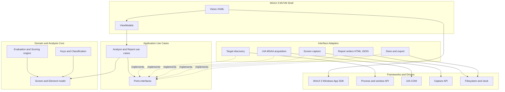
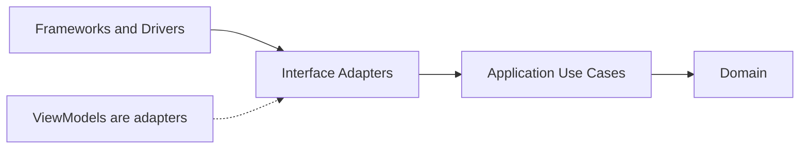
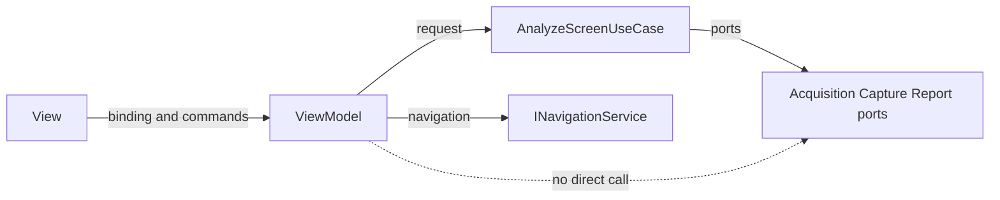
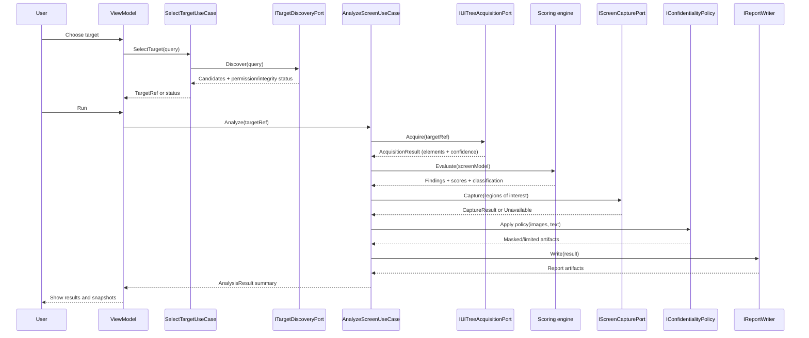

# DES-0001 Surveyor Initial Architecture

This artifact defines the initial architecture for Surveyor, the read-only GUI testability analyzer for legacy C++/MFC/Win32 Windows applications. It is an architecture-phase design. It refines requirement meaning by linking, not by duplicating: canonical requirements stay in [gui-testability-analyzer-requirements.md](../../docs/gui-testability-analyzer-requirements.md) (`RQ-xxx`) and derived requirements stay in [gui-testability-analyzer-requirements-definition.md](../../docs/gui-testability-analyzer-requirements-definition.md) (`RD-xxx`).

## Trace Block

| Field | Content |
| -- | -- |
| Artifact | `DES-0001`, Surveyor Initial Architecture, architecture design phase |
| Upstream | The [Driving Requirements](#driving-requirements) table is the authoritative upstream map. Guardrails `RQ-048`, `RQ-051`, `RQ-052`, `RQ-054`; acquisition/output `RQ-011`, `RQ-013`, `RQ-016`–`RQ-031`, `RQ-034`, `RQ-036`, `RQ-049`, `RQ-050`, `RQ-053`, `RQ-055`; derived `RD-001`, `RD-003`, `RD-004`, `RD-005`–`RD-014`, `RD-017`, `RD-018`, `RD-019`, `RD-020`, `RD-021`, `RD-022`, `RD-023`, `RD-024`, `RD-025`, `RD-026`, `RD-031`, `RD-032`; [ADR-0001](../decisions/adr-0001-ai-collaboration-and-okf.md); [Layering Principles](layering-principles.md) |
| Downstream | Candidate `ADR-0002` (technology allocation, Option A); basic/detailed `DES-xxxx` for screen model, element model, scoring rules, key generation and key confidentiality, capture, report schema, and target/process discovery; `IMP-xxxx`/`UT-xxxx`/`IT-xxxx` trace notes for the Codex slices in the [Downstream Implementation Slices](#downstream-implementation-slices) section, where each slice names its own `RQ-xxx`/`RD-xxx` |
| Evidence | Layer split, Clean Architecture dependency rule, MVVM boundaries, port contracts, technology allocation comparison, determinism/confidentiality/read-only policies, Mermaid diagrams |
| Verification | `tools/okf/Validate-Okf.ps1`; `git diff --check`; design review against [Quality Review Policy](../process/quality-review-policy.md) architecture gate |
| Residual Risk | UIA client method, capture API, packaging, report display, storage, and expert calibration remain open (see [Unresolved Architecture Decisions](#unresolved-architecture-decisions)) |

## Scope And Non-Scope

In scope for the initial version:

- The static architecture of the analyzer tool itself: layers, dependency rule, ports, and adapter boundaries.
- The MVVM structure of the WinUI 3 shell and how it reaches analysis behavior.
- Architecture-level policies for determinism, read-only inspection, and confidential data.
- A technology allocation recommendation (C#/C++) with tradeoffs.
- Downstream design and implementation slices suitable for Codex.

Not in scope here (deferred to basic/detailed design, or excluded by `RD-027`):

- Concrete scoring formulas, thresholds, rounding, and calibration numbers (detailed design; `RD-020`, `RD-029`).
- Final choice of UIA client library, capture API, packaging form, storage location, and HTML display host (open decisions; `RD-026`).
- GUI test code generation, CI gating, image-recognition automation, self-modification of custom UI, and full-screen coverage (out of scope; `RQ-035`–`RQ-039`, `RD-027`).
- Migration deliverables; only reuse potential is preserved (`RQ-055`, `RD-031`).

## Driving Requirements

Primary guardrails (blocking): `RQ-048` read-only, `RQ-051` determinism, `RQ-052` confidential data, `RQ-054` WinUI 3 shell with UI-independent core.

Other strongly driving requirements and their derived definitions:

| Concern | Upstream `RQ` | Derived `RD` |
| -- | -- | -- |
| Dynamic read-only acquisition of a displayed screen | `RQ-020`, `RQ-048` | `RD-001`, `RD-032` |
| Target/window discovery and permission/integrity check | `RQ-049`, `RQ-054` | `RD-001`, `RD-023`, `RD-026` |
| UIA/MSAA acquisition of Win32/MFC UI info | `RQ-017`, `RQ-026`, `RQ-049` | `RD-003`, `RD-004` |
| Evaluation and automation-strategy classification | `RQ-017`–`RQ-023`, `RQ-013`, `RQ-034` | `RD-005`–`RD-011`, `RD-014` |
| Snapshot capture and problem-element correspondence | `RQ-011`, `RQ-016`, `RQ-027`, `RQ-028` | `RD-012`, `RD-013` |
| Human-readable and machine-readable reports | `RQ-025`, `RQ-026`, `RQ-030`, `RQ-031` | `RD-017`, `RD-018`, `RD-019` |
| Deterministic, comparable output and stable keys | `RQ-031`, `RQ-051`, `RQ-053` | `RD-019`, `RD-020`, `RD-021` |
| Confidential data handling | `RQ-052`, `RQ-030` | `RD-012`, `RD-022` |
| Environment, permissions, packaging | `RQ-049`, `RQ-054` | `RD-023`, `RD-026` |
| Performance and scale | `RQ-050` | `RD-009`, `RD-024` |
| Layer separation and future CLI reuse | `RQ-054`, `RQ-036`, `RQ-055` | `RD-025`, `RD-031` |

## Architecture Drivers

The architecture is shaped first by the following forces:

- **Read-only inspection (`RQ-048`/`RD-032`)** — the target application must never be mutated; state-changing UIA patterns are prohibited by design, not just by convention.
- **Deterministic scoring and machine-readable output (`RQ-051`/`RD-020`)** — same input and conditions yield the same scores, keys, and ordering, so results support comparison and regression.
- **Confidential screenshot/text handling (`RQ-052`/`RD-022`)** — captured images and extracted text may contain business data; the default must be safe.
- **WinUI 3 shell and UI-independent core (`RQ-054`/`RD-025`)** — WinUI 3 stays in the shell; analysis, scoring, and output generation are UI-independent and unit-testable.
- **Clean Architecture dependency rule** — source dependencies point inward; frameworks and Windows APIs sit at the outer edge behind ports.
- **Mandatory MVVM in the UI layer** — Views bind and forward input; ViewModels own UI state and command orchestration and never touch Win32/UIA/capture/report writers directly.
- **UIA/MSAA acquisition constraints** — Win32/MFC surfaces expose identifiers and patterns unevenly; custom-drawn regions may not appear as UIA nodes at all. Acquisition must record confidence and "unavailable" distinctly.
- **Capture, DPI, multi-monitor, occlusion, permissions** — capture must be DPI-aware, mark offscreen/occluded/unavailable regions, and degrade cleanly when integrity level or permissions block inspection (`RQ-027`, `RQ-049`).

## Logical Architecture

Surveyor is organized into UI-independent core modules plus a thin WinUI 3 shell. The scoring/evaluation engine is pure and I/O-free; all Windows interaction is behind ports.

Module responsibilities:

- **WinUI 3 MVVM shell** — target selection, run control, result browsing, snapshot viewing, and report display. Depends inward on application use cases only.
- **Application orchestration / use cases** — coordinate a run: discover target, acquire, evaluate, capture, assemble result, write reports. Own the port interfaces and depend on the domain.
- **Domain model / analysis core** — screen and element model, value objects, acquisition-confidence and availability semantics. No I/O.
- **Target discovery adapter** — read-only enumeration of candidate windows/processes, window-handle resolution, and permission/integrity-level checks; keeps the process/window boundary out of the shell and ViewModel (`RQ-049`, `RD-023`).
- **UIA/MSAA acquisition adapter** — read-only UIA client that produces the element model with confidence and unavailable markers.
- **Screen capture adapter** — DPI-aware image capture with metadata for offscreen/occluded/unavailable regions.
- **Evaluation/scoring engine** — pure deterministic rules producing per-element findings, per-screen scores, and automation-strategy classification.
- **Report/output generation** — HTML report writer and machine-readable (JSON) writer sharing one result model.
- **Storage/export/configuration boundaries** — persistence, export, and run configuration behind ports, defaulting to safe, local, confidential-aware behavior.

## Clean Architecture Mapping

Dependencies point inward only. The domain knows nothing about the layers around it; the application knows the domain and its own port interfaces but not their implementations.

| Clean Architecture ring | Surveyor content |
| -- | -- |
| Domain entities / value objects | `ScreenModel`, `UiElement`, `ElementIdentity`, `BoundingRect`, `ControlKind`, `AcquisitionConfidence`, `Availability`, evaluation value objects, `TestabilityClass`, `ScreenKey`, `ElementKey`, `DisplayLabel` (kept separate from keys), `SnapshotRef`, `Finding`, `ImprovementCandidate` |
| Application use cases | `SelectTargetUseCase`, `AnalyzeScreenUseCase`, `GenerateReportUseCase`, `ExportResultUseCase`; evaluation invoked as a domain service |
| Ports / interfaces (owned by application) | `ITargetDiscoveryPort`, `IUiTreeAcquisitionPort`, `IScreenCapturePort`, `IReportWriter`, `IResultStore`, `IConfidentialityPolicy`, `IClock` |
| Adapter implementations | `ProcessWindowDiscoveryAdapter`, `UiaAcquisitionAdapter`, `PrintWindowCaptureAdapter`/`GraphicsCaptureAdapter`, `HtmlReportWriter`, `JsonReportWriter`, `FileSystemResultStore`; ViewModels as presenters |
| Framework / driver dependencies | WinUI 3, Windows App SDK, process/window enumeration (Win32), UIA COM (or FlaUI), Windows.Graphics.Capture / `PrintWindow`, WebView2 (if used), filesystem, system clock |

Allowed dependency directions:

- Views -> ViewModels -> Application use cases -> Domain.
- Adapters -> Application ports (they implement them) and -> Frameworks.
- Composition root (in the shell/host) wires adapters into use cases.

Prohibited dependency directions:

- Domain or Application referencing WinUI 3, UIA, capture, WebView2, or filesystem types.
- ViewModels referencing UIA/capture/report-writer/store implementations directly.
- Evaluation/scoring referencing any I/O, clock, locale, or ambient state.

## MVVM Design

- **View responsibilities** — XAML layout, data binding, and input routing. No analysis logic, no direct Windows API calls, no formatting rules beyond binding converters.
- **ViewModel responsibilities** — hold observable UI state (selected target, run status, result summaries, error text), expose commands, and orchestrate use-case calls. ViewModels are interface adapters (presenters): they translate domain results into display state.
- **Command/state model** — an explicit run state (`Idle`, `Selecting`, `Analyzing`, `Capturing`, `Reporting`, `Completed`, `Failed`, `Cancelled`). Commands (`SelectTarget`, `RunAnalysis`, `Cancel`, `OpenReport`, `Export`) map to use-case invocations; long-running work is async with cancellation. `SelectTarget` is a use case (`SelectTargetUseCase` over `ITargetDiscoveryPort`): process enumeration, window-handle resolution, and permission/integrity checks stay behind the port, not in the View or ViewModel.
- **Navigation/dialog boundaries** — behind `INavigationService` and `IDialogService` presentation ports so ViewModels do not depend on WinUI navigation or dialog types.
- **How ViewModels invoke use cases** — ViewModels depend only on application use-case interfaces (or a small facade). They pass a run request and receive a result model; they never call UIA, capture, or report writers.
- **How ViewModels stay testable** — because they depend on use-case interfaces plus `IUiDispatcher`/`INavigationService`/`IDialogService`, a unit test supplies fakes and asserts state transitions and command behavior without a real WinUI window or UIA target.

## Interface Design

Interfaces exist to isolate the deterministic, testable core from Windows-specific, nondeterministic, or confidential edges. Each port has a precise responsibility; broad `Manager`/`Service` catch-alls are avoided. Result-carrying return types are preferred over exceptions for expected outcomes (unavailable data, permission denied, timeout), so that "unavailable" stays distinct from "low score" (`RD-020`, quality policy detailed-design gate).

| Port | Purpose | Owner / direction | Input -> Output | Error/result model | Cancellation/timeout | Determinism | Read-only / confidentiality | Fake/fixture strategy |
| -- | -- | -- | -- | -- | -- | -- | -- | -- |
| `ITargetDiscoveryPort` | Enumerate candidate windows/processes, resolve window handles, and check permission/integrity level for a target | Application owns; adapter implements over process/window API | `DiscoveryQuery` -> `TargetCandidate` list / `TargetRef` (with `PermissionDenied`/`IntegrityMismatch`/`Unavailable` status) | Result with per-candidate status; no throw for expected permission/integrity gaps (`RQ-049`) | Yes; enumeration timeout | Deterministic candidate ordering by stable identity | Read-only; enumeration only, no window activation or input | Fake returning a fixed candidate list and status codes |
| `IUiTreeAcquisitionPort` | Read a target window's UIA/MSAA tree into the element model | Application owns; adapter implements over UIA | `TargetRef` -> `AcquisitionResult` (elements + confidence + unavailable markers) | Result with per-node availability + run-level diagnostics; no throw for expected gaps | Yes; bounded by element-count/time caps (`RQ-050`, `RD-024`) | Stable element ordering and keys in output | Read-only; must not call state-changing patterns (`RD-032`) | Serialized fixture tree loaded from a fixed file |
| `IScreenCapturePort` | Capture DPI-aware image of window/region | Application owns; adapter implements over capture API | `CaptureRequest` (window/region) -> `CaptureResult` (image + metadata or unavailable reason) | Result with `Unavailable(reason)` for offscreen/occluded/blocked | Yes; per-capture timeout | Metadata (bounds, DPI) recorded deterministically; image bytes excluded from scoring | Read-only; image treated as confidential by default (`RQ-052`) | Stub returning a fixed small image or `Unavailable` |
| `IReportWriter` (HTML, JSON) | Serialize the result model to a report artifact | Application owns; adapters implement | `AnalysisResult` -> written artifact / byte stream | Result with write outcome; schema-validated for JSON | Yes; async cancellable, atomic write (temp-then-rename) so a cancelled/failed write leaves no partial artifact | Byte-stable ordering, stable keys, no ambient time except via `IClock` | Applies `IConfidentialityPolicy` before emitting images/text | In-memory writer + golden-file comparison; cancellation/failure-path tests |
| `IResultStore` | Persist/load results and snapshots with keys | Application owns; adapter implements over filesystem | `AnalysisResult` <-> stored record keyed by run id and sanitized `ScreenKey` | Result with store/load outcome | Yes; async cancellable, atomic write, defined partial-result semantics | Deterministic key-based layout; keys sanitized before use in paths | Default-safe local storage, limited scope; no raw sensitive text in paths (`RD-022`) | In-memory store; cancellation/failure-path tests |
| `IConfidentialityPolicy` | Decide masking/blur/redaction and persistence limits | Application owns; adapter/domain policy implements | `CaptureResult`/text -> policy decision (mask/blur/allow) | Decision object; secure-by-default | Not required | Same input -> same decision | Central point enforcing `RQ-052`/`RD-022` secure defaults | Configurable fake policy |
| `IClock` | Provide report timestamps without ambient time | Application owns; adapter over system clock | none -> `Instant` | n/a | n/a | Injected fixed clock in tests keeps output deterministic (`RQ-051`) | No confidentiality impact | Fixed clock |
| `INavigationService`, `IDialogService`, `IUiDispatcher` | Presentation-layer navigation, dialogs, thread marshaling | Presentation owns; WinUI implements | UI intents | n/a | n/a | n/a | n/a | No-op / recording fakes |

Scoring is intentionally **not** a port: it is pure domain logic with no external dependency, so introducing an interface there would be abstraction for its own sake. It is exercised directly in unit tests.

## Technology Allocation And Tradeoffs

`RQ-054`/`RD-025` require the WinUI 3 shell in C# and a UI-independent core. This artifact reads that as: the shell and the .NET-based orchestration are C#; the language of the non-UI adapters (UIA/MSAA acquisition, capture) and of the core is an architecture decision constrained to **C# or C++**. It does not read `RQ-054` as forbidding a contained native adapter, nor as forcing every layer to be C#. Any residual interpretation gap is recorded as an assumption below.

Candidate allocations:

- **Option A — C#-centered with WinUI 3 shell.** All layers in C#/.NET; UIA via managed COM interop (or FlaUI); capture via Windows.Graphics.Capture (WinRT) and/or `PrintWindow` through P/Invoke.
- **Option B — C# core + C++ native adapters** for UIA/MSAA/capture where a native path is needed; C# shell, application, domain, and reports.
- **Option C — C++ core/adapters + C# WinUI 3 shell**, bridged via C++/WinRT or interop.

| Criterion | A: C#-centered | B: C# core + C++ adapters | C: C++ core + C# shell |
| -- | -- | -- | -- |
| WinUI 3 shell integration | Best (single stack) | Good | Interop seam at shell boundary |
| UIA/MSAA/Win32 access | Full via interop/FlaUI | Full, native detail available | Full, native |
| Read-only enforcement auditability | Easiest (one managed surface) | Two surfaces to audit | Native surface harder to audit |
| Deterministic output | Easiest (managed, testable) | Core in C#, deterministic | Determinism in native core, more effort |
| Fixture-based unit testing | Easiest (xUnit + fakes) | Core testable in C#, adapters need native fixtures | Native test tooling heavier |
| Packaging / runtime dependency | Windows App SDK + .NET only | Adds native binaries | Adds native + interop packaging |
| Performance / memory ownership | Good; GC pauses possible on huge trees | Native hot paths tunable | Native ownership control |
| Interop complexity | Low | Medium (bounded to adapters) | High (core across boundary) |
| Long-term maintainability | High (one language) | Medium | Lower (split core, more interop) |

**Recommended: Option A**, with C++ retained only as a bounded, port-isolated escape hatch for a specific capture/UIA capability if a managed path proves insufficient (revisit as part of the capture-API decision). Rationale: it best satisfies the guardrails that dominate this project — read-only auditability, determinism, and fixture-based testing — while matching `RQ-054`'s WinUI 3/C# mandate and minimizing interop and packaging cost.

Options B and C are rejected for the initial version: their only decisive advantage is native performance/detail, which is not yet demonstrated to be necessary and can be recovered later behind the existing ports (`IUiTreeAcquisitionPort`, `IScreenCapturePort`) without reshaping the core. This recommendation should be ratified as **candidate `ADR-0002`** once the UIA client and capture-API spikes complete.

## Data Flow

Target selection produces a `TargetRef`; acquisition builds the screen/element model with confidence and availability; the scoring engine derives findings, per-screen scores, and an automation-strategy class; capture attaches DPI-aware snapshots (or records "unavailable"); the confidentiality policy masks/limits before emission; report writers produce human-readable and machine-readable outputs sharing stable keys.

## Determinism Policy

- **Stable keys** — `ScreenKey`/`ElementKey` are derived from stable identity (for example window class and screen-definition name; element control id and structural path), computed in the domain, not in writers (`RQ-053`, `RD-021`). Key material is normalized before hashing/comparison and collision-handled deterministically.
- **Keys vs display labels** — volatile or sensitive text (window title, `Name`) is a `DisplayLabel`, kept separate from key material. Titles can carry customer/document names, timestamps, or transient state, so using them raw would both destabilize comparisons and leak confidential text; such text is excluded from keys, or normalized/hashed through the confidentiality policy before it can appear in any key, path, or machine-readable id (`RQ-051`, `RQ-052`, `RQ-053`).
- **Ordering** — elements and findings are emitted in a defined, input-derived order (for example, structural traversal order then key), never in acquisition-arrival or hash-iteration order.
- **Rounding/threshold ownership** — the scoring engine owns rounding and thresholds; writers never re-round or re-classify. Concrete rules are detailed design (`RD-020`).
- **Unavailable vs low score** — "data not acquirable" is modeled as `Availability.Unavailable` with a reason, kept distinct from a legitimately low score; both the model and the machine-readable output preserve this distinction.
- **Time** — only `IClock` provides timestamps; tests inject a fixed clock so output is reproducible (`RQ-051`).

## Confidentiality Policy

- **Default-safe behavior** — captures and extracted text are confidential by default; storage is local and scope-limited, and masking/blur is available by default rather than opt-in (secure-by-default per `RD-022`, resolving requirement finding `F-04`).
- **Masking/blur/redaction decision points** — centralized in `IConfidentialityPolicy`, applied before report writing and before persistence, not scattered across writers.
- **Logging and persistence constraints** — image bytes and extracted text are never written to logs; persisted artifacts carry a confidentiality marker; HTML reports intended for distribution surface a handling notice.
- **Keys and paths** — raw window titles or `Name` text must not be embedded in file paths, filenames, or machine-readable ids; key material passes through normalization/hashing so sensitive text does not leak via the storage layout or JSON keys (`RQ-052`, `RD-022`).

## Read-Only Enforcement

- **Prohibited UIA mutation paths** — the acquisition adapter must not invoke state-changing UIA patterns (`Invoke`, `SetValue`, `Select`, `Toggle`, `Expand/Collapse`, `Scroll`/`ScrollItem`, `Dock`, `Transform`/window manipulation, `RangeValue.SetValue`, `Text` edit). Only read patterns and property/tree reads are permitted (`RD-032`).
- **Design-level enforcement** — the acquisition port surface exposes no mutation operation, so ViewModels and use cases cannot request one; mutation capability is absent from the type surface, not merely discouraged.
- **Adapter-level audit test (required)** — a `UT-xxxx` test wraps the UIA client with a recording/spy layer that logs every UIA call and fails if any state-changing pattern method is invoked during a full acquisition and capture pass. This guards read-only at the adapter regardless of the live target.
- **Read-only integration obligation (required `IT-xxxx`)** — an integration test drives analysis against a fixture target application and asserts these invariants are unchanged before and after a run: input focus, selection, text/edit contents, checked/toggle state, expand/collapse state, scroll offset, active tab/dialog, window position and z-order, and target business data. This is a required downstream obligation, not an optional idea (`RQ-048`, `RD-032`, quality policy integration gate).

## Extension Strategy

Extension points are the existing ports plus a small strategy set, added only where variability is real:

- **Target discovery providers** — alternate `ITargetDiscoveryPort` implementations (for example, top-level window enumeration vs process-scoped discovery) selected at composition.
- **Acquisition providers** — alternate `IUiTreeAcquisitionPort` implementations (for example, direct UIA COM vs FlaUI) selected at composition.
- **Capture providers** — alternate `IScreenCapturePort` implementations (`PrintWindow` vs Graphics Capture).
- **Scoring rules** — evaluation composed of independent, deterministic rule units so rules can be added without touching acquisition or reporting.
- **Report formats** — new `IReportWriter` implementations over the shared result model.
- **Privacy policies** — alternate `IConfidentialityPolicy` implementations.
- **Future CLI reuse** — a CLI front end reuses application use cases and core unchanged, since nothing UI-specific leaks inward (`RQ-036`, `RQ-055`, `RD-025`).

## Unresolved Architecture Decisions

These stay open per `RD-026`/`RSK-RD-001` and should each become a `DES-xxxx` or ADR after a spike:

- **Technology allocation ratification** — Option A is recommended but not yet ratified. Either ratify it as `ADR-0002` before the first adapter slice, or keep each early slice adapter-agnostic (fakes and ports only) until the UIA/capture spikes complete. The domain, scoring, use-case, and report slices are adapter-agnostic by construction and may proceed now.
- **UIA client approach** — direct UIA COM (`IUIAutomation`) vs a managed library (FlaUI).
- **MSAA fallback approach** — whether/how to fall back to MSAA/`IAccessible` for elements UIA does not expose.
- **Screenshot/capture API** — `PrintWindow` (`PW_RENDERFULLCONTENT`) vs Windows.Graphics.Capture, given occlusion and custom-draw tradeoffs (`RQ-027`).
- **Cross-integrity inspection** — whether elevation or a signed `uiAccess` manifest is needed to inspect higher-integrity targets, or whether same-integrity targets are assumed; drives `ITargetDiscoveryPort` status handling and packaging (`RQ-049`).
- **Packaging** — MSIX vs unpackaged, affecting distribution and cross-integrity inspection (`RQ-049`).
- **HTML report display** — WebView2 in-app vs external browser (`RQ-030`).
- **Storage location and retention** — concrete default paths, default retention window, and what exactly counts as secure-by-default for screenshots and extracted text, under the confidentiality policy (`RD-022`).

## Downstream Implementation Slices

Small vertical slices suitable for Codex, each testable before real GUI targets exist:

Each slice is adapter-agnostic unless it names a concrete adapter, so most can proceed before the technology-allocation ratification.

| Slice | Behavior | `RQ`/`RD` | Expected tests | Trace to create |
| -- | -- | -- | -- | -- |
| Domain model + keys | Screen/element model, `ScreenKey`/`ElementKey` vs `DisplayLabel` separation, sanitized/collision-handled keys, availability/confidence value objects | `RQ-026`, `RQ-053`; `RD-004`, `RD-020`, `RD-021`, `RD-022` | Unit tests for key stability, key sanitization, label/key separation, availability semantics | `DES-xxxx` basic design; `UT-xxxx` |
| Scoring engine skeleton | Deterministic identifiability/operability rules over a fixture model, no I/O | `RQ-017`, `RQ-018`, `RQ-034`, `RQ-051`; `RD-005`, `RD-006`, `RD-014`, `RD-020` | Fixture-based deterministic scoring tests; same input -> same output | `DES-xxxx` detailed design; `UT-xxxx` |
| Target discovery port + fake | `ITargetDiscoveryPort` with a fake candidate list and permission/integrity status; no real process API | `RQ-049`, `RQ-054`; `RD-001`, `RD-023`, `RD-026` | Tests for candidate ordering and permission/integrity/unavailable status handling | `DES-xxxx`; `IMP-xxxx`; `UT-xxxx` |
| Acquisition port + fake | `IUiTreeAcquisitionPort` with a fixture tree loader; no real UIA | `RQ-017`, `RQ-026`, `RQ-048`; `RD-003`, `RD-004`, `RD-032` | Tests mapping fixture tree -> model with unavailable markers | `IMP-xxxx`; `UT-xxxx` |
| Read-only adapter audit | Recording/spy UIA wrapper that rejects state-changing pattern calls | `RQ-048`; `RD-032` | Audit test failing on any mutation call during acquisition/capture | `UT-xxxx` |
| JSON report writer | Machine-readable output with stable keys/ordering via `IClock`; cancellable atomic write | `RQ-031`, `RQ-050`, `RQ-051`; `RD-019`, `RD-020`, `RD-024` | Golden-file determinism tests; cancellation/failure-path tests | `IMP-xxxx`; `UT-xxxx` |
| Confidentiality policy | Secure-by-default masking decisions; no raw sensitive text in keys/paths | `RQ-052`; `RD-022` | Unit tests for default-safe decisions and key/path sanitization | `DES-xxxx`; `UT-xxxx` |
| Analyze use case wiring | `SelectTargetUseCase` + `AnalyzeScreenUseCase` over fake ports end to end | `RQ-048`, `RQ-054`; `RD-001`, `RD-025` | Use-case tests with all fakes | `IMP-xxxx`; `UT-xxxx` |
| Read-only integration check | Target-state-unchanged verification against a fixture app across the full invariant set | `RQ-048`; `RD-032` | Integration evidence | `IT-xxxx` |

## Residual Risks And Quality Review Checklist

Residual risks: UIA/capture/packaging choices are unresolved (`RSK-RD-001`); calibration targets remain non-numeric until detailed design (`RSK-RD-002`); confidentiality defaults need concrete values in detailed design (`RSK-RD-003`); UIA cannot expose some custom-drawn regions, so acquisition confidence and "unavailable" reporting carry inherent uncertainty.

Architecture review checklist (aligned with the [Quality Review Policy](../process/quality-review-policy.md) architecture gate):

- Dependency rule holds; no WinUI/UIA/capture types inside domain or application.
- ViewModels reach behavior only through use cases/ports; no direct adapter calls.
- Process/window discovery, handle resolution, and permission/integrity checks sit behind a port (`ITargetDiscoveryPort`), not in the shell/ViewModel.
- Scoring is pure, I/O-free, and deterministic; keys and ordering are core-owned.
- Keys are separated from display labels; sensitive title/`Name` text is normalized/hashed and never raw in keys, paths, or ids.
- Read-only is enforced by port surface plus an adapter audit test; the target-state-unchanged integration check is a required `IT-xxxx` with an explicit invariant set.
- Confidential data is secure-by-default; masking is centralized.
- Output and store operations are cancellable with atomic/partial-write semantics.
- Every port has a fixture/fake path enabling tests before real GUI targets.
- Ports have precise responsibilities; no broad `Manager`/`Service` catch-alls; no pattern used without a stated purpose.
- Upstream `RQ-xxx`/`RD-xxx` and downstream `DES/IMP/UT/IT` obligations are named, including per-slice trace IDs.

## Document Structure Notes

The section order follows the requested outline. One structural change: interface design is presented as a single contract table (purpose, owner/direction, I/O, error model, cancellation, determinism, read-only/confidentiality, fake strategy) rather than as prose per interface, because the guardrail-per-port view is easier to review for gaps and keeps each port's responsibility precise. The explicit note that scoring is deliberately not a port is added under the same section to document a "no abstraction here" decision, since avoiding needless abstraction is itself an architecture judgment worth recording.

Corrections after third-party review (2026-07-01): added `ITargetDiscoveryPort` and `SelectTargetUseCase` so the process/window boundary stays out of the shell; separated `DisplayLabel` from key material and required sensitive text to be normalized/hashed and kept out of keys, paths, and ids; made report/store operations cancellable with atomic-write semantics; promoted read-only verification from an "idea" to a required adapter audit test plus an `IT-xxxx` with an explicit invariant set; and aligned the trace block with the Driving Requirements table, adding per-slice `RQ`/`RD` to the downstream slices.

## Related

- [Layering Principles](layering-principles.md)
- [Requirement Source](../requirements/source-spec.md)
- [Requirement Definition](../requirements/requirements-definition.md)
- [Lifecycle Traceability](../process/lifecycle-traceability.md)
- [Quality Review Policy](../process/quality-review-policy.md)
- [ADR-0001 AI Collaboration and OKF](../decisions/adr-0001-ai-collaboration-and-okf.md)
