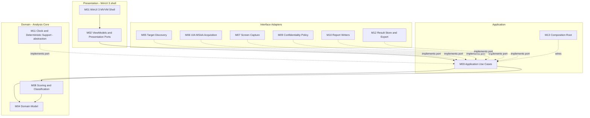

# DES-0002 Module Responsibility Basic Design

This artifact is the basic-design decomposition of Surveyor into modules with fixed responsibilities and boundaries. It takes the architecture design [DES-0001](../architecture/des-0001-initial-architecture.md) as input and raises it to a granularity where detailed design, implementation, unit test, and integration test can proceed without getting lost. It does not fix algorithms, score formulas, JSON schemas, or Windows-API call sequences; those are deferred to detailed design. Canonical requirements stay in [gui-testability-analyzer-requirements.md](../../docs/gui-testability-analyzer-requirements.md) (`RQ-xxx`) and derived requirements in [gui-testability-analyzer-requirements-definition.md](../../docs/gui-testability-analyzer-requirements-definition.md) (`RD-xxx`).

Companion artifacts: [DES-0003 Module Interface Basic Design](des-0003-module-interface-basic-design.md) (boundary contracts), [DES-0004 Analysis Flow Basic Design](des-0004-analysis-flow-basic-design.md) (run orchestration), and [DES-0005 V-Model Traceability and Downstream Test Design Obligations](des-0005-vmodel-traceability-and-downstream-tests.md) (phase mapping and UT/IT obligations).

## Trace Block

| Field | Content |
| -- | -- |
| Artifact | `DES-0002`, Module Responsibility Basic Design, basic design phase |
| Upstream | [DES-0001](../architecture/des-0001-initial-architecture.md); guardrails `RQ-048`, `RQ-051`, `RQ-052`, `RQ-054`; `RQ-011`, `RQ-013`, `RQ-016`–`RQ-031`, `RQ-034`, `RQ-036`, `RQ-046`, `RQ-049`, `RQ-050`, `RQ-053`, `RQ-055`; derived `RD-001`–`RD-026`, `RD-030`, `RD-032` mapped in the per-module RQ/RD columns (covering the §5 basic-design scope `RD-002`–`RD-018`). `RD-027` is an out-of-scope constraint surfaced in [Downstream-Design Carve-Outs](#downstream-design-carve-outs); `RD-028`/`RD-029` are detailed-design (calibration/selection-rationale depth); `RD-031` is preserved at architecture/output-structure level in `DES-0001`. [Layering Principles](../architecture/layering-principles.md); [ADR-0001](../decisions/adr-0001-ai-collaboration-and-okf.md) |
| Downstream | [DES-0003](des-0003-module-interface-basic-design.md), [DES-0004](des-0004-analysis-flow-basic-design.md), [DES-0005](des-0005-vmodel-traceability-and-downstream-tests.md); detailed-design `DES-xxxx` for scoring rules, key generation, capture, report schema; Codex `IMP-xxxx`/`UT-xxxx`/`IT-xxxx` slices named in [DES-0005](des-0005-vmodel-traceability-and-downstream-tests.md) |
| Evidence | 13-module responsibility map, ownership layers, allowed/forbidden dependencies, module-level data ownership, guardrail assignment, downstream-design carve-outs |
| Verification | `tools/okf/Validate-Okf.ps1`; `git diff --check`; basic-design gate of [Quality Review Policy](../process/quality-review-policy.md) |
| Residual Risk | UIA client library, capture API, packaging, storage defaults, HTML host still open (`RSK-RD-001`, `RSK-RD-003`); custom-drawn regions inherently limit acquisition confidence |

## Purpose And Success Criterion

The success criterion for this basic design is not "implementation can start"; it is "detailed design, implementation, unit test, and integration test do not get lost." Therefore this document fixes, at a reviewable granularity:

- Which module owns which responsibility, and where each module lives in the layer stack.
- Which module owns which piece of the data model.
- Which guardrail (`RQ-048`/`RQ-051`/`RQ-052`/`RQ-054`) each module is accountable for.
- What each module explicitly does **not** do (so responsibilities do not bleed across boundaries).

Contracts between modules are fixed in [DES-0003](des-0003-module-interface-basic-design.md).

## Module Map

Surveyor is decomposed into 13 modules across five ownership layers. Modules are numbered `M01`–`M13` for local reference in this basic design; the numbers are not durable artifact IDs.

Ownership layers, from inner to outer: Domain (`M04`, `M08`, and the `IClock` abstraction conceptually owned with the application), Application (`M03`, `M13`), Interface Adapters (`M05`–`M07`, `M09`, `M10`, `M12`, and concrete `IClock`), Presentation (`M01`, `M02`). The Clean Architecture dependency rule from DES-0001 holds: source dependencies point inward; adapters implement application-owned ports.

## Module Responsibilities

Each module below states its responsibility, ownership layer, what it must not do, the data it owns, the guardrails it is accountable for, and the driving requirements. Interface contracts are in [DES-0003](des-0003-module-interface-basic-design.md); the boundary/port names appear here only to locate the module.

### M01 WinUI 3 MVVM Shell

- **Responsibility**: XAML views for target selection, run control, result browsing, snapshot viewing, and report display; data binding and input routing only.
- **Layer**: Presentation. Depends inward on `M02` only.
- **Must not**: contain analysis, scoring, formatting, or Windows-inspection logic; call UIA/capture/report/store directly; hold domain rules.
- **Owns**: XAML, view resources, binding converters. No domain data.
- **Guardrails**: `RQ-054` (WinUI 3 confined to shell).
- **RQ/RD**: `RQ-030`, `RQ-054`; `RD-017`, `RD-025`.

### M02 ViewModels and Presentation Ports

- **Responsibility**: observable UI state (selected target, run state, result summaries, error text), commands, orchestration of use-case calls, translation of domain results into display state. Owns presentation ports `INavigationService`, `IDialogService`, `IUiDispatcher`.
- **Layer**: Presentation (interface adapters / presenters). Depends inward on `M03` use-case interfaces and on presentation ports.
- **Must not**: call `M05`–`M07`, `M10`, `M12` (or their APIs) directly; contain scoring; depend on WinUI navigation/dialog types (those sit behind presentation ports); block the UI thread on long-running work.
- **Owns**: the run state machine (`Idle`, `Selecting`, `Analyzing`, `Capturing`, `Reporting`, `Completed`, `Failed`, `Cancelled`), command definitions, display view-models projected from `AnalysisResult`.
- **Guardrails**: `RQ-054` (no adapter or WinUI leakage into orchestration); surfaces `RQ-052` handling notices to the user.
- **RQ/RD**: `RQ-009`, `RQ-016`, `RQ-030`, `RQ-044`, `RQ-054`; `RD-017`, `RD-025`, `RD-030`.

### M03 Application Use Cases

- **Responsibility**: orchestrate a run — `SelectTargetUseCase`, `AnalyzeScreenUseCase`, `GenerateReportUseCase`, `ExportResultUseCase`. Own the port interfaces (`ITargetDiscoveryPort`, `IUiTreeAcquisitionPort`, `IScreenCapturePort`, `IReportWriter`, `IResultStore`, `IConfidentialityPolicy`, `IClock`). Sequence acquire → evaluate → capture → apply policy → assemble result → write/store.
- **Layer**: Application. Depends on `M04`/`M08` (domain) and on its own port interfaces; never on adapter implementations.
- **Must not**: reference WinUI, UIA, capture, filesystem, or WebView2 types; embed scoring rules (delegates to `M08`); make policy decisions itself (delegates to `M09`).
- **Owns**: port interface definitions, use-case request/result DTOs (`AnalysisRunRequest`, `AnalysisResult` assembly), run sequencing, cancellation propagation, and threading `ScreenSelectionMetadata` (user-supplied priority basis, `RD-016`) and generated `ImprovementCandidate`s (`RD-015`) into the assembled result for `M10`/`M12`.
- **Guardrails**: accountable for enforcing the read-only sequence (`RQ-048`), routing all text/images through `M09` before emission (`RQ-052`), passing `IClock` for timestamps (`RQ-051`), and keeping the core UI-independent (`RQ-054`).
- **RQ/RD**: `RQ-048`, `RQ-054`, `RQ-050`; `RD-001`, `RD-024`, `RD-025`, `RD-032`.

### M04 Domain Model / Analysis Core

- **Responsibility**: the screen/element model and value objects: `ScreenModel`, `UiElement`, `ElementIdentity`, `BoundingRect`, `ControlKind`, `AcquisitionConfidence`, `Availability` (with reason), `ScreenKey`, `ElementKey`, `DisplayLabel` (separate from keys), `SnapshotRef`, `Finding`, `ImprovementCandidate`, `TestabilityClass`. Owns key derivation semantics and the availability/confidence semantics. **`ScreenModel` is the evaluation/output unit** — a top-level window, dialog, MDI/SDI child, tab, or pane, and, where a screen has multiple states (tab/mode switch), a state-differentiated screen is a distinct `ScreenModel` with its own `ScreenKey` (`RD-002`). The model also carries `ScreenSelectionMetadata` (regression cost, change/exec frequency, UI-pattern representativeness, judgment-split flag) as a domain value so prioritization can be recorded and surfaced without the analyzer computing those user-supplied inputs (`RD-016`).
- **Layer**: Domain (innermost). Depends on nothing outward.
- **Must not**: perform any I/O; touch clock, locale, filesystem, UIA, capture, or WinUI; embed report formatting; read ambient state.
- **Owns**: the canonical data model; the `ScreenKey`/`ElementKey` derivation rule from **non-sensitive stable identity** (stable identity → normalized → collision-handled), delegating the sensitive-fallback path (when stable identity is absent and `Name`/title must be hashed into a fallback key) to `M09` so no raw sensitive text is ever hashed inside the domain (`RQ-052`/`RQ-053` seam); the screen/state evaluation-unit rule; and the `Availability.Unavailable(reason)` vs low-score distinction.
- **Guardrails**: `RQ-051` (keys/ordering are core-owned and deterministic), `RQ-052` (keys separated from `DisplayLabel`; sensitive text normalized/hashed via `M09` before it can appear in a key), `RQ-053` (stable identity keys).
- **RQ/RD**: `RQ-004`, `RQ-017`–`RQ-021`, `RQ-025`, `RQ-026`, `RQ-046`, `RQ-053`; `RD-002`, `RD-004`, `RD-016`, `RD-020`, `RD-021`.

### M05 Target Discovery

- **Responsibility**: read-only enumeration of candidate windows/processes, window-handle resolution, and permission/integrity-level checks. Implements `ITargetDiscoveryPort`.
- **Layer**: Interface Adapters. Implements an application-owned port; depends outward on process/window API.
- **Must not**: activate, focus, move, or send input to any window; leak `HWND`/process types inward; contain scoring.
- **Owns**: candidate enumeration, `TargetRef` resolution, and mapping OS permission/integrity results into the port's status model.
- **Guardrails**: `RQ-048` (enumeration only, no activation/input), `RQ-049` (permission/integrity reported, not thrown), `RQ-051` (deterministic candidate ordering).
- **RQ/RD**: `RQ-048`, `RQ-049`, `RQ-054`; `RD-001`, `RD-023`, `RD-026`.

### M06 UIA/MSAA Acquisition

- **Responsibility**: read-only UIA client that reads a target window's tree into the element model with confidence and unavailable markers. Optional MSAA/`IAccessible` fallback. Implements `IUiTreeAcquisitionPort`.
- **Layer**: Interface Adapters. Implements an application-owned port; depends outward on UIA COM / library.
- **Must not**: invoke any state-changing UIA pattern (`Invoke`, `SetValue`, `Select`, `Toggle`, `Expand/Collapse`, `Scroll`, `Dock`, `Transform`, `RangeValue.SetValue`, `Text` edit); apply scoring; produce report formatting.
- **Owns**: tree read, property/pattern read, per-node `Availability`/`AcquisitionConfidence` assignment, element-count/time cap enforcement, run-level acquisition diagnostics.
- **Guardrails**: `RQ-048`/`RD-032` (read-only patterns only — the strongest owner of this guardrail), `RQ-050` (caps), `RQ-051` (stable element ordering in output).
- **RQ/RD**: `RQ-017`, `RQ-026`, `RQ-048`, `RQ-049`, `RQ-050`; `RD-003`, `RD-004`, `RD-032`.

### M07 Screen Capture

- **Responsibility**: DPI-aware image capture of a window/region, with metadata for offscreen/occluded/unavailable regions. Implements `IScreenCapturePort`.
- **Layer**: Interface Adapters. Implements an application-owned port; depends outward on the capture API.
- **Must not**: send input or bring windows to foreground to capture; feed image bytes into scoring; persist images itself (persistence is `M12` after `M09`).
- **Owns**: capture request handling, DPI/bounds metadata, `Unavailable(reason)` for offscreen/occluded/blocked cases.
- **Guardrails**: `RQ-048` (capture must not mutate/foreground the target), `RQ-052` (captured image is confidential by default; handed to `M09`), `RQ-051` (bounds/DPI metadata deterministic; image bytes excluded from scoring).
- **RQ/RD**: `RQ-011`, `RQ-016`, `RQ-027`; `RD-012`, `RD-013`.

### M08 Scoring and Classification

- **Responsibility**: pure deterministic evaluation across all evaluation axes — identifiability (`RQ-017`), operability (`RQ-018`), result-determinability (`RQ-019`), precondition-controllability (`RQ-020`), screen-stability (`RQ-021`), custom-UI risk (`RQ-005`/`RQ-022`), coordinate/image-dependence (`RQ-023`) — producing per-element findings, per-screen scores, and automation-strategy classification (`即自動化 / 小改善後 / 限定 / 改善優先 / 対象外`). Also **generates `ImprovementCandidate`s and the "do-not-automate" rationale** (identifier remediation, Name fixes, result-info exposure, UIA/IAccessible implementation, coordinate-dependence avoidance, defer-to-lower-layer) with residual-risk/cost notes (`RD-015`). Owns rounding and thresholds. Composed of independent rule units. **Not a port** — pure domain logic exercised directly in tests.
- **Layer**: Domain. Depends on `M04` only.
- **Must not**: perform I/O, read clock/locale/ambient state, re-derive keys (uses `M04` keys), double-count the same root cause across non-orthogonal axes, conflate `Unavailable` with a low score.
- **Owns**: the deterministic scoring pipeline, threshold/rounding ownership, classification mapping, improvement-candidate derivation, and the "same input → same output" property.
- **Guardrails**: `RQ-051` (determinism — primary owner), plus honoring the `Unavailable` vs low-score distinction from `M04`.
- **RQ/RD**: `RQ-003`, `RQ-005`, `RQ-006`, `RQ-007`, `RQ-013`, `RQ-017`–`RQ-023`, `RQ-029`, `RQ-034`, `RQ-051`; `RD-005`–`RD-011`, `RD-014`, `RD-015`, `RD-020`. Concrete formulas, weights, thresholds, and rounding are **detailed design** (`RD-020`, `RSK-RD-002`).

### M09 Confidentiality Policy

- **Responsibility**: decide masking/blur/redaction and persistence limits for captures and extracted text; secure-by-default. Central enforcement point for `RQ-052`. Implements `IConfidentialityPolicy`.
- **Layer**: Interface Adapters / domain policy (behind an application-owned port). Applied by `M03` before `M10`/`M12`.
- **Must not**: be bypassed by writers or store; leak raw sensitive text into keys, paths, or machine-readable ids; default to unmasked/wide storage.
- **Owns**: masking/blur/redaction decisions; the key/path sanitization rule for sensitive text, including the **sensitive-fallback key path** delegated by `M04` (normalize/hash `Name`/title into a stable, non-reversible fallback key when no non-sensitive stable identity exists), so this hashing lives in one place and never inside the domain; secure-by-default configuration surface.
- **Guardrails**: `RQ-052`/`RD-022` (primary owner — secure-by-default), supports `RQ-051` (deterministic decision for same input).
- **RQ/RD**: `RQ-030`, `RQ-052`; `RD-022`. Concrete default retention/paths and exact "secure-by-default" values are **detailed design** (`RSK-RD-003`).

### M10 Report Writers

- **Responsibility**: serialize the shared result model to HTML (human-readable) and JSON (machine-readable) artifacts. Implements `IReportWriter`.
- **Layer**: Interface Adapters. Implements an application-owned port; depends outward on filesystem via atomic write.
- **Must not**: re-round or re-classify scores; re-derive keys; emit images/text not passed through `M09`; use ambient time (only `IClock`); order output by hash/arrival.
- **Owns**: HTML rendering, JSON serialization, byte-stable ordering using core-owned keys, atomic (temp-then-rename) write, distribution handling notice on HTML. **Surfaces the prioritization view** — improvement candidates (`RD-015`) and `ScreenSelectionMetadata`/priority basis (`RD-016`) are rendered/serialized as carried by the result model; the writer presents, it does not compute priority.
- **Guardrails**: `RQ-051` (byte-stable ordering/keys), `RQ-052` (emits only `M09`-processed content; HTML carries handling notice), `RQ-054` (UI-independent).
- **RQ/RD**: `RQ-025`, `RQ-026`, `RQ-029`, `RQ-030`, `RQ-031`; `RD-015`, `RD-016`, `RD-017`, `RD-018`, `RD-019`, `RD-022`. Full JSON schema and HTML layout are **detailed design**.

### M11 Clock and Deterministic Support

- **Responsibility**: provide timestamps and any deterministic-support primitives (e.g., stable ordering helpers) without ambient time. Abstraction `IClock` is application-owned; the system-clock adapter is outer.
- **Layer**: Abstraction owned with Application; concrete adapter in Interface Adapters.
- **Must not**: let ambient `DateTime.Now`/locale reach the core; be read by `M08` (scoring must not depend on time at all).
- **Owns**: `IClock` contract and the fixed-clock test seam.
- **Guardrails**: `RQ-051` (injected fixed clock keeps output reproducible).
- **RQ/RD**: `RQ-051`; `RD-020`.

### M12 Result Store and Export

- **Responsibility**: persist/load results and snapshots keyed by run id and sanitized `ScreenKey`; export result bundles. Implements `IResultStore`. Default-safe local storage.
- **Layer**: Interface Adapters. Implements an application-owned port; depends outward on filesystem.
- **Must not**: put raw sensitive text in paths/filenames (uses sanitized keys from `M04`/`M09`); persist images/text not passed through `M09`; leave partial artifacts on cancel/failure.
- **Owns**: deterministic key-based storage layout, atomic write, partial-result semantics, export packaging.
- **Guardrails**: `RQ-052`/`RD-022` (default-safe local, sanitized paths), `RQ-051` (deterministic layout), supports comparison/regression (`RQ-010`/`RQ-031`).
- **RQ/RD**: `RQ-010`, `RQ-031`, `RQ-053`; `RD-019`, `RD-021`, `RD-022`. Concrete default paths/retention are **detailed design** (`RSK-RD-003`).

### M13 Composition Root

- **Responsibility**: wire adapters into use cases at startup (in the shell/host); select provider variants (discovery/acquisition/capture/policy) per DES-0001 extension strategy.
- **Layer**: Application/host boundary (lives physically in the shell host, but is the only place allowed to know both concretes and interfaces).
- **Must not**: contain analysis logic; let concrete adapter types leak into `M02`/`M03`.
- **Owns**: dependency wiring, provider selection, lifetime/scoping.
- **Guardrails**: enforces `RQ-054` by being the single seam where concretes meet interfaces; must inject `IClock`, `IConfidentialityPolicy`, and read-only adapters consistently.
- **RQ/RD**: `RQ-054`; `RD-025`, `RD-026`.

## Module-to-Data Ownership

| Data element | Owning module | Notes |
| -- | -- | -- |
| `ScreenModel`, `UiElement`, value objects | M04 | Canonical model; no I/O |
| `ScreenKey`, `ElementKey` | M04 | Derived from stable identity; sanitized/collision-handled |
| `DisplayLabel` | M04 | Volatile/sensitive text; kept separate from keys |
| `Availability`, `AcquisitionConfidence` | M04 (assigned by M06) | Unavailable(reason) distinct from low score |
| `Finding`, score, `TestabilityClass` | M08 | Deterministic; owns rounding/thresholds |
| `ImprovementCandidate` (value object) / generation | M04 (type) / M08 (generation) | Do-not-automate rationale + cost/residual-risk notes (`RD-015`) |
| `ScreenSelectionMetadata` (priority basis) | M04 (type) / M03 (threading) / M10 (presentation) | User-supplied inputs (cost/frequency/representativeness); analyzer records, does not compute (`RD-016`) |
| `SnapshotRef` + capture metadata | M07 → M04 reference | Image bytes excluded from scoring |
| Masking/redaction decision | M09 | Secure-by-default |
| Timestamp | M11 (`IClock`) | Never ambient time |
| Stored/exported record | M12 | Sanitized key-based layout |
| `AnalysisResult` (assembled) | M03 | Composed from M04/M08/M07/M09 outputs |

## Downstream-Design Carve-Outs

The following are explicitly deferred to detailed design and are **not** fixed here (per the task scope and `RD-020`/`RD-024`/`RD-026`):

- Score formulas, weights, thresholds, rounding rules (M08; `RD-020`).
- UIA/MSAA concrete API call sequences and library choice (M06; `RSK-RD-001`).
- Capture API implementation (`PrintWindow` vs Graphics Capture) (M07; `RSK-RD-001`).
- Complete JSON/HTML schema and layout (M10).
- Storage default paths, retention, exact secure-by-default values (M09/M12; `RSK-RD-003`).
- File placement, class internals, method signatures, WinUI screen layout.

## Related

- [DES-0001 Initial Architecture](../architecture/des-0001-initial-architecture.md)
- [DES-0003 Module Interface Basic Design](des-0003-module-interface-basic-design.md)
- [DES-0004 Analysis Flow Basic Design](des-0004-analysis-flow-basic-design.md)
- [DES-0005 V-Model Traceability and Downstream Tests](des-0005-vmodel-traceability-and-downstream-tests.md)
- [DES-0006 Screen (Operating UI) Basic Design](des-0006-screen-basic-design.md)
- [Layering Principles](../architecture/layering-principles.md)
- [Lifecycle Traceability](../process/lifecycle-traceability.md)
- [Quality Review Policy](../process/quality-review-policy.md)
