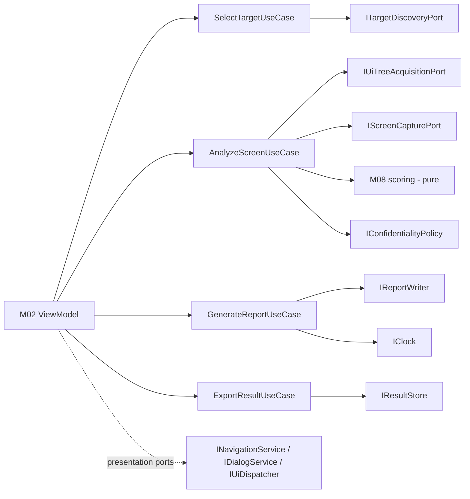

# DES-0003 Module Interface Basic Design

This artifact raises the port candidates in [DES-0001](../architecture/des-0001-initial-architecture.md) to basic-design contracts. Its purpose is to fix, at a review-grade granularity, the contract and responsibility boundary of every module interface so that detailed design, implementation, unit test, and integration test do not get lost. It fixes the **contract** (direction, I/O shape, result/error model, cancellation, guardrail obligations, fake strategy), not the internal implementation, algorithm, schema, or Windows-API sequence — those are detailed design.

Module responsibilities are in [DES-0002](des-0002-module-responsibility-basic-design.md); run orchestration is in [DES-0004](des-0004-analysis-flow-basic-design.md); the V-model phase mapping and the planned `UT-xxxx`/`IT-xxxx` obligations referenced below are catalogued in [DES-0005](des-0005-vmodel-traceability-and-downstream-tests.md).

## Trace Block

| Field | Content |
| -- | -- |
| Artifact | `DES-0003`, Module Interface Basic Design, basic design phase |
| Upstream | [DES-0001](../architecture/des-0001-initial-architecture.md) Interface Design; [DES-0002](des-0002-module-responsibility-basic-design.md); guardrails `RQ-048`, `RQ-051`, `RQ-052`, `RQ-054`; `RQ-013`, `RQ-017`–`RQ-031`, `RQ-034`, `RQ-049`, `RQ-050`, `RQ-053`; derived `RD-001`, `RD-003`–`RD-025`, `RD-032` |
| Downstream | Detailed-design `DES-xxxx` for each port's schema/algorithm; Codex slices and planned `UT-0001`–`UT-0012` / `IT-0001`–`IT-0006` in [DES-0005](des-0005-vmodel-traceability-and-downstream-tests.md) |
| Evidence | Per-boundary contracts for `ITargetDiscoveryPort`, `IUiTreeAcquisitionPort`, `IScreenCapturePort`, `IReportWriter`, `IResultStore`, `IConfidentialityPolicy`, `IClock`, `INavigationService`, `IDialogService`, `IUiDispatcher`, and use cases `SelectTargetUseCase`, `AnalyzeScreenUseCase`, `GenerateReportUseCase`, `ExportResultUseCase`; exception-vs-result policy; DTO shapes |
| Verification | `tools/okf/Validate-Okf.ps1`; `git diff --check`; basic-design gate of [Quality Review Policy](../process/quality-review-policy.md) |
| Residual Risk | Concrete DTO fields, status enum members, schema, and per-port timeout defaults are detailed design; UIA/capture/packaging choices open (`RSK-RD-001`) |

## Contract Conventions

These conventions apply to every contract below unless a boundary states otherwise.

- **Result vs exception (project rule).** *Expected* domain outcomes — `Unavailable`, `PermissionDenied`, `IntegrityMismatch`, `Timeout`, `NotFound`, `PartialResult` — are carried in a `Result`/status object, never thrown. This keeps "data not acquirable" (`Availability.Unavailable`) distinct from "low score" (`RD-020`, quality policy detailed-design gate). Exceptions are reserved for *programming/contract violations and truly unexpected faults* (null required argument, disposed handle, out-of-memory, corrupt fixture). Cancellation surfaces as the platform `OperationCanceledException` from a cooperative `CancellationToken`, not as a domain status.
- **Cancellation/timeout.** All potentially long-running boundaries (`M05`–`M07`, `M10`, `M12`, and the use cases) are `async` and accept a `CancellationToken`. Each also has a per-operation timeout (concrete default values are detailed design; `RQ-050`/`RD-024`). A timeout produces a `Timeout` status (an expected result), while an external cancel produces `OperationCanceledException`.
- **Determinism (`RQ-051`).** Output ordering is input-derived (structural traversal then key), never hash-iteration or arrival order. Timestamps come only from `IClock`. Scoring never crosses a port.
- **Read-only (`RQ-048`).** No port exposes a mutation operation on the target. The absence of state-changing operations from the type surface is the primary enforcement; `M06` additionally must not call state-changing UIA patterns.
- **Confidentiality (`RQ-052`).** Images and extracted text are confidential by default. Nothing is emitted or persisted before passing through `IConfidentialityPolicy`. Raw sensitive text (window title, `Name`) never enters keys, paths, or machine-readable ids.
- **WinUI/Core separation (`RQ-054`).** Application-owned ports and domain types carry no WinUI/UIA/capture/filesystem types in their signatures. Presentation ports (`INavigationService`/`IDialogService`/`IUiDispatcher`) are owned by presentation and implemented by WinUI; they never appear in application or domain signatures.

DTO names (`DiscoveryQuery`, `TargetCandidate`, `TargetRef`, `AcquisitionResult`, `CaptureRequest`, `CaptureResult`, `AnalysisResult`, etc.) denote basic-design contract shapes. Their concrete fields and status-enum members are fixed in detailed design.

---

## Analysis Ports

### ITargetDiscoveryPort

| Aspect | Contract |
| -- | -- |
| Boundary / owner | Application-owned port; implemented by `M05` Target Discovery |
| Direction | `SelectTargetUseCase` (M03) → port; adapter → process/window API (outward) |
| Purpose | Read-only enumeration of candidate windows/processes, `HWND` resolution, permission/integrity check for a target |
| Input | `DiscoveryQuery` (scope hint: top-level windows vs process-scoped; optional filter) |
| Output | `TargetCandidate` list and/or a resolved `TargetRef`, each carrying a discovery status |
| Normal flow | Query → deterministically ordered candidate list with per-candidate status; caller resolves one into a `TargetRef` |
| Failure model (Result) | Per-candidate/overall status: `Ok`, `PermissionDenied`, `IntegrityMismatch`, `Unavailable(reason)`, `Timeout`; no throw for these expected gaps (`RQ-049`) |
| Exceptions | Only contract violations / unexpected faults (e.g., invalid query object) |
| Cancellation / timeout | `async` + `CancellationToken`; enumeration timeout → `Timeout` status |
| Read-only (`RQ-048`) | Enumeration only — no activation, focus, move, or input |
| Determinism (`RQ-051`) | **Within-session** ordering is stable by a within-session stable identity (e.g., class + process/window key), not z-order/arrival — this feeds live user selection and is scoped separately from machine-readable report determinism. Raw `HWND` values are not stable across runs and are never used as report/`ScreenKey` material; report-output determinism is owned by `M04` keys (`RQ-053`), not by this ordering. |
| Confidentiality (`RQ-052`) | Window titles surfaced as `DisplayLabel` for user choice, not embedded in keys/paths |
| WinUI/Core (`RQ-054`) | No `HWND`/process types leak inward; `TargetRef` is an opaque domain-safe handle |
| Fake/fixture | Fake returning a fixed candidate list with seeded status codes (incl. `PermissionDenied`/`IntegrityMismatch`) |
| Open (detailed design) | Concrete status enum members; integrity/`uiAccess`/elevation handling; identity fields of `TargetRef` and the within-session ordering key (`RSK-RD-001`) |
| RQ / RD | `RQ-048`, `RQ-049`, `RQ-054`; `RD-001`, `RD-023`, `RD-026` |
| UT / IT | `UT-0003` (ordering + status handling); `IT-0005` (real integrity/permission) |

### IUiTreeAcquisitionPort

| Aspect | Contract |
| -- | -- |
| Boundary / owner | Application-owned port; implemented by `M06` UIA/MSAA Acquisition |
| Direction | `AnalyzeScreenUseCase` (M03) → port; adapter → UIA COM/library (outward) |
| Purpose | Read a target window's UIA/MSAA tree into the element model with confidence and unavailable markers |
| Input | `TargetRef` + acquisition options (element-count/time caps) |
| Output | `AcquisitionResult`: `ScreenModel`/`UiElement` tree with per-node `Availability`/`AcquisitionConfidence` + run-level diagnostics |
| Normal flow | Resolve tree → read properties/patterns per node → assign confidence/availability → return model in stable order |
| Failure model (Result) | Per-node `Availability.Unavailable(reason)` (not-exposed / permission / offscreen); run-level `PermissionDenied`, `PartialResult(capReached)`, `Timeout`; no throw for expected gaps |
| Exceptions | UIA COM faults that are not expected gaps, disposed target, contract violations |
| Cancellation / timeout | `async` + `CancellationToken`; bounded by element-count/time caps → `PartialResult`/`Timeout` (`RQ-050`, `RD-024`) |
| Read-only (`RQ-048`) | **Strongest owner**: only read patterns/property/tree reads; state-changing patterns (`Invoke`, `SetValue`, `Select`, `Toggle`, `Expand/Collapse`, `Scroll`, `Dock`, `Transform`, `RangeValue.SetValue`, `Text` edit) are prohibited and absent from the surface (`RD-032`) |
| Determinism (`RQ-051`) | Stable element ordering and keys in output; traversal order fixed, independent of acquisition timing |
| Confidentiality (`RQ-052`) | Extracted `Name`/text captured as `DisplayLabel`; never placed in keys/ids; handed downstream only via `M09` |
| WinUI/Core (`RQ-054`) | No UIA types in the port signature; adapter maps UIA → domain model |
| Fake/fixture | Serialized fixture tree loaded from a fixed file → deterministic model; `Unavailable`-node fixtures |
| Open (detailed design) | UIA client library (COM vs FlaUI), MSAA fallback rule, confidence rubric, cap defaults (`RSK-RD-001`) |
| RQ / RD | `RQ-017`, `RQ-026`, `RQ-048`, `RQ-049`, `RQ-050`; `RD-003`, `RD-004`, `RD-032` |
| UT / IT | `UT-0004` (fixture→model, unavailable markers), `UT-0005` (read-only spy audit); `IT-0001` (state-unchanged), `IT-0002` (real UIA), `IT-0006` (caps/perf) |

### IScreenCapturePort

| Aspect | Contract |
| -- | -- |
| Boundary / owner | Application-owned port; implemented by `M07` Screen Capture |
| Direction | `AnalyzeScreenUseCase` (M03) → port; adapter → capture API (outward) |
| Purpose | DPI-aware image capture of a window/region with metadata for offscreen/occluded/unavailable |
| Input | `CaptureRequest` (target window / region of interest, bounds) |
| Output | `CaptureResult`: image bytes + metadata (bounds, DPI) **or** `Unavailable(reason)` |
| Normal flow | Request → DPI-aware capture → image + bounds/DPI metadata; ROI cropping deferred to writer/detail design |
| Failure model (Result) | `Unavailable(reason)` for offscreen / occluded / blocked / permission; `Timeout`; no throw for these |
| Exceptions | Capture API faults outside the expected set; contract violations |
| Cancellation / timeout | `async` + `CancellationToken`; per-capture timeout → `Timeout` |
| Read-only (`RQ-048`) | Capture must not foreground/move/activate the target or send input |
| Determinism (`RQ-051`) | Bounds/DPI metadata recorded deterministically; **image bytes excluded from scoring** |
| Confidentiality (`RQ-052`) | Image is confidential by default; returned to `M03`, which routes it through `M09` before emit/persist |
| WinUI/Core (`RQ-054`) | No capture API types in signature; image returned as an opaque byte payload + metadata |
| Fake/fixture | Stub returning a fixed small image or `Unavailable(reason)` |
| Open (detailed design) | `PrintWindow` vs Windows.Graphics.Capture; multi-monitor/occlusion handling; image format (`RQ-027`, `RSK-RD-001`) |
| RQ / RD | `RQ-011`, `RQ-016`, `RQ-027`; `RD-012`, `RD-013` |
| UT / IT | `UT` via fake in use-case tests; `IT-0003` (DPI/occlusion/multi-monitor/offscreen), `IT-0004` (confidential handling) |

---

## Output And Persistence Ports

### IReportWriter (HTML, JSON)

| Aspect | Contract |
| -- | -- |
| Boundary / owner | Application-owned port; implemented by `M10` (one adapter per format) |
| Direction | `GenerateReportUseCase` (M03) → port; adapter → filesystem (outward) |
| Purpose | Serialize the shared `AnalysisResult` to an HTML or JSON artifact |
| Input | `AnalysisResult` (post-policy) + output destination |
| Output | Written artifact / byte stream + write outcome; JSON schema-validated |
| Normal flow | Result → byte-stable serialization using core-owned keys/order → atomic write (temp-then-rename) |
| Failure model (Result) | Write outcome: `Ok`, `IoError`, `Timeout`; schema-validation failure for JSON reported as a result |
| Exceptions | Unexpected I/O faults beyond the modeled set; contract violations |
| Cancellation / timeout | `async` + `CancellationToken`; **atomic write** so a cancelled/failed write leaves no partial artifact |
| Read-only (`RQ-048`) | N/A to target; writes only to Surveyor's own output location |
| Determinism (`RQ-051`) | Byte-stable ordering, stable keys, no ambient time except via `IClock`; never re-round/re-classify (owned by `M08`) |
| Confidentiality (`RQ-052`) | Emits only `M09`-processed images/text; HTML for distribution carries a handling notice |
| WinUI/Core (`RQ-054`) | UI-independent; HTML display host (WebView2/external) is a shell concern, not the writer's |
| Fake/fixture | In-memory writer + golden-file comparison; cancellation/failure-path tests |
| Open (detailed design) | Full JSON schema, HTML layout, schema-version key |
| RQ / RD | `RQ-025`, `RQ-026`, `RQ-030`, `RQ-031`; `RD-017`, `RD-018`, `RD-019`, `RD-022` |
| UT / IT | `UT-0006` (JSON golden-file + cancel), `UT-0007` (HTML + handling notice); `IT-0004` |

### IResultStore

| Aspect | Contract |
| -- | -- |
| Boundary / owner | Application-owned port; implemented by `M12` (filesystem) |
| Direction | `AnalyzeScreenUseCase`/`ExportResultUseCase` (M03) → port; adapter → filesystem (outward) |
| Purpose | Persist/load results and snapshots keyed by run id and sanitized `ScreenKey`; support comparison/regression |
| Input | `AnalysisResult` to store; run id / key to load |
| Output | Stored record location / loaded `AnalysisResult` + store/load outcome |
| Normal flow | Store: sanitized key-based layout, atomic write; Load: by run id + `ScreenKey` |
| Failure model (Result) | `Ok`, `NotFound`, `IoError`, `PartialResult`, `Timeout`; defined partial-result semantics |
| Exceptions | Unexpected I/O faults; contract violations |
| Cancellation / timeout | `async` + `CancellationToken`; atomic write; partial-result semantics defined |
| Read-only (`RQ-048`) | N/A to target |
| Determinism (`RQ-051`) | Deterministic key-based layout; stable ordering of stored collections |
| Confidentiality (`RQ-052`) | Default-safe local storage, limited scope; **no raw sensitive text in paths/filenames** — keys sanitized via `M04`/`M09` (`RD-022`) |
| WinUI/Core (`RQ-054`) | No filesystem types in signature; store operates on domain result + opaque payloads |
| Fake/fixture | In-memory store; cancellation/failure-path tests; path-sanitization tests |
| Open (detailed design) | Concrete default paths, retention window, export bundle format, secure-by-default values (`RSK-RD-003`) |
| RQ / RD | `RQ-010`, `RQ-031`, `RQ-053`; `RD-019`, `RD-021`, `RD-022` |
| UT / IT | `UT-0009` (atomic/partial/sanitized paths); `IT-0004` |

### IConfidentialityPolicy

| Aspect | Contract |
| -- | -- |
| Boundary / owner | Application-owned port; implemented by `M09` (domain/adapter policy) |
| Direction | `M03` invokes before `M10`/`M12`; central `RQ-052` enforcement point |
| Purpose | Decide masking/blur/redaction and persistence limits; sanitize sensitive text for keys/paths |
| Input | `CaptureResult` / extracted text / key material candidate |
| Output | Decision object (mask / blur / redact / allow) + sanitized key/path material |
| Normal flow | Content in → secure-by-default decision → masked/limited artifact + sanitized key material out |
| Failure model (Result) | Decision object always returned; degrades to the safest option, never "fail open" |
| Exceptions | Contract violations only |
| Cancellation / timeout | Not required (pure decision) |
| Read-only (`RQ-048`) | N/A to target |
| Determinism (`RQ-051`) | Same input → same decision |
| Confidentiality (`RQ-052`) | **Primary owner** — secure-by-default; masking available by default (not opt-in); prevents raw sensitive text in keys/paths/ids (`RD-022`, resolving `F-04`) |
| WinUI/Core (`RQ-054`) | UI-independent policy; UI only reflects the resulting handling notice |
| Fake/fixture | Configurable fake policy (allow-all vs mask-all) to test both branches |
| Open (detailed design) | Concrete masking technique, default retention, exact secure-by-default values (`RSK-RD-003`) |
| RQ / RD | `RQ-030`, `RQ-052`; `RD-022` |
| UT / IT | `UT-0008` (secure-by-default + key/path sanitization); `IT-0004` |

### IClock

| Aspect | Contract |
| -- | -- |
| Boundary / owner | Application-owned port; system-clock adapter in `M11` |
| Direction | `M03`/`M10` → port; adapter → system clock (outward) |
| Purpose | Provide report timestamps without ambient time |
| Input | none |
| Output | `Instant` |
| Normal flow | Caller requests current instant; injected implementation supplies it |
| Failure model (Result) | n/a |
| Exceptions | n/a (contract violations only) |
| Cancellation / timeout | n/a |
| Read-only / determinism / confidentiality | No target/confidentiality impact; **injected fixed clock in tests keeps output deterministic** (`RQ-051`) |
| WinUI/Core (`RQ-054`) | No system types in signature |
| Fake/fixture | Fixed clock returning a constant instant |
| Open (detailed design) | Timestamp format/precision in serialized output |
| RQ / RD | `RQ-051`; `RD-020` |
| UT / IT | `UT-0010` (fixed clock → deterministic output); covered across writer tests |

---

## Presentation Ports

These are owned by presentation (`M02`) and implemented by WinUI (`M01`). They never appear in application or domain signatures, keeping `RQ-054` separation intact and ViewModels unit-testable without a live WinUI window.

### INavigationService / IDialogService / IUiDispatcher

| Aspect | Contract |
| -- | -- |
| Boundary / owner | Presentation-owned ports; WinUI implements |
| Direction | ViewModels (`M02`) → port; WinUI shell (`M01`) implements (outward to WinUI) |
| Purpose | `INavigationService`: view navigation intents; `IDialogService`: dialogs/confirmations (incl. confidentiality notices); `IUiDispatcher`: marshal work to the UI thread |
| Input / Output | UI intents (navigate to view, show dialog, post to UI thread) → completion/user choice |
| Normal flow | ViewModel expresses an intent; WinUI carries it out; result (e.g., dialog choice) returns to the ViewModel |
| Failure model | Dialog cancel / navigation blocked surfaced as a normal return value, not exceptions |
| Cancellation | `IUiDispatcher` respects the run `CancellationToken` where applicable |
| Read-only / determinism / confidentiality | N/A to target/determinism; `IDialogService` is where `RQ-052` handling notices reach the user |
| WinUI/Core (`RQ-054`) | These are the **only** UI-aware interfaces; they stay in presentation, never inward |
| Fake/fixture | No-op / recording fakes asserting the ViewModel requested the right navigation/dialog |
| Open (detailed design) | Concrete intent set, dialog types, WinUI page mapping |
| RQ / RD | `RQ-030`, `RQ-052`, `RQ-054`; `RD-022`, `RD-025`, `RD-030` |
| UT / IT | `UT-0011` (ViewModel state machine with fakes) |

---

## Application Use Cases

Use cases are the inward-facing interfaces the ViewModels depend on. Each takes a request, drives ports/domain, and returns a result model. None expose Windows/WinUI types. All are `async` and cancellable.

### SelectTargetUseCase

| Aspect | Contract |
| -- | -- |
| Boundary / owner | Application (`M03`); called by ViewModel (`M02`) |
| Direction | ViewModel → use case → `ITargetDiscoveryPort` |
| Purpose | Produce candidate targets and resolve a chosen `TargetRef`, keeping process/window boundary out of the shell |
| Input | `DiscoveryQuery` / chosen candidate id |
| Output | Candidate list (with status) / resolved `TargetRef` or status |
| Normal flow | Discover → present ordered candidates → resolve selection → `TargetRef` |
| Failure model (Result) | Propagates `PermissionDenied`/`IntegrityMismatch`/`Unavailable`/`Timeout` as result; no throw |
| Exceptions | Contract violations |
| Cancellation / timeout | `async` + `CancellationToken`; enumeration timeout as result |
| Read-only (`RQ-048`) | Enumeration only, via port |
| Determinism (`RQ-051`) | Preserves deterministic candidate ordering from the port |
| Confidentiality (`RQ-052`) | Titles as `DisplayLabel` only |
| WinUI/Core (`RQ-054`) | No `HWND`/process types cross to the ViewModel |
| Fake/fixture | Fake discovery port + use-case test |
| Open (detailed design) | Selection/resolution edge rules (stale handle, multiple matches) |
| RQ / RD | `RQ-048`, `RQ-049`, `RQ-054`; `RD-001`, `RD-023` |
| UT / IT | `UT-0012` (orchestration with fakes); `IT-0005` |

### AnalyzeScreenUseCase

| Aspect | Contract |
| -- | -- |
| Boundary / owner | Application (`M03`); called by ViewModel (`M02`) |
| Direction | ViewModel → use case → `IUiTreeAcquisitionPort`, `IScreenCapturePort`, `M08` scoring, `IConfidentialityPolicy` |
| Purpose | Run one analysis: acquire → evaluate → capture → apply policy → assemble `AnalysisResult` |
| Input | `AnalysisRunRequest` (`TargetRef` + options) |
| Output | `AnalysisResult` (screen/element model, findings, scores, classification, snapshot refs, diagnostics) |
| Normal flow | Acquire model → score (pure) → capture ROIs → policy-mask → assemble result (see [DES-0004](des-0004-analysis-flow-basic-design.md)) |
| Failure model (Result) | Aggregates port results: `PartialResult` when acquisition/capture partially unavailable; run-level `PermissionDenied`/`Timeout`; **`Unavailable` never collapses into a low score** |
| Exceptions | Unexpected faults from adapters that are not modeled results; contract violations |
| Cancellation / timeout | `async` + `CancellationToken`; cancellation between stages leaves no persisted partial artifact |
| Read-only (`RQ-048`) | Enforced by using only read ports; scoring/capture cannot mutate the target |
| Determinism (`RQ-051`) | Scoring pure; `IClock` for time; ordering core-owned; same fixture input → same result |
| Confidentiality (`RQ-052`) | **Routes every image/text through `IConfidentialityPolicy` before it can be stored/emitted** |
| WinUI/Core (`RQ-054`) | Pure application logic; unit-testable with all fakes |
| Fake/fixture | All ports faked (fixture tree, stub capture, fake policy, fixed clock) → end-to-end use-case test |
| Open (detailed design) | Stage error-aggregation rules; capture ROI selection policy |
| RQ / RD | `RQ-048`, `RQ-050`, `RQ-051`, `RQ-052`, `RQ-054`; `RD-004`, `RD-012`, `RD-014`, `RD-020`, `RD-025`, `RD-032` |
| UT / IT | `UT-0012` (full orchestration with fakes); `IT-0001`, `IT-0002`, `IT-0003`, `IT-0006` |

### GenerateReportUseCase

| Aspect | Contract |
| -- | -- |
| Boundary / owner | Application (`M03`); called by ViewModel (`M02`) |
| Direction | ViewModel → use case → `IReportWriter` (HTML/JSON), `IClock` |
| Purpose | Produce human-readable and machine-readable reports from an `AnalysisResult` |
| Input | `AnalysisResult` + requested formats/destination |
| Output | Written report artifacts + outcome |
| Normal flow | Take post-policy result → write JSON and/or HTML atomically with stable keys/order |
| Failure model (Result) | `IoError`/`Timeout`/schema-validation as result |
| Exceptions | Unexpected I/O faults; contract violations |
| Cancellation / timeout | `async` + `CancellationToken`; atomic writes → no partial artifacts |
| Read-only (`RQ-048`) | N/A to target |
| Determinism (`RQ-051`) | Byte-stable output; no re-round/re-classify; time via `IClock` |
| Confidentiality (`RQ-052`) | Writes only `M09`-processed content; HTML handling notice |
| WinUI/Core (`RQ-054`) | UI-independent |
| Fake/fixture | In-memory writer + golden-file test |
| Open (detailed design) | Report set/format selection, schema version |
| RQ / RD | `RQ-025`, `RQ-026`, `RQ-030`, `RQ-031`, `RQ-051`; `RD-017`, `RD-018`, `RD-019`, `RD-020`, `RD-022` |
| UT / IT | `UT-0006`, `UT-0007`; `IT-0004` |

### ExportResultUseCase

| Aspect | Contract |
| -- | -- |
| Boundary / owner | Application (`M03`); called by ViewModel (`M02`) |
| Direction | ViewModel → use case → `IResultStore` |
| Purpose | Persist/export a result bundle (result + snapshots) for comparison, regression, or sharing |
| Input | `AnalysisResult` / run id + export destination |
| Output | Stored/exported bundle location + outcome |
| Normal flow | Sanitized key-based store / export bundle, atomically |
| Failure model (Result) | `NotFound`/`IoError`/`PartialResult`/`Timeout` as result |
| Exceptions | Unexpected I/O faults; contract violations |
| Cancellation / timeout | `async` + `CancellationToken`; atomic; partial-result semantics |
| Read-only (`RQ-048`) | N/A to target |
| Determinism (`RQ-051`) | Deterministic key-based layout |
| Confidentiality (`RQ-052`) | Default-safe local scope; sanitized paths; no raw sensitive text (`RD-022`) |
| WinUI/Core (`RQ-054`) | UI-independent |
| Fake/fixture | In-memory store + sanitization/failure-path tests |
| Open (detailed design) | Export bundle format, default retention/paths (`RSK-RD-003`) |
| RQ / RD | `RQ-010`, `RQ-031`, `RQ-052`, `RQ-053`; `RD-019`, `RD-021`, `RD-022` |
| UT / IT | `UT-0009`; `IT-0004` |

## Boundary Interaction Summary

## Cross-Boundary Open Items (Detailed Design)

- Concrete DTO fields and status-enum members for every port (`RD-020` naming discipline: `Unavailable` ≠ low score).
- Per-port timeout/cap default values (`RQ-050`, `RD-024`).
- UIA client library, MSAA fallback, capture API, packaging, storage defaults, HTML host (`RSK-RD-001`, `RSK-RD-003`).
- JSON schema, schema version key, and HTML layout for `IReportWriter`.

## Related

- [DES-0001 Initial Architecture](../architecture/des-0001-initial-architecture.md)
- [DES-0002 Module Responsibility Basic Design](des-0002-module-responsibility-basic-design.md)
- [DES-0004 Analysis Flow Basic Design](des-0004-analysis-flow-basic-design.md)
- [DES-0005 V-Model Traceability and Downstream Tests](des-0005-vmodel-traceability-and-downstream-tests.md)
- [Lifecycle Traceability](../process/lifecycle-traceability.md)
- [Quality Review Policy](../process/quality-review-policy.md)
