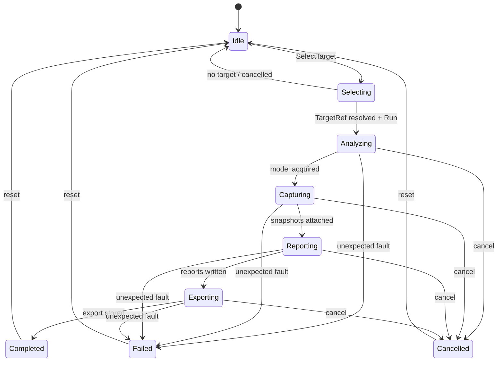
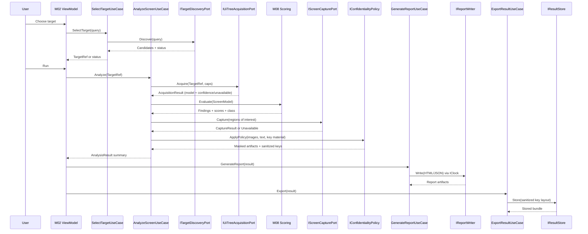

# DES-0004 Analysis Flow Basic Design

This artifact fixes the end-to-end run flow of Surveyor at basic-design granularity: which module acts in which stage, what each stage consumes and produces, how expected failures / `Unavailable` / `PartialResult` / cancellation flow through, and where each guardrail is checked. It does not fix algorithms, score formulas, schemas, or Windows-API sequences (detailed design). It builds on module responsibilities in [DES-0002](des-0002-module-responsibility-basic-design.md) and boundary contracts in [DES-0003](des-0003-module-interface-basic-design.md).

## Trace Block

| Field | Content |
| -- | -- |
| Artifact | `DES-0004`, Analysis Flow Basic Design, basic design phase |
| Upstream | [DES-0001](../architecture/des-0001-initial-architecture.md) Data Flow; [DES-0002](des-0002-module-responsibility-basic-design.md); [DES-0003](des-0003-module-interface-basic-design.md); guardrails `RQ-048`, `RQ-051`, `RQ-052`, `RQ-054`; `RQ-027`, `RQ-050`, `RQ-053`; `RD-001`, `RD-012`, `RD-014`, `RD-020`, `RD-024`, `RD-032` |
| Downstream | Detailed-design stage rules (error aggregation, ROI selection, cap handling); Codex slices and `UT-0001`–`UT-0012`/`IT-0001`–`IT-0006` in [DES-0005](des-0005-vmodel-traceability-and-downstream-tests.md) |
| Evidence | Staged run flow, per-stage in/out and failure behavior, run state machine, cancellation/partial-result rules, guardrail checkpoints, unavailable-vs-low-score rule |
| Verification | `tools/okf/Validate-Okf.ps1`; `git diff --check`; basic-design gate of [Quality Review Policy](../process/quality-review-policy.md) |
| Residual Risk | ROI selection policy, cap/timeout defaults, and error-aggregation rules are detailed design; custom-drawn regions limit acquisition/capture completeness |

## Run State Machine

The ViewModel (`M02`) owns the run state; use cases (`M03`) drive stage transitions.

The run only reaches `Completed` after Stage 8 export/store finishes; `Reporting` transitions to the intermediate `Exporting` state when reports are written (Stage 7), and `Exporting` reaches `Completed` once the export bundle is stored (Stage 8). This keeps the state machine aligned with the Stages 2–8 cancellation span: an export that is still running, faults, or is cancelled is represented as `Exporting`, `Failed`, or `Cancelled` respectively, never as a premature `Completed`.

Expected outcomes (`Unavailable`, `PermissionDenied`, `Timeout`, `PartialResult`) do **not** move the run to `Failed`; they are carried in the result and the run still reaches `Completed` with diagnostics. Only unexpected faults reach `Failed`. External cancel reaches `Cancelled` and leaves no persisted partial artifact.

## Staged Flow

## Stage Contracts

### Stage 1 — Target Selection (`SelectTargetUseCase` / `ITargetDiscoveryPort`)

- **In**: `DiscoveryQuery`. **Out**: ordered `TargetCandidate` list → resolved `TargetRef`.
- **Failure/partial**: `PermissionDenied`/`IntegrityMismatch`/`Unavailable`/`Timeout` returned as status; run does not start until a `TargetRef` resolves.
- **Guardrail checkpoint**: `RQ-048` (enumeration only, no activation); `RQ-049` (permission/integrity surfaced); `RQ-054` (no `HWND` to VM).
- **RQ/RD**: `RQ-048`, `RQ-049`; `RD-001`, `RD-023`.

### Stage 2 — Acquisition (`AnalyzeScreenUseCase` / `IUiTreeAcquisitionPort`)

- **In**: `TargetRef` + caps. **Out**: `ScreenModel`/`UiElement` tree with `Availability`/`AcquisitionConfidence`, run-level diagnostics.
- **Failure/partial**: per-node `Unavailable(reason)`; `PartialResult(capReached)`/`Timeout` at run level; these are recorded, **not** turned into scores.
- **Guardrail checkpoint**: `RQ-048`/`RD-032` (only read patterns; state-changing patterns prohibited); `RQ-050` (caps); `RQ-051` (stable order/keys); `RQ-052` (`Name`/text as `DisplayLabel`).
- **RQ/RD**: `RQ-017`, `RQ-026`, `RQ-048`, `RQ-049`, `RQ-050`; `RD-003`, `RD-004`, `RD-032`.

### Stage 3 — Scoring (`M08`, pure domain)

- **In**: `ScreenModel`. **Out**: `Finding` list, per-screen scores, `TestabilityClass`, and generated `ImprovementCandidate`s with rationale (`RD-015`). Evaluation spans all axes: identifiability (`RQ-017`), operability (`RQ-018`), result-determinability (`RQ-019`), precondition-controllability (`RQ-020`), screen-stability (`RQ-021`), custom-UI risk (`RQ-005`/`RQ-022`), coordinate/image-dependence (`RQ-023`).
- **Failure/partial**: none by I/O — pure; `Unavailable` inputs are represented as findings/limits, never silently scored as low. Same input → same output.
- **Guardrail checkpoint**: `RQ-051` (determinism — no clock/locale/ambient); **unavailable-vs-low-score rule enforced here** (an unacquirable element yields an `Unavailable`-tagged finding, not a fabricated low score); non-orthogonal axes (identifiability → coordinate-dependence) must not double-count one root cause (`RQ-006`, ch.4).
- **RQ/RD**: `RQ-003`, `RQ-005`, `RQ-006`, `RQ-007`, `RQ-013`, `RQ-017`–`RQ-023`, `RQ-029`, `RQ-034`, `RQ-051`; `RD-005`–`RD-011`, `RD-014`, `RD-015`, `RD-020`. Formulas/thresholds are detailed design.

### Stage 4 — Capture (`AnalyzeScreenUseCase` / `IScreenCapturePort`)

- **In**: regions of interest (from findings). **Out**: `CaptureResult` (image + DPI/bounds metadata) or `Unavailable(reason)`.
- **Failure/partial**: offscreen/occluded/blocked → `Unavailable(reason)` attached to the finding; capture failure never fails the run.
- **Guardrail checkpoint**: `RQ-048` (no foreground/move/input); `RQ-051` (metadata deterministic; **image bytes excluded from scoring**); `RQ-052` (image confidential — flows only to Stage 5).
- **RQ/RD**: `RQ-011`, `RQ-016`, `RQ-027`; `RD-012`, `RD-013`.

### Stage 5 — Confidentiality (`AnalyzeScreenUseCase` / `IConfidentialityPolicy`)

- **In**: images, extracted text, key material candidates. **Out**: masked/limited artifacts + sanitized key/path material.
- **Failure/partial**: degrades to the safest option; never "fail open".
- **Guardrail checkpoint**: `RQ-052`/`RD-022` (**mandatory gate** — nothing reaches report/store before this stage; secure-by-default; no raw sensitive text into keys/paths/ids).
- **RQ/RD**: `RQ-030`, `RQ-052`; `RD-022`.

### Stage 6 — Result Assembly (`AnalyzeScreenUseCase`)

- **In**: model (incl. screen/state-unit identity `RD-002` and any user-supplied `ScreenSelectionMetadata` `RD-016`), findings/scores/class, improvement candidates (`RD-015`), snapshot refs, diagnostics (all post-policy). **Out**: `AnalysisResult`.
- **Failure/partial**: aggregates stage statuses into a run-level result carrying `PartialResult` and per-item `Unavailable` markers; the distinction between "unavailable" and "low score" is preserved into the result model.
- **Guardrail checkpoint**: `RQ-051` (stable keys/order in the assembled result); `RQ-054` (result is a domain-safe DTO, no Windows types).
- **RQ/RD**: `RQ-025`, `RQ-046`, `RQ-053`; `RD-002`, `RD-014`, `RD-015`, `RD-016`, `RD-019`, `RD-020`, `RD-021`.

### Stage 7 — Report (`GenerateReportUseCase` / `IReportWriter`, `IClock`)

- **In**: `AnalysisResult`. **Out**: HTML + JSON artifacts.
- **Failure/partial**: `IoError`/`Timeout`/schema-validation as result; atomic write leaves no partial file on cancel/failure.
- **Guardrail checkpoint**: `RQ-051` (byte-stable order/keys; time via `IClock`; no re-round/re-classify); `RQ-052` (only post-policy content; HTML handling notice); `RQ-054` (UI-independent writer). Presents improvement candidates (`RD-015`) and priority basis (`RD-016`) as carried; the writer does not compute priority.
- **RQ/RD**: `RQ-025`, `RQ-026`, `RQ-029`, `RQ-030`, `RQ-031`; `RD-015`, `RD-016`, `RD-017`, `RD-018`, `RD-019`, `RD-022`.

### Stage 8 — Export/Store (`ExportResultUseCase` / `IResultStore`)

- **In**: `AnalysisResult` / run id. **Out**: stored/exported bundle keyed by run id + sanitized `ScreenKey`.
- **Failure/partial**: `NotFound`/`IoError`/`PartialResult`/`Timeout`; atomic write.
- **Guardrail checkpoint**: `RQ-052`/`RD-022` (default-safe local, sanitized paths); `RQ-051` (deterministic layout); supports `RQ-010`/`RQ-031` comparison.
- **RQ/RD**: `RQ-010`, `RQ-031`, `RQ-053`; `RD-019`, `RD-021`, `RD-022`.

## Cancellation, Timeout, And Partial Results

- A single run `CancellationToken` threads through Stages 2–8. External cancel → `Cancelled` state; **no persisted partial artifact** (atomic writes in Stages 7–8 guarantee this).
- Per-operation timeouts (Stages 1, 2, 4, 7, 8) yield a `Timeout` status (expected result), not `Failed`, and are recorded in diagnostics (`RQ-050`, `RD-024`).
- Acquisition/capture caps (`RQ-050`) yield `PartialResult`; the report and store still complete with the partial model and explicit "not fully acquired / not captured" markers.
- **`Unavailable` never becomes a low score**: Stages 2/4 produce `Unavailable(reason)`; Stage 3 keeps it as an availability-tagged finding; Stages 6–8 preserve it distinctly in both human- and machine-readable output (`RD-020`).

## Guardrail Checkpoint Summary

| Guardrail | Where checked in the flow |
| -- | -- |
| `RQ-048` read-only | Stage 1 (enumeration only), Stage 2 (read patterns only — `RD-032`), Stage 4 (no foreground/input); verified by `UT-0005` spy audit + `IT-0001` state-unchanged |
| `RQ-051` determinism | Stage 2 (order/keys), Stage 3 (pure scoring), Stage 6 (assembled order), Stage 7 (byte-stable, `IClock`) |
| `RQ-052` confidentiality | Stage 5 mandatory gate; Stages 7–8 emit only post-policy content; keys/paths sanitized |
| `RQ-054` WinUI/core separation | All stages run in application/domain with domain-safe DTOs; only `M02`/`M01` touch WinUI |

## Open Items (Detailed Design)

- ROI selection policy for Stage 4 (which findings trigger capture, crop rules).
- Error-aggregation rules for Stage 6 (how per-stage statuses combine into run-level status).
- Cap/timeout default values (`RQ-050`, `RD-024`).
- Concrete scoring pipeline, thresholds, rounding (Stage 3; `RD-020`).

## Related

- [DES-0001 Initial Architecture](../architecture/des-0001-initial-architecture.md)
- [DES-0002 Module Responsibility Basic Design](des-0002-module-responsibility-basic-design.md)
- [DES-0003 Module Interface Basic Design](des-0003-module-interface-basic-design.md)
- [DES-0005 V-Model Traceability and Downstream Tests](des-0005-vmodel-traceability-and-downstream-tests.md)
- [Lifecycle Traceability](../process/lifecycle-traceability.md)
- [Quality Review Policy](../process/quality-review-policy.md)
