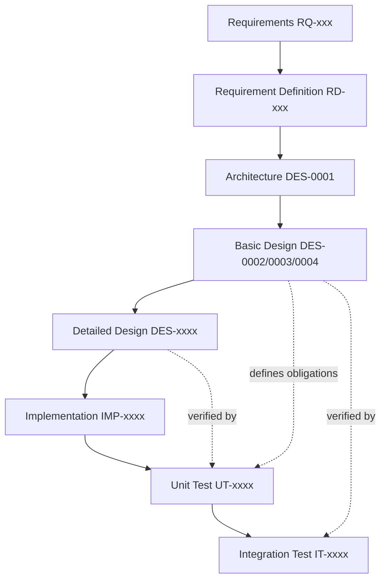

# DES-0005 V-Model Traceability and Downstream Test Design Obligations

This artifact makes the basic design verifiable against a V-model. For each basic-design item ([DES-0002](des-0002-module-responsibility-basic-design.md), [DES-0003](des-0003-module-interface-basic-design.md), [DES-0004](des-0004-analysis-flow-basic-design.md)) it names: what detailed design must decide, the candidate implementation module/file, the unit-test viewpoint, and the integration-test viewpoint. It also fixes the planned `UT-xxxx`/`IT-xxxx` identifiers referenced by DES-0002–0004 so downstream trace evidence has stable anchors, and lists Codex implementation-slice candidates.

Planned `UT-xxxx`/`IT-xxxx` IDs here are **obligations**, not yet evidence. Actual evidence is created under `knowledge/traces/` per [Lifecycle Traceability](../process/lifecycle-traceability.md) when the tests are written.

## Trace Block

| Field | Content |
| -- | -- |
| Artifact | `DES-0005`, V-Model Traceability and Downstream Test Design Obligations, basic design phase |
| Upstream | [DES-0002](des-0002-module-responsibility-basic-design.md), [DES-0003](des-0003-module-interface-basic-design.md), [DES-0004](des-0004-analysis-flow-basic-design.md); [DES-0001](../architecture/des-0001-initial-architecture.md); requirement-definition lifecycle trace (§5); guardrails `RQ-048`, `RQ-051`, `RQ-052`, `RQ-054` |
| Downstream | Detailed-design `DES-xxxx`; Codex `IMP-xxxx`; unit evidence `UT-0001`–`UT-0012`; integration evidence `IT-0001`–`IT-0006` under `knowledge/traces/` |
| Evidence | V-model item→detail/impl/UT/IT map, RQ/RD→DES→UT/IT trace table, planned UT/IT catalogue, Codex slice candidates, unresolved risks |
| Verification | `tools/okf/Validate-Okf.ps1`; `git diff --check`; basic-design gate of [Quality Review Policy](../process/quality-review-policy.md) |
| Residual Risk | UT/IT IDs are obligations pending implementation; UIA/capture/packaging/storage-default choices open (`RSK-RD-001`, `RSK-RD-003`); calibration non-numeric until detailed design (`RSK-RD-002`) |

## V-Model Position

Left arm (design refinement) descends RQ → RD → architecture → basic → detailed → implementation. Right arm (verification) ascends unit → integration. This artifact fixes the horizontal links: each basic-design item states which right-arm test verifies it.

## Basic-Design Item → Downstream Map

Each row: a basic-design item, what detailed design must still decide, the candidate implementation module (from [DES-0002](des-0002-module-responsibility-basic-design.md)), the unit-test viewpoint, and the integration-test viewpoint.

| Basic-design item | Detailed design must decide | Impl module (candidate file/area) | Unit-test viewpoint | Integration-test viewpoint |
| -- | -- | -- | -- | -- |
| Domain model + key/label separation + screen/state-unit (`M04`) | Key derivation algorithm, normalization/hash, collision rule, field set, screen-state-unit key rule | `Surveyor.Domain` (model, keys) | `UT-0001`: key stability, sanitization, label/key separation, availability semantics, screen/state-unit identity (`RD-002`) | — (pure) |
| Scoring + classification + improvement candidates (`M08`) | Formulas, weights, thresholds, rounding, non-orthogonality de-dup, candidate-derivation rules | `Surveyor.Domain` (scoring rules) | `UT-0002`: deterministic scoring across all eval axes (`RD-005`–`RD-011`), unavailable≠low-score, no double-count, improvement-candidate generation (`RD-015`) | `IT-0006` (perf on large trees) |
| Prioritization support (`M04`/`M03`/`M10`) | Metadata field set, presentation format; note inputs are user-supplied not analyzer-derived | `Surveyor.Domain` (metadata type), `Surveyor.Application`, `Surveyor.Reports` | `UT-0002` (candidate generation), `UT-0006`/`UT-0007` (priority/candidate presentation, `RD-016`) | `IT-0004` |
| `ITargetDiscoveryPort` (`M05`) | Status enum, integrity/`uiAccess` handling, `TargetRef` fields | `Surveyor.Adapters.Discovery` | `UT-0003`: candidate ordering + status mapping | `IT-0005`: real integrity/permission |
| `IUiTreeAcquisitionPort` (`M06`) | UIA library, MSAA fallback, confidence rubric, cap defaults | `Surveyor.Adapters.Uia` | `UT-0004`: fixture tree→model, unavailable markers | `IT-0002`: real UIA acquisition; `IT-0001`: state-unchanged |
| Read-only enforcement (`M06`) | Spy layer design, prohibited-pattern list detail | `Surveyor.Adapters.Uia` (spy) | `UT-0005`: audit fails on any state-changing pattern | `IT-0001`: target-state-unchanged invariants |
| `IScreenCapturePort` (`M07`) | Capture API, occlusion/multi-monitor/offscreen, image format | `Surveyor.Adapters.Capture` | via fake in `UT-0012` | `IT-0003`: DPI/occlusion/multi-monitor/offscreen |
| `IConfidentialityPolicy` (`M09`) | Masking technique, default retention, secure-by-default values | `Surveyor.Domain`/`Surveyor.Policy` | `UT-0008`: secure-by-default + key/path sanitization | `IT-0004`: masked content in emitted artifacts |
| `IReportWriter` HTML/JSON (`M10`) | JSON schema + version, HTML layout, handling notice | `Surveyor.Reports` | `UT-0006` (JSON golden + cancel), `UT-0007` (HTML + notice) | `IT-0004` |
| `IResultStore` (`M12`) | Default paths, retention, export bundle format, partial semantics | `Surveyor.Adapters.Store` | `UT-0009`: atomic/partial/sanitized paths | `IT-0004` |
| `IClock` (`M11`) | Timestamp format/precision | `Surveyor.Application`/adapter | `UT-0010`: fixed clock → deterministic output | — |
| Presentation ports + ViewModels (`M01`/`M02`) | Intent set, dialog types, WinUI page mapping | `Surveyor.App` (WinUI), `Surveyor.Presentation` (VMs) | `UT-0011`: VM run state machine with fakes | thin/manual UI verification |
| Use cases (`M03`) | Stage error-aggregation, ROI selection rules | `Surveyor.Application` | `UT-0012`: full orchestration with fakes | `IT-0001`/`IT-0002`/`IT-0003`/`IT-0006` |
| Composition root (`M13`) | Provider selection, lifetime/scoping | `Surveyor.App` (host wiring) | wiring smoke test | end-to-end run assembly |
| Run flow + cancellation/partial (`DES-0004`) | Timeout/cap defaults, aggregation rules | `Surveyor.Application` | cancellation/partial-result paths in `UT-0012` | `IT-0001`–`IT-0006` staged assumptions |

Candidate assembly names (`Surveyor.Domain`, `Surveyor.Application`, `Surveyor.Adapters.*`, `Surveyor.Reports`, `Surveyor.App`) are candidates for detailed design, not fixed project structure.

## RQ / RD → DES → UT / IT Trace

| Guardrail / concern | RQ | RD | Basic-design DES | UT | IT |
| -- | -- | -- | -- | -- | -- |
| Read-only inspection | `RQ-048` | `RD-001`, `RD-032` | DES-0002 M05/M06, DES-0003 discovery/acquisition, DES-0004 S1/S2/S4 | `UT-0005` | `IT-0001` |
| Determinism | `RQ-051` | `RD-020`, `RD-025` | DES-0002 M04/M08, DES-0003 clock/writer, DES-0004 S3/S6/S7 | `UT-0002`, `UT-0006`, `UT-0010` | `IT-0004` |
| Confidential data | `RQ-052` | `RD-012`, `RD-022` | DES-0002 M07/M09/M12, DES-0003 policy/store, DES-0004 S5 | `UT-0008` | `IT-0004` |
| WinUI/core separation | `RQ-054` | `RD-025` | DES-0002 M01/M02/M03/M13, DES-0003 presentation ports/use cases | `UT-0011`, `UT-0012` | thin UI verification |
| Identifiability eval | `RQ-017`, `RQ-041` | `RD-005` | DES-0002 M08, DES-0004 S3 | `UT-0002` | `IT-0006` |
| Operability eval | `RQ-018` | `RD-006` | DES-0002 M08, DES-0004 S3 | `UT-0002` | `IT-0006` |
| Result-determinability eval | `RQ-019` | `RD-007` | DES-0002 M08, DES-0004 S3 | `UT-0002` | `IT-0006` |
| Precondition-controllability eval | `RQ-020` | `RD-008` | DES-0002 M08, DES-0004 S3 | `UT-0002` | `IT-0006` |
| Screen-stability eval | `RQ-021`, `RQ-006` | `RD-009` | DES-0002 M08, DES-0004 S3 | `UT-0002` | `IT-0006` |
| Custom-UI risk eval | `RQ-005`, `RQ-022`, `RQ-042` | `RD-010` | DES-0002 M08, DES-0004 S3 | `UT-0002` | `IT-0002` |
| Coordinate/image-dependence eval | `RQ-023`, `RQ-006` | `RD-011` | DES-0002 M08, DES-0004 S3 | `UT-0002` | `IT-0006` |
| Classification + do-not-automate rationale | `RQ-013`, `RQ-034`, `RQ-040` | `RD-014`, `RD-015` | DES-0002 M08/M10, DES-0004 S3/S7 | `UT-0002`, `UT-0007` | `IT-0004` |
| Screen/state evaluation unit | `RQ-025`, `RQ-046` | `RD-002` | DES-0002 M04, DES-0004 S6 | `UT-0001` | — |
| Prioritization support (user-supplied basis) | `RQ-001`, `RQ-008`, `RQ-013`, `RQ-046` | `RD-016` | DES-0002 M04/M03/M10, DES-0004 S6/S7 | `UT-0002` (M08 fabricates no priority), `UT-0012` (M03 threads metadata unchanged), `UT-0007` (presentation) | `IT-0004` |
| Acquisition of Win32/MFC info | `RQ-017`, `RQ-026`, `RQ-049` | `RD-003`, `RD-004` | DES-0003 acquisition port | `UT-0004` | `IT-0002` |
| Capture + correspondence | `RQ-011`, `RQ-016`, `RQ-027`, `RQ-028` | `RD-012`, `RD-013` | DES-0003 capture port, DES-0004 S4 | `UT-0012` (fake) | `IT-0003` |
| Reports (human + machine) | `RQ-025`, `RQ-026`, `RQ-030`, `RQ-031` | `RD-017`, `RD-018`, `RD-019` | DES-0003 writer, DES-0004 S7 | `UT-0006`, `UT-0007` | `IT-0004` |
| Stable keys / comparability | `RQ-031`, `RQ-053` | `RD-019`, `RD-020`, `RD-021` | DES-0002 M04, DES-0003 store | `UT-0001`, `UT-0009` | `IT-0004` |
| Environment/permissions | `RQ-049`, `RQ-054` | `RD-023`, `RD-026` | DES-0003 discovery port | `UT-0003` | `IT-0005` |
| Performance/scale | `RQ-050` | `RD-024` | DES-0004 caps/timeout | `UT-0002` (bounded) | `IT-0006` |

## Planned Unit-Test Obligations (`UT-xxxx`)

| ID | Behavior | RQ / RD |
| -- | -- | -- |
| `UT-0001` | Domain key stability, sanitization, `DisplayLabel`/key separation, availability semantics, and screen/state-unit identity (same window, different state → distinct `ScreenKey`) | `RQ-025`, `RQ-046`, `RQ-053`; `RD-002`, `RD-004`, `RD-020`, `RD-021` |
| `UT-0002` | Deterministic scoring across all evaluation axes — identifiability/operability/result-determinability/controllability/screen-stability/custom-UI/coordinate-dependence (`RD-005`–`RD-011`); `Unavailable`≠low score; no double-count of one root cause; improvement-candidate generation with rationale (`RD-015`); scoring fabricates no priority basis — user-supplied metadata is never computed by `M08` (`RD-016`) | `RQ-005`, `RQ-017`–`RQ-023`, `RQ-029`, `RQ-034`, `RQ-051`; `RD-005`–`RD-011`, `RD-014`, `RD-015`, `RD-016`, `RD-020` |
| `UT-0003` | Target discovery candidate ordering + permission/integrity/unavailable status mapping | `RQ-049`; `RD-001`, `RD-023` |
| `UT-0004` | Acquisition fixture tree → model with unavailable/confidence markers | `RQ-017`, `RQ-026`; `RD-003`, `RD-004` |
| `UT-0005` | Read-only adapter audit: spy fails on any state-changing UIA pattern | `RQ-048`; `RD-032` |
| `UT-0006` | JSON writer golden-file determinism + cancellation/failure atomic-write | `RQ-031`, `RQ-051`; `RD-019`, `RD-020` |
| `UT-0007` | HTML writer output + confidentiality handling notice + presentation of improvement candidates and priority basis | `RQ-029`, `RQ-030`, `RQ-052`; `RD-015`, `RD-016`, `RD-017`, `RD-022` |
| `UT-0008` | Confidentiality secure-by-default + key/path sanitization; both policy branches | `RQ-052`; `RD-022` |
| `UT-0009` | Result store atomic write, partial semantics, sanitized paths | `RQ-052`, `RQ-053`; `RD-021`, `RD-022` |
| `UT-0010` | Fixed clock → reproducible timestamped output | `RQ-051`; `RD-020` |
| `UT-0011` | ViewModel run state machine + presentation-port fakes (no live WinUI) | `RQ-054`; `RD-025`, `RD-030` |
| `UT-0012` | Use-case orchestration end to end over all fakes; cancellation/partial paths; `M03` threads user-supplied `ScreenSelectionMetadata` through unchanged and never fabricates priority (`RD-016`) | `RQ-046`, `RQ-048`, `RQ-054`; `RD-001`, `RD-016`, `RD-025`, `RD-032` |

## Planned Integration-Test Obligations (`IT-xxxx`)

| ID | Behavior + environment assumptions | RQ / RD |
| -- | -- | -- |
| `IT-0001` | Target-state-unchanged invariants (focus, selection, text, toggle, expand, scroll, tab/dialog, window pos/z-order, business data) before/after a full run against a fixture app | `RQ-048`; `RD-032` |
| `IT-0002` | Real UIA acquisition against a fixture app; Windows version, DPI, permission assumptions recorded | `RQ-017`, `RQ-026`, `RQ-049`; `RD-003`, `RD-004` |
| `IT-0003` | Capture correctness: DPI awareness, occlusion, multi-monitor, offscreen → `Unavailable` marking | `RQ-027`; `RD-012` |
| `IT-0004` | Confidential end-to-end: emitted HTML/JSON/stored bundle contain only masked content; no raw sensitive text in keys/paths | `RQ-052`; `RD-022` |
| `IT-0005` | Environment/permission/integrity + packaging assumptions (same vs higher integrity, `uiAccess`) | `RQ-049`, `RQ-054`; `RD-023`, `RD-026` |
| `IT-0006` | Performance/scale: per-screen time target, caps on large trees, partial-result behavior | `RQ-050`; `RD-024` |

## Codex Implementation-Slice Candidates

Adapter-agnostic slices can proceed before the technology-allocation ratification (`ADR-0002`); adapter-bound slices wait on the relevant spike.

| Order | Slice | Adapter-agnostic? | Primary tests |
| -- | -- | -- | -- |
| 1 | Domain model + keys (`M04`) | Yes | `UT-0001` |
| 2 | Scoring skeleton (`M08`) | Yes | `UT-0002` |
| 3 | Confidentiality policy (`M09`) | Yes | `UT-0008` |
| 4 | Clock + fixed-clock seam (`M11`) | Yes | `UT-0010` |
| 5 | Discovery port + fake (`M05`) | Yes (fake) | `UT-0003` |
| 6 | Acquisition port + fixture loader (`M06`) | Yes (fake) | `UT-0004` |
| 7 | Read-only spy audit (`M06`) | Yes | `UT-0005` |
| 8 | JSON writer (`M10`) | Yes | `UT-0006` |
| 9 | HTML writer (`M10`) | Yes | `UT-0007` |
| 10 | Result store + export (`M12`) | Yes | `UT-0009` |
| 11 | Use-case wiring over fakes (`M03`) | Yes | `UT-0012` |
| 12 | ViewModels + presentation ports (`M02`) | Yes (fakes) | `UT-0011` |
| 13 | Real UIA/capture adapters + composition (`M06`/`M07`/`M13`) | No (needs spike) | `IT-0001`–`IT-0003` |

## Unresolved Risks Carried Into Detailed Design

- `RSK-RD-001`: UIA client library, capture API, packaging form remain open — resolve via spikes and candidate `ADR-0002`.
- `RSK-RD-002`: score thresholds and expert-calibration targets remain non-numeric until detailed design (`RD-020`, `RD-029`).
- `RSK-RD-003`: confidentiality default paths/retention and exact secure-by-default values undefined (`RD-022`).
- Custom-drawn/non-HWND regions inherently limit acquisition and capture completeness; `Unavailable`-reporting carries residual uncertainty.
- Planned `UT`/`IT` IDs are obligations; evidence must be created under `knowledge/traces/` when tests exist.
- `RSK-DES-001` (from basic-design review, `RD-016`): the correctness property that the analyzer *records* user-supplied `ScreenSelectionMetadata` and never *fabricates* priority is now mapped to named obligations in the trace table and UT catalogue — `UT-0012` (M03 threads metadata unchanged) and `UT-0002` (M08 computes no priority), beyond the `UT-0007` presentation coverage. Detailed design and implementation must realize these assertions when the tests are written so `RD-016` is not verified by presentation alone.
- `RSK-DES-002` (from basic-design review, `RD-020`/`RQ-053`): with the sensitive-fallback key hash delegated to `M09` (invoked by `M03`, outside the domain), detailed design must pin *when* a fallback `ScreenKey` is finalized (domain construction vs application/policy stage) so "core-owned keys" stays coherent. Determinism is preserved (`M09` is deterministic); this is a sequencing-clarity item, not a contradiction.

## Related

- [DES-0002 Module Responsibility Basic Design](des-0002-module-responsibility-basic-design.md)
- [DES-0003 Module Interface Basic Design](des-0003-module-interface-basic-design.md)
- [DES-0004 Analysis Flow Basic Design](des-0004-analysis-flow-basic-design.md)
- [DES-0001 Initial Architecture](../architecture/des-0001-initial-architecture.md)
- [Lifecycle Traceability](../process/lifecycle-traceability.md)
- [Quality Review Policy](../process/quality-review-policy.md)
- [Trace Evidence](../traces/index.md)
