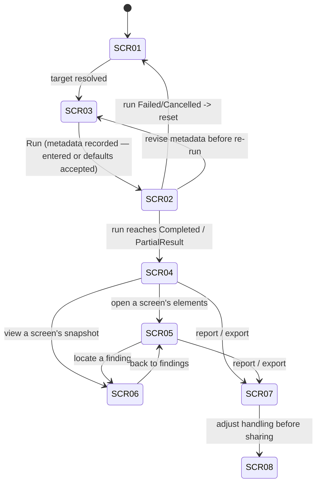

# DES-0006 Screen (Operating UI) Basic Design

This artifact fixes the basic design of **Surveyor's own operating UI** — the WinUI 3 shell the user drives — at a reviewable granularity so detailed design, implementation, unit test, and manual UI verification do not get lost. It covers the screen inventory, navigation/transition, per-screen display/input items and their binding source, the native-vs-HTML review decision, the snapshot correspondence model, the confidentiality-choice and status/error surfaces, and the usability principles that bind them together.

**Disambiguation.** "Screen" here means a **Surveyor app screen** (an operating-UI view the user interacts with), referenced locally as `SCR-01`–`SCR-08`. This is distinct from the analysis-target **`ScreenModel`** (the evaluation/output unit defined in [DES-0002](des-0002-module-responsibility-basic-design.md) `M04` / `RD-002`), which the tool inspects. Where both appear, target screens are called "target `ScreenModel`."

**Scope.** This fixes screen purpose, screen inventory, transitions, per-screen logical items and their `AnalysisResult` binding source, input screens, the review-surface decision, and usability intent. It does **not** fix pixel layout, exact control types, visual styling, XAML structure, or resource strings — those remain detailed design (consistent with the `WinUI screen layout` carve-out in [DES-0002](des-0002-module-responsibility-basic-design.md#downstream-design-carve-outs)). It builds on `M01`/`M02` responsibilities ([DES-0002](des-0002-module-responsibility-basic-design.md)), the presentation ports and use-case contracts ([DES-0003](des-0003-module-interface-basic-design.md)), and the run state machine ([DES-0004](des-0004-analysis-flow-basic-design.md)).

## Trace Block

| Field | Content |
| -- | -- |
| Artifact | `DES-0006`, Screen (Operating UI) Basic Design, basic design phase |
| Upstream | [DES-0002](des-0002-module-responsibility-basic-design.md) `M01`/`M02`; [DES-0003](des-0003-module-interface-basic-design.md) presentation ports + use cases; [DES-0004](des-0004-analysis-flow-basic-design.md) run state machine; [DES-0001](../architecture/des-0001-initial-architecture.md) UI layer + HTML-display open item; guardrails `RQ-052`, `RQ-054`, `RQ-051`; `RQ-009`, `RQ-011`–`RQ-016`, `RQ-024`, `RQ-025`, `RQ-026`, `RQ-028`, `RQ-030`, `RQ-043`, `RQ-044`, `RQ-046`, `RQ-049`; `RD-012`, `RD-013`, `RD-016`, `RD-017`, `RD-018`, `RD-022`, `RD-025`, `RD-028`, `RD-030` |
| Downstream | Detailed-design `DES-xxxx` for XAML layout, control set, visual/interaction spec, `INavigationService`/`IDialogService` concrete intents; [ADR-0003](../decisions/adr-0003-review-surface-native-vs-html.md) ratifies the review-surface decision ([§4](#4-review-surface-decision-native-vs-html-resolves-gap-a)); `UT-0011` (extended), proposed `IT-0007` manual usability walkthrough in [DES-0005](des-0005-vmodel-traceability-and-downstream-tests.md) |
| Evidence | Screen inventory (`SCR-01`–`SCR-08`), navigation/transition map keyed to the run state machine, per-screen item→binding tables, review-surface decision, snapshot correspondence model, confidentiality-choice and status/error surfaces, usability principles, guardrail checkpoints |
| Verification | `tools/okf/Validate-Okf.ps1`; `git diff --check`; basic-design gate of [Quality Review Policy](../process/quality-review-policy.md) |
| Residual Risk | Pixel layout, control set, visual/interaction detail, resource strings, and concrete navigation/dialog intent enums are detailed design; the in-app HTML host (WebView2 vs external browser) remains an implementation choice under the review-surface decision; accessibility conformance target to be set in detailed design |

## 1. Design Goal And Non-Goals

The success criterion, mirroring the other basic-design artifacts, is not "UI coding can start" but **"detailed design and implementation do not hesitate on the tool's own screens."** To reach that this artifact fixes, at a reviewable granularity: which screens exist, how the user moves between them, what each screen shows and takes as input, where results are reviewed (native vs HTML), and how usability, confidentiality choices, and error/status are handled.

Non-goals (detailed design): pixel layout, exact WinUI controls, colours/spacing/iconography, XAML tree, localized strings, and the concrete member set of the navigation/dialog intent enums.

## 2. Screen Inventory (`SCR-01`–`SCR-08`)

Screens are numbered `SCR-01`–`SCR-08` for local reference; the numbers are **not durable artifact IDs**. Every screen is a `M01` XAML view bound to a `M02` ViewModel; no screen calls adapters, use cases' dependencies, or Windows APIs directly (`RQ-054`).

| ID | Screen (JP) | Purpose | Primary use case / port | Driving RQ / RD |
| -- | -- | -- | -- | -- |
| `SCR-01` | Target Selection（ターゲット選択） | Enumerate candidate windows/processes, show permission/integrity status, resolve a `TargetRef` | `SelectTargetUseCase` | `RQ-046`, `RQ-049`; `RD-001`, `RD-023` |
| `SCR-02` | Run & Progress（解析実行・進捗） | Start/cancel a run; show run state, stage progress, and expected-status diagnostics | `AnalyzeScreenUseCase` + run state machine | `RQ-050`, `RQ-051`, `RQ-048`; `RD-024` |
| `SCR-03` | Selection Metadata Input（画面メタデータ入力） | Capture **user-supplied** prioritization basis and selection rationale; analyzer records, never computes | `AnalyzeScreenUseCase` request (`ScreenSelectionMetadata`) | `RQ-046`, `RQ-008`, `RQ-013`; `RD-016`, `RD-028` |
| `SCR-04` | Result Overview / Screen List（画面別評価一覧） | Per-screen testability list: name, class, score, main risks, improvement points, priority basis; high-risk emphasis | projected from `AnalysisResult` | `RQ-012`, `RQ-013`, `RQ-025`, `RQ-040`, `RQ-044`; `RD-014`, `RD-017` |
| `SCR-05` | Element Findings（要素別問題一覧） | Per-element problem list for a selected screen; filter/group by finding type; sync to snapshot | projected from `AnalysisResult` | `RQ-004`, `RQ-026`, `RQ-041`, `RQ-042`; `RD-018` |
| `SCR-06` | Snapshot Viewer（スナップショット対応付け） | Interactive image with finding-position overlay; two-way list↔image correspondence; mark uncapturable regions | `SnapshotRef` + capture metadata in `AnalysisResult` | `RQ-011`, `RQ-016`, `RQ-024`, `RQ-028`, `RQ-043`; `RD-012`, `RD-013` |
| `SCR-07` | Report & Export（レポート・エクスポート） | Generate HTML/JSON, preview HTML, export bundle; surface confidentiality handling notice | `GenerateReportUseCase`, `ExportResultUseCase` | `RQ-030`, `RQ-031`, `RQ-010`; `RD-017`, `RD-019`, `RD-022` |
| `SCR-08` | Confidentiality Choices（機密取り扱い設定） | Show secure-by-default handling; record explicit opt-outs (wider storage / masking off) as deliberate choices | `IConfidentialityPolicy` surface via `M02` + `IDialogService` | `RQ-052`; `RD-022` |

Modal surfaces (via `IDialogService`, not standalone screens): run-cancel confirmation, confidentiality handling notice / opt-out confirmation, and unexpected-fault error dialog. Cross-cutting surfaces present on every screen: a **status/diagnostics banner** ([§7](#7-statuserror-surface-resolves-gap-f)) and a persistent **read-only reassurance indicator** ("target not modified", `RQ-048`).

## 3. Navigation And Transition (Resolves Gap D)

Navigation is expressed by ViewModels through `INavigationService` intents; WinUI (`M01`) realizes them (`RQ-054`). A persistent shell navigation (basic-design intent: a left `NavigationView`-style rail; the concrete control is detailed design) hosts the post-run review screens so the user can move freely among Overview, Findings, Snapshot, and Report after a run — review is **non-linear**, acquisition is linear.

**Run pre-condition (metadata gate).** `AnalyzeScreenUseCase` requires a resolved `TargetRef` **and** a recorded `ScreenSelectionMetadata` (including the selection-rationale note, `RD-028`) before it can accept a Run request. Accordingly, `SCR-03` is a **required step on the acquisition path**, not an optional detour: the user either fills the metadata or explicitly accepts the recorded defaults on `SCR-03` (see [§5 SCR-03](#scr-03-selection-metadata-input-the-previously-missing-input-screen)), and this acceptance is itself recorded as a deliberate user action (`RQ-046`, `RD-016`/`RD-028`). This closes the direct `SCR-01`→`SCR-02` gap and guarantees the analyzer never assembles an `AnalysisResult` without a recorded priority basis.

**Navigation gating (keyed to the [run state machine](des-0004-analysis-flow-basic-design.md#run-state-machine)):**

| Run state | Enabled destinations | Run enablement |
| -- | -- | -- |
| `Idle` / `Selecting` | `SCR-01`, `SCR-03` | Run on `SCR-02` **disabled** until both `TargetRef` is resolved *and* `ScreenSelectionMetadata` has been recorded on `SCR-03` (either entered or defaults explicitly accepted) |
| `Analyzing` / `Capturing` / `Reporting` / `Exporting` | `SCR-02` only (review screens disabled; **Cancel** available) | Run start is idempotent; further Run requests ignored |
| `Completed` (incl. `PartialResult`) | `SCR-04`–`SCR-08` all enabled; `SCR-03` reachable for a **new** run's metadata revision | New Run re-requires metadata acknowledgement (previous run's metadata is not silently reused) |
| `Failed` | error dialog → `SCR-02`/`SCR-01`; review screens disabled | Re-Run requires the metadata gate again |
| `Cancelled` | back to `SCR-01`; no persisted partial artifact ([DES-0004](des-0004-analysis-flow-basic-design.md#cancellation-timeout-and-partial-results)) | Re-Run requires the metadata gate again |

Detailed design decides the concrete `INavigationService` intent members (including the metadata-gate signal exposed to `SCR-02`), whether the shell is a single window with a nav rail or multiple pages, and dialog types for `IDialogService`.

> **Version note (2026-07-11, refined by [DES-0016](des-0016-operating-ui-detailed-design.md), per DES-0007 §5.3):** the gating-table row for `Reporting`/`Exporting` was written against the [DES-0004](des-0004-analysis-flow-basic-design.md) linear model where report/export ran inside the run. Under the accepted [DES-0011](des-0011-port-dtos-status-model-and-use-case-orchestration.md) use-case split they are post-review commands issued from `SCR-07`; for those command-scoped states `DES-0016` refines the row to: user stays on `SCR-07` with a cancellable inline progress surface, `SCR-02` remains reachable to show the in-flight state, all other navigation is blocked, and Run stays disabled. The intent — no review-screen interaction races an output operation — is unchanged. In-run states (`Analyzing`/`Capturing` and the store step) keep the original `SCR-02`-only row.

## 4. Review-Surface Decision: Native vs HTML (Resolves Gap A)

[DES-0001](../architecture/des-0001-initial-architecture.md) left "HTML report display — WebView2 in-app vs external browser" open, and `M01` lists both "result browsing" and "report display." This basic design **decides the split** so downstream work does not stall:

- **Native WinUI is the primary interactive review surface.** `SCR-04`/`SCR-05`/`SCR-06` are native views bound to `AnalysisResult` via `M02`. Only native views can deliver the two-way, low-latency **list↔image correspondence** that `RQ-011`/`RQ-016`/`RQ-028` require, stay unit-testable through ViewModels (`RQ-054`), and remain responsive on large screens.
- **The HTML report is the portable/distribution artifact, not the primary interactive surface.** `M10`'s HTML/JSON (`RQ-030`/`RQ-031`) is for sharing, offline review, LLM/tool re-review, and pasting into report decks (`RQ-043`/`RQ-044`). `SCR-07` can **preview** the generated HTML in-app; whether that preview host is WebView2 or an external browser is an implementation choice left to detailed design.

Rationale: this keeps the interactive-correspondence requirements on the surface that can satisfy them, avoids duplicating interaction logic inside HTML, and preserves `RQ-054` testability. **Consequence for downstream:** `M02` owns projection view-models for `SCR-04`–`SCR-06`; `M10` owns the portable artifact; the writer never becomes the interactive surface. This decision is **ratified as [ADR-0003](../decisions/adr-0003-review-surface-native-vs-html.md)**, resolving the architecture-level open item carried from [DES-0001](../architecture/des-0001-initial-architecture.md).

## 5. Per-Screen Item Definitions (Resolves Gaps B, G)

Logical items and their **binding source** in `AnalysisResult` (concrete columns, widths, formatting, and controls are detailed design). Display order follows core-owned keys/ordering, never hash/arrival order (`RQ-051`); `DisplayLabel` is shown to users but never treated as a key (`RQ-052`).

### SCR-01 Target Selection

| Item | Source | Notes |
| -- | -- | -- |
| Candidate list (title/class as `DisplayLabel`) | `TargetCandidate` (`SelectTargetUseCase`) | Within-session stable ordering ([DES-0003](des-0003-module-interface-basic-design.md#itargetdiscoveryport)) |
| Per-candidate status badge | candidate status (`Ok`/`PermissionDenied`/`IntegrityMismatch`/`Unavailable`/`Timeout`) | Drives permission guidance ([§7](#7-statuserror-surface-resolves-gap-f)) |
| Refresh / filter-search | command | Re-enumeration is read-only (`RQ-048`) |
| Resolve action | → `TargetRef` | Enables Run |

### SCR-03 Selection Metadata Input (the previously missing input screen)

`SCR-03` is a **required step on the acquisition path** (see [§3 Run pre-condition](#3-navigation-and-transition-resolves-gap-d)). It captures the **user-supplied** `ScreenSelectionMetadata` (`RD-016`) and selection rationale (`RD-028`) — the analyzer records these, it does **not** compute them; inline help states this explicitly to avoid the misconception that scores derive priority. Each field carries a recorded default; a user who wants to skip data entry must **explicitly acknowledge the defaults** ("Accept defaults and continue" — a distinct, recorded action, not a silent skip), and that acknowledgement is itself threaded into the result as the recorded basis (`RQ-046`).

| Item | Source/target | Notes |
| -- | -- | -- |
| Regression-test cost | `ScreenSelectionMetadata` | User input; recorded default available, but selection (entered value or default acceptance) is required |
| Change frequency / Exec frequency | `ScreenSelectionMetadata` | User input; recorded default as above |
| UI-pattern representativeness | `ScreenSelectionMetadata` | User input; recorded default as above |
| Judgment-split flag | `ScreenSelectionMetadata` | User input; recorded default as above |
| Selection rationale note | `ScreenSelectionMetadata` (`RD-028`) | Free text; recorded for stakeholder review. When left blank, the metadata acknowledgement records that "no rationale was provided" rather than dropping the field |
| Metadata acknowledgement | `ScreenSelectionMetadata` (basis flag) | Records whether the user entered values or accepted defaults; blocks Run on `SCR-02` until set (`RQ-046`, `RD-028`) |

Threaded unchanged by `M03` into the result ([DES-0002](des-0002-module-responsibility-basic-design.md) `M03`); presented on `SCR-04` and in reports. Concrete default values and the acknowledgement UI (banner vs. confirmation dialog) are detailed design.

### SCR-04 Result Overview / Screen List

| Item | Source | Notes |
| -- | -- | -- |
| Screen name (`DisplayLabel`) + `ScreenKey` | `AnalysisResult` per-screen | Key drives comparison, not display sort key alone |
| Testability class (即自動化/小改善後/限定/改善優先/対象外) | `TestabilityClass` (`M08`) | Colour/emphasis by class (detailed design) |
| Score(s) | `M08` | Presented as carried; never re-rounded/re-classified (`RQ-051`) |
| Main risks / improvement points | `Finding` summary, `ImprovementCandidate` (`RD-015`) | Summarized |
| Priority basis | `ScreenSelectionMetadata` (`RD-016`) | Sort/filter by priority |
| High-risk emphasis | derived from class/score | Visual only |
| Drill-down to `SCR-05`/`SCR-06` | navigation | Per-screen |

### SCR-05 Element Findings

| Item | Source | Notes |
| -- | -- | -- |
| Element `DisplayLabel` + `ElementKey` | `UiElement` | Key never shows raw sensitive text (`RQ-052`) |
| Finding type(s) | `Finding` (`M08`) | Missing/duplicate id, empty/duplicate Name, low operability, result-determinability gap, custom-UI candidate, coordinate-dependent |
| Availability | `Availability` (`Unavailable(reason)`) | **`Unavailable` shown distinctly from a low score** (`RD-020`) |
| Filter/group by finding type | command | Usability: focus one problem class |
| Locate → `SCR-06` | navigation | Selects the element's snapshot region |

### SCR-06 Snapshot Viewer

| Item | Source | Notes |
| -- | -- | -- |
| Screen image | `SnapshotRef` (post-`M09` only) | Only `M09`-processed content is ever shown (`RQ-052`) |
| Finding overlay (highlight of element bounds) | `BoundingRect` + capture metadata | Interactive correspondence ([§6](#6-snapshot-correspondence-model-resolves-gap-c)) |
| Two-way selection sync with `SCR-05` | ViewModel state | Click list item ↔ highlight; click region ↔ select finding |
| Uncapturable markers | capture `Unavailable(reason)` (offscreen/occluded/blocked) | Shown, not hidden (`RQ-027`) |
| Zoom / pan | command | Usability for dense screens |

### SCR-07 Report & Export

| Item | Source/target | Notes |
| -- | -- | -- |
| Generate HTML / JSON | `GenerateReportUseCase` | Post-policy content only |
| HTML preview | generated HTML | Host = WebView2/external (detailed design, [§4](#4-review-surface-decision-native-vs-html-resolves-gap-a)) |
| Export bundle | `ExportResultUseCase` | Sanitized key layout (`RQ-052`/`RQ-053`) |
| Confidentiality handling notice | `IConfidentialityPolicy` result | Shown before share/export (`RD-022`) |

### SCR-08 Confidentiality Choices

| Item | Source/target | Notes |
| -- | -- | -- |
| Current handling summary (secure-by-default) | `IConfidentialityPolicy` | Masking on, scope limited by default |
| Explicit opt-out (widen storage / disable masking) | policy choice | Requires confirmation; **recorded as a deliberate choice** (`RD-022`) |
| Handling notice for distribution | policy result | Reflected on `SCR-07` |

## 6. Snapshot Correspondence Model (Resolves Gap C)

`SCR-05` and `SCR-06` share one selection state in the ViewModel so a finding and its on-screen location stay in sync both ways (`RQ-011`/`RQ-016`/`RQ-028`/`RQ-024`):

- Selecting a finding in `SCR-05` highlights its `BoundingRect` overlay in `SCR-06`; selecting/clicking a highlighted region in `SCR-06` selects the corresponding finding in `SCR-05`.
- Regions that could not be captured (offscreen/occluded/blocked → capture `Unavailable(reason)`) are **explicitly marked** rather than omitted, so a name-less element with no image still reads as "present but not captured," not "no problem."
- Overlays use capture DPI/bounds metadata (`RQ-027`); the correspondence is metadata-driven, so it stays deterministic and testable at the ViewModel level (no image analysis). This keeps `RQ-051` intact and the interaction unit-testable without a live window.

Detailed design decides overlay rendering, zoom control, and cropping.

## 7. Status/Error Surface (Resolves Gap F)

Expected outcomes and unexpected faults are surfaced differently, matching [DES-0004](des-0004-analysis-flow-basic-design.md#run-state-machine) (expected status → still `Completed` with diagnostics; only unexpected faults → `Failed`).

| Condition | Surface | User-facing meaning / action |
| -- | -- | -- |
| `PermissionDenied` / `IntegrityMismatch` (`SCR-01`/`SCR-02`) | status banner + guidance | "Cannot inspect this target at current privilege" → guidance on integrity/`uiAccess`/elevation (`RQ-049`) |
| `Unavailable(reason)` (element/region) | inline marker in `SCR-05`/`SCR-06` | "Present but not acquirable/capturable" — distinct from a low score (`RD-020`) |
| `PartialResult` (caps) | status banner; run still `Completed` | "Not fully acquired/captured" with explicit markers (`RQ-050`) |
| `Timeout` | status banner; recorded in diagnostics | Expected status, not a failure |
| Unexpected fault | `IDialogService` error dialog → `Failed` → reset | Distinct from all expected statuses |

A persistent **read-only reassurance indicator** communicates `RQ-048` ("target not modified") so users trust running against live business screens.

## 8. Usability Principles

These bind the screens and are accountable to `RD-030` (multi-role communication) and `RD-025` (WinUI shell):

- **Responsiveness / no UI-thread block.** Long-running use-case calls run off the UI thread; UI marshaling via `IUiDispatcher`; `SCR-02` always offers **Cancel** (`M02` must not block the UI thread — [DES-0002](des-0002-module-responsibility-basic-design.md) `M02`).
- **Progressive disclosure.** Start at the `SCR-04` overview; drill into element findings and snapshots on demand; keep the first read scannable for leaders/QA (`RQ-009`/`RQ-044`).
- **Two-way traceable correspondence.** Findings and on-screen locations stay linked ([§6](#6-snapshot-correspondence-model-resolves-gap-c)) so problems are understood by position, not just attributes (`RQ-011`/`RQ-016`).
- **Safe-by-default confidentiality.** Masking on and storage scope limited by default; widening is an explicit, confirmed, recorded choice (`SCR-08`, `RD-022`).
- **Consistent status/error language.** One banner grammar across screens; expected status ≠ failure ([§7](#7-statuserror-surface-resolves-gap-f)); permission problems give next steps (`RQ-049`).
- **Multi-role readability.** Avoid raw UIA jargon in primary surfaces; link the [glossary (spec §1.5)](../../docs/gui-testability-analyzer-requirements.md#15-用語) where terms are unavoidable (`RD-030`).
- **Trust of read-only operation.** Persistent "target not modified" reassurance (`RQ-048`).
- **Accessibility intent.** Keyboard operability and screen-reader labels are design intent; a concrete conformance target is set in detailed design.

## 9. Guardrail Checkpoints

| Guardrail | Where checked in the UI |
| -- | -- |
| `RQ-054` WinUI/core separation | Every `SCR-xx` binds via `M02` ViewModels and presentation ports only; no adapter/UIA/capture/store/WinUI-navigation type reaches a view's logic; ViewModels unit-testable with fakes (`UT-0011`) |
| `RQ-052` confidentiality | `SCR-06` shows only post-`M09` images; `SCR-07`/`SCR-08` gate sharing behind the handling notice; opt-outs recorded; keys/paths never expose raw sensitive text |
| `RQ-051` determinism | List/overlay order follows core-owned keys; UI never re-sorts by hash/arrival, never re-rounds/re-classifies scores |
| `RQ-048` read-only | `SCR-01` re-enumeration and all review are read-only; persistent reassurance indicator; no screen offers a target-mutating action |
| `RQ-046` recorded priority basis | `SCR-03` metadata gate blocks Run on `SCR-02` until `ScreenSelectionMetadata` and the selection-rationale acknowledgement are recorded (entered values or explicit default acceptance); no acquisition path bypasses this gate ([§3](#3-navigation-and-transition-resolves-gap-d), `RD-016`/`RD-028`) |

## 10. Downstream Design And Test Obligations

- **Detailed design** must fix: XAML layout and control set per `SCR-xx`; the concrete `INavigationService`/`IDialogService` intent/dialog enums; the in-app HTML host (WebView2 vs external) under [§4](#4-review-surface-decision-native-vs-html-resolves-gap-a); overlay/zoom rendering for `SCR-06`; visual encoding of class/risk; resource strings; and the accessibility conformance target.
- **Ratification**: the review-surface decision ([§4](#4-review-surface-decision-native-vs-html-resolves-gap-a)) is recorded as [ADR-0003](../decisions/adr-0003-review-surface-native-vs-html.md).
- **Verification obligations** (to be absorbed into [DES-0005](des-0005-vmodel-traceability-and-downstream-tests.md)):
  - `UT-0011` (**extended**): ViewModel coverage for navigation gating by run state ([§3](#3-navigation-and-transition-resolves-gap-d)), the `SCR-03` **metadata gate** blocking Run until entered-or-defaults-accepted (`RQ-046`, `RD-028`), `SCR-03` metadata capture threaded unchanged (`RD-016`), `SCR-05`↔`SCR-06` correspondence state ([§6](#6-snapshot-correspondence-model-resolves-gap-c)), and confidentiality opt-out recording (`RD-022`) — all with presentation-port fakes, no live WinUI.
  - `IT-0007` (**proposed, manual**): usability/manual UI walkthrough of the `SCR-01`→`SCR-07` flow against a fixture app, recording multi-role readability (`RD-030`), read-only reassurance (`RQ-048`), and confidentiality-notice behavior (`RD-022`).

## Related

- [DES-0001 Initial Architecture](../architecture/des-0001-initial-architecture.md)
- [DES-0002 Module Responsibility Basic Design](des-0002-module-responsibility-basic-design.md)
- [DES-0003 Module Interface Basic Design](des-0003-module-interface-basic-design.md)
- [DES-0004 Analysis Flow Basic Design](des-0004-analysis-flow-basic-design.md)
- [DES-0005 V-Model Traceability and Downstream Tests](des-0005-vmodel-traceability-and-downstream-tests.md)
- [Lifecycle Traceability](../process/lifecycle-traceability.md)
- [Quality Review Policy](../process/quality-review-policy.md)
