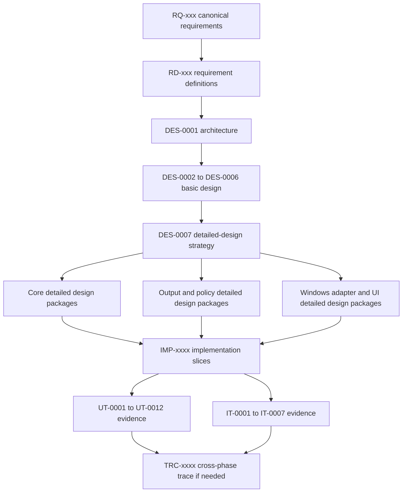
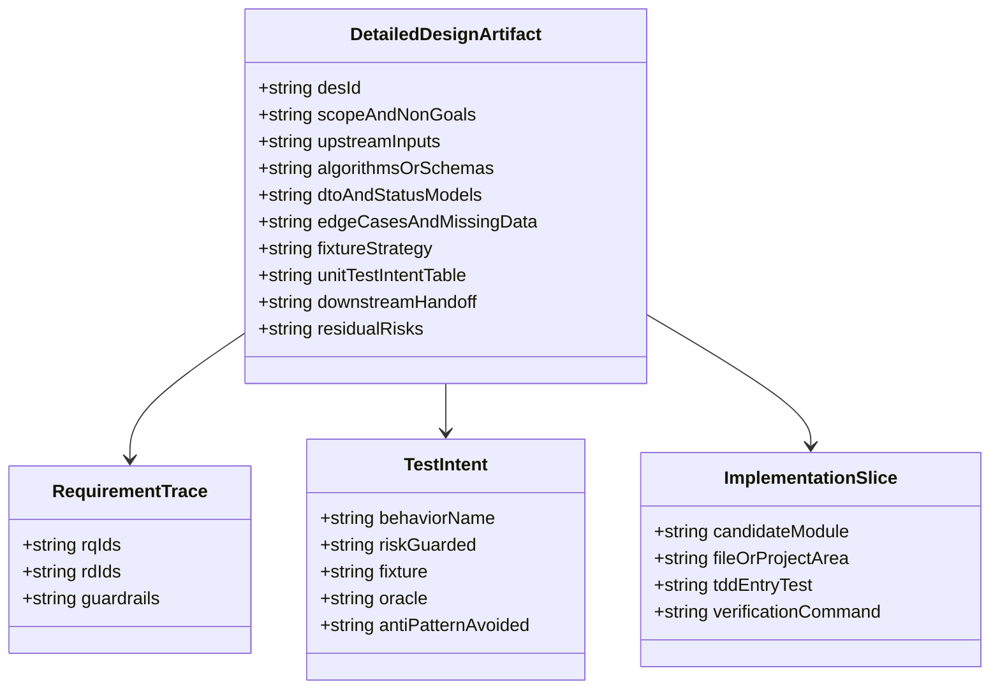
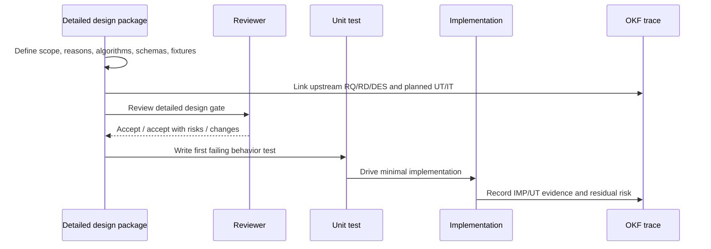

# DES-0007 Detailed Design Phase Execution Strategy

This artifact defines how Surveyor enters the detailed-design phase. It is intentionally stored as an OKF design artifact, not as private task notes, because the next phases need durable answers to "why this order?", "what must be decided before coding?", and "what should the unit tests prove?"

## Trace Block

| Field | Content |
| -- | -- |
| Artifact | `DES-0007`, Detailed Design Phase Execution Strategy, detailed design phase |
| Upstream | [DES-0001](../architecture/des-0001-initial-architecture.md); [DES-0002](des-0002-module-responsibility-basic-design.md); [DES-0003](des-0003-module-interface-basic-design.md); [DES-0004](des-0004-analysis-flow-basic-design.md); [DES-0005](des-0005-vmodel-traceability-and-downstream-tests.md); [DES-0006](des-0006-screen-basic-design.md); [ADR-0003](../decisions/adr-0003-review-surface-native-vs-html.md); [Requirement Definition](../requirements/requirements-definition.md); guardrails `RQ-048`, `RQ-051`, `RQ-052`, `RQ-054`; detailed-design drivers `RD-005` to `RD-021`, `RD-024`, `RD-026`, `RD-029`, `RD-032` |
| Downstream | Planned detailed-design package IDs `DES-0008` to `DES-0017`; later implementation trace `IMP-xxxx`; unit evidence `UT-0001` to `UT-0012`; integration evidence `IT-0001` to `IT-0007` |
| Evidence | OKF-vs-standalone decision, design-package topology, execution order, detailed-design artifact template, trace rules, unit-test intent strategy, residual-risk closure map, Mermaid UML |
| Verification | `tools/okf/Validate-Okf.ps1`; `git diff --check`; detailed-design review against [Quality Review Policy](../process/quality-review-policy.md) |
| Residual Risk | This strategy does not itself decide score formulas, schemas, UIA/capture technologies, storage defaults, or UI layouts. Those decisions are assigned to planned downstream detailed-design packages below. The repository has no source project scaffold yet, so implementation file paths remain candidate areas until project-structure detailed design is accepted. |

## 1. Purpose

The detailed-design phase must convert the accepted architecture and basic design into implementation-ready decisions without losing the reasons behind them. The success criterion is not "there is more documentation." The success criterion is:

- each implementation slice has a precise upstream `RQ`/`RD`/`DES` basis;
- each algorithm, schema, DTO, status enum, ordering rule, and missing-data rule is explicit enough to implement without re-litigating design intent;
- each unit test has a behavior purpose and a fixture/oracle, not just a line-coverage purpose;
- Windows-dependent uncertainty is isolated behind ports and named as integration risk before it blocks core TDD;
- all durable design decisions are discoverable from `knowledge/index.md`, not from chat memory.

The phase should therefore produce a small set of focused detailed-design packages, each ending with a downstream implementation and test handoff.

## 2. Knowledge Format Decision

Detailed design should be **OKF-hosted but self-contained**:

- Store each durable detailed-design document under `knowledge/design/` as a `DES-xxxx` Markdown file with YAML frontmatter, a trace block, and Mermaid diagrams.
- Treat each `DES-xxxx` as a standalone readable design document inside OKF. It must explain its own purpose, upstream inputs, downstream tests, and why the decisions were made.
- Update `knowledge/design/index.md`, `knowledge/index.md`, and `knowledge/log.md` when a new durable design package is added.
- Do not maintain a separate external detailed-design document unless it is generated from OKF later.

Why: Surveyor's central risk is not lack of prose, it is trace drift. A separate detailed-design file outside OKF would be easy to review once and then forget. Keeping detailed design as indexed OKF concepts makes the next `IMP-xxxx`, `UT-xxxx`, and `IT-xxxx` evidence mechanically reachable.

## 3. Phase Topology

## 4. Planned Detailed-Design Packages

The IDs below are reserved as planned packages. They become durable artifacts only when the corresponding Markdown file is created and indexed.

| Order | Planned artifact | Main scope | Why this order | Upstream | Primary tests |
| -- | -- | -- | -- | -- | -- |
| 1 | `DES-0008` Project Structure and Test Harness Detailed Design | Solution/project layout, assembly boundaries, namespaces, test projects, fixture locations, dependency rules | The repository has no source scaffold yet; this prevents implementation from inventing structure ad hoc | `DES-0001`, `DES-0002`, `DES-0003`, `RQ-054`, `RD-025` | All `UT`, especially `UT-0011`/`UT-0012` setup |
| 2 | `DES-0009` Domain Model, Stable Keys, and Availability Detailed Design | `ScreenModel`, `UiElement`, keys, labels, fallback-key finalization stage, availability/confidence semantics | Pure core design unlocks TDD without Windows GUI and closes `RSK-DES-002` | `DES-0002` M04/M09, `DES-0005`, `RQ-051`, `RQ-052`, `RQ-053` | `UT-0001`, `UT-0008` key/path cases |
| 3 | `DES-0010` Scoring, Classification, and Improvement Candidate Detailed Design | Evaluation axes, formulas, thresholds, rounding, non-orthogonal de-dup, strategy classification, improvement candidates | Scoring is the product's core decision logic and must avoid coverage-only tests | `DES-0002` M08, `DES-0004` Stage 3, `RD-005` to `RD-016`, `RD-020` | `UT-0002`, `UT-0007`, `IT-0006` |
| 4 | `DES-0011` Port DTOs, Status Model, and Use-Case Orchestration Detailed Design | Concrete DTO fields, status enums, timeout/cancellation rules, error aggregation, partial-result semantics, ROI selection handoff | This fixes the contracts that implementation and fakes share | `DES-0003`, `DES-0004`, `RQ-048`, `RQ-050`, `RQ-054` | `UT-0003`, `UT-0004`, `UT-0012` |
| 5 | `DES-0012` Report Schema and Deterministic Serialization Detailed Design | JSON schema/version, HTML content structure, stable ordering, timestamp format, atomic write behavior | Machine-readable output and comparison require deterministic design before code | `DES-0003` M10, `DES-0004` Stage 7, `RQ-030`, `RQ-031`, `RQ-051`, `RQ-053` | `UT-0006`, `UT-0007`, `UT-0010` |
| 6 | `DES-0013` Confidentiality, Storage, and Export Detailed Design | Masking/redaction decisions, secure-by-default values, storage paths, retention, sanitized paths, export bundle | Closes `RSK-RD-003` before reports or store can leak sensitive data | `DES-0002` M09/M12, `DES-0003`, `RQ-052`, `RD-022` | `UT-0008`, `UT-0009`, `IT-0004` |
| 7 | `DES-0014` Discovery, UIA/MSAA Acquisition, and Read-Only Audit Detailed Design | Discovery statuses, `TargetRef`, UIA client choice, MSAA fallback, confidence rubric, prohibited call spy | Adapter-bound design must be explicit before live Windows testing; closes part of `RSK-RD-001` | `DES-0003` M05/M06, `DES-0004` Stages 1/2, `RQ-048`, `RQ-049` | `UT-0003`, `UT-0004`, `UT-0005`, `IT-0001`, `IT-0002`, `IT-0005` |
| 8 | `DES-0015` Capture and Snapshot Correspondence Detailed Design | Capture API, DPI/multi-monitor/occlusion behavior, image format, overlay coordinate mapping, uncapturable markers | Snapshot trust is user-facing and integration-heavy, so design must separate pure mapping from live capture | `DES-0003` M07, `DES-0006` SCR-05/SCR-06, `RQ-011`, `RQ-016`, `RQ-027`, `RQ-028` | `UT-0011`, `UT-0012`, `IT-0003` |
| 9 | `DES-0016` Operating UI Detailed Design | XAML/page structure, ViewModel state, navigation/dialog intent enums, metadata gate, accessibility target, HTML preview host | Follows result model/report decisions so UI binds to stable contracts | `DES-0006`, `ADR-0003`, `RQ-030`, `RQ-052`, `RQ-054` | `UT-0011`, `IT-0007` |
| 10 | `DES-0017` Performance and Expert Calibration Detailed Design | Measurement environment, caps/timeouts, large-tree fixture, expert review sample size, agreement target, discrepancy records | Turns `RD-024` and `RD-029` from risk into measurable acceptance work | `DES-0005`, `RQ-034`, `RQ-047`, `RQ-050`, `RD-024`, `RD-029` | `UT-0002` bounded cases, `IT-0006`, expert-review trace |

## 5. Execution Rules

Each detailed-design package should follow this sequence:

1. Re-open its upstream `RQ`/`RD`/`DES` sources and list the exact inputs in the trace block.
2. Decide scope and non-goals first, especially when a Windows adapter choice or UI behavior could expand the package.
3. Write the design in Markdown with Mermaid UML where a relationship, sequence, or state is easier to review as a diagram than prose.
4. Add the unit-test intent table before implementation starts.
5. Identify fixture files or fixture shapes, even if the fixture files are created later during implementation.
6. Add downstream handoff notes: candidate module/project area, first failing test, expected implementation slice, verification command.
7. Update OKF index/log and run OKF validation.
8. Request design review before implementation for packages that decide algorithms, schemas, adapter technologies, privacy defaults, or UI interaction.

Implementation may start per slice after the relevant detailed-design package is accepted or explicitly accepted with risks. Adapter-bound implementation should wait for the relevant spike/decision where the package says the technology choice is blocking.

## 6. Detailed-Design Artifact Template

Every planned `DES-xxxx` detailed-design package should contain these sections unless the package explains why a section is not applicable:

| Section | Required content |
| -- | -- |
| Purpose and success criterion | What later implementers should no longer need to infer |
| Scope and non-goals | Explicit boundaries, especially exclusions inherited from `RQ-035` to `RQ-039` and `RD-027` |
| Trace block | Required lifecycle trace fields from [Lifecycle Traceability](../process/lifecycle-traceability.md) |
| Upstream decisions | Which `RQ`, `RD`, `DES`, and `ADR` inputs are binding |
| Data and contract design | DTO fields, value objects, status enums, null/empty rules, versioning rules |
| Algorithm or rule design | Pseudocode, ordering, rounding, duplicate handling, missing-data behavior |
| Mermaid UML | Class, sequence, state, or activity diagrams for review-critical structure |
| Edge-case table | Permission denied, unavailable, duplicate, custom UI, DPI, occlusion, cancellation, timeout, confidentiality branches as applicable |
| Fixture strategy | Fixture shape, golden-file policy, fake/spy behavior, deterministic oracle |
| Unit-test intent | Behavior name, risk guarded, fixture, oracle, and anti-pattern avoided |
| Integration assumptions | Windows version, DPI, monitor, integrity, fixture app, manual steps, residual risk |
| Downstream handoff | Candidate module/project area, first failing test, implementation slice, verification command |

## 7. Unit-Test Intent Strategy

The unit tests should be written to protect product decisions, not to mirror code. The design package for each `UT-xxxx` must answer: "what false implementation would this test catch?"

| UT | Intent | Meaningful oracle | Test smell to avoid |
| -- | -- | -- | -- |
| `UT-0001` | Prove stable identity, key/label separation, availability semantics, and screen-state identity | Same stable input gives same key; volatile `DisplayLabel` changes do not change key; different screen states differ; `Unavailable` remains explicit | Asserting the exact string produced by a helper without testing volatility, collision, or confidentiality cases |
| `UT-0002` | Prove scoring/classification rules are deterministic and explainable across all evaluation axes | Fixed fixture yields expected findings, score/class, no double-count, no fabricated priority, `Unavailable` is not a low score | One test per method that only repeats the formula, or tests that pass because thresholds equal implementation constants |
| `UT-0003` | Prove discovery status and candidate ordering behavior | Fixed candidates with permission/integrity statuses return stable within-session order and modeled statuses | Mocking the adapter to return the same DTO and only asserting it was returned |
| `UT-0004` | Prove acquisition fixture maps to the domain model with confidence/unavailable markers | Fixture tree with missing identifiers/custom panes maps to expected `UiElement` states and diagnostics | Testing only the happy path where every UIA field is present |
| `UT-0005` | Prove read-only enforcement at adapter seam | Spy fails if any prohibited state-changing UIA pattern is called during acquisition | A test that merely checks the public port has no mutation method |
| `UT-0006` | Prove JSON output is byte-stable, schema-valid, cancellable, and atomically written | Same result and fixed clock produce identical bytes and ordering; cancel/failure leaves no partial artifact | Snapshotting arbitrary JSON without schema or ordering assertions |
| `UT-0007` | Prove HTML output communicates risks, candidates, priority basis, and confidentiality notice | Rendered model includes required sections and post-policy content only | Golden HTML that changes on harmless layout but misses required user meaning |
| `UT-0008` | Prove secure-by-default confidentiality behavior and sanitization | Default policy masks/limits; opt-out is explicit; raw sensitive text never enters keys/paths/ids | Testing only allow-all policy because it is easier to assert |
| `UT-0009` | Prove result-store atomicity, partial semantics, and sanitized layout | Failure/cancel leaves defined state; paths use sanitized key material only | Asserting a file exists after the happy path only |
| `UT-0010` | Prove timestamp determinism through `IClock` | Fixed clock produces reproducible serialized timestamp precision/format | Letting `DateTime.Now` leak into expected output |
| `UT-0011` | Prove ViewModel state and navigation behavior without WinUI | Fakes record run-state gating, metadata gate, SCR-05/SCR-06 selection sync, confidentiality opt-out | Driving a live window for unit evidence or checking only property setters |
| `UT-0012` | Prove use-case orchestration over fakes | Fakes show stage order, cancellation, partial results, policy gate, metadata threaded unchanged | One end-to-end happy path that cannot localize which contract broke |

Two project-level rules follow:

- A test name should describe behavior and risk, not implementation mechanics. Prefer "does not change key when display label changes" over "GetHash returns expected value."
- Golden files are acceptable only when the design states which semantic properties they protect: stable order, schema shape, confidentiality notice, masked content, or atomic write behavior.

## 8. Residual-Risk Closure Map

| Risk | Closure target | Design obligation |
| -- | -- | -- |
| `RSK-RD-001` UIA client, capture API, packaging open | `DES-0014`, `DES-0015`, possible `ADR-0002` | Compare options against read-only, determinism, fixtureability, permissions, packaging, and performance before adapter implementation |
| `RSK-RD-002` score thresholds and expert target non-numeric | `DES-0010`, `DES-0017` | Define initial thresholds, rounding, disagreement categories, expert sample, and adjustment loop |
| `RSK-RD-003` confidentiality defaults undefined | `DES-0013` | Define secure-by-default masking, retention, storage location, opt-out recording, and export behavior |
| Custom-drawn/non-HWND regions incomplete | `DES-0010`, `DES-0014`, `DES-0015` | Preserve confidence/unavailable markers and avoid claiming unsupported automation certainty |
| `RSK-DES-001` priority basis must be recorded, never fabricated | `DES-0010`, `DES-0011`, `DES-0016` | Make scoring compute no priority; make use case thread metadata unchanged; make UI metadata gate explicit |
| `RSK-DES-002` fallback `ScreenKey` finalization stage unclear | `DES-0009`, `DES-0013` | Pin whether fallback key material is finalized during model construction, policy application, or result assembly, while keeping determinism and confidentiality intact |

## 9. Detailed-Design Review Checklist

Before a package is handed to implementation, review it against these checks:

- Trace: upstream `RQ`/`RD`/`DES` links are explicit and honest; no broad overclaim.
- Guardrails: `RQ-048`, `RQ-051`, `RQ-052`, `RQ-054` are either directly addressed or explicitly not in scope.
- Determinism: ordering, keys, timestamps, rounding, duplicate handling, and missing-data behavior are defined.
- Confidentiality: raw screenshots/text/window titles/element names cannot leak into logs, paths, ids, or reports without a documented policy decision.
- Read-only: no target-mutating operation exists in the contract or adapter call sequence.
- Testability: each Windows edge has a fake, fixture, spy, golden file, or integration-test assumption.
- Unit-test intent: tests name behavior and risk; they do not merely trace the implementation path.
- Handoff: the first failing test, candidate project area, and verification command are identified.

## Related

- [DES-0001 Initial Architecture](../architecture/des-0001-initial-architecture.md)
- [DES-0002 Module Responsibility Basic Design](des-0002-module-responsibility-basic-design.md)
- [DES-0003 Module Interface Basic Design](des-0003-module-interface-basic-design.md)
- [DES-0004 Analysis Flow Basic Design](des-0004-analysis-flow-basic-design.md)
- [DES-0005 V-Model Traceability and Downstream Tests](des-0005-vmodel-traceability-and-downstream-tests.md)
- [DES-0006 Screen (Operating UI) Basic Design](des-0006-screen-basic-design.md)
- [ADR-0003 Review Surface](../decisions/adr-0003-review-surface-native-vs-html.md)
- [Lifecycle Traceability](../process/lifecycle-traceability.md)
- [Quality Review Policy](../process/quality-review-policy.md)
- [TDD and Traceability](../process/tdd-and-traceability.md)
