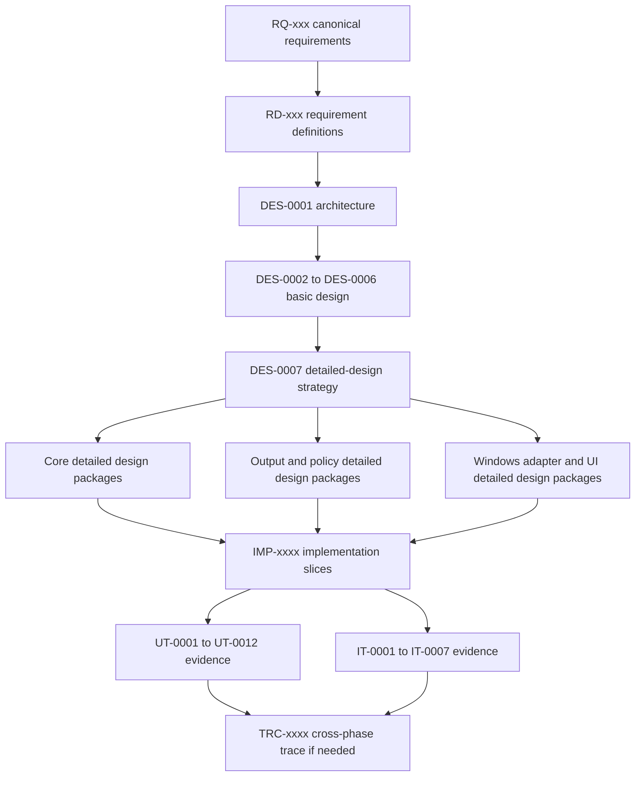
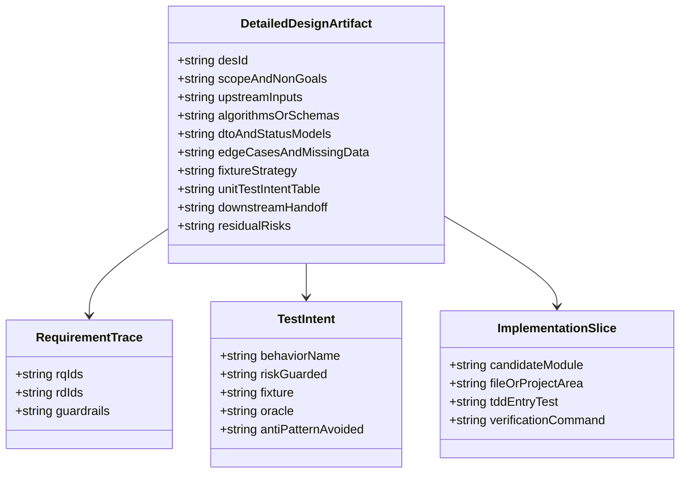
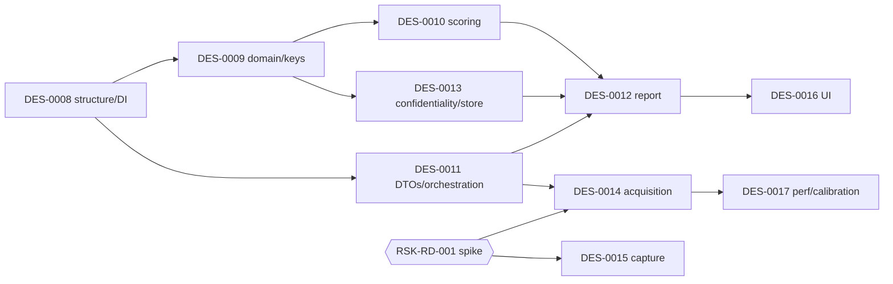
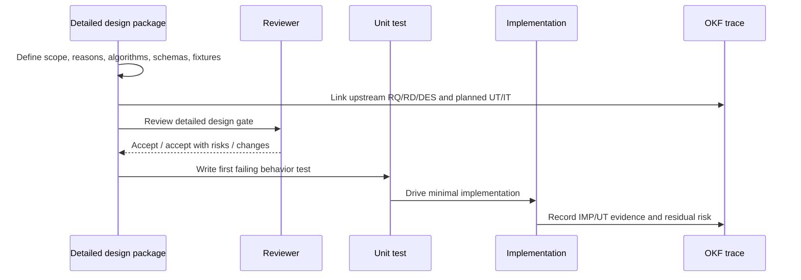

# DES-0007 Detailed Design Phase Execution Strategy

This artifact defines how Surveyor enters the detailed-design phase. It is intentionally stored as an OKF design artifact, not as private task notes, because the next phases need durable answers to "why this order?", "what must be decided before coding?", and "what should the unit tests prove?"

## Trace Block

| Field | Content |
| -- | -- |
| Artifact | `DES-0007`, Detailed Design Phase Execution Strategy, detailed design phase |
| Upstream | [DES-0001](../architecture/des-0001-initial-architecture.md); [DES-0002](des-0002-module-responsibility-basic-design.md); [DES-0003](des-0003-module-interface-basic-design.md); [DES-0004](des-0004-analysis-flow-basic-design.md); [DES-0005](des-0005-vmodel-traceability-and-downstream-tests.md); [DES-0006](des-0006-screen-basic-design.md); [ADR-0003](../decisions/adr-0003-review-surface-native-vs-html.md); [Requirement Definition](../requirements/requirements-definition.md); guardrails `RQ-048`, `RQ-051`, `RQ-052`, `RQ-054`; detailed-design drivers `RD-005` to `RD-021`, `RD-024`, `RD-026`, `RD-029`, `RD-032` |
| Downstream | Planned detailed-design package IDs `DES-0008` to `DES-0017`; later implementation trace `IMP-xxxx`; unit evidence `UT-0001` to `UT-0012`; integration evidence `IT-0001` to `IT-0007` |
| Evidence | OKF-vs-standalone decision, design-package topology, execution order, detailed-design artifact template, trace rules, unit-test intent strategy, residual-risk closure map, Mermaid UML; review-feedback integration from [DES-0007 Multi-Perspective Expert Review](des-0007-review-multiperspective.md) (§4.1) |
| Verification | `tools/okf/Validate-Okf.ps1`; `git diff --check`; detailed-design review against [Quality Review Policy](../process/quality-review-policy.md) |
| Residual Risk | This strategy does not itself decide score formulas, schemas, UIA/capture technologies, storage defaults, or UI layouts. Those decisions are assigned to planned downstream detailed-design packages below. The repository has no source project scaffold yet, so implementation file paths remain candidate areas until project-structure detailed design is accepted. Human-decision items raised by the multi-perspective review (spike/adapter selection, IT runner, at-rest/ACL, approver roles, phase sign-off) are carried in §8.1, not resolved here. |

## 1. Purpose

The detailed-design phase must convert the accepted architecture and basic design into implementation-ready decisions without losing the reasons behind them. The success criterion is not "there is more documentation." The success criterion is:

- each implementation slice has a precise upstream `RQ`/`RD`/`DES` basis;
- each algorithm, schema, DTO, status enum, ordering rule, and missing-data rule is explicit enough to implement without re-litigating design intent;
- each unit test has a behavior purpose and a fixture/oracle, not just a line-coverage purpose;
- Windows-dependent uncertainty is isolated behind ports and named as integration risk before it blocks core TDD;
- all durable design decisions are discoverable from `knowledge/index.md`, not from chat memory.

The phase should therefore produce a small set of focused detailed-design packages, each ending with a downstream implementation and test handoff.

## 2. Knowledge Format Decision

Detailed design should be **OKF-hosted but self-contained**:

- Store each durable detailed-design document under `knowledge/design/` as a `DES-xxxx` Markdown file with YAML frontmatter, a trace block, and Mermaid diagrams.
- Treat each `DES-xxxx` as a standalone readable design document inside OKF. It must explain its own purpose, upstream inputs, downstream tests, and why the decisions were made.
- Update `knowledge/design/index.md`, `knowledge/index.md`, and `knowledge/log.md` when a new durable design package is added.
- Do not maintain a separate external detailed-design document unless it is generated from OKF later.

Why: Surveyor's central risk is not lack of prose, it is trace drift. A separate detailed-design file outside OKF would be easy to review once and then forget. Keeping detailed design as indexed OKF concepts makes the next `IMP-xxxx`, `UT-xxxx`, and `IT-xxxx` evidence mechanically reachable.

## 3. Phase Topology

## 4. Planned Detailed-Design Packages

The IDs below are reserved as planned packages. They become durable artifacts only when the corresponding Markdown file is created and indexed.

| Order | Planned artifact | Main scope | Modules | Why this order | Upstream | Primary tests |
| -- | -- | -- | -- | -- | -- | -- |
| 1 | `DES-0008` Project Structure, Composition Root, and Test Harness Detailed Design | Solution/project layout, assembly boundaries, namespaces, test projects, fixture locations, dependency rules, **composition-root / DI detailed design** (provider selection keys, lifetimes/scoping, injection invariants), **project determinism/quality settings** (TFM, `<Nullable>`, `<InvariantGlobalization>`, `<Deterministic>`, analyzers) | `M13` | The repository has no source scaffold yet; this prevents implementation from inventing structure ad hoc, and the composition root is the one seam where abstractions meet concretes (`RQ-054`) | `DES-0001`, `DES-0002`, `DES-0003`, `RQ-054`, `RD-025` | All `UT`, especially `UT-0011`/`UT-0012` setup; composition-root invariant test |
| 2 | `DES-0009` Domain Model, Stable Keys, and Availability Detailed Design | `ScreenModel`, `UiElement`, keys, labels, fallback-key finalization stage + **fallback-key minimal contract** (deterministic, non-reversible, no raw sensitive text in the domain), availability/confidence semantics, **stable-hash/ordinal determinism rule** | `M04`, `M11` (`IClock` abstraction) | Pure core design unlocks TDD without Windows GUI and closes `RSK-DES-002` | `DES-0002` M04/M09, `DES-0005`, `RQ-051`, `RQ-052`, `RQ-053` | `UT-0001`, `UT-0008` key/path cases |
| 3 | `DES-0010` Scoring, Classification, and Improvement Candidate Detailed Design | Evaluation axes, **axis↔UIA/MSAA property-and-pattern mapping**, formulas, **versioned externalized thresholds/weights/rounding** (report records config version), non-orthogonal de-dup, strategy classification, improvement candidates | `M08` | Scoring is the product's core decision logic and must avoid coverage-only tests | `DES-0002` M08, `DES-0004` Stage 3, `RD-005` to `RD-016`, `RD-020` | `UT-0002`, `UT-0007`, `IT-0006` |
| 4 | `DES-0011` Port DTOs, Status Model, and Use-Case Orchestration Detailed Design | Concrete DTO fields, status enums, timeout/cancellation rules, error aggregation, partial-result semantics, ROI selection handoff, **run-level diagnostics/logging model** (owner of cross-cutting diagnostics shape) | `M03`, `M11` (`IClock` threading) | This fixes the contracts that implementation and fakes share | `DES-0003`, `DES-0004`, `RQ-048`, `RQ-050`, `RQ-054` | `UT-0003`, `UT-0004`, `UT-0012` |
| 5 | `DES-0012` Report Schema and Deterministic Serialization Detailed Design | JSON schema/version, HTML content structure, stable ordering, timestamp format, atomic write behavior, **serializer determinism contract** (explicit property order, `InvariantCulture`, fixed numeric format, UTF-8 no-BOM, newline normalization), **golden-file governance** | `M10` | Machine-readable output and comparison require deterministic design before code | `DES-0003` M10, `DES-0004` Stage 7, `RQ-030`, `RQ-031`, `RQ-051`, `RQ-053` | `UT-0006`, `UT-0007`, `UT-0010` |
| 6 | `DES-0013` Confidentiality, Storage, and Export Detailed Design | Masking/redaction decisions, secure-by-default values, storage paths, retention, sanitized paths, export bundle, **log/diagnostics/exception-message sanitization**, **store at-rest protection/ACL** | `M09`, `M12` | Closes `RSK-RD-003` before reports, store, **or logs/diagnostics** can leak sensitive data | `DES-0002` M09/M12, `DES-0003`, `RQ-052`, `RD-022` | `UT-0008`, `UT-0009`, `IT-0004` |
| 7 | `DES-0014` Discovery, UIA/MSAA Acquisition, and Read-Only Audit Detailed Design | Discovery statuses, `TargetRef`, UIA client choice, MSAA fallback, **UIA threading/apartment (STA/MTA) + cooperative cancellation/timeout**, **legacy acquisition edge table** (MSAA proxy / owner-draw / MDI / windowless / `WM_GETTEXT`), **virtualized/lazy-tree handling**, confidence rubric, prohibited call spy, **minimal-privilege policy** | `M05`, `M06` | Adapter-bound design must be explicit before live Windows testing; closes part of `RSK-RD-001` | `DES-0003` M05/M06, `DES-0004` Stages 1/2, `RQ-048`, `RQ-049` | `UT-0003`, `UT-0004`, `UT-0005`, `IT-0001`, `IT-0002`, `IT-0005` |
| 8 | `DES-0015` Capture and Snapshot Correspondence Detailed Design | Capture API, **analyzer Per-Monitor-V2 DPI awareness + bounds normalized to target DPI context**, multi-monitor/occlusion behavior, image format, overlay coordinate mapping, uncapturable markers, **capture failure-mode table** (black frame / layered / DWM → `Unavailable(reason)`) | `M07` | Snapshot trust is user-facing and integration-heavy, so design must separate pure mapping from live capture | `DES-0003` M07, `DES-0006` SCR-05/SCR-06, `RQ-011`, `RQ-016`, `RQ-027`, `RQ-028` | `UT-0011`, `UT-0012`, `IT-0003` |
| 9 | `DES-0016` Operating UI Detailed Design | XAML/page structure, ViewModel state, navigation/dialog intent enums, metadata gate, accessibility target, HTML preview host | `M01`, `M02` | Follows result model/report decisions so UI binds to stable contracts | `DES-0006`, `ADR-0003`, `RQ-030`, `RQ-052`, `RQ-054` | `UT-0011`, `IT-0007` |
| 10 | `DES-0017` Performance and Expert Calibration Detailed Design | Measurement environment, caps/timeouts, large-tree fixture, expert review sample size, agreement target, discrepancy records, optional real-automation cross-check of "immediately automatable" screens | Cross-cutting (`M08`/`M03` measurement) | Turns `RD-024` and `RD-029` from risk into measurable acceptance work | `DES-0005`, `RQ-034`, `RQ-047`, `RQ-050`, `RD-024`, `RD-029` | `UT-0002` bounded cases, `IT-0006`, expert-review trace |

Module coverage check (`R-ARC-01`): the ten packages together cover `M01`–`M13` with no module left without a detailed-design owner. `M11` `IClock` is designed as an abstraction in `DES-0009` and threaded/wired in `DES-0011`/`DES-0008`; `M13` composition root is owned by `DES-0008`. Whether `M13` should instead become a standalone `DES-0018` is an **open decision (human review)** — see §4.1.

### 4.1 Review-driven scope additions (traceability to DES-0007 review)

The bold scope items in the table above were folded in from the [DES-0007 Multi-Perspective Expert Review](des-0007-review-multiperspective.md). Each traces to a finding so the reason survives:

| Package | Added obligation | Finding | Guardrail touched |
| -- | -- | -- | -- |
| `DES-0008` | Composition-root / DI detailed design (provider keys, lifetimes, injection invariants: read-only-only adapters, single `IClock`, single `IConfidentialityPolicy`) | `R-ARC-01` | `RQ-054`, `RQ-051`, `RQ-052` |
| `DES-0008` | Project determinism/quality settings (TFM, `<Nullable>`, `<InvariantGlobalization>`, `<Deterministic>`, analyzers) | `R-NET-02` | `RQ-051` |
| `DES-0009` | Stable-hash/ordinal rule: key material, ordering, and tie-breaks use a stable hash (e.g. SHA-256) and `StringComparison.Ordinal`; never `Object.GetHashCode`/`Dictionary` iteration order | `R-NET-01` (Critical) | `RQ-051` |
| `DES-0009` | Fallback-key minimal contract front-loaded (deterministic, non-reversible, domain never handles raw sensitive text), extended by `DES-0013` | `R-IMP-01` | `RQ-051`, `RQ-052` |
| `DES-0010` | Axis↔UIA/MSAA property-and-pattern availability mapping (AutomationId, ControlType, supported patterns, `IsKeyboardFocusable`, bounds stability) | `R-GTA-01` | — |
| `DES-0010` | Versioned externalized thresholds/weights/rounding; report records config version; property-style tests over value-equality tests | `R-MNT-01` | `RQ-051` |
| `DES-0011` | Run-level diagnostics/logging model as the cross-cutting owner | `R-ARC-03` | `RQ-052` |
| `DES-0012` | Serializer determinism contract (explicit property order, `InvariantCulture`, fixed numeric/date format, UTF-8 no-BOM, newline normalization) | `R-NET-03` | `RQ-051` |
| `DES-0012` | Golden-file governance (regeneration command, semantic-diff review, approval) | `R-QA-02` | `RQ-051` |
| `DES-0013` | Log/diagnostics/exception-message sanitization (title/`Name`/paths masked) — a `RQ-052` egress the report/store gate did not cover | `R-SEC-01` | `RQ-052` |
| `DES-0013` | Store at-rest protection/ACL | `R-SEC-02` | `RQ-052` |
| `DES-0014` | UIA threading/apartment model + cooperative cancellation/timeout | `R-WIN-02` | `RQ-050` |
| `DES-0014` | Legacy acquisition edge table (MSAA proxy / owner-draw / MDI / windowless / `WM_GETTEXT`) with per-case confidence/`Unavailable` policy | `R-WIN-03` | — |
| `DES-0014` | Virtualized/lazy-tree detection → `PartialResult`/`Unavailable(not-realized)`, distinct from genuine absence | `R-GTA-02` | — |
| `DES-0014` | Minimal-privilege policy (same-integrity default; `uiAccess`/elevation only when required and signed) | `R-SEC-02` | `RQ-048` |
| `DES-0015` | Analyzer Per-Monitor-V2 DPI awareness; all bounds normalized to the target window DPI context with DPI scale in metadata | `R-WIN-01` | `RQ-027`, `RQ-051` |
| `DES-0015` | Capture failure-mode table (black frame / layered / GPU / DWM) → `Unavailable(reason)` | `R-WIN-04` | — |
| `DES-0017` | Optional real-automation cross-check of a sample of "immediately automatable" screens | `R-GTA-03` | — |

New/strengthened `UT`/`IT` obligations arising from these additions are recorded in [DES-0005](des-0005-vmodel-traceability-and-downstream-tests.md), not invented here.

### 4.2 Parallelism, spikes, and critical path

The `Order` column is a *recommended* sequence, not a strict serialization. Dependency and concurrency (`R-ARC-04`, `R-PM-01`):

- **Parallelizable once `DES-0008`/`DES-0009` land**: `DES-0010` (pure scoring) and `DES-0013` (confidentiality policy) can proceed independently; both feed `DES-0012`.
- **Critical path**: `DES-0008 → DES-0009 → DES-0010/DES-0013 → DES-0012 → DES-0016`, with the **`RSK-RD-001` spike gating `DES-0014`/`DES-0015`** as a parallel branch that must not silently block the pure-core path.

**Spike as an explicit, ownable work item** (`R-ARC-02`, `R-PM-01`, `R-AI-01`). The `RSK-RD-001` spike is defined here as a framed investigation task, not an implicit "wait for a human":

- *Comparison axes* (already listed in §8): read-only feasibility, determinism, fixtureability, permissions/integrity, packaging, performance.
- *Method*: minimal PoC per candidate (UIA client: raw COM vs FlaUI; capture: PrintWindow vs Windows.Graphics.Capture) with a recorded, reproducible measurement procedure per axis.
- *Exit criteria*: each axis has a pass/fail result with evidence; a candidate is recommended; the reproduction steps are captured as acceptance evidence.
- *Output*: a **draft `ADR-0002`** (adapter technology decision). This is a valid Claude Code / Codex investigation task up to the draft; **final technology selection and `ADR-0002` promotion are a human decision** (see §5, approver roles).
- *Gate*: adapter-bound packages (`DES-0014`/`DES-0015`) and their implementation slices do not start until the spike is complete and `ADR-0002` is raised.

## 5. Execution Rules

Each detailed-design package should follow this sequence:

1. Re-open its upstream `RQ`/`RD`/`DES` sources and list the exact inputs in the trace block.
2. Decide scope and non-goals first, especially when a Windows adapter choice or UI behavior could expand the package.
3. Write the design in Markdown with Mermaid UML where a relationship, sequence, or state is easier to review as a diagram than prose.
4. Add the unit-test intent table before implementation starts.
5. Identify fixture files or fixture shapes, even if the fixture files are created later during implementation.
6. Add downstream handoff notes: candidate module/project area, first failing test, expected implementation slice, verification command.
7. Update OKF index/log and run OKF validation.
8. Request design review before implementation for packages that decide algorithms, schemas, adapter technologies, privacy defaults, or UI interaction.

Implementation may start per slice after the relevant detailed-design package is accepted or explicitly accepted with risks. Adapter-bound implementation should wait for the relevant spike/decision where the package says the technology choice is blocking.

### 5.1 Per-slice Definition of Done

A slice's first failing test going green is necessary but not sufficient (`R-IMP-02`). A slice is Done when:

- its behavior test(s) pass and the package's verification command is green;
- analyzer/build warnings are zero (settings from `DES-0008`);
- the layer/dependency-direction check passes (source dependencies point inward; adapters implement application-owned ports);
- determinism holds where applicable: keys/ordering/serialization are unchanged across a fresh process and a changed culture;
- confidentiality holds where applicable: no raw title/`Name`/path in keys, paths, ids, logs, diagnostics, or exceptions;
- OKF trace (`IMP`/`UT`/`IT` evidence, residual risk) is updated.

"Accept with risks" is permitted only when the residual risk is named, owned, and carried in the package's Residual Risk block and in [DES-0005](des-0005-vmodel-traceability-and-downstream-tests.md) if it creates a test obligation.

### 5.2 Review gates and approver roles

Step 8 requires review before implementation for packages that decide algorithms, schemas, adapter technologies, privacy defaults, or UI behavior. To keep that gate from stalling or becoming a rubber stamp (`R-PM-02`), each gate names an approver role and a response expectation:

| Decision type | Approver role | Target response |
| -- | -- | -- |
| Confidentiality / storage defaults (`DES-0013`) | Security/ops reviewer | Before adapter/report implementation of that package |
| Score thresholds / classification (`DES-0010`, `DES-0017`) | Quality + domain (GUI-testability) reviewer | Before scoring implementation |
| Adapter technology (`DES-0014`/`DES-0015`, `ADR-0002`) | Architect (final selection: human) | After spike, before adapter implementation |
| UI interaction (`DES-0016`) | Design/review counterpart | Before UI implementation |

Roles may map to the same people on a small team; the point is that the responsible perspective, not availability, decides. Concrete owners are a **human-review item** (see §8 carried risks).

### 5.3 Design revision and supersede convention

Once a `DES-xxxx` is accepted, changing a decision (`R-MNT-02`) requires: a version note in the artifact, a `knowledge/log.md` entry, review of affected `UT`/`IT` obligations in [DES-0005](des-0005-vmodel-traceability-and-downstream-tests.md), and — for a full replacement — a `supersedes`/`superseded-by` link, mirroring the ADR supersede pattern. `DES-0009` and `DES-0013` share the fallback-key seam (`R-IMP-01`): the minimal contract is fixed in `DES-0009` and any later `DES-0013` change to it follows this convention rather than silently diverging.

## 6. Detailed-Design Artifact Template

Every planned `DES-xxxx` detailed-design package should contain these sections unless the package explains why a section is not applicable:

| Section | Required content |
| -- | -- |
| Purpose and success criterion | What later implementers should no longer need to infer |
| Module coverage | Which `M01`–`M13` module(s) this package designs (so no module is left without a detailed-design owner) |
| Scope and non-goals | Explicit boundaries, especially exclusions inherited from `RQ-035` to `RQ-039` and `RD-027` |
| Trace block | Required lifecycle trace fields from [Lifecycle Traceability](../process/lifecycle-traceability.md) |
| Upstream decisions | Which `RQ`, `RD`, `DES`, and `ADR` inputs are binding |
| Data and contract design | DTO fields, value objects, status enums, null/empty rules, versioning rules |
| Algorithm or rule design | Pseudocode, ordering, rounding, duplicate handling, missing-data behavior |
| Mermaid UML | Class, sequence, state, or activity diagrams for review-critical structure |
| Edge-case table | Permission denied, unavailable, duplicate, custom UI, DPI, occlusion, **virtualized/lazy tree**, **capture failure modes**, cancellation, timeout, confidentiality branches as applicable |
| Diagnostics and logging | What diagnostics/log/exception content this package emits, and how it is sanitized (no raw title/`Name`/path) — cross-cut owned by `DES-0011`/`DES-0013` |
| Fixture strategy | Fixture shape, golden-file policy, fake/spy behavior, deterministic oracle, **at least one counter-example fixture per behavior test** |
| Unit-test intent | Behavior name, risk guarded, fixture, oracle, and anti-pattern avoided |
| Integration assumptions | Windows version, DPI, monitor, integrity, fixture app, manual steps, CI execution surface (unattended vs interactive), residual risk |
| Downstream handoff | Candidate module/project area, first failing test, implementation slice, verification command, **minimal context bundle** (the specific `RQ`/`RD`/`DES` excerpts an agent needs to implement the slice without reading all upstream docs) |

## 7. Unit-Test Intent Strategy

The unit tests should be written to protect product decisions, not to mirror code. The design package for each `UT-xxxx` must answer: "what false implementation would this test catch?"

| UT | Intent | Meaningful oracle | Test smell to avoid |
| -- | -- | -- | -- |
| `UT-0001` | Prove stable identity, key/label separation, availability semantics, and screen-state identity | Same stable input gives same key **recomputed in a fresh process**; volatile `DisplayLabel` changes do not change key; different screen states differ; fallback key is non-reversible and same-valued across processes; `Unavailable` remains explicit | Asserting the exact string produced by a helper without testing volatility, collision, cross-process stability, or confidentiality cases |
| `UT-0002` | Prove scoring/classification rules are deterministic and explainable across all evaluation axes | Fixed fixture yields expected findings, score/class, no double-count, no fabricated priority, `Unavailable` is not a low score | One test per method that only repeats the formula, or tests that pass because thresholds equal implementation constants |
| `UT-0003` | Prove discovery status and candidate ordering behavior | Fixed candidates with permission/integrity statuses return stable within-session order and modeled statuses | Mocking the adapter to return the same DTO and only asserting it was returned |
| `UT-0004` | Prove acquisition fixture maps to the domain model with confidence/unavailable markers | Fixture tree with missing identifiers/custom panes maps to expected `UiElement` states and diagnostics | Testing only the happy path where every UIA field is present |
| `UT-0005` | Prove read-only enforcement at adapter seam | Spy fails if any prohibited state-changing UIA pattern is called during acquisition | A test that merely checks the public port has no mutation method |
| `UT-0006` | Prove JSON output is byte-stable, schema-valid, cancellable, and atomically written | Same result and fixed clock produce identical bytes and ordering **across a fresh process and a changed culture**; cancel/failure leaves no partial artifact | Snapshotting arbitrary JSON without schema or ordering assertions; passing only because the test runs in one process/culture |
| `UT-0007` | Prove HTML output communicates risks, candidates, priority basis, and confidentiality notice | Rendered model includes required sections and post-policy content only | Golden HTML that changes on harmless layout but misses required user meaning |
| `UT-0008` | Prove secure-by-default confidentiality behavior and sanitization | Default policy masks/limits; opt-out is explicit; raw sensitive text never enters keys/paths/ids | Testing only allow-all policy because it is easier to assert |
| `UT-0009` | Prove result-store atomicity, partial semantics, and sanitized layout | Failure/cancel leaves defined state; paths use sanitized key material only | Asserting a file exists after the happy path only |
| `UT-0010` | Prove timestamp determinism through `IClock` | Fixed clock produces reproducible serialized timestamp precision/format | Letting `DateTime.Now` leak into expected output |
| `UT-0011` | Prove ViewModel state and navigation behavior without WinUI | Fakes record run-state gating, metadata gate, SCR-05/SCR-06 selection sync, confidentiality opt-out | Driving a live window for unit evidence or checking only property setters |
| `UT-0012` | Prove use-case orchestration over fakes | Fakes show stage order, cancellation, partial results, policy gate, metadata threaded unchanged | One end-to-end happy path that cannot localize which contract broke |

Project-level rules follow:

- A test name should describe behavior and risk, not implementation mechanics. Prefer "does not change key when display label changes" over "GetHash returns expected value."
- Golden files are acceptable only when the design states which semantic properties they protect: stable order, schema shape, confidentiality notice, masked content, or atomic write behavior. Golden changes follow the golden-file governance in `DES-0012` (regeneration command, semantic-diff review, approval) — they are never regenerated on a red without review (`R-QA-02`).
- **Determinism must not depend on `.NET` process-scoped randomness** (`R-NET-01`, Critical): key material, ordering, and tie-breaks use a stable hash (e.g. SHA-256) and `StringComparison.Ordinal`, never `Object.GetHashCode()` or `Dictionary`/`HashSet` iteration order; formatting uses `InvariantCulture`. Determinism tests must at least once verify equality across a fresh process, and `UT-0006` across a changed culture.
- **Every behavior test carries at least one counter-example** (`R-QA-01`): a deliberately wrong implementation or broken fixture that the test is confirmed to catch (red), so a green test is proven to have discriminating power — not just coverage.
- **Second-pass smell check for generated tests** (`R-AI-02`): tests drafted by an agent are reviewed by a second pass (different agent or human) for the smells named above (threshold-equals-implementation-constant, helper-string copy) and for a confirmed red on the counter-example, before they count as evidence.

## 8. Residual-Risk Closure Map

| Risk | Closure target | Design obligation |
| -- | -- | -- |
| `RSK-RD-001` UIA client, capture API, packaging open | `DES-0014`, `DES-0015`, possible `ADR-0002` | Compare options against read-only, determinism, fixtureability, permissions, packaging, and performance before adapter implementation |
| `RSK-RD-002` score thresholds and expert target non-numeric | `DES-0010`, `DES-0017` | Define initial thresholds, rounding, disagreement categories, expert sample, and adjustment loop |
| `RSK-RD-003` confidentiality defaults undefined | `DES-0013` | Define secure-by-default masking, retention, storage location, opt-out recording, and export behavior |
| Custom-drawn/non-HWND regions incomplete | `DES-0010`, `DES-0014`, `DES-0015` | Preserve confidence/unavailable markers and avoid claiming unsupported automation certainty |
| `RSK-DES-001` priority basis must be recorded, never fabricated | `DES-0010`, `DES-0011`, `DES-0016` | Make scoring compute no priority; make use case thread metadata unchanged; make UI metadata gate explicit |
| `RSK-DES-002` fallback `ScreenKey` finalization stage unclear | `DES-0009` (minimal contract), `DES-0013` (policy detail) | Pin whether fallback key material is finalized during model construction, policy application, or result assembly, while keeping determinism and confidentiality intact. `DES-0009` fixes the minimal fallback-key contract (deterministic, non-reversible, no raw sensitive text in the domain) so `DES-0009` implementation is not blocked by `DES-0013` order (`R-IMP-01`) |

### 8.1 Carried risks needing a human decision

These review findings are **not decided in this strategy**; they are surfaced here with an owner-to-be so they are not lost. Concrete answers belong to the named packages or a human owner before the gated work starts:

| Carried risk | Finding | Decision needed | Blocks |
| -- | -- | -- | -- |
| Adapter technology selection and `ADR-0002` promotion | `R-ARC-02`, `R-PM-01`, `R-AI-01` | Who owns the spike; who approves the final UIA/capture choice | `DES-0014`/`DES-0015` implementation |
| IT execution surface | `R-OPS-01` | Self-hosted interactive Windows runner vs manual gate; `uiAccess` signing/install | `IT-0001`–`IT-0007` actually running |
| Fixture app (legacy MFC/Win32) ownership | `R-OPS-03` | Who builds the fixture app and when (assign to `DES-0008` or `DES-0014`/`DES-0015` deliverables) | `IT` and legacy edge coverage |
| Store at-rest encryption/ACL and minimal privilege | `R-SEC-02` | Whether at-rest encryption is required; default integrity level | `DES-0013`/`DES-0014` acceptance |
| Gate approver roles and phase-completion sign-off | `R-PM-02`, `R-PM-03` | Concrete people per role; who closes the phase | Gate throughput |
| `M13` composition root as standalone `DES-0018` vs folded into `DES-0008` | `R-ARC-01` | Package granularity choice | `DES-0008` structure |

### 8.2 CI and execution topology

Determinism and integration testing need an execution model, not just design (`R-OPS-01`, `R-OPS-02`):

- **Unit lane (unattended CI)**: all `UT` are adapter-independent (fakes/fixtures) and must be deterministically green on a headless agent. Pin `DOTNET_SYSTEM_GLOBALIZATION_INVARIANT` / invariant culture, `TZ=UTC`, and newline normalization so byte-stable output holds across machines.
- **Integration lane (interactive/self-hosted or manual gate)**: `IT-0001`–`IT-0007` need a live Windows desktop, fixture app, specific DPI/monitor/integrity, and (for `uiAccess`) a signed/installed build; they run on an interactive self-hosted runner or as a documented manual gate. Each `IT` states its environment assumptions in the package's Integration-assumptions section.
- **Phase completion (`R-PM-03`)**: the detailed-design phase closes when every planned package is accepted (or accepted-with-risk with the risk carried), the four guardrails each have at least one failing-first test in the UT/IT intent (§9), and no `M01`–`M13` module is left without a detailed-design owner.

## 9. Detailed-Design Review Checklist

Before a package is handed to implementation, review it against these checks:

- Trace: upstream `RQ`/`RD`/`DES` links are explicit and honest; no broad overclaim.
- Module coverage: the package names the `M01`–`M13` module(s) it designs.
- Guardrails: `RQ-048`, `RQ-051`, `RQ-052`, `RQ-054` are either directly addressed or explicitly not in scope.
- Determinism: ordering, keys, timestamps, rounding, duplicate handling, and missing-data behavior are defined, and depend on stable hashing/ordinal comparison rather than `Object.GetHashCode()`/iteration order (verified across a fresh process, and culture for serialization).
- Confidentiality: raw screenshots/text/window titles/element names cannot leak into logs, **diagnostics, exception messages,** paths, ids, or reports without a documented policy decision.
- Read-only: no target-mutating operation exists in the contract or adapter call sequence.
- Testability: each Windows edge has a fake, fixture, spy, golden file, or integration-test assumption; each behavior test has a confirmed-red counter-example.
- Unit-test intent: tests name behavior and risk; they do not merely trace the implementation path; agent-generated tests passed the second-pass smell check.
- Handoff: the first failing test, candidate project area, verification command, and minimal context bundle are identified.

Guardrail failing-first coverage (`R-QA-03`) — before phase close, confirm each guardrail has at least one failing-first test:

| Guardrail | Failing-first evidence |
| -- | -- |
| `RQ-048` read-only | `UT-0005` prohibited-pattern spy; `IT-0005` read-only invariant |
| `RQ-051` determinism | `UT-0001` cross-process key; `UT-0006` byte-stable across process/culture; `UT-0010` clock |
| `RQ-052` confidentiality | `UT-0008` secure-by-default; sanitization UT over logs/diagnostics/exceptions (`R-SEC-01`) |
| `RQ-054` UI-independent core | `UT-0011`/`UT-0012` fakes-only; composition-root invariant test (`R-ARC-01`) |

## Related

- [DES-0001 Initial Architecture](../architecture/des-0001-initial-architecture.md)
- [DES-0002 Module Responsibility Basic Design](des-0002-module-responsibility-basic-design.md)
- [DES-0003 Module Interface Basic Design](des-0003-module-interface-basic-design.md)
- [DES-0004 Analysis Flow Basic Design](des-0004-analysis-flow-basic-design.md)
- [DES-0005 V-Model Traceability and Downstream Tests](des-0005-vmodel-traceability-and-downstream-tests.md)
- [DES-0006 Screen (Operating UI) Basic Design](des-0006-screen-basic-design.md)
- [ADR-0003 Review Surface](../decisions/adr-0003-review-surface-native-vs-html.md)
- [Lifecycle Traceability](../process/lifecycle-traceability.md)
- [Quality Review Policy](../process/quality-review-policy.md)
- [TDD and Traceability](../process/tdd-and-traceability.md)
