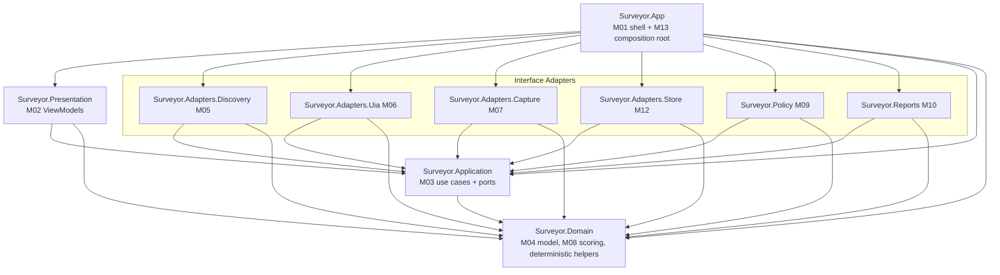
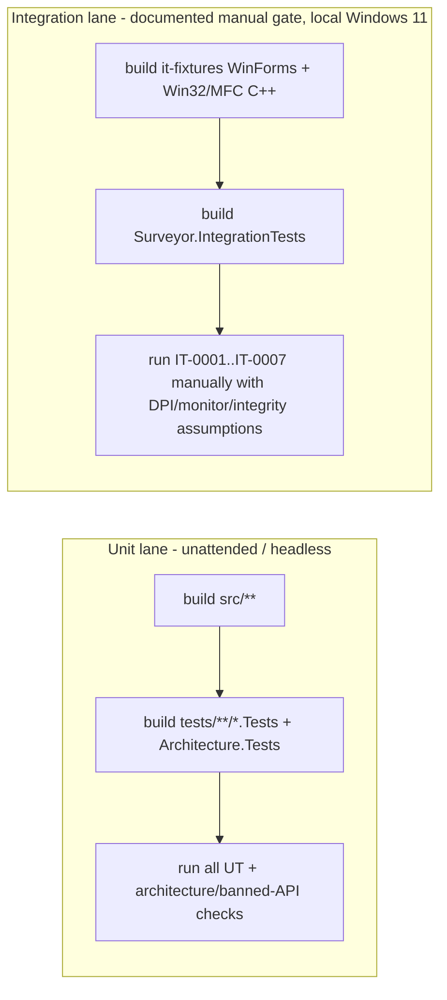

# DES-0008 Project Structure and Test Harness Detailed Design

This is the first detailed-design package of the Surveyor detailed-design phase ([DES-0007](des-0007-detailed-design-execution-strategy.md) §4 package 1). The repository has no source scaffold yet, so this package fixes the physical home — solution, projects, assembly boundaries, namespaces, test projects, fixtures — into which every later `UT`/`IMP` slice lands, and pins the determinism/quality build settings and the inward dependency rule with a *mechanical* check. It does **not** design any module's internal algorithm, schema, DTO, or UI; those belong to `DES-0009` and later. Canonical requirements stay in [gui-testability-analyzer-requirements.md](../../docs/gui-testability-analyzer-requirements.md) (`RQ-xxx`) and derived requirements in [gui-testability-analyzer-requirements-definition.md](../requirements/requirements-definition.md) (`RD-xxx`).

## Trace Block

| Field | Content |
| -- | -- |
| Artifact | `DES-0008`, Project Structure and Test Harness Detailed Design, detailed design phase |
| Upstream | [DES-0007](des-0007-detailed-design-execution-strategy.md) §4 package 1 / §4.1 (`R-NET-02`) / §8.1 (`R-OPS-01`, `R-OPS-03`); [DES-0001](../architecture/des-0001-initial-architecture.md) (Clean Architecture, ports, technology allocation Option A); [DES-0002](des-0002-module-responsibility-basic-design.md) (`M01`–`M13` ownership layers); [DES-0003](des-0003-module-interface-basic-design.md) (port set); [DES-0005](des-0005-vmodel-traceability-and-downstream-tests.md) (candidate assembly names, `UT-0001`–`UT-0013`); [Layering Principles](../architecture/layering-principles.md); guardrails `RQ-054`, `RQ-051`; derived `RD-025`, `RD-031`, `RD-032` |
| Downstream | Source scaffold implementation (`IMP-xxxx`) creating the projects below; all `UT-0001`–`UT-0013` land in the test projects defined here; `DES-0009`–`DES-0018` assume this structure; `DES-0014`/`DES-0015` fill the IT fixture-app legacy-edge/capture content; `DES-0018` wires the composition root whose physical home (`Surveyor.App`) is located here |
| Evidence | Solution/project topology, assembly-boundary and namespace rules, inward dependency rule + `NetArchTest`/banned-API mechanical verification, `Directory.Build.props`/`Directory.Packages.props`/`global.json` determinism-quality settings, UT synthetic fixture-tree placement, mixed IT fixture-app harness scaffold (`R-OPS-03`), CI/execution lanes (`R-OPS-01`), Mermaid dependency graph, edge-case/failure-mode table, architecture-test intent table |
| Verification | [Validate-Okf.ps1](../../tools/okf/Validate-Okf.ps1); `git diff --check`; `surveyor-design-review` + `surveyor-quality-review` pre-review evidence, then human owner final approval per [DES-0007](des-0007-detailed-design-execution-strategy.md) §5.2 (review gate is sub-issue #31) |
| Residual Risk | The real MFC/Win32 IT fixture app is built incrementally, so the first scaffold is skeleton-only (`R-OPS-03`); packaging form is `ADR-0002`-blocked, so distribution-related project settings (MSIX/unpackaged, signing for `uiAccess`) are provisional; the exact `net10.0-windows` TFM patch and Windows App SDK version are pinned in `global.json`/`Directory.Build.props` and revisited against the Windows App SDK support matrix. No other unknowns; the structure itself is decidable now. |

## Purpose And Success Criterion

The success criterion is not "there are projects." It is: **a later implementer or agent never has to invent where a class, test, or fixture goes, and can never accidentally break the layering or the determinism guarantees without a build failure.** Concretely, after this package:

- every `M01`–`M13` module and every `UT-0001`–`UT-0013` test has exactly one obvious project home;
- the Clean Architecture dependency rule (`RQ-054`) is enforced by the `ProjectReference` graph **and** an automated architecture test, not by review vigilance;
- the determinism/quality build settings (`RQ-051`, `R-NET-02`) are set once, centrally, and inherited by every project so no project can silently drift culture, nullability, or non-deterministic build behavior;
- the unit lane is deterministic and headless; the integration lane and its mixed fixture app have a defined, incremental home and a documented manual run mode.

## Module Coverage

This is a **cross-cutting scaffold** package. It designs no module's internal logic; it assigns the *project/assembly home and test-project home* for all of `M01`–`M13` (see [Project ↔ Module Map](#project--module-map)). Two placement facts are decided here and only here:

- The composition root **`M13`** physically lives in `Surveyor.App`; its DI wiring design remains [DES-0018](des-0007-detailed-design-execution-strategy.md) (order 11).
- The `IClock` concrete adapter (`M11`) physically lives with the composition host in `Surveyor.App` for the MVP, with a note that it may move to a dedicated adapter assembly when a future CLI host reuses the core (`RQ-055`/`RD-031`).

Every module's *responsibilities* stay owned by [DES-0002](des-0002-module-responsibility-basic-design.md); every module's *contracts* stay owned by [DES-0003](des-0003-module-interface-basic-design.md).

## Scope And Non-Goals

In scope:

- Solution file, `src`/`tests` layout, project (assembly) set, root namespaces.
- The inward dependency rule per project and its mechanical verification.
- Central determinism/quality MSBuild settings (TFM, `<Nullable>`, `<InvariantGlobalization>`, `<Deterministic>`, analyzers), SDK pin, and central package management.
- Placement of synthetic UT fixture trees and golden files.
- The mixed IT fixture-app harness location and scaffold shape (`R-OPS-03`), and the unit/integration CI execution lanes (`R-OPS-01`).

Out of scope (inherited exclusions and downstream owners):

- Domain/key rules → [DES-0009](des-0007-detailed-design-execution-strategy.md). Scoring formulas → `DES-0010`. Port DTO/status fields → `DES-0011`. Report schema/serializer contract → `DES-0012`. Confidentiality/store defaults and at-rest protection → `DES-0013`. UIA/capture technology and legacy-edge/capture-failure fixture content → `DES-0014`/`DES-0015`. UI layout → `DES-0016`. DI wiring → `DES-0018`.
- Adapter technology selection → `ADR-0002` spike (`RSK-RD-001`); this package keeps every project adapter-agnostic (packages exist as empty scaffolds whose concrete API choice is deferred).
- CLI front end, code generation, CI gating, and the other `RQ-035`–`RQ-039`/`RD-027` MVP exclusions.

## Upstream Decisions (binding)

- **Option A technology allocation** ([DES-0001](../architecture/des-0001-initial-architecture.md)): C#/.NET across all layers, WinUI 3 shell; C++ only as a bounded escape hatch behind a port. This package therefore uses a single .NET solution; the only native C++ project is the *IT fixture target* (a legacy app under test), not a Surveyor runtime component.
- **`M01`–`M13` ownership layers** ([DES-0002](des-0002-module-responsibility-basic-design.md)): Domain innermost (`M04`, `M08`, `IClock` abstraction), Application (`M03` + ports, `M13`), Interface Adapters (`M05`–`M07`, `M09`, `M10`, `M12`), Presentation (`M01`, `M02`).
- **Candidate assembly names** ([DES-0005](des-0005-vmodel-traceability-and-downstream-tests.md) §"Basic-Design Item → Downstream Map"): `Surveyor.Domain`, `Surveyor.Application`, `Surveyor.Adapters.*`, `Surveyor.Policy`, `Surveyor.Reports`, `Surveyor.App`, `Surveyor.Presentation`. This package promotes them from "candidate" to fixed.
- **Resolved decisions in [DES-0007](des-0007-detailed-design-execution-strategy.md) §8.1**: `R-OPS-03` (mixed IT fixture app, `DES-0008` owns the harness), `R-OPS-01` (IT = documented manual gate on local Windows 11 now), `R-NET-02` (project determinism/quality settings belong here), `R-ARC-01` (composition root is standalone `DES-0018`, not folded here).

## Solution And Project Layout

One solution, `Surveyor.sln`, with `src` (shipping code), `tests` (unit + architecture + integration + shared support), and repository-root MSBuild/SDK control files.

```
Surveyor.sln
global.json                     # pins the .NET SDK version (deterministic build across machines)
Directory.Build.props           # central determinism/quality MSBuild settings (inherited by all projects)
Directory.Packages.props        # central package versions (ManagePackageVersionsCentrally)
.editorconfig                   # analyzer severities + code style (EnforceCodeStyleInBuild)
.gitattributes                  # newline normalization; golden/fixture files pinned to LF
src/
  Surveyor.Domain/              # M04 model + keys, M08 scoring, M11 deterministic helpers (pure)
  Surveyor.Application/         # M03 use cases, all ports incl. IClock (M11 abstraction, application-owned), request/result DTOs
  Surveyor.Policy/              # M09 IConfidentialityPolicy implementation
  Surveyor.Reports/             # M10 HTML + JSON report writers
  Surveyor.Adapters.Discovery/  # M05 ITargetDiscoveryPort adapter
  Surveyor.Adapters.Uia/        # M06 IUiTreeAcquisitionPort adapter (+ read-only spy)
  Surveyor.Adapters.Capture/    # M07 IScreenCapturePort adapter
  Surveyor.Adapters.Store/      # M12 IResultStore adapter
  Surveyor.Presentation/        # M02 ViewModels + presentation ports (INavigationService, IDialogService, IUiDispatcher)
  Surveyor.App/                 # M01 WinUI 3 shell + M13 composition root (+ SystemClock adapter for MVP)
tests/
  Surveyor.TestSupport/         # shared test helpers + synthetic fixture-tree loaders (library, not a test project)
  Surveyor.Architecture.Tests/  # mechanical dependency-direction + determinism-settings tests (unit lane)
  Surveyor.Domain.Tests/        # UT-0001, UT-0002, UT-0010
  Surveyor.Application.Tests/   # UT-0012 (+ UT-0013 composition-root invariants seam; design in DES-0018)
  Surveyor.Policy.Tests/        # UT-0008
  Surveyor.Reports.Tests/       # UT-0006, UT-0007
  Surveyor.Adapters.Discovery.Tests/  # UT-0003
  Surveyor.Adapters.Uia.Tests/        # UT-0004, UT-0005
  Surveyor.Adapters.Store.Tests/      # UT-0009
  Surveyor.Presentation.Tests/        # UT-0011
  fixtures/
    uia-trees/                  # synthetic deterministic serialized element trees for UT
    golden/                     # golden report files (governance owned by DES-0012)
  integration/
    Surveyor.IntegrationTests/  # IT-0001..IT-0007 driver (manual gate now; R-OPS-01)
  it-fixtures/
    Surveyor.ITFixture.WinForms/  # lighter WinForms/synthetic surface (general UIA cases) — built first
    Surveyor.ITFixture.Win32/     # small real MFC/Win32 C++ app (authentic legacy edges) — skeleton first (R-OPS-03)
```

Notes:

- **`Surveyor.TestSupport` is a plain library** (not a `*.Tests` project) so the unit lane can share fixture loaders and fakes without the test runner discovering it. Fakes for ports (`ITargetDiscoveryPort`, `IUiTreeAcquisitionPort`, `IScreenCapturePort`, `IReportWriter`, `IResultStore`, `IConfidentialityPolicy`, `IClock`) live here so `UT-0011`/`UT-0012` and adapter tests reuse one set.
- **`fixtures/` holds data, not code.** UT fixture trees are synthetic and deterministic (no real target app, no real sensitive text); golden files live under `fixtures/golden/` and change only through the `DES-0012` golden-file governance (regeneration command + semantic-diff review + approval), never regenerated on a red.
- **`Surveyor.ITFixture.Win32` is a C++ project.** It is a *target under test*, not a Surveyor assembly, so it never appears in any `ProjectReference` of `src/**`. It requires the C++ desktop workload in Visual Studio 2026 and is **excluded from the unattended unit lane** (see [CI and Execution Lanes](#ci-and-execution-lanes)).

## Project ↔ Module Map

| Project (assembly) | Layer | Module(s) | Root namespace | May reference (Surveyor projects) |
| -- | -- | -- | -- | -- |
| `Surveyor.Domain` | Domain (innermost) | `M04`, `M08`, `M11` (deterministic helpers) | `Surveyor.Domain` | **none** |
| `Surveyor.Application` | Application | `M03` (use cases + all ports incl. `IClock` `M11` abstraction + DTOs) | `Surveyor.Application` | `Surveyor.Domain` |
| `Surveyor.Policy` | Interface Adapters | `M09` | `Surveyor.Policy` | `Surveyor.Application`, `Surveyor.Domain` |
| `Surveyor.Reports` | Interface Adapters | `M10` | `Surveyor.Reports` | `Surveyor.Application`, `Surveyor.Domain` |
| `Surveyor.Adapters.Discovery` | Interface Adapters | `M05` | `Surveyor.Adapters.Discovery` | `Surveyor.Application`, `Surveyor.Domain` |
| `Surveyor.Adapters.Uia` | Interface Adapters | `M06` | `Surveyor.Adapters.Uia` | `Surveyor.Application`, `Surveyor.Domain` |
| `Surveyor.Adapters.Capture` | Interface Adapters | `M07` | `Surveyor.Adapters.Capture` | `Surveyor.Application`, `Surveyor.Domain` |
| `Surveyor.Adapters.Store` | Interface Adapters | `M12` | `Surveyor.Adapters.Store` | `Surveyor.Application`, `Surveyor.Domain` |
| `Surveyor.Presentation` | Presentation | `M02` | `Surveyor.Presentation` | `Surveyor.Application`, `Surveyor.Domain` |
| `Surveyor.App` | Presentation / host | `M01`, `M13` (+ `M11` concrete `SystemClock`) | `Surveyor.App` | **all** src projects |

The namespace equals the assembly name; sub-namespaces group internals (e.g. `Surveyor.Domain.Model`, `Surveyor.Domain.Scoring`, `Surveyor.Domain.Keys`, `Surveyor.Application.UseCases`, `Surveyor.Application.Ports`, `Surveyor.Application.Dto`). One assembly = one layer role keeps the dependency check simple and the layering reviewable.

## Dependency Direction Rule (inward) And Mechanical Verification

The rule (from [DES-0001](../architecture/des-0001-initial-architecture.md) Clean Architecture mapping): **source dependencies point inward; adapters implement application-owned ports; only the composition root knows concretes.**



Forbidden edges (any of these must fail the build):

- `Surveyor.Domain` → any Surveyor project (Domain has zero `ProjectReference`).
- `Surveyor.Application` → any adapter, `Surveyor.Reports`, `Surveyor.Policy`, `Surveyor.Presentation`, or `Surveyor.App`.
- Adapter/`Reports`/`Policy` → another adapter, `Surveyor.Presentation`, or `Surveyor.App`.
- `Surveyor.Presentation` → any adapter/`Reports`/`Policy` or `Surveyor.App`.
- `Surveyor.Domain`/`Surveyor.Application` → any WinUI/Windows/UIA/capture/filesystem-UI framework namespace (`Microsoft.UI.*`, `Windows.*`, `System.Windows.*`, UIA COM interop, capture APIs).

Verification is **layered so a violation is caught mechanically, not by review**:

1. **`ProjectReference` graph** — the primary guard. The forbidden edges above simply do not exist as references; adding one is a visible diff and, for the framework-namespace cases, a compile error (the type is not available).
2. **`Surveyor.Architecture.Tests`** — an automated test project (xUnit + `NetArchTest.Rules`, or an equivalent reflection-over-loaded-assemblies test) that asserts, in the unattended unit lane:
   - `Surveyor.Domain` depends on no other `Surveyor.*` assembly;
   - `Surveyor.Application` depends only on `Surveyor.Domain`;
   - no type in `Surveyor.Domain`/`Surveyor.Application` references banned framework namespaces (`Microsoft.UI.*`, `Windows.UI.*`/`Windows.Graphics.*`, WinUI, UIA interop);
   - `Surveyor.Presentation` references no adapter/`Reports`/`Policy` assembly;
   - only `Surveyor.App` references concrete adapter assemblies.
3. **`Microsoft.CodeAnalysis.BannedApiAnalyzers`** (build-time, wired via `Directory.Build.props`) — bans ambient-nondeterminism APIs in `Surveyor.Domain`/`Surveyor.Application`: `DateTime.Now`/`DateTime.UtcNow`/`DateTimeOffset.Now` (time must come through `IClock`, `RQ-051`), and culture-sensitive `ToString()`/`Parse` overloads without `IFormatProvider`. This front-loads the `R-NET-01`/`R-NET-03` determinism guards at the *structure* level; the concrete key-hash/serializer rules stay owned by `DES-0009`/`DES-0012`.

The architecture-test suite is the failing-first, mechanical evidence for the `RQ-054` guardrail called for in [DES-0007](des-0007-detailed-design-execution-strategy.md) §9 (alongside `UT-0011`/`UT-0012` fakes-only and the `DES-0018` composition-root invariant test). Its counter-example is defined in [Architecture-Test Intent](#architecture-test-intent).

## Determinism And Quality Settings (R-NET-02)

> **Version note (2026-07-03, extended by [Coding Standards](../process/coding-standards.md), per DES-0007 §5.3):** two rows were added to this table — `GenerateDocumentationFile` (mandatory Japanese XML doc comments on public APIs, `CS-01`) and central `InternalsVisibleTo` (internal-default accessibility, `CS-02`). The coding-standards process document owns the rules; this table owns their `Directory.Build.props` realization. No previously decided setting changed.

Set once in `Directory.Build.props` and inherited by every project, so no project can drift:

| Setting | Value | Reason |
| -- | -- | -- |
| `TargetFramework` (core: Domain, Application, Policy, Reports, TestSupport, tests) | `net10.0` | `.NET 10` LTS; UI-independent, OS-agnostic core (`RQ-054`); VS 2026 (18.7.3) supports it |
| `TargetFramework` (Windows-facing: `Surveyor.App`, UIA/Capture/Discovery/Store adapters) | `net10.0-windows10.0.19041.0` (exact SDK/patch pinned in `global.json` + Windows App SDK version in `Directory.Packages.props`) | WinUI 3 / Windows App SDK and Win32/UIA APIs need the Windows TFM |
| `Nullable` | `enable` | Null-safety as a correctness guardrail (`R-NET-02`) |
| `InvariantGlobalization` | `true` | Culture-independent formatting/parsing everywhere → deterministic keys/output (`RQ-051`, `R-NET-02`); the WinUI shell must not rely on ambient-culture formatting, consistent with the `DES-0012` explicit-`InvariantCulture` serializer contract |
| `Deterministic` | `true` | Reproducible build output |
| `ContinuousIntegrationBuild` | `true` in CI | Normalizes embedded paths (`/pathmap`) for reproducibility |
| `LangVersion` | `latest` | Consistent language version across projects |
| `ImplicitUsings` | `enable` | Consistency; reduces per-file drift |
| `EnableNETAnalyzers` + `AnalysisLevel` | `true`, `latest-Recommended` | .NET analyzers on by default |
| `EnforceCodeStyleInBuild` | `true` | `.editorconfig` style rules enforced at build |
| `TreatWarningsAsErrors` | `true` | Zero-warning per-slice DoD ([DES-0007](des-0007-detailed-design-execution-strategy.md) §5.1) |
| `GenerateDocumentationFile` | `true` for `src/**`; `false` (or `NoWarn: CS1591`) for `tests/**` and `Surveyor.TestSupport` | Japanese XML documentation comments on every public API are mandatory (`CS-01` in [Coding Standards](../process/coding-standards.md)); with `TreatWarningsAsErrors`, a missing doc comment (`CS1591`) is a build error. Generated code (`*.g.cs`, XAML codegen) is excluded |
| `InternalsVisibleTo` | each `src` project → `$(AssemblyName).Tests` + `Surveyor.TestSupport`, granted centrally | Internal-default accessibility policy (`CS-02` in [Coding Standards](../process/coding-standards.md)): only assembly-boundary contracts are `public`, tests reach `internal` members without visibility promotion |

Supporting control files:

- **`global.json`** pins the exact .NET SDK version so every machine and the CI lane build with the same compiler/SDK (a determinism prerequisite).
- **`Directory.Packages.props`** with `ManagePackageVersionsCentrally=true` pins every NuGet version in one place (deterministic dependency resolution; no floating versions).
- **`.editorconfig`** carries analyzer severities and code style; `.gitattributes` normalizes newlines and pins golden/fixture files to LF so byte-stable golden comparison (`UT-0006`) is not broken by CRLF checkout on Windows.
- **Unit-lane environment** ([DES-0007](des-0007-detailed-design-execution-strategy.md) §8.2): `InvariantGlobalization=true` covers culture; the lane additionally sets `TZ=UTC` and relies on `.gitattributes` newline normalization so byte-stable output holds across machines.

## CI And Execution Lanes

Two lanes, matching [DES-0007](des-0007-detailed-design-execution-strategy.md) §8.2 (`R-OPS-01`):



- **Unit lane (unattended):** builds `src/**` and the `*.Tests` + `Surveyor.Architecture.Tests` projects only. It **excludes** `tests/it-fixtures/**` (especially the C++ MFC project, which needs the C++ workload) and `tests/integration/**`. All `UT` and architecture/banned-API checks are deterministic and headless. This keeps the pure-core lane green on a machine without the C++ workload or a live desktop.
- **Integration lane (manual gate now):** builds the mixed fixture apps and `Surveyor.IntegrationTests`, run manually on the developer's local Windows 11 machine with the DPI/monitor/integrity assumptions each `IT` states. Self-hosted interactive-runner automation of the automatable subset (e.g. read-only invariants `IT-0001`, capture `IT-0003`) is revisited once the fixture app and adapters exist.

Solution-folder grouping keeps `it-fixtures` and `integration` visible in `Surveyor.sln` but a `Directory.Build.props`/solution-filter (`.slnf`) split lets the unattended lane build the unit subset without the native/interactive projects.

## Test Harness: Unit Fixtures And Mixed Integration Fixture App

**Unit fixtures (synthetic, deterministic).** UT fixture element trees live under `tests/fixtures/uia-trees/` as serialized data loaded by `Surveyor.TestSupport`. They are synthetic (no live target, no real sensitive text), giving `UT-0004` (fixture tree → model), `UT-0001` (key stability), and others a deterministic, confidential-safe oracle. Golden report files live under `tests/fixtures/golden/` under `DES-0012` governance.

**Mixed integration fixture app (`R-OPS-03`, incremental).** The IT fixture target is deliberately *mixed*:

| Fixture app | Technology | Purpose | Build order |
| -- | -- | -- | -- |
| `Surveyor.ITFixture.WinForms` | WinForms (.NET) | Lighter synthetic surface for the general UIA cases (standard controls with `AutomationId`, patterns, focusable elements) | Built first; minimal but runnable |
| `Surveyor.ITFixture.Win32` | Real MFC/Win32 (C++) | Authentic legacy edges — owner-draw, MSAA-only proxies, MDI, windowless, `WM_GETTEXT` | **Skeleton first**; legacy-edge content specified by `DES-0014`/capture-failure content by `DES-0015`, built incrementally |

The harness (project locations, how `Surveyor.IntegrationTests` launches/attaches read-only to a fixture window, and the manual run procedure) is owned here; the *content* of the legacy edges and capture-failure modes is owned by [DES-0014](des-0007-detailed-design-execution-strategy.md)/[DES-0015](des-0007-detailed-design-execution-strategy.md). UT keeps synthetic deterministic trees; the fixture apps exist only for the integration lane.

## Edge-Case / Failure-Mode Table

Adapted to a structure package (the [DES-0007](des-0007-detailed-design-execution-strategy.md) §6 template edge cases about DPI/occlusion/virtualization belong to the adapter packages, not here):

| Edge / failure | Handling in this design |
| -- | -- |
| A layer gains a forbidden reference (e.g. Domain → Application, adapter → adapter) | Caught by `ProjectReference` diff + `Surveyor.Architecture.Tests` (build/test failure) |
| Domain/Application code uses WinUI/UIA/filesystem-UI types | Compile error (type unavailable) + architecture-test banned-namespace assertion |
| Ambient time or culture-sensitive formatting leaks into the core | `BannedApiAnalyzers` build error (`DateTime.Now`, culture-less `ToString`) |
| C++ MFC fixture won't build on a machine without the C++ workload | Unit lane excludes `it-fixtures`; only the manual integration lane builds it |
| No live desktop / headless agent | Unit lane is adapter-independent (fakes/fixtures); IT is a separate manual gate |
| CRLF/LF drift corrupts golden comparison | `.gitattributes` pins golden/fixture files to LF; serializer newline rule is `DES-0012` |
| SDK version drift across machines | `global.json` pins the SDK; `Directory.Packages.props` pins package versions |
| Fixture data contains real sensitive text | Rule: fixtures are synthetic only; enforced by review (`RQ-052`) — no real captures in the repo |
| First IT fixture app is skeleton-only | Accepted residual risk (`R-OPS-03`); WinForms surface runnable first, MFC edges grow with `DES-0014`/`DES-0015` |

## Diagnostics And Logging

This package emits no runtime diagnostics of its own (it is build/structure scaffold). It *enables* the cross-cutting diagnostics model owned by [DES-0011](des-0007-detailed-design-execution-strategy.md) and its sanitization owned by [DES-0013](des-0007-detailed-design-execution-strategy.md) by giving them a project home (`Surveyor.Application` for the diagnostics shape; the sanitization rule applies wherever logs/diagnostics are produced). No raw title/`Name`/path may appear in fixtures, golden files, or test output.

## Fixture Strategy

- Port fakes and fixture-tree loaders are centralized in `Surveyor.TestSupport` so every test reuses one deterministic set (no per-test ad-hoc fakes drifting apart).
- Golden files carry a stated semantic purpose (stable order, schema shape, handling notice) and change only via `DES-0012` governance.
- The architecture test carries a **counter-example**: a deliberately added forbidden reference must turn it red (see below), so a green result has discriminating power, not just coverage (`R-QA-01`).

## Architecture-Test Intent

| Test (home) | Behavior / risk guarded | Oracle | Counter-example (must go red) | Anti-pattern avoided |
| -- | -- | -- | -- | -- |
| Dependency-direction suite (`Surveyor.Architecture.Tests`) | The inward dependency rule (`RQ-054`) cannot be broken silently | Loaded-assembly reference graph matches the allowed edges; Domain has zero Surveyor references; core has no banned framework namespaces; only `Surveyor.App` references concretes | Add a `ProjectReference` from `Surveyor.Domain` to `Surveyor.Application` (or a `Microsoft.UI` using in Domain) → suite fails | Asserting projects merely *compile*; testing only that types exist rather than that forbidden dependencies are absent |
| Determinism-settings assertion (`Surveyor.Architecture.Tests`) | Central determinism/quality settings are actually applied (`RQ-051`, `R-NET-02`) | Runtime/culture invariants hold (e.g. `CultureInfo.CurrentCulture` is invariant under `InvariantGlobalization`); banned-API analyzer is active | Remove `InvariantGlobalization` / disable the banned-API package → assertion (or a determinism UT elsewhere) fails | Trusting the props file exists without proving the setting takes effect |

These are structural tests, not new behavior `UT`s; they strengthen the `RQ-054`/`RQ-051` failing-first coverage in [DES-0007](des-0007-detailed-design-execution-strategy.md) §9 without renumbering `UT-0001`–`UT-0013`.

## Integration Assumptions

- **Unit lane:** Windows or any OS able to build/run `net10.0` for the OS-agnostic core; the Windows-facing projects and adapters need Windows + Windows App SDK, but their *unit* tests use fakes and do not need a live target.
- **Integration lane:** local Windows 11, Visual Studio 2026 (18.7.3) with the .NET desktop **and C++ desktop** workloads (for the MFC fixture), specific DPI/monitor/integrity per each `IT`, same-integrity by default (elevation/`uiAccess` only when a target requires it, signed build — `DES-0013`/`DES-0014`). Run mode: **manual** now (`R-OPS-01`).
- Residual: MFC fixture is incremental (skeleton first); packaging/signing settings provisional pending `ADR-0002`.

## Downstream Handoff

- **Candidate project area / first slice:** an `IMP-xxxx` scaffold slice creates `Surveyor.sln`, the ten `src` projects, the control files (`global.json`, `Directory.Build.props`, `Directory.Packages.props`, `.editorconfig`, `.gitattributes`), `Surveyor.TestSupport`, and `Surveyor.Architecture.Tests`.
- **First failing test:** the dependency-direction suite in `Surveyor.Architecture.Tests` — write it red against an intentionally-wrong reference (or before the projects satisfy the rule), then make it green by establishing the correct `ProjectReference` graph and settings.
- **Verification command:** `dotnet build` (warnings-as-errors) + `dotnet test tests/Surveyor.Architecture.Tests` on the unit lane; `Validate-Okf.ps1` for the design artifact.
- **Minimal context bundle for the slice:** this package's [Solution And Project Layout](#solution-and-project-layout), [Project ↔ Module Map](#project--module-map), [Dependency Direction Rule](#dependency-direction-rule-inward-and-mechanical-verification), and [Determinism And Quality Settings](#determinism-and-quality-settings-r-net-02); `RQ-054` and `RQ-051` from the requirement source; the resolved `R-NET-02`/`R-OPS-01`/`R-OPS-03` decisions in [DES-0007](des-0007-detailed-design-execution-strategy.md) §8.1.
- **Blocks unblocked:** all `DES-0009`+ packages and every `UT`/`IMP` now have a fixed home; `DES-0018` inherits `Surveyor.App` as the composition-root home.

## Residual Risks

- **`R-OPS-03` incremental fixture app:** the real MFC/Win32 fixture starts as a skeleton; authentic legacy edges accrue with `DES-0014`/`DES-0015`. Carried, owned by those packages.
- **`ADR-0002` packaging open:** MSIX-vs-unpackaged and `uiAccess` signing affect final project/packaging settings; distribution-related settings are provisional until the spike/ADR lands.
- **TFM/SDK pinning:** exact `net10.0-windows` patch and Windows App SDK version are pinned in `global.json`/`Directory.Packages.props` and revisited against the support matrix; not a design blocker.
- Otherwise **None known** — the structure, layering, determinism settings, and harness placement are fully decidable now.

## Related

- [DES-0007 Detailed Design Phase Execution Strategy](des-0007-detailed-design-execution-strategy.md)
- [DES-0001 Initial Architecture](../architecture/des-0001-initial-architecture.md)
- [DES-0002 Module Responsibility Basic Design](des-0002-module-responsibility-basic-design.md)
- [DES-0003 Module Interface Basic Design](des-0003-module-interface-basic-design.md)
- [DES-0005 V-Model Traceability and Downstream Tests](des-0005-vmodel-traceability-and-downstream-tests.md)
- [Layering Principles](../architecture/layering-principles.md)
- [Lifecycle Traceability](../process/lifecycle-traceability.md)
- [Quality Review Policy](../process/quality-review-policy.md)
- [Git Policy](../process/git-policy.md)
</content>
</invoke>
