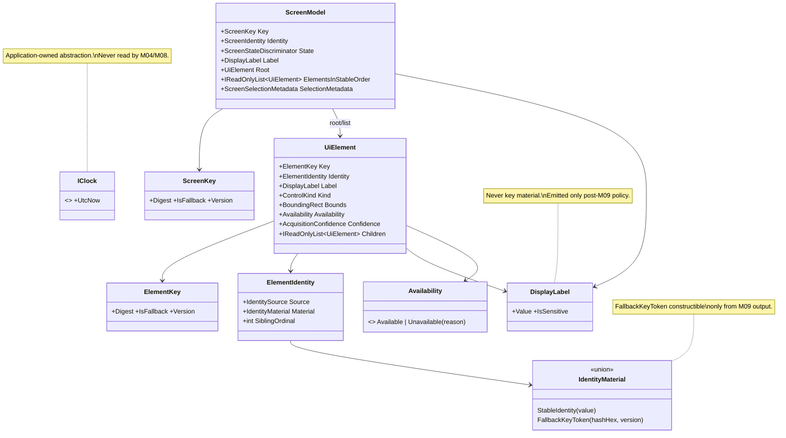

# DES-0009 Domain Model, Stable Keys, and Availability Detailed Design

This is detailed-design package 2 ([DES-0007](des-0007-detailed-design-execution-strategy.md) §4). It fixes the pure-core decisions that every later slice re-uses: the `ScreenModel`/`UiElement` value-object model, the stable-key (`ScreenKey`/`ElementKey`) derivation rule separated from `DisplayLabel`, the **fallback-key minimal contract** and its **finalization stage** (closing `RSK-DES-002`), the availability/confidence semantics (`Unavailable(reason)` is never a low score), the **stable-hash + `StringComparison.Ordinal` determinism rule** (`R-NET-01`, Critical), and the `M11` `IClock` abstraction. After this package, implementation of `Surveyor.Domain` (`UT-0001`, `IMP-0001`) can start without re-interpreting the domain model, key generation, or the confidentiality seam.

Canonical requirements stay in [gui-testability-analyzer-requirements.md](../../docs/gui-testability-analyzer-requirements.md) (`RQ-xxx`) and derived requirements in [requirements-definition.md](../requirements/requirements-definition.md) (`RD-xxx`).

## Trace Block

| Field | Content |
| -- | -- |
| Artifact | `DES-0009`, Domain Model, Stable Keys, and Availability Detailed Design, detailed design phase |
| Upstream | Guardrails `RQ-051` (determinism), `RQ-052` (confidential data), `RQ-053` (screen/element identity); derived `RD-004` (internal screen/element model), `RD-020` (deterministic scores/machine output), `RD-021` (version-comparison unit), `RD-022` (secure-by-default confidential handling), `RD-002` (screen/state evaluation unit, via the `M04` responsibility); [DES-0007](des-0007-detailed-design-execution-strategy.md) §4 package 2, §4.1 (`R-NET-01`, `R-IMP-01`), §5.3 (supersede convention), §8 (`RSK-DES-002`); [DES-0002](des-0002-module-responsibility-basic-design.md) `M04`/`M09`/`M11`; [DES-0003](des-0003-module-interface-basic-design.md) (`IUiTreeAcquisitionPort`, `IConfidentialityPolicy`, `IClock` contracts); [DES-0004](des-0004-analysis-flow-basic-design.md) Stages 2/3/5/6; [DES-0005](des-0005-vmodel-traceability-and-downstream-tests.md) (`UT-0001`/`UT-0008` obligations, `RSK-DES-002`); [DES-0008](des-0008-project-structure-and-test-harness.md) (project homes, banned-API guards); [DES-0001](../architecture/des-0001-initial-architecture.md) (layering) |
| Downstream | `IMP-0001` (minimal `ScreenModel`/`ElementIdentity` implementation, issue #19); `UT-0001` (issue #18) and the key/path sensitive cases of `UT-0008`; review gate issue #17; `DES-0010` (scoring consumes keys/availability), `DES-0011` (`IClock` threading/wiring, DTO carriage), `DES-0012` (serialized key/order rules), `DES-0013` (fallback-key policy detail, masking/storage), `DES-0014` (confidence rubric assignment, identity-source population) |
| Evidence | Value-object catalogue with invariants, identity-source ladder, canonical key-material encoding + SHA-256 rule, fallback-key minimal contract + finalization-stage decision (model construction), availability/confidence semantics, `IClock` abstraction contract, Mermaid class/sequence diagrams, edge-case table, fixture strategy with counter-examples, `UT-0001`/`UT-0008` intent tables, downstream handoff |
| Verification | [Validate-Okf.ps1](../../tools/okf/Validate-Okf.ps1); `git diff --check`; AI pre-review completed 2026-07-02 — `surveyor-design-review`: *Accept with changes* (2 Major / 5 Minor, all applied in this revision) and `surveyor-quality-review`: *Accept with risks* (acceptance conditions 1–3 applied, carried risks recorded below); human owner final approval pending per [DES-0007](des-0007-detailed-design-execution-strategy.md) §5.2 (review gate is issue #17) |
| Residual Risk | Implementation file paths follow [DES-0008](des-0008-project-structure-and-test-harness.md), whose source scaffold is not yet created (review gate #31); fallback-key *policy* detail (masking technique, storage, retention, export) is delegated to `DES-0013` under the §5.3 supersede convention — only the minimal contract is fixed here; `IClock` threading/DI wiring is delegated to `DES-0011`/`DES-0018`; the concrete confidence *rubric* (how `M06` assigns values) is `DES-0014` |

## Purpose And Success Criterion

After this package, a later implementer should no longer need to infer:

- what fields and invariants `ScreenModel`, `UiElement`, and their value objects have;
- how a `ScreenKey`/`ElementKey` is derived, encoded, collision-handled, and kept independent of `DisplayLabel`;
- **when** a fallback key is finalized and **what contract** its derivation must satisfy, without waiting for `DES-0013`;
- how `Unavailable(reason)` and `AcquisitionConfidence` are represented so they can never collapse into a low score;
- which hash/comparison primitives are allowed for key material and ordering (`R-NET-01`);
- what the `IClock` abstraction looks like and what is deliberately *not* decided here.

Success criterion: `UT-0001` and the key/path cases of `UT-0008` can be written directly from this document, and a deliberately wrong implementation (volatile label leaking into a key, per-process hash, raw sensitive text in key material) fails those tests.

## Module Coverage

- **`M04` Domain Model / Analysis Core** — designed in full here (model, keys, labels, availability/confidence, screen/state identity).
- **`M11` Clock and Deterministic Support** — the `IClock` **abstraction** and the deterministic-support rules are designed here; the concrete `SystemClock` adapter, threading, and DI wiring are `DES-0011`/`DES-0018` (homes fixed by [DES-0008](des-0008-project-structure-and-test-harness.md)).

`M09`'s fallback-hash *service* is referenced as a seam (its contract obligations are fixed here because `M04`'s keys depend on them); `M09`'s full policy design remains `DES-0013`.

## Scope And Non-Goals

In scope:

- `ScreenModel`, `UiElement`, and supporting value objects: fields, invariants, equality, ordering.
- `ScreenKey`/`ElementKey` derivation: identity-source ladder, canonical material encoding, stable hash, collision rule, `DisplayLabel` separation.
- Fallback-key minimal contract (deterministic, non-reversible, cross-process stable, no raw sensitive text in the domain) and the finalization-stage decision (`RSK-DES-002` closure).
- Availability/confidence semantics and their invariants.
- Stable-hash/ordinal determinism rules for all key material, ordering, and tie-breaks (`R-NET-01`).
- `IClock` abstraction contract and the fixed-clock test seam.
- `UT-0001`/`UT-0008` test-intent tables and fixture strategy.

Out of scope (downstream owners):

- Score formulas, weights, thresholds, classification → `DES-0010`.
- Confidentiality policy detail — masking technique, storage paths, retention, export bundles, log/diagnostics sanitization → `DES-0013`. This package fixes only the minimal fallback-key contract; later `DES-0013` changes to that contract follow the [DES-0007](des-0007-detailed-design-execution-strategy.md) §5.3 supersede convention.
- Port DTO fields, status enums, orchestration, run-level diagnostics, `IClock` threading → `DES-0011`; concrete DI wiring → `DES-0018`.
- UIA/MSAA acquisition technique, confidence rubric, virtualization detection → `DES-0014`; capture → `DES-0015`.
- Report schema, serialized timestamp format, serializer determinism contract → `DES-0012`.
- MVP exclusions inherited from `RQ-035`–`RQ-039`/`RD-027`.

Guardrail disposition ([DES-0007](des-0007-detailed-design-execution-strategy.md) §9): `RQ-051`/`RQ-052`/`RQ-053` are directly addressed here. `RQ-048` (read-only) is **explicitly not in scope** beyond the type-level fact that the domain exposes no pattern-invoking API (`SupportedPatterns` is read/report data only); enforcement is owned by `M06`/`DES-0014` (`UT-0005`). `RQ-054` (UI-independent core) is satisfied structurally — this package designs pure core types with no framework dependency, mechanically guarded by the [DES-0008](des-0008-project-structure-and-test-harness.md) dependency/banned-API checks.

## Upstream Decisions (binding)

- **Keys are core-owned and deterministic; `DisplayLabel` is never key material** ([DES-0002](des-0002-module-responsibility-basic-design.md) `M04`; `RQ-051`/`RQ-053`).
- **Sensitive-fallback hashing lives in `M09`, never inside the domain** ([DES-0002](des-0002-module-responsibility-basic-design.md) `M04`/`M09`; `RQ-052`): when no non-sensitive stable identity exists, `Name`/title is normalized/hashed by the `M09`-owned service before it can become key material.
- **Stable hash + `Ordinal`** ([DES-0007](des-0007-detailed-design-execution-strategy.md) §4.1, `R-NET-01`, Critical): key material, ordering, and tie-breaks use SHA-256 and `StringComparison.Ordinal`; `Object.GetHashCode()` and `Dictionary`/`HashSet` iteration order are prohibited as sources of persisted keys or output order.
- **Fallback-key minimal contract is front-loaded here** ([DES-0007](des-0007-detailed-design-execution-strategy.md) §4.1, `R-IMP-01`) so `DES-0009` implementation is not blocked by `DES-0013`.
- **A state-differentiated screen is a distinct `ScreenModel` with its own `ScreenKey`** ([DES-0002](des-0002-module-responsibility-basic-design.md) `M04`, `RD-002`).
- **`Unavailable` is an expected result, not an exception, and never a low score** ([DES-0003](des-0003-module-interface-basic-design.md) contract conventions; `RD-020`).
- **Project homes** ([DES-0008](des-0008-project-structure-and-test-harness.md)): model/keys in `Surveyor.Domain` (`Surveyor.Domain.Model`, `Surveyor.Domain.Keys`); `IClock` abstraction in `Surveyor.Application` (`Surveyor.Application.Ports`); tests in `Surveyor.Domain.Tests`; fixture trees under `tests/fixtures/uia-trees/`.

## Data And Contract Design

### Value-object catalogue

All types below are immutable value objects (or immutable aggregates of value objects). Equality is structural over the listed fields; `DisplayLabel` participates in equality **only** where stated (it never participates in key derivation).

| Type | Fields | Invariants |
| -- | -- | -- |
| `ScreenModel` | `ScreenKey Key`, `ScreenIdentity Identity`, `ScreenStateDiscriminator? State`, `DisplayLabel Label`, `UiElement Root`, `IReadOnlyList<UiElement> ElementsInStableOrder`, `ScreenSelectionMetadata? SelectionMetadata` | `Key` is final at construction and derived only from `Identity` + `State`; `ElementsInStableOrder` is the fixed structural traversal order (see [Ordering](#ordering-and-tie-break-rules)); no I/O, no clock; `SelectionMetadata` is attached at result assembly (Stage 6) via a copy-with operation producing a new value (`RD-016`) — keys are unaffected |
| `UiElement` | `ElementKey Key`, `ElementIdentity Identity`, `DisplayLabel Label`, `ControlKind Kind`, `BoundingRect? Bounds`, `Availability Availability`, `AcquisitionConfidence Confidence`, `IReadOnlyList<UiElement> Children`, `SupportedPatterns Patterns` | `Key` final at construction; `Bounds` is `null` only when `Availability` is `Unavailable`; children order = fixed traversal order |
| `ScreenIdentity` | `string ProcessImageName` (file name only, no path), `string NormalizedWindowClass`, `ScreenRole Role` (`TopLevel`/`Dialog`/`MdiChild`/`Tab`/`Pane`), `IdentityMaterial Material` | `ProcessImageName` contains no directory separators; `NormalizedWindowClass` passed through the class-name normalization rule |
| `ElementIdentity` | `IdentitySource Source`, `IdentityMaterial Material`, `int? SiblingOrdinal` | `Material` never contains raw sensitive text (enforced by `IdentityMaterial` construction, below) |
| `IdentityMaterial` | *either* `StableIdentity(string value)` *or* `FallbackKeyToken(string hashHex, string algorithmVersion)` | `StableIdentity.value` must come from the non-sensitive sources of the ladder below; `FallbackKeyToken` requires hash-shaped input (exactly 32 lowercase hex chars; the sole in-repo producer is the `M09` service) — there is no domain constructor that accepts raw `Name`/title text |
| `IdentitySource` (enum) | `AutomationId`, `FrameworkStableId` (e.g. Win32 control ID), `FallbackHash`, `StructuralOrdinal` | Recorded per element so comparability confidence (`RD-021`) is honest about how stable the key is |
| `ScreenKey` / `ElementKey` | `string Digest` (32 lowercase hex chars = first 16 bytes of SHA-256), `bool IsFallback`, `string Version` (`"1"`) | Canonical string forms `scr:1:<digest>` / `elm:1:<digest>` (fallback: `scr:1f:` / `elm:1f:`); ordinal comparison; safe for paths/ids by construction (lowercase hex + ASCII prefix) |
| `DisplayLabel` | `string Value`, `bool IsSensitive` (default `true` for target-derived text) | Never key material; never serialized as an id/path; emitted only post-`M09` policy (Stage 5) |
| `Availability` | `Available` \| `Unavailable(UnavailableReason Reason)` | Closed set; carries no free-text taken from the target (reason detail text, if any, is diagnostic-lane data owned by `DES-0011`/`DES-0013` sanitization) |
| `UnavailableReason` (enum) | `NotExposed`, `PermissionDenied`, `Timeout`, `NotRealized` (virtualized/lazy subtree), `Offscreen`, `Unknown` | `NotRealized` is distinct from genuine absence (`R-GTA-02`) |
| `AcquisitionConfidence` (enum) | `High`, `Medium`, `Low` | Value assigned by `M06` per the `DES-0014` rubric; the domain only stores and propagates it |
| `ScreenStateDiscriminator` | `IdentityMaterial StateMaterial`, `DisplayLabel StateLabel` | Same material rules as elements: stable identity of the state selector (e.g. selected tab's `AutomationId`) or an `M09` fallback token — never raw state text |
| `BoundingRect` | `int X, Y, Width, Height` (target-DPI-normalized per `DES-0015`) | Value equality; no floating-point in key material |
| `ControlKind` (enum) | Closed mapping of UIA ControlType + `Custom`, `Unknown` | Mapping table owned by `DES-0014`; the domain owns the closed set |
| `SupportedPatterns` | Immutable flag set of read-relevant UIA patterns | Read/report only; the domain never invokes patterns (`RQ-048` is adapter-owned) |
| `ScreenSelectionMetadata` | Per [DES-0002](des-0002-module-responsibility-basic-design.md): regression cost, change/exec frequency, representativeness, judgment-split flag | User-supplied; never computed or defaulted silently by the analyzer (`RD-016`, `RSK-DES-001`) |
| `SnapshotRef` | Opaque reference + capture metadata | Value type owned here; population is `DES-0015` |

`Finding`, `ImprovementCandidate`, `TestabilityClass` remain `M04`-owned *types* whose field detail is fixed by `DES-0010` (they are score-bearing).

### Identity-source ladder (key material precedence)

For each element, for the screen identity (`ScreenIdentity.Material`), and for the screen-state discriminator, key material is chosen by the first applicable rung:

| Rung | Source | `IdentitySource` | Notes |
| -- | -- | -- | -- |
| 1 | UIA `AutomationId` (non-empty, not runtime-generated) | `AutomationId` | Preferred; non-sensitive by classification (developer-assigned identifier) |
| 2 | Framework stable id — Win32 control ID ≠ 0, or an equivalent framework-stable identifier | `FrameworkStableId` | Non-sensitive; recorded with a source tag in the material |
| 3 | `M09` fallback hash of normalized `Name`/title | `FallbackHash` | Only via the fallback-key contract below; marks the key `IsFallback` |
| 4 | Structural ordinal — position among same-`ControlKind` siblings in fixed traversal order | `StructuralOrdinal` | Weakest; comparability across versions is best-effort (`RD-021`); never marked fallback (contains no sensitive data) |

"Runtime-generated" detection for rung 1 (e.g. WinForms auto-ids, decimal-only ids) and the exact per-framework rules are an acquisition concern (`DES-0014`); the domain contract is only that rung-1/2 values must be **non-sensitive and run-stable**, which the adapter asserts by choosing the rung.

**Screen application.** `ScreenIdentity.Material` uses rungs 1–3 (window `AutomationId` → framework-stable window identifier → `M09` fallback token of the normalized title). Rung 4 does not apply to screens; the terminal rule when no stable identity exists **and** the normalized title is empty is the `n=0` no-identity marker in the material — the key then rests on `proc`/`class`/`role` alone, is *not* marked fallback (no sensitive input was used), records `IdentitySource.StructuralOrdinal`, and multiple such screens in one run are disambiguated by the collision rule below. Comparability across versions is weakest for this terminal case (`RD-021`).

### Canonical key-material encoding and hash rule

Deterministic derivation (`R-NET-01`):

```
ScreenKey.material  = "scr" LF "v=1" LF
                      "proc=" esc(lower(ProcessImageName)) LF
                      "class=" esc(NormalizedWindowClass) LF
                      "role=" RoleTag LF
                      "id=" ( "a=" esc(AutomationId)        ; source-tagged like element steps
                            | "w=" esc(FrameworkStableId)
                            | "f=" FallbackTokenHex
                            | "n=0" )                       ; no-identity terminal rule (screens only)
                      [ LF "state=" StateMaterialTag ]      ; present only for state-differentiated screens

ElementKey.material = "elm" LF "v=1" LF
                      "screen=" ScreenKey.Digest LF
                      "path=" step1 "/" step2 "/" ... stepN

step_i = ControlKindTag ":" ( "a=" esc(AutomationId)
                            | "w=" esc(FrameworkStableId)
                            | "f=" FallbackTokenHex
                            | "o=" SiblingOrdinal )
```

- `esc()` backslash-escapes `\`, LF, `/`, `:`, `=`, and `#` so material (including the collision suffix below) cannot be forged by crafted values; `lower()` is `ToLowerInvariant` (culture-independent); no other case folding, no trimming beyond leading/trailing whitespace (whitespace = `char.IsWhiteSpace`), no Unicode normalization is applied to stable ids (they are compared as authored, ordinally).
- Digest = SHA-256 over the UTF-8 bytes of the material; the key stores the **first 16 bytes as 32 lowercase hex chars**. 128 bits keeps accidental collision probability negligible at Surveyor's scale while keeping keys path/report friendly.
- `v=1` is the key-algorithm version. Any change to the material grammar, normalization, or hash is a new version and follows the [DES-0007](des-0007-detailed-design-execution-strategy.md) §5.3 supersede convention; the report records the version (`DES-0012` carries it in the schema).
- **Prohibited as key/ordering sources**: `Object.GetHashCode()`, `string.GetHashCode()`, `Dictionary`/`HashSet` iteration order, `HWND`/`RuntimeId` values, arrival/timing order, ambient culture. The [DES-0008](des-0008-project-structure-and-test-harness.md) banned-API analyzers guard the ambient-time/culture part at build time; `UT-0001`'s fresh-process assertion guards the rest behaviorally.

**Window-class normalization rule** (part of the domain's key contract because MFC/WinForms class names embed per-process noise). The v=1 table, applied in order, first match wins, replacement strings are literal except the named capture:

| Order | Match (regex, ordinal) | Replace with |
| -- | -- | -- |
| 1 | `^Afx:[0-9a-fA-F:]+$` | `Afx` |
| 2 | `^WindowsForms10\.(?<core>[^.]+)\.app\..*$` | `WindowsForms10.` + `${core}` |
| 3 | `^(?<base>.+?):[0-9a-fA-F]{4,}$` | `${base}` (strips one trailing hex-token segment) |

The table is fixed and versioned here (extended, if needed, via a `v=2` material bump, not ad hoc).

**Collision rule**: if two sibling elements produce identical `step_i` material (e.g. duplicated `AutomationId`), the later ones (in fixed traversal order) get `"#2"`, `"#3"`, … appended to the step before hashing, and the element records `SiblingOrdinal`. Because `#` is escaped in authored values, a crafted `AutomationId` (e.g. `"X#2"`) cannot forge a suffixed step; the rule is **re-applied to the post-suffix material until all sibling steps are unique**, so the result is deterministic regardless of how authored ids and suffixes interleave. The same rule disambiguates multiple no-identity (`n=0`) screens within one run, in within-run encounter order. Duplicate stable ids are also a testability finding (owned by `DES-0010`), but the key must remain unique and deterministic regardless.

### Fallback-key minimal contract (`R-IMP-01`) and finalization stage (`RSK-DES-002` closure)

**Contract.** The `M09`-owned fallback derivation service (a narrow seam of `IConfidentialityPolicy`: interface `IFallbackKeyDerivation`, application-owned in `Surveyor.Application.Ports` alongside the other ports per [DES-0008](des-0008-project-structure-and-test-harness.md), implemented by `M09` in `Surveyor.Policy`) must satisfy, for input = target-derived sensitive text (window title, element `Name`) plus a domain-separation tag (`"scr"`/`"elm"`/`"state"`):

1. **Deterministic**: same normalized input → same token, across processes, machines, and runs. Normalization is fixed for v=1: trim leading/trailing whitespace and collapse internal whitespace runs to a single U+0020 (whitespace = `char.IsWhiteSpace`, a culture-independent Unicode property check); **no case folding and no Unicode normalization (NFC/NFD)** — `String.Normalize` throws for non-ASCII input under the `InvariantGlobalization=true` setting pinned by [DES-0008](des-0008-project-structure-and-test-harness.md), and normalization tables vary by Unicode data version, which would undermine cross-machine determinism. Visually equivalent but differently composed titles therefore produce different tokens (accepted v=1 limitation, revisable only via an algorithm-version bump). Then UTF-8 → SHA-256 with the tag prefixed as `tag LF "v=1" LF text`.
2. **Non-reversible**: the token is the truncated hash only (first 16 bytes, lowercase hex); the raw text is not retained by the service, is never stored in any domain object except `DisplayLabel`, and never appears in keys, paths, ids, logs, diagnostics, or exception messages. No per-process or per-install salt (that would break cross-process determinism); the fixed domain-separation tag prevents cross-kind token reuse. *Honest limit*: saltless hashing of low-entropy text resists preimage recovery but **not guess-and-verify matching** against candidate texts — whether fallback tokens may appear in exported artifacts is an explicit `DES-0013` decision (recorded in Residual Risks).
3. **Cross-process equal-value stability**: guaranteed by (1) + the pinned algorithm version; `UT-0001` asserts it with a recorded expected token recomputed in a fresh process.
4. **The domain never handles raw sensitive text as key material**: `IdentityMaterial.FallbackKeyToken`'s constructor validates hash shape (exactly 32 lowercase hex chars), and the sole in-repo producer of such tokens is the `M09` service — provenance is enforced by construction-time shape validation plus architecture review/test, not cryptographically. There is no `M04` API that hashes, truncates, or otherwise transforms `Name`/title into a key.
5. **Marked**: keys built on a fallback token carry `IsFallback = true` (canonical form `scr:1f:`/`elm:1f:`), so comparability (`RD-021`) and reports can distinguish design-grade identity from hash-of-label identity.

`DES-0013` may extend policy around the token (masking of `DisplayLabel`, storage, retention, export) but must not alter items 1–5 without a version bump under the §5.3 supersede convention.

**Finalization stage — decided: model construction (Stage 2).** The three candidate stages from `RSK-DES-002` were model construction, policy application (Stage 5), and result assembly (Stage 6). This package fixes **model construction**: `AnalyzeScreenUseCase` (`M03`) supplies the `M09` fallback-derivation service to the acquisition mapping step, so every `ScreenModel`/`UiElement` carries its final, immutable key at construction time; Stages 3–8 never recompute or rewrite keys.

Why: Stage 3 scoring de-duplicates and orders by key, Stage 5 policy gates *emission* (images/labels), and Stage 6 assembles output — if keys were finalized at Stage 5 or 6, scoring would run on provisional identities, and "core-owned keys" (`RQ-053`) would silently depend on policy sequencing. Fixing keys at construction keeps determinism (`RQ-051`) and identity management (`RQ-053`) independent of the emission-policy pipeline, while confidentiality (`RQ-052`) is preserved because the only sensitive-text transformation happens inside `M09` *before* the domain object exists. The adapter (`M06`) may hold raw text transiently during mapping — it read it from the target — but hands the domain either non-sensitive stable identity or the finished token.

**Reconciliation with the basic design.** This decision *refines* two basic-design statements rather than contradicting them. [DES-0003](des-0003-module-interface-basic-design.md)'s `IConfidentialityPolicy` input ("key material candidate" → "sanitized key/path material") and [DES-0004](des-0004-analysis-flow-basic-design.md)'s Stage 5 contract assumed key material could flow through the Stage-5 gate; with keys final at Stage 2, key material **does not reach Stage 5**, which remains the mandatory emission gate (images, labels, path/output sanitization). The caller topology is likewise refined: [DES-0005](des-0005-vmodel-traceability-and-downstream-tests.md) described the fallback hash as "invoked by `M03`"; concretely, `M03` *supplies* the `M09`-backed `IFallbackKeyDerivation` service and the `M06` mapping *invokes* it during model construction. Version notes recording this refinement are added to `DES-0003`/`DES-0004` per the [DES-0007](des-0007-detailed-design-execution-strategy.md) §5.3 convention, and the refined wording is a named review item for `DES-0011`/`DES-0013` so the contracts do not fork.

```mermaid
sequenceDiagram
  participant UC as M03 AnalyzeScreenUseCase (Stage 2)
  participant AQ as M06 acquisition mapping
  participant CP as M09 IFallbackKeyDerivation
  participant DM as M04 domain constructors

  UC->>AQ: acquire(TargetRef, options, fallbackDerivation)
  AQ->>AQ: read UIA node (AutomationId, class, Name, ...)
  alt stable identity present (rung 1/2)
    AQ->>DM: new ElementIdentity(StableIdentity)
  else no stable identity (rung 3)
    AQ->>CP: deriveFallbackToken(tag, normalized Name)
    CP-->>AQ: FallbackKeyToken (non-reversible, versioned)
    AQ->>DM: new ElementIdentity(FallbackKeyToken)
  else nothing usable (rung 4)
    AQ->>DM: new ElementIdentity(StructuralOrdinal)
  end
  DM-->>AQ: UiElement with final ElementKey (immutable)
  AQ-->>UC: ScreenModel (keys final; Stages 3-8 never rewrite keys)
```

### Availability and confidence semantics

- `Availability` is a closed discriminated value: `Available` or `Unavailable(reason)`. It is **data**, not an exception, and it is **not** a score: `M08` must consume the tag and produce availability-tagged findings, never a numeric penalty that erases the distinction (`RD-020`; enforced by `UT-0002` in `DES-0010`'s scope, asserted structurally by `UT-0001` here).
- An `Unavailable` element still has a valid `ElementKey` (identity is about *which element*, availability is about *what we could read*). Fields that could not be read are absent (`null`/empty collections), never fabricated defaults.
- `NotRealized` (virtualized/lazy subtree) is distinct from absence: a missing child is simply not in the model; a detected-but-unrealized subtree is an `Unavailable(NotRealized)` placeholder element (`R-GTA-02`, populated per `DES-0014`).
- `AcquisitionConfidence` (`High`/`Medium`/`Low`) is orthogonal to `Availability`: confidence qualifies data that *was* read; availability marks data that was *not*. The rubric that assigns confidence is `DES-0014`; the domain guarantees only that the value is carried unchanged into findings and reports.
- Screen-state identity: a state-differentiated screen (tab/mode switch) is a **distinct `ScreenModel`** whose `ScreenKey` material includes the `state=` field; same window in the same state → same key, different state → different key (`RD-002`, `UT-0001`).

### `IClock` abstraction (`M11`)

| Aspect | Contract |
| -- | -- |
| Shape | `interface IClock { DateTimeOffset UtcNow { get; } }` — UTC only; no local time, no time zone, no culture |
| Home | `Surveyor.Application.Ports` ([DES-0008](des-0008-project-structure-and-test-harness.md)); concrete `SystemClock` lives with the host (`Surveyor.App`), designed in `DES-0011`/`DES-0018` |
| Consumers | `M03` (run timestamps), `M10` (report timestamps via the assembled result) — **never `M08`** (scoring is time-free) and **never `M04`** (the domain model carries no clock reads; timestamps enter only at result assembly) |
| Determinism seam | `FixedClock` fake in `Surveyor.TestSupport` returning a constant instant → `UT-0010` reproducible output |
| Not decided here | Serialized timestamp format/precision (`DES-0012`); threading/cancellation interaction and injection lifetime (`DES-0011`/`DES-0018`) |

Deterministic-support helpers (ordinal comparers, stable sort wrappers) live in `Surveyor.Domain` per [DES-0008](des-0008-project-structure-and-test-harness.md) and expose only culture-free, allocation-stable operations.

### Ordering and tie-break rules

- **Element order** within a `ScreenModel` is the fixed structural traversal order (depth-first, document order as returned by the acquisition contract of [DES-0003](des-0003-module-interface-basic-design.md)); the domain preserves it as `ElementsInStableOrder` and never re-orders by hash or dictionary iteration.
- **Cross-collection ordering** (e.g. screens in a result, findings per element) is by canonical key string, `StringComparison.Ordinal`.
- **Tie-breaks** always resolve by ordinal comparison of canonical key strings, then by `SiblingOrdinal`. There is no rule that depends on `GetHashCode`, insertion order, or timing.

## Mermaid UML — model overview



## Edge-Case Table

| Edge case | Rule |
| -- | -- |
| No `AutomationId`, no framework id, `Name` present | Rung 3: `M09` fallback token; key marked `IsFallback`; `DisplayLabel` keeps the name for display only |
| No identity at all (unnamed custom pane) | Rung 4: structural ordinal path; `IdentitySource.StructuralOrdinal`; comparability best-effort (`RD-021`) |
| Duplicate `AutomationId` among siblings | Collision rule `#n` suffix in traversal order; deterministic; duplicate-id finding is `DES-0010`'s concern |
| Volatile title text (document name, counters) in `DisplayLabel` | For stable-identity screens/elements (rungs 1/2/4), label changes never change any key (`UT-0001` core assertion). For rung-3 fallback identity the label *is* the identity source, so a `Name`/title change changes the key **by design**; the `IsFallback` marker makes this comparability limit explicit (`RD-021`) |
| MFC `Afx:0x...`/WinForms auto class names | Class-name normalization table strips instance noise before material encoding |
| Same window, different tab/mode state | Distinct `ScreenModel` + distinct `ScreenKey` via `state=` material (`RD-002`) |
| Whitespace/Unicode variants of the same `Name` | Fallback normalization (trim, collapse whitespace, NFC) → same token; case differences → different token (intentional: ordinal, no case folding) |
| Sensitive text in exception/diagnostic paths | The domain throws only on contract violations and includes keys (safe hex), never `DisplayLabel` values, in exception messages; full sanitization ownership is `DES-0011`/`DES-0013` |
| Permission-denied / timeout subtree | `Unavailable(PermissionDenied/Timeout)` placeholder with valid key; no fabricated children |
| Virtualized/lazy subtree | `Unavailable(NotRealized)`, distinct from absence (`R-GTA-02`) |
| Culture change (e.g. tr-TR) or fresh process | Keys and ordering byte-identical: materials are culture-free, hash is SHA-256, comparisons ordinal (`UT-0001` fresh-process case; serializer-level culture case is `UT-0006`/`DES-0012`) |
| Empty screen (no readable elements) | The window itself is always modeled: `Root` is the window's own `UiElement` (possibly `Unavailable`) with empty `Children`; run-level availability status carried by the acquisition result (`DES-0011`) |

## Diagnostics And Logging

This package emits no runtime diagnostics itself. Its contribution to the cross-cutting model (owned by `DES-0011`, sanitized per `DES-0013`) is a rule: **domain exception messages and any diagnostic text produced while constructing models may reference canonical key strings (safe hex) and enum values, never `DisplayLabel` values or raw target text** (`R-SEC-01` seam).

## Fixture Strategy

- Synthetic serialized element trees under `tests/fixtures/uia-trees/` ([DES-0008](des-0008-project-structure-and-test-harness.md)), loaded via `Surveyor.TestSupport`. No real captures, no real sensitive text (`RQ-052`).
- Named fixtures for `UT-0001`/`UT-0008`: `stable-ids.tree` (rungs 1–2), `fallback-names.tree` (rung 3, synthetic sensitive-looking names), `ordinal-only.tree` (rung 4), `duplicate-ids.tree` (collision rule), `state-switch-a.tree`/`state-switch-b.tree` (`RD-002`), `volatile-label-before.tree`/`volatile-label-after.tree` (same identities, changed labels).
- **Counter-example fixtures (`R-QA-01`)** — each behavior test must be confirmed red against at least one: a deliberately wrong key function that includes `DisplayLabel` in material (must fail the volatile-label test); a per-process-salted fallback hash (must fail the fresh-process equality test); a raw-`Name`-in-material variant (must fail the `UT-0008` no-raw-text scan); a `GetHashCode`-based ordering (must fail the stable-order assertion).
- Fixed expected digests for a small set of materials are recorded in the test data (computed once, by hand-verifiable SHA-256), so key derivation is oracle-checked against the algorithm, not against itself.

## Unit-Test Intent

Per [DES-0007](des-0007-detailed-design-execution-strategy.md) §7, tests protect decisions, not code paths. This package's obligations ([DES-0005](des-0005-vmodel-traceability-and-downstream-tests.md)):

### `UT-0001` — stable identity, key/label separation, availability, screen-state identity

| Behavior | Risk guarded | Fixture | Oracle | Anti-pattern avoided / counter-example |
| -- | -- | -- | -- | -- |
| Display-label change does not change any **stable-identity** key (rungs 1/2/4) (**first failing test**) | Volatile text leaking into identity breaks version comparison (`RQ-053`, `RD-021`) | `volatile-label-before/after.tree` (stable identities only) | All rung-1/2/4 `ScreenKey`/`ElementKey` values byte-equal across the two trees; rung-3 fallback keys are excluded — they change with the label by design and stay `IsFallback`-marked | Asserting a helper's exact string only; counter-example: label-in-material key function must go red |
| Same stable input → same key recomputed in a **fresh process** | `String.GetHashCode` per-process randomization (`R-NET-01`, Critical) | `stable-ids.tree` + recorded expected digests | Child-process recomputation equals recorded digests | Same-process-only equality; counter-example: `GetHashCode`-based digest must go red |
| Fallback key deterministic, non-reversible, cross-process stable, marked | `R-IMP-01` contract regression | `fallback-names.tree` | Token equals recorded SHA-256-derived value in fresh process; key string carries `1f` marker; no input-derived sentinel substring appears in the token or key string | Reversible/truncated-plaintext "hash"; per-process salt counter-example must go red |
| Different screen state → different `ScreenKey`; same state → same key | Screen/state evaluation unit collapses (`RD-002`) | `state-switch-a/b.tree` | Keys differ across states, equal within a state | Testing only one state; counter-example: a key function that ignores the `state=` material must go red |
| `Unavailable(reason)` preserved distinctly; unavailable element keeps a valid key | `Unavailable` conflated with low score / dropped (`RD-020`) | tree with `PermissionDenied`/`NotRealized` nodes | Model exposes `Unavailable(reason)` values unchanged; keys present | Fabricating defaults for unread fields; counter-example: a builder that fills defaults for unread fields must go red |
| Element order is fixed traversal order; ties broken ordinally | Iteration-order nondeterminism | `duplicate-ids.tree` | Order identical across repeated constructions and fresh process | Order asserted against insertion order only |

### `UT-0008` — key/path confidentiality cases (this package's share)

`UT-0008`'s policy-branch coverage belongs to `DES-0013`; the key/path cases fixed here. Homes per [DES-0008](des-0008-project-structure-and-test-harness.md): domain construction-refusal cases in `Surveyor.Domain.Tests`, fallback-token derivation contract cases in `Surveyor.Policy.Tests`.

| Behavior | Risk guarded | Fixture | Oracle | Anti-pattern avoided / counter-example |
| -- | -- | -- | -- | -- |
| No raw sensitive text in any key, canonical key string, or key-derived path segment | `RQ-052` egress via ids/paths | `fallback-names.tree` with sentinel names (e.g. `"SENTINEL-SSN-1234"`) | Scan of all key strings/derived paths finds no sentinel substring | Testing only the happy allow-all branch; counter-example: raw-`Name`-in-material variant must go red |
| Domain refuses raw-text key construction | Accidental bypass of the `M09` seam | direct API misuse test | No public `M04` API accepts `Name`/title for key material; `FallbackKeyToken` requires hash-shaped input (length/charset validated) | Relying on convention instead of construction-time enforcement; counter-example: a `FallbackKeyToken` constructor without length/charset validation must go red |
| Exception/diagnostic text from domain construction contains keys only, never labels | `R-SEC-01` seam | forced contract-violation cases | Exception messages match `scr:`/`elm:` pattern allowlist; no sentinel text | Asserting only that an exception is thrown; counter-example: an implementation embedding the label in the message must go red |

Second-pass smell check (`R-AI-02`) applies to the implemented tests before they count as evidence.

## Integration Assumptions

None — this package is pure core. No Windows version, DPI, monitor, integrity, or fixture-app assumption; everything runs in the unattended unit lane ([DES-0008](des-0008-project-structure-and-test-harness.md) CI lanes). Live acquisition/capture edges are `DES-0014`/`DES-0015` with `IT-0001`–`IT-0003`.

## Downstream Handoff

- **Candidate project area**: `Surveyor.Domain` (`Surveyor.Domain.Model`, `Surveyor.Domain.Keys`), `Surveyor.Application.Ports` (`IClock`), `Surveyor.Domain.Tests`, fixtures under `tests/fixtures/uia-trees/` — all per [DES-0008](des-0008-project-structure-and-test-harness.md) (scaffold pending, review gate #31).
- **First failing test** (issue #18, `UT-0001`): "display label change does not change key" against `volatile-label-before/after.tree` — written red first, then made green by `IMP-0001`.
- **Implementation slice** (issue #19, `IMP-0001`): minimal `ScreenModel`/`UiElement`/`ElementIdentity`/keys sufficient to turn the first `UT-0001` behaviors green, including the `IdentityMaterial` construction rules and canonical material encoding.
- **Verification command**: `dotnet test tests/Surveyor.Domain.Tests` plus `dotnet test tests/Surveyor.Policy.Tests` (fallback-derivation contract cases) on the unit lane, warnings-as-errors; `tools/okf/Validate-Okf.ps1` for this artifact.
- **Minimal context bundle** for the implementing agent: this package's [Data And Contract Design](#data-and-contract-design) (value-object catalogue, ladder, encoding, fallback contract) and [Unit-Test Intent](#unit-test-intent); `RQ-051`–`RQ-053` from the requirement source; [DES-0008](des-0008-project-structure-and-test-harness.md) project map; the `IUiTreeAcquisitionPort`/`IConfidentialityPolicy` rows of [DES-0003](des-0003-module-interface-basic-design.md). Reading `DES-0001`/`DES-0004` in full is not required for the slice.
- **Unblocks**: `DES-0010` (consumes keys/availability), `DES-0013` (extends the fallback contract), `DES-0011` (carries the model through DTOs; wires `IClock`).

## Residual Risks And `RSK-DES-002` Closure

- **`RSK-DES-002` — closed.** The fallback-`ScreenKey` finalization stage is fixed at **model construction (Stage 2)** with the minimal contract above; `DES-0013` extends policy around the token under the §5.3 supersede convention and cannot move the stage or weaken items 1–5 without a versioned supersede.
- **Fallback tokens are guess-and-verify matchable** (saltless by design for cross-process determinism): an attacker with candidate texts can confirm which one a token encodes. Whether tokens may appear in *exported* artifacts (vs internal keys/paths only) is an explicit `DES-0013` decision.
- **Rung-3 fallback keys change when the source `Name`/title changes** — version-to-version comparability (`RD-021`) degrades for fallback-identified screens/elements; mitigated by the `IsFallback` marker so comparison tooling can treat them as best-effort.
- **Basic-design wording refined**: `DES-0003` (`IConfidentialityPolicy` key-material I/O) and `DES-0004` (Stage 5) carry §5.3 version notes from this package; `DES-0011`/`DES-0013` must design against the refined wording (named review item).
- v=1 fallback normalization performs **no Unicode normalization** (see contract item 1); visually equivalent, differently composed titles yield different tokens. Accepted for v=1; revisit only with an algorithm-version bump.
- Implementation file paths are candidates until the `DES-0008` scaffold lands (review gate #31); the design does not depend on the paths, only the homes.
- The identity-source ladder's rung-1 "runtime-generated id" detection rules are owned by `DES-0014`; a too-permissive rung-1 rule would degrade key stability — carried as a named review item for `DES-0014`.
- Fallback-key *policy* breadth (masking, storage, retention, export, log sanitization detail) is delegated to `DES-0013`; until it lands, only the minimal contract governs — acceptable because no emission path exists before `DES-0012`/`DES-0013` designs are implemented.
- Otherwise **None known** for the pure-core scope.

## Related

- [DES-0007 Detailed Design Phase Execution Strategy](des-0007-detailed-design-execution-strategy.md)
- [DES-0008 Project Structure and Test Harness Detailed Design](des-0008-project-structure-and-test-harness.md)
- [DES-0002 Module Responsibility Basic Design](des-0002-module-responsibility-basic-design.md)
- [DES-0003 Module Interface Basic Design](des-0003-module-interface-basic-design.md)
- [DES-0004 Analysis Flow Basic Design](des-0004-analysis-flow-basic-design.md)
- [DES-0005 V-Model Traceability and Downstream Tests](des-0005-vmodel-traceability-and-downstream-tests.md)
- [DES-0001 Initial Architecture](../architecture/des-0001-initial-architecture.md)
- [Lifecycle Traceability](../process/lifecycle-traceability.md)
- [Quality Review Policy](../process/quality-review-policy.md)
