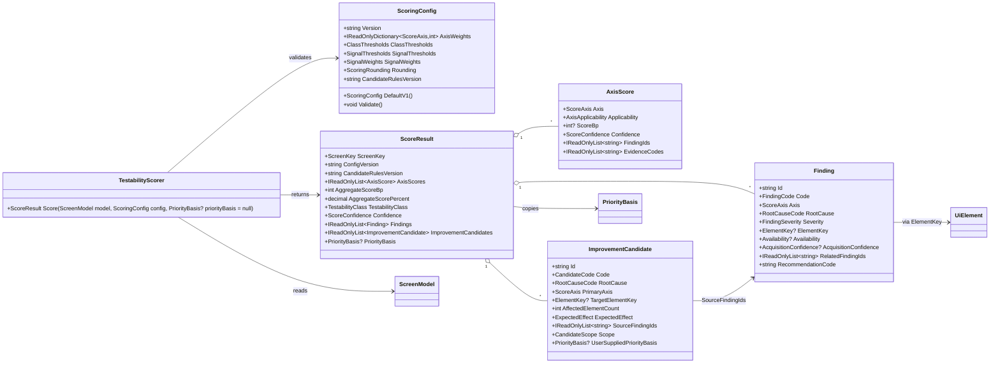
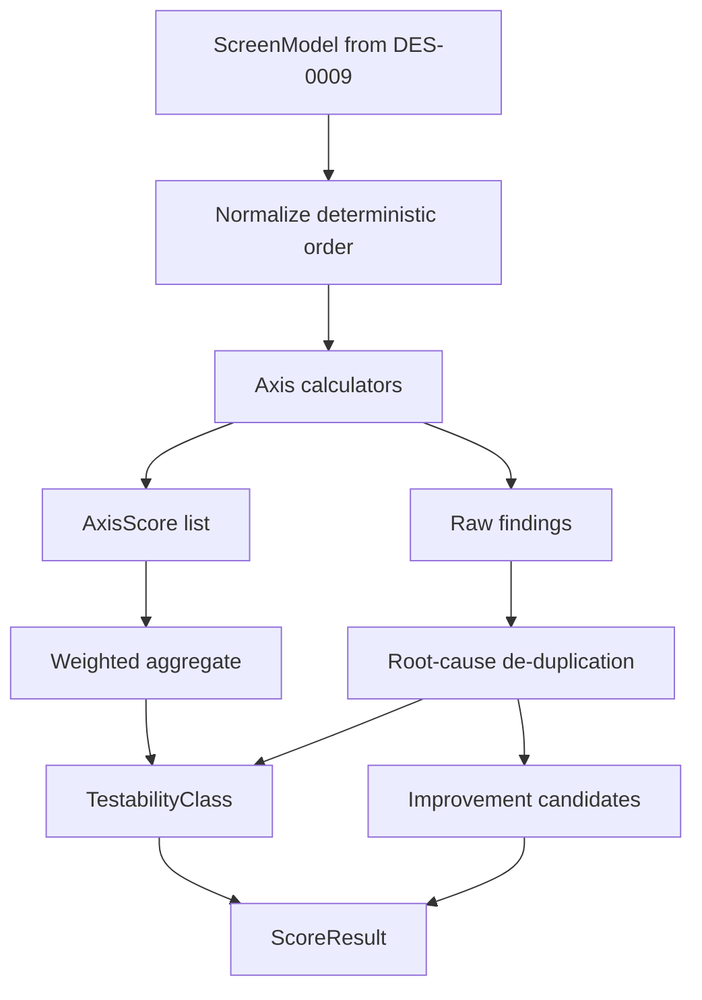

# DES-0010 Scoring, Classification, and Improvement Candidate Detailed Design

This is detailed-design package 3 from [DES-0007](des-0007-detailed-design-execution-strategy.md) section 4. It fixes the pure-domain scoring behavior used by implementation slice `IMP-0002`, unit-test design `UT-0002`, and report design `DES-0012`: which UI Automation / MSAA observations feed each axis, how scores are computed and rounded, how `Unavailable(reason)` remains distinct from a low score, how duplicated root causes are suppressed, how `TestabilityClass` is assigned, and how improvement candidates are emitted without fabricating priority.

Canonical requirements stay in [gui-testability-analyzer-requirements.md](../../docs/gui-testability-analyzer-requirements.md) (`RQ-xxx`) and derived requirements in [requirements-definition.md](../requirements/requirements-definition.md) (`RD-xxx`).

## Trace Block

| Field | Content |
| -- | -- |
| Artifact | `DES-0010`, Scoring, Classification, and Improvement Candidate Detailed Design, detailed design phase |
| Upstream | [DES-0002](des-0002-module-responsibility-basic-design.md) `M08`; [DES-0004](des-0004-analysis-flow-basic-design.md) Stage 3; [DES-0005](des-0005-vmodel-traceability-and-downstream-tests.md) `UT-0002`/`UT-0007` obligations and `RSK-DES-001`; [DES-0007](des-0007-detailed-design-execution-strategy.md) package 3, `R-GTA-01`, `R-MNT-01`; [DES-0008](des-0008-project-structure-and-test-harness.md) project homes; [DES-0009](des-0009-domain-model-stable-keys-and-availability.md) `ScreenModel`, stable keys, `Availability`, `AcquisitionConfidence`; guardrails `RQ-051` and `RQ-052` |
| Requirements | `RQ-005`, `RQ-017`, `RQ-018`, `RQ-019`, `RQ-020`, `RQ-021`, `RQ-022`, `RQ-023`, `RQ-029`, `RQ-034`, `RQ-051`; derived `RD-005`, `RD-006`, `RD-007`, `RD-008`, `RD-009`, `RD-010`, `RD-011`, `RD-014`, `RD-015`, `RD-016`, `RD-020` |
| Downstream | Design review issue #32; `UT-0002` issue #41; `UT-0007` report-output checks; `IMP-0002` issue #60; `DES-0012` machine-readable report schema; `DES-0017` threshold-maintenance operations |
| Evidence | Axis signal mapping, versioned scoring config schema, integer-basis-point formula, deterministic ordering and rounding rules, applicability / unavailable semantics, `TestabilityClass` thresholds, root-cause de-duplication, improvement-candidate rules, Mermaid flow, fixture and counter-example strategy, downstream handoff |
| Verification | `tools/okf/Validate-Okf.ps1`; `git diff --check`; future `dotnet test tests/Surveyor.Domain.Tests --filter UT0002` once `IMP-0002` exists |
| Residual Risk | The concrete UIA/MSAA adapter population of signals is delegated to `DES-0014`; report serialization and display wording are delegated to `DES-0012`; maintenance UI for changing the scoring config is delegated to `DES-0017`; `M08` records user-supplied priority basis from `ScreenSelectionMetadata` but does not compute or infer priority, closing `RSK-DES-001` for the scoring package |

## Module Coverage

Primary module: `M08 Scoring and Classification`, implemented in `Surveyor.Domain`.

Input domain model: `M04 Screen Model`, especially `ScreenModel`, `UiElement`, `ScreenKey`, `ElementKey`, `Availability`, and `AcquisitionConfidence` from `DES-0009`.

Output consumers:

- `M03` orchestration receives `ScoreResult` and combines it into the run result.
- `M10` reports serialize `ScoreResult`, findings, class, config version, and candidates.
- `M02` UI displays class, axis scores, and candidate wording, but does not reinterpret score math.

`M08` has no file, clock, locale, UI Automation, capture, or logging dependency. It is deterministic pure domain code.

## Scope And Non-Goals

In scope:

- seven evaluation axes (`RD-005` through `RD-011`);
- axis-to-signal mapping from UIA/MSAA and capture-derived observations;
- versioned external scoring config (`R-MNT-01`);
- deterministic score formula, thresholding, rounding, and tie ordering;
- explicit `Unavailable` and `NotApplicable` handling;
- non-orthogonal finding de-duplication;
- `TestabilityClass`;
- improvement candidate generation (`RD-014`, `RD-015`);
- no fabricated priority (`RD-016`).

Out of scope:

- how adapters read UIA/MSAA properties (`DES-0014`);
- screenshot capture details (`DES-0015`);
- report schema and wording (`DES-0012`);
- user-editable threshold management UI (`DES-0017`);
- storage, masking, export, and logging policy (`DES-0013`).

## Domain Contracts

Implementation homes are fixed by [DES-0008](des-0008-project-structure-and-test-harness.md):

- `src/Surveyor.Domain/Scoring/ScoringConfig.cs`
- `src/Surveyor.Domain/Scoring/ScoreResult.cs`
- `src/Surveyor.Domain/Scoring/AxisScore.cs`
- `src/Surveyor.Domain/Scoring/Finding.cs`
- `src/Surveyor.Domain/Scoring/ImprovementCandidate.cs`
- `src/Surveyor.Domain/Scoring/TestabilityScorer.cs`

### ScoringConfig

`ScoringConfig` is an immutable value object loaded by the application layer and passed into `M08`.

Required fields:

| Field | Type | Rule |
| -- | -- | -- |
| `Version` | non-empty string | Semantic config version, e.g. `scoring-v1`. Recorded in every `ScoreResult`. |
| `AxisWeights` | map `ScoreAxis -> int` | Basis points. Sum over all seven axes must equal `10000`. |
| `ClassThresholds` | immutable object | Thresholds in basis points for `ImmediatelyAutomatable`, `SmallImprovement`, `LimitedAutomation`, and `ImproveFirst`. |
| `SignalThresholds` | immutable object | Coverage thresholds used by axis calculators. |
| `SignalWeights` | immutable object | Per-axis signal formula coefficients in basis points. Every axis formula's coefficients must sum to `10000`. |
| `Rounding` | enum | `BasisPointHalfAwayFromZero` for v1. |
| `CandidateRulesVersion` | non-empty string | Version of candidate mapping rules, recorded separately from score weights. |

Default v1 weights:

| Axis | Weight |
| -- | --: |
| `Identifiability` | 2000 |
| `Operability` | 2000 |
| `ResultDeterminability` | 1500 |
| `PreconditionControllability` | 1500 |
| `ScreenStability` | 1000 |
| `CustomUiRisk` | 1000 |
| `CoordinateImageDependence` | 1000 |

The non-equal weights are deliberate: stable identity and operation seams are the earliest blockers for repeatable GUI automation, while custom UI and coordinate/image dependence are important risk modifiers.

### ScoreResult

`ScoreResult` contains:

- `ScreenKey ScreenKey`
- `string ConfigVersion`
- `string CandidateRulesVersion`
- `IReadOnlyList<AxisScore> AxisScores`
- `int AggregateScoreBp`
- `decimal AggregateScorePercent`
- `TestabilityClass TestabilityClass`
- `ScoreConfidence Confidence`
- `IReadOnlyList<Finding> Findings`
- `IReadOnlyList<ImprovementCandidate> ImprovementCandidates`
- `PriorityBasis? PriorityBasis`

`PriorityBasis` is copied from upstream `ScreenSelectionMetadata` when present. `M08` never computes business priority, urgency, or implementation order.

### AxisScore

`AxisScore` contains:

- `ScoreAxis Axis`
- `AxisApplicability Applicability`: `Applicable`, `NotApplicable`, or `UnknownDueToUnavailable`
- `int? ScoreBp`: `0` through `10000`; null when not applicable or unknown
- `ScoreConfidence Confidence`: `High`, `Medium`, `Low`, or `Unknown`
- `IReadOnlyList<string> FindingIds`
- `IReadOnlyList<string> EvidenceCodes`

`UnknownDueToUnavailable` is not numeric zero. It contributes to confidence and class capping but is excluded from the weighted average numerator and denominator.

### Finding

`Finding` is a safe, machine-readable domain fact:

- `string Id`
- `FindingCode Code`
- `ScoreAxis Axis`
- `RootCauseCode RootCause`
- `FindingSeverity Severity`: `Info`, `Warning`, `Blocking`
- `ElementKey? ElementKey`
- `Availability? Availability`
- `AcquisitionConfidence? AcquisitionConfidence`
- `IReadOnlyList<string> RelatedFindingIds`
- `string RecommendationCode`

Findings must not contain `DisplayLabel`, window title, raw text, image paths, or exception messages. Report wording is a downstream concern.

### ImprovementCandidate

`ImprovementCandidate` contains:

- `string Id`
- `CandidateCode Code`
- `RootCauseCode RootCause`
- `ScoreAxis PrimaryAxis`
- `ElementKey? TargetElementKey`
- `int AffectedElementCount`
- `ExpectedEffect ExpectedEffect`: `UnlockAutomation`, `ImproveReliability`, `ImproveObservability`, `ReduceMaintenanceCost`, `ReduceManualReview`
- `IReadOnlyList<string> SourceFindingIds`
- `CandidateScope Scope`: `Element`, `Screen`, `Application`
- `PriorityBasis? UserSuppliedPriorityBasis`

Candidate ordering is deterministic and non-priority: `Code` ordinal, `Scope`, `TargetElementKey` ordinal with null last, then `Id`.

## Class Design (UML)

`M08` exposes one public scoring service plus immutable public result/config records. Axis calculators, de-duplication helpers, and candidate-rule tables are implementation-private so unit tests assert observable behavior through `TestabilityScorer` and `ScoreResult`, not private decomposition. `UT-0002` should use test-project fixture builders to construct focused `ScreenModel` inputs; `InternalsVisibleTo` is not part of the v1 design contract.



## Public API Definitions

The following APIs are the implementation contract for `IMP-0002` and the direct unit-test seam for `UT-0002`.

```csharp
namespace Surveyor.Domain.Scoring;

public sealed class TestabilityScorer
{
    public ScoreResult Score(
        ScreenModel model,
        ScoringConfig config,
        PriorityBasis? priorityBasis = null);
}

public sealed record ScoringConfig(
    string Version,
    IReadOnlyDictionary<ScoreAxis, int> AxisWeights,
    ClassThresholds ClassThresholds,
    SignalThresholds SignalThresholds,
    SignalWeights SignalWeights,
    ScoringRounding Rounding,
    string CandidateRulesVersion)
{
    public static ScoringConfig DefaultV1();
    public void Validate();
}

public sealed record ClassThresholds(
    int ImmediatelyAutomatableBp,
    int SmallImprovementBp,
    int LimitedAutomationBp,
    int ImproveFirstBelowBp,
    int MaxUnknownWeightForImmediateBp,
    int MaxUnknownWeightForSmallImprovementBp,
    int MaxUnknownWeightBeforeImproveFirstBp,
    int MaxUnknownWeightBeforeNotEnoughEvidenceBp);

public sealed record SignalThresholds(
    IReadOnlyDictionary<ScoreAxis, IReadOnlyDictionary<string, int>> BasisPointThresholds);

public sealed record SignalWeights(
    IReadOnlyDictionary<ScoreAxis, IReadOnlyDictionary<string, int>> BasisPointWeights);

public sealed record ScoreResult(
    ScreenKey ScreenKey,
    string ConfigVersion,
    string CandidateRulesVersion,
    IReadOnlyList<AxisScore> AxisScores,
    int AggregateScoreBp,
    decimal AggregateScorePercent,
    TestabilityClass TestabilityClass,
    ScoreConfidence Confidence,
    IReadOnlyList<Finding> Findings,
    IReadOnlyList<ImprovementCandidate> ImprovementCandidates,
    PriorityBasis? PriorityBasis);
```

Public records used by `ScoreResult`:

```csharp
public sealed record AxisScore(
    ScoreAxis Axis,
    AxisApplicability Applicability,
    int? ScoreBp,
    ScoreConfidence Confidence,
    IReadOnlyList<string> FindingIds,
    IReadOnlyList<string> EvidenceCodes);

public sealed record Finding(
    string Id,
    FindingCode Code,
    ScoreAxis Axis,
    RootCauseCode RootCause,
    FindingSeverity Severity,
    ElementKey? ElementKey,
    Availability? Availability,
    AcquisitionConfidence? AcquisitionConfidence,
    IReadOnlyList<string> RelatedFindingIds,
    string RecommendationCode);

public sealed record ImprovementCandidate(
    string Id,
    CandidateCode Code,
    RootCauseCode RootCause,
    ScoreAxis PrimaryAxis,
    ElementKey? TargetElementKey,
    int AffectedElementCount,
    ExpectedEffect ExpectedEffect,
    IReadOnlyList<string> SourceFindingIds,
    CandidateScope Scope,
    PriorityBasis? UserSuppliedPriorityBasis);
```

Enums fixed by this package:

```csharp
public enum ScoreAxis
{
    Identifiability,
    Operability,
    ResultDeterminability,
    PreconditionControllability,
    ScreenStability,
    CustomUiRisk,
    CoordinateImageDependence
}

public enum AxisApplicability { Applicable, NotApplicable, UnknownDueToUnavailable }
public enum ScoreConfidence { High, Medium, Low, Unknown }
public enum TestabilityClass { ImmediatelyAutomatable, SmallImprovement, LimitedAutomation, ImproveFirst, NotEnoughEvidence }
public enum FindingSeverity { Info, Warning, Blocking }
public enum ScoringRounding { BasisPointHalfAwayFromZero }
public enum CandidateScope { Element, Screen, Application }
public enum ExpectedEffect { UnlockAutomation, ImproveReliability, ImproveObservability, ReduceMaintenanceCost, ReduceManualReview }

public enum RootCauseCode
{
    MissingStableIdentity,
    DuplicateIdentity,
    NoSemanticActionPattern,
    ResultNotObservable,
    PreconditionNotControllable,
    UnstableScreenStructure,
    OpaqueCustomSurface,
    CoordinateOnlyInteraction,
    AcquisitionUnavailable
}

public enum FindingCode
{
    NoStableIdentity,
    DuplicateIdentity,
    FallbackOnlyIdentity,
    MissingActionPattern,
    NotKeyboardFocusable,
    DisabledOnlyAction,
    MissingObservableResult,
    VolatileResultElement,
    MissingPreconditionState,
    MissingSettablePrecondition,
    UnstableScreenKey,
    UnstableElementSet,
    UnrealizedSubtree,
    OpaqueCustomControl,
    LowAcquisitionConfidence,
    CoordinateOnlyAction,
    ImageOnlyVerification,
    CaptureUnavailable,
    NoScorableAxes
}

public enum CandidateCode
{
    AddStableAutomationIdOrPeerName,
    MakeAutomationIdentityUnique,
    ExposeActionPattern,
    ExposeResultStatusOrReadableValue,
    ExposeStateSetupOrResetHook,
    StabilizeScreenIdentityAndChildOrder,
    AddAccessiblePeerForCustomControl,
    ReduceCoordinateOrImageDependency,
    HandleUnavailableSurfaceManuallyOrByAdapter
}
```

Function rules:

| API | Throws | Determinism / test rule |
| -- | -- | -- |
| `TestabilityScorer.Score` | `ArgumentNullException` for null model/config; `ArgumentException` for invalid config | Pure function. Same model/config/priority basis yields equal `ScoreResult`. No clock, file, culture, adapter, or randomness. |
| `ScoringConfig.DefaultV1` | None | Returns immutable v1 config exactly matching this document. |
| `ScoringConfig.Validate` | `ArgumentException` | Rejects empty version, duplicate/missing axes, negative axis weights, axis weights not summing to `10000`, per-axis signal weights not summing to `10000`, invalid thresholds, unsupported rounding, or empty candidate-rules version. |

## Axis Signal Mapping

The adapter packages populate neutral observations on `UiElement`; `M08` consumes only those neutral observations. When a property was not obtainable, the adapter supplies `Unavailable(reason)` rather than omitting the field silently.

| Axis | Primary question | UIA/MSAA and model signals | Negative indicators |
| -- | -- | -- | -- |
| `Identifiability` (`RD-005`) | Can automation address controls stably? | `AutomationId`, framework stable id, `RuntimeId` stability, `ElementKey.Source`, duplicate-key count, fallback-key ratio, `ControlType`, MSAA child id when stable | duplicate stable ids, fallback-only identity, structural ordinal identity, missing element key, volatile window/state identity |
| `Operability` (`RD-006`) | Can user actions be driven through semantic patterns? | supported UIA patterns (`Invoke`, `SelectionItem`, `Toggle`, `Value`, `RangeValue`, `ExpandCollapse`, `ScrollItem`), MSAA action/default action, `IsKeyboardFocusable`, `IsEnabled`, bounding rectangle presence | actionable element has no semantic action pattern, disabled-only surface, focus unavailable, custom control without action proxy |
| `ResultDeterminability` (`RD-007`) | Can expected results be observed without image-only checks? | output/status elements, `Name`/`Value`/`Text` availability through safe model fields, selection/value pattern readable state, stable result element keys | result only visible in bitmap, text unavailable, result element volatile, no observable completion/status |
| `PreconditionControllability` (`RD-008`) | Can setup state be controlled or detected? | readable/writable value controls, selection controls, reset/state hooks exposed by target metadata, stable navigation state key, user-supplied screen metadata | required precondition hidden, current state not readable, setup depends on previous manual order |
| `ScreenStability` (`RD-009`) | Is the evaluated screen structurally stable? | stable `ScreenKey`, bounded element count, post-realization tree stability, low disappearing-element ratio, deterministic child order | lazy unrealized subtree, frequent count/order changes, timeout/cap truncation, volatile labels used only as fallback material |
| `CustomUiRisk` (`RD-010`) | How much of the screen is opaque custom UI? | `ControlType.Custom`, owner-draw markers, MSAA-only proxy ratio, low `AcquisitionConfidence`, no peer pattern | high custom/owner-draw ratio, opaque childless panel containing controls, confidence low |
| `CoordinateImageDependence` (`RD-011`) | Would tests depend on coordinates or screenshots? | bounds availability/stability, capture availability, ratio of elements without semantic keys/patterns, image-only result markers | coordinate-only action, capture failure, layout-dependent verification, DPI virtualization risk |

## Scoring Algorithm

### Step 1: Normalize Inputs

Inputs are copied into immutable working arrays sorted by:

1. `ScreenKey` ordinal;
2. `ElementKey` ordinal, null last;
3. `ControlType` ordinal;
4. original deterministic model ordinal from `DES-0009`.

`StringComparison.Ordinal` is required everywhere. Ambient culture and `Object.GetHashCode()` are prohibited by `DES-0008`.

### Step 2: Compute Axis Facts

Each axis calculator emits:

- one `AxisScore`;
- zero or more `Finding`s;
- zero or more raw `RootCauseCode`s.

Axis calculators may count coverage ratios but must use integer arithmetic:

```text
coverageBp = (coveredCount * 10000 + totalCount / 2) / totalCount
```

This is half-away-from-zero at basis-point precision without `double`.

If `totalCount == 0` because the axis does not apply to the screen, emit `NotApplicable`. If `totalCount` cannot be known due to an upstream availability status, emit `UnknownDueToUnavailable`.

### Step 3: Derive Axis Scores

V1 axis formulas are intentionally simple and auditable. Every signal score and every coefficient is an integer basis-point value. Coefficients are stored in `ScoringConfig.SignalWeights`, not in `SignalThresholds`, so future threshold maintenance cannot accidentally change formula weights unless the config version changes.

For a positive-weighted axis:

```text
axisScoreBp = (sum(signalScoreBp * signalWeightBp) + 5000) / 10000
```

For inverse risk axes:

```text
riskBp = (sum(riskSignalBp * signalWeightBp) + 5000) / 10000
axisScoreBp = 10000 - riskBp
```

The `+ 5000` term is the only rounding point for the formula. Do not round each weighted term individually. Use integer types wide enough to hold `10000 * 10000 * signalCount`.

| Axis | V1 signal weights |
| -- | -- |
| `Identifiability` | `stableIdentityCoverage=7000`, `uniqueIdentityCoverage=2000`, `nonFallbackCoverage=1000` |
| `Operability` | `semanticActionCoverage=5500`, `focusOrEnabledCoverage=2000`, `actionBoundsCoverage=1500`, `nonCustomActionCoverage=1000` |
| `ResultDeterminability` | `observableResultCoverage=5000`, `readableStateCoverage=3000`, `stableResultIdentityCoverage=2000` |
| `PreconditionControllability` | `readablePreconditionCoverage=3500`, `settablePreconditionCoverage=3500`, `stableStateMetadataCoverage=3000` |
| `ScreenStability` | `screenIdentityStability=3500`, `elementSetStability=3000`, `boundedTreeCoverage=2000`, `nonVolatileFallbackCoverage=1500` |
| `CustomUiRisk` | inverse risk: `customOpaqueCoverage=7000`, `lowConfidenceCoverage=3000` |
| `CoordinateImageDependence` | inverse risk: `coordinateOnlyCoverage=5000`, `imageOnlyVerificationCoverage=3000`, `captureUnavailableCoverage=2000` |

`SignalThresholds` remains separate and contains only cutoffs used to convert observed counts into signal scores.

### Step 4: Aggregate

Only axes with `Applicability == Applicable` and a non-null `ScoreBp` participate:

```text
weightedSum = sum(axis.ScoreBp * axis.Weight)
usedWeight = sum(axis.Weight)
AggregateScoreBp = (weightedSum + usedWeight / 2) / usedWeight
```

If `usedWeight == 0`, aggregate is null internally and the public result uses `AggregateScoreBp = 0`, `Confidence = Unknown`, and `TestabilityClass = NotEnoughEvidence` with a blocking `NoScorableAxes` finding. This case is distinct from a valid low score and must include the `Unavailable` reasons.

### Step 5: De-Duplicate Root Causes

Findings are grouped by:

```text
RootCauseCode + TargetElementKeyOrScreen + AvailabilityReasonOrNone
```

Primary finding selection order:

1. `Blocking` over `Warning` over `Info`;
2. axis order from this document;
3. lower `FindingCode` ordinal.

Non-primary findings are retained only as `RelatedFindingIds` on the primary finding. Improvement candidates reference the primary finding. This prevents one missing `AutomationId` on a custom button from generating three separate candidate rows.

### Step 6: Classify

Classification is an ordered decision list. The first matching row wins. This is part of the public behavior and is covered by `UT-0002` boundary tests.

Definitions:

- `unknownWeightBp`: sum of configured axis weights for applicable axes whose score is `UnknownDueToUnavailable`.
- `hasBlockingFinding`: any de-duplicated finding with `FindingSeverity.Blocking`.
- `hasFixableBlockingRootCause`: any blocking finding whose root cause maps to a candidate code in Step 7. V1 treats all Step 7 root causes except `AcquisitionUnavailable` as fixable by target/application changes; `AcquisitionUnavailable` is fixable only when the finding status is `PartialResult`, not when it is `PermissionDenied` or `IntegrityMismatch`.

| Priority | Class | Required condition |
| --: | -- | -- |
| 1 | `NotEnoughEvidence` | `usedWeight == 0` or `unknownWeightBp > 5000` |
| 2 | `ImproveFirst` | `hasFixableBlockingRootCause` or `unknownWeightBp > 3000` or aggregate < `5000` |
| 3 | `ImmediatelyAutomatable` | aggregate >= `8500`, `hasBlockingFinding == false`, `unknownWeightBp <= 500`, confidence not lower than `Medium` |
| 4 | `SmallImprovement` | aggregate >= `7000`, `hasBlockingFinding == false`, `unknownWeightBp <= 1500` |
| 5 | `LimitedAutomation` | aggregate >= `5000` |
| 6 | `ImproveFirst` | fallback when no earlier row matched |

This ordering intentionally lets evidence insufficiency and fixable blockers override a high aggregate score. Class names are stable enum values. User-facing localized labels belong to `DES-0012` / `DES-0016`.

### Step 7: Generate Improvement Candidates

Candidate mapping:

| Root cause | Candidate code | Expected effect |
| -- | -- | -- |
| `MissingStableIdentity` | `AddStableAutomationIdOrPeerName` | `UnlockAutomation` |
| `DuplicateIdentity` | `MakeAutomationIdentityUnique` | `ImproveReliability` |
| `NoSemanticActionPattern` | `ExposeActionPattern` | `UnlockAutomation` |
| `ResultNotObservable` | `ExposeResultStatusOrReadableValue` | `ImproveObservability` |
| `PreconditionNotControllable` | `ExposeStateSetupOrResetHook` | `ImproveReliability` |
| `UnstableScreenStructure` | `StabilizeScreenIdentityAndChildOrder` | `ReduceMaintenanceCost` |
| `OpaqueCustomSurface` | `AddAccessiblePeerForCustomControl` | `UnlockAutomation` |
| `CoordinateOnlyInteraction` | `ReduceCoordinateOrImageDependency` | `ReduceMaintenanceCost` |
| `AcquisitionUnavailable` | `HandleUnavailableSurfaceManuallyOrByAdapter` | `ReduceManualReview` |

Candidates are not priorities. When upstream `ScreenSelectionMetadata` contains user-supplied priority context, candidates copy it into `UserSuppliedPriorityBasis`; otherwise this field is null.

`FindingCode` is more granular than `RootCauseCode`: several finding codes can map to one root cause, but a finding has exactly one root cause. V1 mapping:

| Root cause | Finding codes |
| -- | -- |
| `MissingStableIdentity` | `NoStableIdentity`, `FallbackOnlyIdentity` |
| `DuplicateIdentity` | `DuplicateIdentity` |
| `NoSemanticActionPattern` | `MissingActionPattern`, `NotKeyboardFocusable`, `DisabledOnlyAction` |
| `ResultNotObservable` | `MissingObservableResult`, `VolatileResultElement` |
| `PreconditionNotControllable` | `MissingPreconditionState`, `MissingSettablePrecondition` |
| `UnstableScreenStructure` | `UnstableScreenKey`, `UnstableElementSet`, `UnrealizedSubtree` |
| `OpaqueCustomSurface` | `OpaqueCustomControl`, `LowAcquisitionConfidence` |
| `CoordinateOnlyInteraction` | `CoordinateOnlyAction`, `ImageOnlyVerification` |
| `AcquisitionUnavailable` | `CaptureUnavailable`, `NoScorableAxes` |

## Mermaid Flow



## Edge Cases

| Case | Required behavior |
| -- | -- |
| Empty but valid screen model | `NotEnoughEvidence`, blocking `NoScorableAxes`, no crash. |
| Element has `Unavailable(NotRealized)` for patterns | Axis becomes unknown or partial; never numeric zero solely because data is unavailable. |
| Duplicate `AutomationId` across sibling buttons | One primary `DuplicateIdentity` finding and one candidate for the duplicate set. |
| Custom owner-draw control has stable key and MSAA action | Penalize custom risk only for opaque/low-confidence parts; do not double-penalize operability if semantic action exists. |
| Capture unavailable but semantic results readable | Coordinate/image axis records risk; result determinability can still score high. |
| Config weights do not sum to `10000` | Application config loader rejects before invoking `M08`; domain scorer also guards and throws `ArgumentException` because this is a programmer/config error. |
| Two candidate rows otherwise tie | Stable ordinal tie-breakers decide order. |

## Diagnostics And Confidentiality

`M08` emits safe codes, keys, counts, and enum values only. It never includes:

- `DisplayLabel`;
- raw target text;
- raw exception message;
- screenshot path;
- window title.

`DES-0013` owns log/export sanitization. `DES-0012` owns report wording. This package makes their job possible by keeping scoring facts code-based from the start.

## Unit-Test Design Handoff

`UT-0002` should be written before `IMP-0002` and should include at least:

| Test intent | Fixture |
| -- | -- |
| Deterministic aggregate and class | Same synthetic tree scored twice and in permuted element order; byte-identical result after serializer order from `DES-0012`. |
| Axis mapping | One fixture per axis with clear positive and negative signals. |
| `Unavailable` is not low score | Pattern availability unknown yields `UnknownDueToUnavailable`, confidence cap, and no zero penalty. |
| Root-cause de-duplication | One missing identity on a custom button emits one primary candidate. |
| Rounding | Basis-point midpoint cases use half-away-from-zero. |
| Classification boundary order | Each class threshold has `-1`, exact, and `+1` cases; overlapping conditions prove the ordered decision list (`NotEnoughEvidence` before `ImproveFirst` before score-based classes). |
| Config validation | invalid weight sum, negative axis weight, missing axis, missing/invalid signal weights, and unknown config version fail fast before scoring. |
| Dictionary order independence | Reordered `AxisWeights`, `SignalThresholds`, and `SignalWeights` dictionaries produce equal results. |
| No fabricated priority | no `ScreenSelectionMetadata` means no priority-like field on candidates; supplied metadata is copied as basis only. |

`UT-0007` should assert that the report layer receives candidate codes, source finding ids, class enum, and config version without recomputing score math.

## Implementation Handoff

Implementers should start with:

1. `ScoringConfig.DefaultV1()`;
2. immutable result records and enums;
3. `TestabilityScorer.Score(ScreenModel model, ScoringConfig config, PriorityBasis? priorityBasis = null)`;
4. axis calculators as private deterministic methods;
5. candidate generation from de-duplicated findings.

Do not read clocks, files, UIA objects, capture data, or localization resources in `Surveyor.Domain`.
