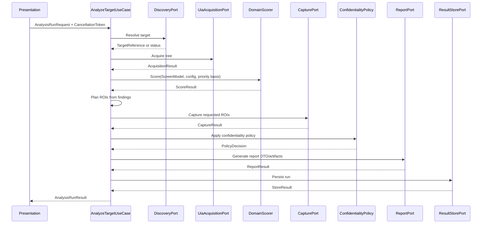

# DES-0011 Port DTOs, Status Model, and Use-Case Orchestration Detailed Design

This is detailed-design package 4 from [DES-0007](des-0007-detailed-design-execution-strategy.md) section 4. It fixes the application-layer contracts that implementation and tests use to connect target discovery, acquisition, scoring, capture, confidentiality policy, reporting, and storage without leaking adapter types inward. It also owns the run-level diagnostics model (`R-ARC-03`) and makes timeout, cancellation, partial-result, and `ScreenSelectionMetadata` behavior explicit.

Canonical requirements stay in [gui-testability-analyzer-requirements.md](../../docs/gui-testability-analyzer-requirements.md) (`RQ-xxx`) and derived requirements in [requirements-definition.md](../requirements/requirements-definition.md) (`RD-xxx`).

## Trace Block

| Field | Content |
| -- | -- |
| Artifact | `DES-0011`, Port DTOs, Status Model, and Use-Case Orchestration Detailed Design, detailed design phase |
| Upstream | [DES-0002](des-0002-module-responsibility-basic-design.md) `M03`/`M11`; [DES-0003](des-0003-module-interface-basic-design.md) port contracts; [DES-0004](des-0004-analysis-flow-basic-design.md) staged flow; [DES-0005](des-0005-vmodel-traceability-and-downstream-tests.md) `UT-0003`/`UT-0004`/`UT-0012`; [DES-0007](des-0007-detailed-design-execution-strategy.md) package 4 and `R-ARC-03`; [DES-0008](des-0008-project-structure-and-test-harness.md) project homes; [DES-0009](des-0009-domain-model-stable-keys-and-availability.md) `IClock`, keys, availability; accepted [ADR-0002](../decisions/adr-0002-adapter-technology-selection.md) threading/capture observations |
| Requirements | `RQ-046`, `RQ-048`, `RQ-050`, `RQ-054`; derived `RD-001`, `RD-016`, `RD-023`, `RD-025`, `RD-032` |
| Downstream | Design review issue #33; `UT-0012` issue #51; implementation issues #62 (`IMP-0004` clock), #63 (`IMP-0005` discovery), #64 (`IMP-0006` acquisition), #69 (`IMP-0011` use-case wiring); `DES-0012` report DTOs; `DES-0013` sanitization policy; `DES-0014`/`DES-0015` adapter contracts; `DES-0018` composition root |
| Evidence | DTO catalog, status enums, timeout defaults, cancellation rules, partial-result aggregation, sanitized diagnostic shape, ROI handoff contract, metadata threading rule, orchestration sequence, fixture strategy, unit-test intent |
| Verification | `tools/okf/Validate-Okf.ps1`; `git diff --check`; future `dotnet test tests/Surveyor.Application.Tests --filter UT0012` once source exists |
| Residual Risk | Concrete adapter failure maps are refined in `DES-0014`/`DES-0015`; report schema is refined in `DES-0012`; storage/export policy and final sanitizer implementation are refined in `DES-0013`; composition root wiring is refined in `DES-0018` |

## Module Coverage

Primary modules:

- `M03 Use Cases and Application Ports` in `Surveyor.Application`;
- `M11 Shared Infrastructure Abstractions` for `IClock`.

Participating modules through ports:

- `M05 Target Discovery`
- `M06 UI Tree Acquisition`
- `M07 Screen Capture`
- `M08 Scoring`
- `M09 Confidentiality`
- `M10 Report Generation`
- `M12 Result Store / Export`

The application layer owns orchestration, statuses, DTOs, and diagnostic aggregation. It does not own UIA, Windows capture, WinUI, file-system implementation, or score math.

## DTO Home And Naming

Suggested source layout:

- `src/Surveyor.Application/Dto/*.cs`
- `src/Surveyor.Application/Ports/*.cs`
- `src/Surveyor.Application/UseCases/*.cs`
- `src/Surveyor.Application/Diagnostics/*.cs`
- `src/Surveyor.Application/Time/IClock.cs`

DTOs are immutable records. Collections are `IReadOnlyList<T>` and are sorted by the producer before returning. No DTO exposes adapter-native types such as `AutomationElement`, COM interfaces, `Bitmap`, `HWND`, `StorageFile`, or WinUI types.

## Status Model

Expected operational outcomes are status values, not exceptions.

### RunOutcome

| Value | Meaning |
| -- | -- |
| `Succeeded` | All requested stages completed and no warning or blocking diagnostic was produced. |
| `SucceededWithPartialResult` | At least one optional or recoverable stage returned `Unavailable`, `PartialResult`, `Timeout`, or `PermissionDenied`, but the run produced a useful result. |
| `Cancelled` | The caller's `CancellationToken` was canceled. |
| `FailedUnexpected` | A programmer error, invariant violation, or unexpected adapter exception escaped expected status mapping. |

### OperationStatus

| Value | Use |
| -- | -- |
| `Ok` | Stage completed normally. |
| `Unavailable` | Target data cannot be obtained but the run may continue with explicit absence. |
| `PermissionDenied` | Integrity/session/access boundary prevented the operation. |
| `IntegrityMismatch` | Target integrity level prevents safe same-integrity access. |
| `Timeout` | Stage exceeded its configured budget. |
| `PartialResult` | Stage completed with a capped/truncated result. |
| `NotFound` | User-selected target disappeared or cannot be resolved. |
| `Cancelled` | Cancellation observed inside a stage; propagated as run cancellation. |
| `SchemaInvalid` | Input/config/result shape is invalid. |
| `IoError` | Store/export/report output failed in an expected way. |

Cancellation is special: the application use case does not convert caller cancellation into a partial result. It throws or propagates `OperationCanceledException` internally and returns `RunOutcome.Cancelled` only at the public use-case boundary.

### RunStage

`TargetDiscovery`, `TargetSelection`, `TreeAcquisition`, `Scoring`, `RegionPlanning`, `Capture`, `ConfidentialityPolicy`, `ResultAssembly`, `ReportGeneration`, `Store`, `Export`.

Stage order in diagnostics is fixed by this enum order.

## Core DTOs

### AnalysisRunRequest

Required fields:

- `TargetReference Target`
- `ScreenSelectionMetadata? ScreenSelectionMetadata`
- `AnalysisRunOptions Options`
- `ScoringConfigReference ScoringConfig`
- `OutputRequest Outputs`

`ScreenSelectionMetadata` is passed through unchanged. `M03` may validate shape but must not fabricate priority, business criticality, or screen intent. If metadata is absent, downstream `PriorityBasis` remains null.

### AnalysisRunOptions

V1 defaults:

| Option | Default | Notes |
| -- | --: | -- |
| `DiscoveryTimeout` | 5 seconds | Used by target selection refresh. |
| `AcquisitionTimeout` | 10 seconds | Includes UIA warm-up. |
| `MaxElementCount` | 20000 | Cap returns `PartialResult`, not hard failure. |
| `CaptureFirstFrameTimeout` | 5 seconds | Covers ADR-0002 WGC first-frame observation plus margin. |
| `ReportTimeout` | 10 seconds | Expected status `Timeout` if exceeded. |
| `StoreTimeout` | 10 seconds | Expected status `Timeout` or `IoError`. |
| `ContinueWithoutCapture` | true | Capture absence is partial unless capture was explicitly required. |
| `RequireCapture` | false | If true, capture failure can make the run partial/failure per policy. |

All timeout values are explicit in options after defaults are applied so tests can assert exact values.

### TargetReference

- `string SessionTargetId`
- `TargetKind Kind`: `ProcessWindow`, `TopLevelWindow`, `Fixture`
- `string? SafeDisplayHint`
- `TargetIntegrityHint IntegrityHint`

`SafeDisplayHint` is optional and already sanitized by the presentation/discovery boundary. It is not used for keys or paths.

### TargetCandidate

- `TargetReference Reference`
- `string SafeName`
- `TargetProcessInfo Process`
- `bool IsLikelyLegacyGui`
- `OperationStatus Status`
- `IReadOnlyList<RunDiagnostic> Diagnostics`

Discovery may expose a safe name for UI display, but persistent logs and exports use diagnostic codes and safe ids.

### AcquisitionResult

- `OperationStatus Status`
- `ScreenModel? ScreenModel`
- `int ElementCount`
- `bool HitElementCap`
- `IReadOnlyList<Availability> Availability`
- `IReadOnlyList<RunDiagnostic> Diagnostics`

If `ScreenModel` is null, status must be `Unavailable`, `PermissionDenied`, `IntegrityMismatch`, `Timeout`, `NotFound`, or `Cancelled`.

### RegionOfInterest

The ROI handoff connects scoring findings to capture/report review without adding score logic to the capture adapter.

- `string Id`
- `ElementKey? ElementKey`
- `RectangleDip? BoundsDip`
- `RegionPurpose Purpose`: `ExplainFinding`, `ShowResultArea`, `ManualReview`
- `string SourceFindingId`
- `RunDiagnostic? Diagnostic`

ROI order is deterministic by `SourceFindingId`, `ElementKey`, then `Id`. Missing bounds yield a diagnostic and no capture request for that ROI.

### CaptureResult

- `OperationStatus Status`
- `IReadOnlyList<CapturedRegion> Regions`
- `CaptureCoordinateSpace CoordinateSpace`
- `IReadOnlyList<RunDiagnostic> Diagnostics`

`CapturedRegion` references bytes through an opaque in-memory `CaptureBlobId` or store-bound reference, not a file path. File paths belong to `M12`.

### AnalysisRunResult

- `RunId RunId`
- `DateTimeOffset StartedAtUtc`
- `DateTimeOffset CompletedAtUtc`
- `RunOutcome Outcome`
- `TargetReference Target`
- `ScreenSelectionMetadata? ScreenSelectionMetadata`
- `ScreenModel? ScreenModel`
- `ScoreResult? ScoreResult`
- `IReadOnlyList<RegionOfInterest> RegionsOfInterest`
- `CaptureResult? Capture`
- `ReportResult? Report`
- `StoreResult? Store`
- `IReadOnlyList<StageResult> Stages`
- `IReadOnlyList<RunDiagnostic> Diagnostics`

`StartedAtUtc` and `CompletedAtUtc` are read from injected `IClock.UtcNow` only. Domain scoring never reads time.

## Diagnostics Model

`RunDiagnostic` is safe by construction:

- `string Code`
- `RunStage Stage`
- `DiagnosticSeverity Severity`: `Info`, `Warning`, `Error`
- `OperationStatus Status`
- `ScreenKey? ScreenKey`
- `ElementKey? ElementKey`
- `string MessageTemplateId`
- `IReadOnlyDictionary<string, string> SafeArgs`
- `ExceptionKind? ExceptionKind`
- `int? HResult`

Prohibited fields:

- raw exception message;
- target window title;
- raw `DisplayLabel`;
- raw file path;
- raw screenshot path;
- raw UI text.

`SafeArgs` are allowlisted values: enum names, counts, durations in milliseconds, config versions, status codes, and stable safe keys. `DES-0013` defines the sanitizer enforcement and export/log handling; this package defines the shape all stages must use.

## Orchestration Rules

### Sequence



### Partial Results

The run returns `SucceededWithPartialResult` when:

- acquisition hit `MaxElementCount` but returned a usable `ScreenModel`;
- capture failed or timed out and `RequireCapture == false`;
- one or more optional ROIs lack bounds;
- store/export failed after a report DTO was generated;
- adapter returned `Unavailable` for part of the tree.

The run returns `FailedUnexpected` only for invariant breaches or unexpected exceptions that are not represented by the status model.

### Timeout Handling

Each port receives a linked cancellation token derived from the caller token plus the stage timeout. If the stage timeout fires, the port result status is `Timeout` when possible. If the caller token fires, cancellation wins and the public result is `Cancelled`.

Timeout diagnostics include:

- stage;
- timeout budget in milliseconds;
- elapsed milliseconds measured by a monotonic stopwatch abstraction or adapter-local measurement;
- safe target reference id.

Elapsed timing is diagnostic only. It must not affect scoring or report determinism.

### Error Aggregation

Diagnostics from every stage are appended into a builder sorted by:

1. `RunStage`;
2. severity (`Error`, `Warning`, `Info`);
3. `Code` ordinal;
4. `ElementKey` ordinal with null last.

The final outcome is derived after aggregation:

- any cancellation -> `Cancelled`;
- unexpected exception diagnostic -> `FailedUnexpected`;
- any `Error` from required stage -> `FailedUnexpected` unless it has an expected partial mapping;
- any warning/error from optional recoverable stage -> `SucceededWithPartialResult`;
- otherwise `Succeeded`.

### Read-Only Guardrail

Application ports are named around read-only semantics:

- acquisition may read UI tree properties and patterns listed by `DES-0014`;
- capture may capture pixels without driving target interaction;
- store/export/report operate on Surveyor artifacts only.

No application DTO or use case exposes a command that clicks, types, sets values, invokes patterns, changes focus, activates the target, or sends window messages for mutation. This supports `RQ-048` and `RD-032`.

## IClock Usage

`IClock` is:

```csharp
public interface IClock
{
    DateTimeOffset UtcNow { get; }
}
```

Usage:

- `AnalyzeTargetUseCase` reads start and completion timestamps.
- report/store DTOs receive those timestamps from the use case.
- tests inject `FakeClock`.
- adapters may measure elapsed time internally but do not feed timing into `M08`.

Do not use `DateTime.Now`, `DateTimeOffset.Now`, or ambient local time in application code.

## Unit-Test Design Handoff

`UT-0012` should cover the orchestration slice over fake ports:

| Test intent | Fake setup |
| -- | -- |
| Happy path | all ports return `Ok`; result is `Succeeded`, timestamps from fake clock, metadata copied unchanged. |
| Acquisition partial | fake acquisition hits cap; scoring still runs; outcome `SucceededWithPartialResult`. |
| Capture timeout optional | fake capture returns `Timeout`; result remains partial when `RequireCapture=false`. |
| Caller cancellation | token canceled during acquisition; public result `Cancelled`; later ports not called. |
| Expected permission denial | acquisition returns `PermissionDenied`; result has safe diagnostic and no raw exception text. |
| No fabricated priority | absent `ScreenSelectionMetadata` remains absent through scorer and result. |
| Diagnostic ordering | multiple fake stage diagnostics sort deterministically. |

`UT-0003` should cover discovery/selection DTOs and status mapping. `UT-0004` should cover acquisition/capture port DTOs and cancellation/timeout contracts.

## Implementation Handoff

Start implementation with:

1. immutable DTO and enum definitions;
2. `IClock` and `FakeClock`;
3. port interfaces using DTOs and `CancellationToken`;
4. `AnalyzeTargetUseCase` over fakes;
5. diagnostic builder and outcome derivation;
6. timeout wrapper helper in `Surveyor.Application`.

Adapter packages must depend inward on these interfaces; these interfaces must never depend on adapter packages.
