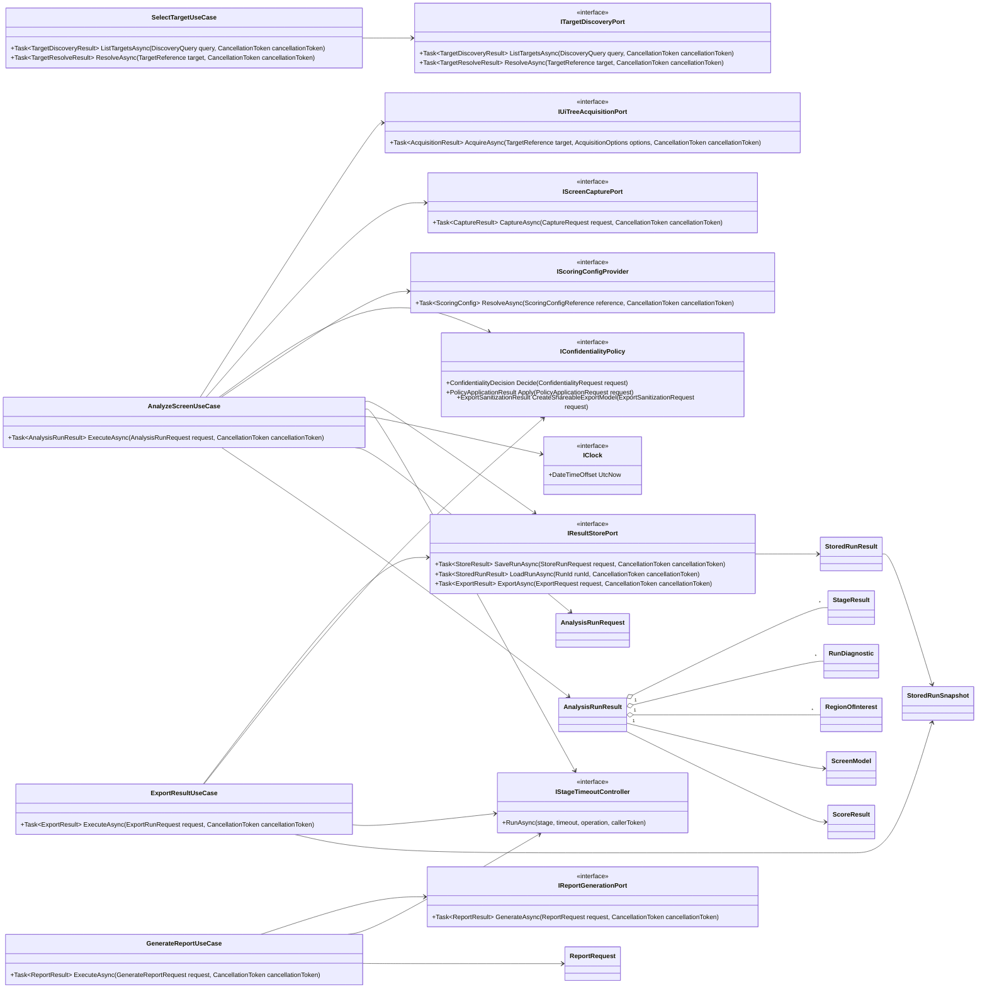
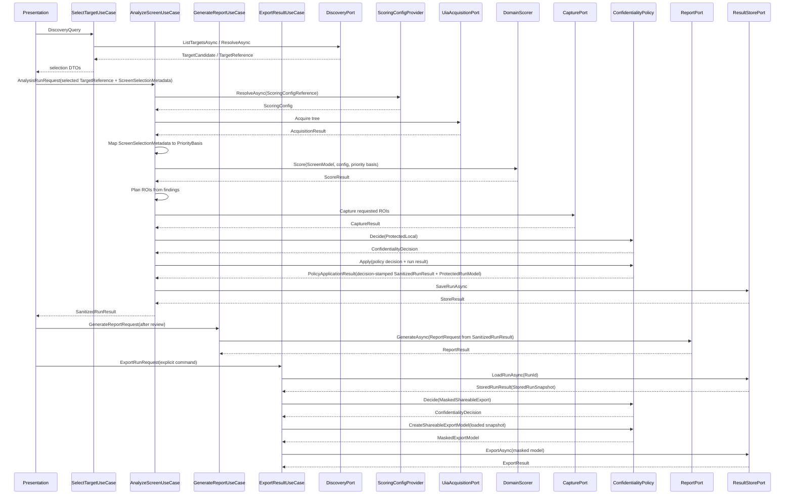

# DES-0011 Port DTOs, Status Model, and Use-Case Orchestration Detailed Design

This is detailed-design package 4 from [DES-0007](des-0007-detailed-design-execution-strategy.md) section 4. It fixes the application-layer contracts that implementation and tests use to connect target discovery, acquisition, scoring, capture, confidentiality policy, reporting, and storage without leaking adapter types inward. It also owns the run-level diagnostics model (`R-ARC-03`) and makes timeout, cancellation, partial-result, and `ScreenSelectionMetadata` behavior explicit.

Canonical requirements stay in [gui-testability-analyzer-requirements.md](../../docs/gui-testability-analyzer-requirements.md) (`RQ-xxx`) and derived requirements in [requirements-definition.md](../requirements/requirements-definition.md) (`RD-xxx`).

> **Version note (2026-07-14, target-facing category closure, per DES-0007 §5.3):** the canonical Application contract now declares methodless `ITargetFacingPort`, and `ITargetDiscoveryPort`, `IUiTreeAcquisitionPort`, and `IScreenCapturePort` inherit it. Method signatures and DTOs are unchanged. This is the binding source for `DES-0018` Invariant A; adapter-internal raw-handle registry/resolver contracts remain `DES-0014` scope and do not enter Application.

## Trace Block

| Field | Content |
| -- | -- |
| Artifact | `DES-0011`, Port DTOs, Status Model, and Use-Case Orchestration Detailed Design, detailed design phase |
| Upstream | [DES-0002](des-0002-module-responsibility-basic-design.md) `M03`/`M11`; [DES-0003](des-0003-module-interface-basic-design.md) port contracts; [DES-0004](des-0004-analysis-flow-basic-design.md) staged flow; [DES-0005](des-0005-vmodel-traceability-and-downstream-tests.md) `UT-0003`/`UT-0004`/`UT-0012`; [DES-0007](des-0007-detailed-design-execution-strategy.md) package 4 and `R-ARC-03`; [DES-0008](des-0008-project-structure-and-test-harness.md) project homes; [DES-0009](des-0009-domain-model-stable-keys-and-availability.md) `IClock`, keys, availability; accepted [ADR-0002](../decisions/adr-0002-adapter-technology-selection.md) threading/capture observations |
| Requirements | `RQ-046`, `RQ-048`, `RQ-050`, `RQ-054`; derived `RD-001`, `RD-016`, `RD-023`, `RD-025`, `RD-032` |
| Downstream | Design review issue #33; `UT-0012` issue #51; implementation issues #62 (`IMP-0004` clock), #63 (`IMP-0005` discovery), #64 (`IMP-0006` acquisition), #69 (`IMP-0011` use-case wiring); `DES-0012` report DTOs; `DES-0013` sanitization policy; `DES-0014`/`DES-0015` adapter contracts; `DES-0018` composition root |
| Evidence | DTO catalog, status enums, timeout defaults, cancellation rules, partial-result aggregation, sanitized diagnostic shape, ROI handoff contract, metadata threading rule, the `ITargetFacingPort` category on the three live-target Application ports, orchestration sequence, fixture strategy, unit-test intent |
| Verification | `tools/okf/Validate-Okf.ps1`; `git diff --check`; future `dotnet test tests/Surveyor.Application.Tests --filter UT0012` once source exists |
| Residual Risk | Concrete adapter failure maps are refined in `DES-0014`/`DES-0015`; report schema is refined in `DES-0012`; storage/export policy and final sanitizer implementation are refined in `DES-0013`; composition root wiring is refined in `DES-0018` |

## Module Coverage

Primary modules:

- `M03 Use Cases and Application Ports` in `Surveyor.Application`;
- `M11 Shared Infrastructure Abstractions` for `IClock`.

Participating modules through ports:

- `M05 Target Discovery`
- `M06 UI Tree Acquisition`
- `M07 Screen Capture`
- `M08 Scoring`
- `M09 Confidentiality`
- `M10 Report Generation`
- `M12 Result Store / Export`

The application layer owns orchestration, statuses, DTOs, and diagnostic aggregation. It does not own UIA, Windows capture, WinUI, file-system implementation, or score math.

## DTO Home And Naming

Suggested source layout:

- `src/Surveyor.Application/Dto/*.cs`
- `src/Surveyor.Application/Ports/*.cs`
- `src/Surveyor.Application/UseCases/*.cs`
- `src/Surveyor.Application/Diagnostics/*.cs`
- `src/Surveyor.Application/Time/IClock.cs`

DTOs are immutable records. Collections are `IReadOnlyList<T>` and are sorted by the producer before returning. No DTO exposes adapter-native types such as `AutomationElement`, COM interfaces, `Bitmap`, `HWND`, `StorageFile`, or WinUI types.

## Status Model

Expected operational outcomes are status values, not exceptions.

### RunOutcome

| Value | Meaning |
| -- | -- |
| `Succeeded` | All requested stages completed and no warning or blocking diagnostic was produced. |
| `SucceededWithPartialResult` | At least one optional or recoverable stage returned `Unavailable`, `PartialResult`, `Timeout`, or `PermissionDenied`, but the run produced a useful result. |
| `Cancelled` | The caller's `CancellationToken` was canceled. |
| `FailedUnexpected` | A programmer error, invariant violation, or unexpected adapter exception escaped expected status mapping. |

### OperationStatus

| Value | Use |
| -- | -- |
| `Ok` | Stage completed normally. |
| `Unavailable` | Target data cannot be obtained but the run may continue with explicit absence. |
| `PermissionDenied` | Integrity/session/access boundary prevented the operation. |
| `IntegrityMismatch` | Target integrity level prevents safe same-integrity access. |
| `Timeout` | Stage exceeded its configured budget. |
| `PartialResult` | Stage completed with a capped/truncated result. |
| `NotFound` | User-selected target disappeared or cannot be resolved. |
| `Cancelled` | Cancellation observed inside a stage; propagated as run cancellation. |
| `SchemaInvalid` | Input/config/result shape is invalid. |
| `IoError` | Store/export/report output failed in an expected way. |

Cancellation is special: the application use case does not convert caller cancellation into a partial result. It throws or propagates `OperationCanceledException` internally and returns `RunOutcome.Cancelled` only at the public use-case boundary.

### RunStage

`TargetDiscovery`, `TargetSelection`, `TreeAcquisition`, `Scoring`, `RegionPlanning`, `Capture`, `ConfidentialityPolicy`, `ResultAssembly`, `ReportGeneration`, `Store`, `Export`.

Stage order in diagnostics is fixed by this enum order.

## Core DTOs

### AnalysisRunRequest

Required fields:

- `TargetReference Target`
- `ScreenSelectionMetadata? ScreenSelectionMetadata`
- `AnalysisRunOptions Options`
- `ScoringConfigReference ScoringConfig`
- `OutputRequest Outputs`

`ScreenSelectionMetadata` is passed through unchanged. `M03` may validate shape but must not fabricate priority, business criticality, or screen intent. If metadata is absent, downstream `PriorityBasis` remains null.

> **Version note (2026-07-11, refined by [DES-0016](des-0016-operating-ui-detailed-design.md), per DES-0007 §5.3):** the `OutputRequest` field detail this package left open is fixed by `DES-0016` as `OutputRequest(ConfidentialityMode RequestedMode, OptOutRequest? ConfidentialityOptOut)` — the recorded `SCR-08` confidentiality choice. `AnalyzeScreenUseCase` builds `ConfidentialityRequest.RequestedMode`/`OptOut` from it; the `Decide(ProtectedLocal)` step in the orchestration sequence below is the default path of that parameterization (`ProtectedLocal` unless an explicit, recorded opt-out is present). No other field or rule of this package changes.

### PriorityBasis Mapping

`AnalyzeScreenUseCase` is the only application-layer component that maps `AnalysisRunRequest.ScreenSelectionMetadata` to the scoring `PriorityBasis` defined by [DES-0010](des-0010-scoring-classification-and-improvement-candidates.md). The mapping happens after scoring config resolution and before `TestabilityScorer.Score`.

Mapping rules:

| Source field | `PriorityBasis` field | Rule |
| -- | -- | -- |
| metadata acknowledgement | `Source` | entered values -> `EnteredByUser`; explicit default acceptance -> `AcceptedRecordedDefaults` |
| regression-test cost | `RegressionTestCost` | copy normalized band; absent metadata yields null `PriorityBasis` rather than a synthesized band |
| change frequency | `ChangeFrequency` | copy normalized band; do not combine with execution frequency |
| execution frequency | `ExecutionFrequency` | copy normalized band |
| UI-pattern representativeness | `UiPatternRepresentativeness` | copy normalized band |
| judgment-split flag | `HasJudgmentSplit` | copy boolean |
| selection rationale note | `HasSelectionRationale` | true when a non-empty rationale was recorded; never pass the rationale text to scoring |

When `ScreenSelectionMetadata` is null, `AnalyzeScreenUseCase` passes `null` to the scorer and leaves `ScoreResult.PriorityBasis` / `ImprovementCandidate.UserSuppliedPriorityBasis` null. It must not synthesize defaults at this stage; default acceptance is valid only when `SCR-03` recorded it before the request was created. Report and store writers serialize the post-policy `ScoreResult.PriorityBasis` and candidate basis exactly as carried by the result model; they may redact/suppress rationale text per `DES-0013`, but they do not compute a priority order.

### AnalysisRunOptions

V1 defaults:

| Option | Default | Notes |
| -- | --: | -- |
| `DiscoveryTimeout` | 5 seconds | Used by target selection refresh. |
| `AcquisitionTimeout` | 10 seconds | Includes UIA warm-up. |
| `MaxElementCount` | 20000 | Cap returns `PartialResult`, not hard failure. |
| `CaptureFirstFrameTimeout` | 5 seconds | Covers ADR-0002 WGC first-frame observation plus margin. |
| `ReportTimeout` | 10 seconds | Expected status `Timeout` if exceeded. |
| `StoreTimeout` | 10 seconds | Expected status `Timeout` or `IoError`. |
| `ContinueWithoutCapture` | true | Capture absence is partial unless capture was explicitly required. |
| `RequireCapture` | false | If true, capture failure can make the run partial/failure per policy. |

All timeout values are explicit in options after defaults are applied so tests can assert exact values.

### TargetReference

- `string SessionTargetId`
- `TargetKind Kind`: `ProcessWindow`, `TopLevelWindow`, `Fixture`
- `string? SafeDisplayHint`
- `TargetIntegrityHint IntegrityHint`

`SessionTargetId` is an opaque safe id generated by the discovery/selection boundary for this Surveyor session. It contains no target title, process path, raw `HWND`, UI text, or filesystem path, and may be serialized as the report `targetSafeId`; it is not a stable cross-run comparison key. `SafeDisplayHint` is optional and already sanitized by the presentation/discovery boundary. It is display-only and is not used for keys, paths, report ids, or ordering.

### TargetCandidate

- `TargetReference Reference`
- `string SafeName`
- `TargetProcessInfo Process`
- `bool IsLikelyLegacyGui`
- `OperationStatus Status`
- `IReadOnlyList<RunDiagnostic> Diagnostics`

Discovery may expose a safe name for UI display, but persistent logs and exports use diagnostic codes and safe ids.

### AcquisitionResult

- `OperationStatus Status`
- `ScreenModel? ScreenModel`
- `int ElementCount`
- `bool HitElementCap`
- `IReadOnlyList<Availability> Availability`
- `IReadOnlyList<RunDiagnostic> Diagnostics`

If `ScreenModel` is null, status must be `Unavailable`, `PermissionDenied`, `IntegrityMismatch`, `Timeout`, `NotFound`, or `Cancelled`.

### RegionOfInterest

The ROI handoff connects scoring findings to capture/report review without adding score logic to the capture adapter.

- `string Id`
- `ElementKey? ElementKey`
- `RectangleDip? BoundsDip`
- `RegionPurpose Purpose`: `ExplainFinding`, `ShowResultArea`, `ManualReview`
- `string SourceFindingId`
- `RunDiagnostic? Diagnostic`

ROI order is deterministic by `SourceFindingId`, `ElementKey`, then `Id`. Missing bounds yield a diagnostic and no capture request for that ROI.

### CaptureResult

- `OperationStatus Status`
- `IReadOnlyList<CapturedRegion> Regions`
- `CaptureCoordinateSpace CoordinateSpace`
- `IReadOnlyList<RunDiagnostic> Diagnostics`

`CapturedRegion` references bytes through an opaque in-memory `CaptureBlobId` or store-bound reference, not a file path. File paths belong to `M12`.

### AnalysisRunResult

- `RunId RunId`
- `DateTimeOffset StartedAtUtc`
- `DateTimeOffset CompletedAtUtc`
- `RunOutcome Outcome`
- `TargetReference Target`
- `ScreenSelectionMetadata? ScreenSelectionMetadata`
- `ScreenModel? ScreenModel`
- `ScoreResult? ScoreResult`
- `IReadOnlyList<RegionOfInterest> RegionsOfInterest`
- `CaptureResult? Capture`
- `ReportResult? Report`
- `StoreResult? Store`
- `ConfidentialityDecision? ConfidentialityDecision`
- `IReadOnlyList<StageResult> Stages`
- `IReadOnlyList<RunDiagnostic> Diagnostics`

`StartedAtUtc` and `CompletedAtUtc` are read from injected `IClock.UtcNow` only. Domain scoring never reads time. A successful or partial result emitted to UI/report/export is the post-policy `SanitizedRunResult` returned by `IConfidentialityPolicy.Apply`; raw pre-policy labels, titles, exception messages, and export-unsafe fallback tokens do not appear in the emitted result.

`ConfidentialityDecision` is nullable only for failed/cancelled results that never reached the confidentiality gate. For a post-policy result, `IConfidentialityPolicy.Apply` owns the population rule: `PolicyApplicationResult.Decision`, `PolicyApplicationResult.SanitizedRunResult.ConfidentialityDecision`, and the protected-store decision metadata must all equal the `PolicyApplicationRequest.Decision`. `AnalyzeScreenUseCase` returns exactly `PolicyApplicationResult.SanitizedRunResult` to the UI, verifies the equality before save/report handoff, and treats a missing or mismatched decision as a `ResultAssembly` invariant failure rather than fabricating a replacement.

## Class Design (UML)

`M03` exposes four use cases, matching [DES-0002](des-0002-module-responsibility-basic-design.md), [DES-0003](des-0003-module-interface-basic-design.md), and [DES-0004](des-0004-analysis-flow-basic-design.md): `SelectTargetUseCase`, `AnalyzeScreenUseCase`, `GenerateReportUseCase`, and `ExportResultUseCase`. Ports are public because adapters implement them and unit tests replace them with fakes. DTO records are immutable and contain only domain/application types.



## Public API Definitions

These signatures are the implementation contract for `IMP-0004`, `IMP-0005`, `IMP-0006`, and `IMP-0011`, and the direct fake seam for `UT-0012`.

```csharp
namespace Surveyor.Application.UseCases;

public sealed class SelectTargetUseCase
{
    public SelectTargetUseCase(
        ITargetDiscoveryPort discoveryPort,
        IStageTimeoutController timeoutController);

    public Task<TargetDiscoveryResult> ListTargetsAsync(
        DiscoveryQuery query,
        CancellationToken cancellationToken);

    public Task<TargetResolveResult> ResolveAsync(
        TargetReference target,
        CancellationToken cancellationToken);
}

public sealed class AnalyzeScreenUseCase
{
    public AnalyzeScreenUseCase(
        IUiTreeAcquisitionPort acquisitionPort,
        IScreenCapturePort capturePort,
        IConfidentialityPolicy confidentialityPolicy,
        IResultStorePort storePort,
        TestabilityScorer scorer,
        IScoringConfigProvider scoringConfigProvider,
        IStageTimeoutController timeoutController,
        IClock clock);

    public Task<AnalysisRunResult> ExecuteAsync(
        AnalysisRunRequest request,
        CancellationToken cancellationToken,
        IProgress<StageResult>? stageProgress = null);

    // Version note (2026-07-11, refined by DES-0016, per DES-0007 §5.3):
    // the optional stageProgress parameter is additive. The use case reports each
    // completed stage's StageResult so SCR-02 can show live stage progress
    // (DES-0006 requires it); null preserves the original behavior. Progress
    // reporting is diagnostic-only and must not affect outcome derivation,
    // ordering, or determinism. UT-0012 gains one intent: stages are reported
    // in RunStage order and never after cancellation is observed.
}

public sealed class GenerateReportUseCase
{
    public GenerateReportUseCase(
        IReportGenerationPort reportPort,
        IStageTimeoutController timeoutController,
        IClock clock);

    public Task<ReportResult> ExecuteAsync(
        GenerateReportRequest request,
        CancellationToken cancellationToken);
}

public sealed class ExportResultUseCase
{
    public ExportResultUseCase(
        IResultStorePort storePort,
        IConfidentialityPolicy confidentialityPolicy,
        IStageTimeoutController timeoutController,
        IClock clock);

    public Task<ExportResult> ExecuteAsync(
        ExportRunRequest request,
        CancellationToken cancellationToken);
}
```

Application ports:

```csharp
namespace Surveyor.Application.Composition;

// Methodless category metadata for DES-0018 composition validation.
public interface ITargetFacingPort { }
```

The marker is physically declared in its own `Surveyor.Application.Composition` file. The port files consume it without adding methods or Windows types:

```csharp
namespace Surveyor.Application.Ports;

using Surveyor.Application.Composition;

public interface ITargetDiscoveryPort : ITargetFacingPort
{
    Task<TargetDiscoveryResult> ListTargetsAsync(
        DiscoveryQuery query,
        CancellationToken cancellationToken);

    Task<TargetResolveResult> ResolveAsync(
        TargetReference target,
        CancellationToken cancellationToken);
}

public interface IUiTreeAcquisitionPort : ITargetFacingPort
{
    Task<AcquisitionResult> AcquireAsync(
        TargetReference target,
        AcquisitionOptions options,
        CancellationToken cancellationToken);
}

public interface IScreenCapturePort : ITargetFacingPort
{
    Task<CaptureResult> CaptureAsync(
        CaptureRequest request,
        CancellationToken cancellationToken);
}

public interface IReportGenerationPort
{
    Task<ReportResult> GenerateAsync(
        ReportRequest request,
        CancellationToken cancellationToken);
}

public interface IResultStorePort
{
    Task<StoreResult> SaveRunAsync(
        StoreRunRequest request,
        CancellationToken cancellationToken);

    Task<StoredRunResult> LoadRunAsync(
        RunId runId,
        CancellationToken cancellationToken);

    Task<ExportResult> ExportAsync(
        ExportRequest request,
        CancellationToken cancellationToken);
}

public interface IScoringConfigProvider
{
    Task<ScoringConfig> ResolveAsync(
        ScoringConfigReference reference,
        CancellationToken cancellationToken);
}
```

Policy and clock interfaces:

```csharp
namespace Surveyor.Application.Ports;

public interface IConfidentialityPolicy
{
    ConfidentialityDecision Decide(
        ConfidentialityRequest request);

    PolicyApplicationResult Apply(
        PolicyApplicationRequest request);

    ExportSanitizationResult CreateShareableExportModel(
        ExportSanitizationRequest request);
}

namespace Surveyor.Application.Time;

public interface IClock
{
    DateTimeOffset UtcNow { get; }
}

public interface IStageTimeoutController
{
    Task<StageCallResult<T>> RunAsync<T>(
        RunStage stage,
        TimeSpan timeout,
        Func<CancellationToken, Task<T>> operation,
        CancellationToken callerToken);
}
```

Core immutable DTO records:

```csharp
namespace Surveyor.Application.Dto;

public sealed record AnalysisRunRequest(
    TargetReference Target,
    ScreenSelectionMetadata? ScreenSelectionMetadata,
    AnalysisRunOptions Options,
    ScoringConfigReference ScoringConfig,
    OutputRequest Outputs);

public sealed record AnalysisRunResult(
    RunId RunId,
    DateTimeOffset StartedAtUtc,
    DateTimeOffset CompletedAtUtc,
    RunOutcome Outcome,
    TargetReference Target,
    ScreenSelectionMetadata? ScreenSelectionMetadata,
    ScreenModel? ScreenModel,
    ScoreResult? ScoreResult,
    IReadOnlyList<RegionOfInterest> RegionsOfInterest,
    CaptureResult? Capture,
    ReportResult? Report,
    StoreResult? Store,
    ConfidentialityDecision? ConfidentialityDecision,
    IReadOnlyList<StageResult> Stages,
    IReadOnlyList<RunDiagnostic> Diagnostics);

public sealed record StageResult(
    RunStage Stage,
    OperationStatus Status,
    TimeSpan? TimeoutBudget,
    IReadOnlyList<RunDiagnostic> Diagnostics);

public sealed record StageCallResult<T>(
    T? Value,
    bool TimedOut,
    bool CancelledByCaller,
    IReadOnlyList<RunDiagnostic> Diagnostics);

public sealed record GenerateReportRequest(
    AnalysisRunResult RunResult,
    ReportOptions Options);

public sealed record ReportRequest(
    RunId RunId,
    AnalysisRunResult SanitizedRunResult,
    ReportOptions Options,
    ConfidentialityDecision ConfidentialityDecision);

public sealed record ExportRunRequest(
    RunId RunId,
    ExportProfile ExportProfile,
    ExportDestination Destination,
    ExportOptions Options);
```

`ConfidentialityRequest`, `PolicyApplicationRequest`, `PolicyApplicationResult`, `ExportSanitizationRequest`, `StoredRunSnapshot`, `ExportProfile`, `ExportDestination`, and `ExportOptions` are application-layer DTOs because they appear on application-owned ports. Their field-level definitions are owned by [DES-0013](des-0013-confidentiality-storage-and-export.md), which is the confidentiality/storage detailed-design package.

> **Implementation slice note (2026-07-12, PR #107 review follow-up, per DES-0007 §5.3):** the current `IMP-0011` MVP implementation narrows the store input to a pre-store snapshot DTO (`StoreRequest`) instead of passing a final `AnalysisRunResult` into the save port. The snapshot intentionally excludes the `Store` stage's own status and `CompletedAtUtc`, because those values are not knowable until `SaveAsync` returns and would otherwise create a self-referential mismatch between persisted and returned results. The full `SaveRunAsync(StoreRunRequest)` / `ProtectedRunModel` / load-export symmetry remains the target contract and is still completed by `IMP-0010` / `IMP-0015`. The same implementation slice also defers the additive `IProgress<StageResult>` and `IStageTimeoutController` seams to the downstream contract-closure work; their behavior remains normative in this design even though the current MVP code does not expose them yet.

Port result DTO records:

```csharp
public sealed record TargetDiscoveryResult(
    OperationStatus Status,
    IReadOnlyList<TargetCandidate> Candidates,
    IReadOnlyList<RunDiagnostic> Diagnostics);

public sealed record TargetResolveResult(
    OperationStatus Status,
    TargetReference? Target,
    IReadOnlyList<RunDiagnostic> Diagnostics);

public sealed record AcquisitionResult(
    OperationStatus Status,
    ScreenModel? ScreenModel,
    int ElementCount,
    bool HitElementCap,
    IReadOnlyList<Availability> Availability,
    IReadOnlyList<RunDiagnostic> Diagnostics);

public sealed record CaptureRequest(
    TargetReference Target,
    IReadOnlyList<RegionOfInterest> Regions,
    TimeSpan FirstFrameTimeout,
    bool RequireCapture);

public sealed record CaptureResult(
    OperationStatus Status,
    IReadOnlyList<CapturedRegion> Regions,
    CaptureCoordinateSpace CoordinateSpace,
    IReadOnlyList<RunDiagnostic> Diagnostics);

public sealed record StoredRunResult(
    OperationStatus Status,
    RunId RunId,
    StoredRunSnapshot? Snapshot,
    SafeArtifactReference? Manifest,
    IReadOnlyList<RunDiagnostic> Diagnostics);
```

Function rules:

| API | Throws / cancellation | Test rule |
| -- | -- | -- |
| `SelectTargetUseCase.*Async` | `ArgumentNullException` for null query/target; observes caller cancellation | Fake discovery port can assert ViewModel never calls discovery adapters directly. |
| `AnalyzeScreenUseCase.ExecuteAsync` | `ArgumentNullException` for null request; observes caller cancellation and returns `RunOutcome.Cancelled` at the boundary | Fake ports can assert stage order, no later ports after cancellation, timestamps from fake clock, metadata copied unchanged, `ScoringConfigReference` resolved through `IScoringConfigProvider`, and policy decision equality before the sanitized result is returned or saved. |
| `GenerateReportUseCase.ExecuteAsync` | `ArgumentNullException` for null request; observes caller cancellation; returns report failure when `RunResult.ConfidentialityDecision` is missing | Fake report port verifies report generation is separate from analysis, is triggered after review, and receives a `ReportRequest` built from the post-policy `SanitizedRunResult` without calling `IConfidentialityPolicy` again. |
| `ExportResultUseCase.ExecuteAsync` | `ArgumentNullException` for null request; observes caller cancellation | Fake store port verifies export is explicit user-command flow, loads a `StoredRunSnapshot` by `RunId`, and receives a masked export model. |
| `ITargetDiscoveryPort.*Async` | Expected failures are statuses; caller cancellation propagates | Fakes return stable candidate ordering. |
| `IUiTreeAcquisitionPort.AcquireAsync` | Expected Windows/access failures are statuses; caller cancellation propagates | Fakes can return `PartialResult`, `Timeout`, `PermissionDenied`, and a fixture `ScreenModel`. |
| `IScreenCapturePort.CaptureAsync` | Capture failure returns status when recoverable | Fakes can omit ROI images without blocking scoring. |
| `IReportGenerationPort.GenerateAsync` / `IResultStorePort.SaveRunAsync` | Expected output failures return `ReportResult`/`StoreResult` statuses | Unit tests verify partial-result aggregation and sanitized diagnostics. |
| `IConfidentialityPolicy.Decide` / `Apply` / `CreateShareableExportModel` | Pure policy application; invalid policy input is `ArgumentException` | Unit tests assert the use cases call `Decide` before `Apply`/export model creation and no raw label/text leaks into policy result. |
| `IStageTimeoutController.RunAsync` | Returns `CancelledByCaller` when caller cancellation wins; returns `TimedOut` when only stage budget fires | Fakes avoid real-time sleeps in timeout tests and exercise cancellation/timeout races deterministically. |
| `IClock.UtcNow` | No throw expected | Fake clock controls run timestamps. |

## Diagnostics Model

`RunDiagnostic` is safe by construction:

- `string Code`
- `RunStage Stage`
- `DiagnosticSeverity Severity`: `Info`, `Warning`, `Error`
- `OperationStatus Status`
- `ScreenKey? ScreenKey`
- `ElementKey? ElementKey`
- `string MessageTemplateId`
- `IReadOnlyDictionary<string, string> SafeArgs`
- `ExceptionKind? ExceptionKind`
- `int? HResult`

Prohibited fields:

- raw exception message;
- target window title;
- raw `DisplayLabel`;
- raw file path;
- raw screenshot path;
- raw UI text.

`SafeArgs` are allowlisted values: enum names, counts, durations in milliseconds, config versions, status codes, and stable safe keys. `DES-0013` defines the sanitizer enforcement and export/log handling; this package defines the shape all stages must use.

## Orchestration Rules

### Sequence



### Partial Results

The run returns `SucceededWithPartialResult` when:

- acquisition hit `MaxElementCount` but returned a usable `ScreenModel`;
- capture failed or timed out and `RequireCapture == false`;
- one or more optional ROIs lack bounds;
- store failed after a protected in-memory result was assembled;
- adapter returned `Unavailable` for part of the tree.

The run returns `FailedUnexpected` only for invariant breaches or unexpected exceptions that are not represented by the status model.

Export is not part of `AnalyzeScreenUseCase`; `ExportResultUseCase` has its own result and expected failure status. It starts from `RunId`, loads a persisted `StoredRunSnapshot` through `IResultStorePort.LoadRunAsync`, and then builds the masked export model through `IConfidentialityPolicy`. `GenerateReportUseCase` is separate so the user can review analysis results before generating a report; it writes only the post-policy `SanitizedRunResult` produced by analysis and does not call `IConfidentialityPolicy.Apply` a second time.

The `Apply` contract deliberately returns two outputs: `SanitizedRunResult` for UI/report/export orchestration and `ProtectedRunModel` for local encrypted persistence. Use cases must not treat `ProtectedRunModel` as a report input; it is an opaque store payload whose serialization and load symmetry are owned by [DES-0013](des-0013-confidentiality-storage-and-export.md). `GenerateReportUseCase` copies `RunResult.ConfidentialityDecision` into `ReportRequest.ConfidentialityDecision`; it does not recompute or re-decide policy.

### Stage Criticality

Outcome derivation uses this table. New stages must be added here before implementation.

| Stage | Owning use case | Criticality | Recoverable statuses |
| -- | -- | -- | -- |
| `TargetDiscovery` | `SelectTargetUseCase` | Required for selection flow | `NotFound`, `PermissionDenied`, `Timeout` return discovery/resolve status, not `AnalysisRunResult`. |
| `TargetSelection` | Presentation + `SelectTargetUseCase` | Required before analysis | Missing selection prevents `AnalyzeScreenUseCase` call. |
| `TreeAcquisition` | `AnalyzeScreenUseCase` | Required for scoring, but can be partial | `PartialResult` continues; `PermissionDenied`, `IntegrityMismatch`, `NotFound`, or full `Timeout` yields `FailedUnexpected` for analysis unless a partial `ScreenModel` is present. |
| `Scoring` | `AnalyzeScreenUseCase` | Required | Unexpected scoring/config exception yields `FailedUnexpected`; unavailable axis data remains scoring data, not a stage failure. |
| `RegionPlanning` | `AnalyzeScreenUseCase` | Optional/recoverable | Missing ROI bounds becomes diagnostic and partial result. |
| `Capture` | `AnalyzeScreenUseCase` | Optional unless `RequireCapture == true` | `Unavailable`/`Timeout` yields partial when optional; required capture failure yields `FailedUnexpected`. |
| `ConfidentialityPolicy` | `AnalyzeScreenUseCase`, `ExportResultUseCase` | Required emission gate | Policy invariant failure yields `FailedUnexpected`; sanitizer recoveries are diagnostics. `GenerateReportUseCase` consumes only `SanitizedRunResult` already emitted by analysis. |
| `ResultAssembly` | `AnalyzeScreenUseCase` | Required | Invariant failure, including missing/mismatched post-policy `ConfidentialityDecision`, yields `FailedUnexpected`. |
| `ReportGeneration` | `GenerateReportUseCase` | Required for report command, not analysis | Expected `Timeout`/`IoError` returns `ReportResult` failure. |
| `Store` | `AnalyzeScreenUseCase` | Recoverable after protected in-memory result exists | `Timeout`/`IoError` yields `SucceededWithPartialResult` with unsaved-result diagnostic. |
| `Export` | `ExportResultUseCase` | Required for export command, not analysis | Load failure, expected `Timeout`, or expected `IoError` returns `ExportResult` failure. |

### Timeout Handling

Each stage is executed through `IStageTimeoutController.RunAsync`. The controller receives the caller token and the stage timeout and returns explicit flags (`CancelledByCaller`, `TimedOut`) so unit tests do not depend on real-time sleeps.

Race rule: caller cancellation wins. If both the caller token and the stage timeout are observed as canceled, `CancelledByCaller` is returned and the public analysis outcome is `Cancelled`. A stage is `Timeout` only when the caller token is not canceled and the stage budget fired.

Timeout diagnostics include:

- stage;
- timeout budget in milliseconds;
- elapsed milliseconds measured by a monotonic stopwatch abstraction or adapter-local measurement;
- safe target reference id.

Elapsed timing is diagnostic only. It must not affect scoring or report determinism.

### Error Aggregation

Diagnostics from every stage are appended into a builder sorted by:

1. `RunStage`;
2. severity (`Error`, `Warning`, `Info`);
3. `Code` ordinal;
4. `ElementKey` ordinal with null last.

The final outcome is derived after aggregation:

- any cancellation -> `Cancelled`;
- unexpected exception diagnostic -> `FailedUnexpected`;
- any `Error` from required stage -> `FailedUnexpected` unless it has an expected partial mapping;
- any warning/error from optional recoverable stage -> `SucceededWithPartialResult`;
- otherwise `Succeeded`.

### Read-Only Guardrail

Application ports are named around read-only semantics:

- acquisition may read UI tree properties and patterns listed by `DES-0014`;
- capture may capture pixels without driving target interaction;
- store/export/report operate on Surveyor artifacts only.

No application DTO or use case exposes a command that clicks, types, sets values, invokes patterns, changes focus, activates the target, or sends window messages for mutation. This supports `RQ-048` and `RD-032`.

## IClock Usage

`IClock` is:

```csharp
public interface IClock
{
    DateTimeOffset UtcNow { get; }
}
```

Usage:

- `AnalyzeScreenUseCase`, `GenerateReportUseCase`, and `ExportResultUseCase` read start/completion or decision timestamps that need to be persisted.
- report/store DTOs receive those timestamps from the use case.
- tests inject `FakeClock` and a fake `IStageTimeoutController`.
- adapters may measure elapsed time internally but do not feed timing into `M08`.

Do not use `DateTime.Now`, `DateTimeOffset.Now`, or ambient local time in application code.

## Unit-Test Design Handoff

`UT-0012` should cover the orchestration slice over fake ports:

| Test intent | Fake setup |
| -- | -- |
| Happy path | all ports return `Ok`; result is `Succeeded`, timestamps from fake clock, metadata copied unchanged. |
| Use-case split | ViewModel-facing tests call `SelectTargetUseCase`, `AnalyzeScreenUseCase`, `GenerateReportUseCase`, and `ExportResultUseCase` separately; no test requires direct adapter-port access from presentation. |
| Config resolution | request `ScoringConfigReference` is resolved through `IScoringConfigProvider`; scorer receives the resolved config. |
| Confidentiality decision timing | `AnalyzeScreenUseCase` calls `Decide(ProtectedLocal)` before `Apply`, verifies `PolicyApplicationResult.Decision == SanitizedRunResult.ConfidentialityDecision`, then returns `PolicyApplicationResult.SanitizedRunResult`; `GenerateReportUseCase` does not call policy and fails safely if the result lacks `ConfidentialityDecision`; `ExportResultUseCase` calls `LoadRunAsync`, then `Decide(MaskedShareableExport)`, then `CreateShareableExportModel`. |
| Decision consistency | fake policy returns a mismatched or missing `SanitizedRunResult.ConfidentialityDecision`; analysis fails at result assembly and does not save or return a reportable/exportable result. |
| Report request shaping | fake report port receives `ReportRequest.SanitizedRunResult` and never receives `ProtectedRunModel` or protected blob bytes. |
| Export load path | fake store returns `StoredRunResult` with `StoredRunSnapshot` for `RunId`; export fails with a safe diagnostic when load returns `NotFound`, `IoError`, or null `Snapshot`. |
| Acquisition partial | fake acquisition hits cap; scoring still runs; outcome `SucceededWithPartialResult`. |
| Capture timeout optional | fake capture returns `Timeout`; result remains partial when `RequireCapture=false`. |
| Caller cancellation | token canceled during acquisition; public result `Cancelled`; later ports not called. |
| Cancellation vs timeout race | fake `IStageTimeoutController` reports both timeout and caller cancellation; caller cancellation wins. |
| Unexpected adapter exception | fake port throws; use case returns `FailedUnexpected` with sanitized diagnostic. |
| Combined partial result | cap reached plus optional capture failure plus missing ROI bounds still yields one deterministic partial result. |
| Expected permission denial | acquisition returns `PermissionDenied`; result has safe diagnostic and no raw exception text. |
| No fabricated priority | absent `ScreenSelectionMetadata` remains absent through scorer and result; explicit default acceptance maps to `PriorityBasisSource.AcceptedRecordedDefaults`; entered metadata maps field-for-field to `PriorityBasis` without ranking or recomputation. |
| Diagnostic ordering | multiple fake stage diagnostics sort deterministically. |

`UT-0003` should cover discovery/selection DTOs and status mapping. `UT-0004` should cover acquisition/capture port DTOs and cancellation/timeout contracts.

## Implementation Handoff

Start implementation with:

1. immutable DTO and enum definitions;
2. `IClock` and `FakeClock`;
3. port interfaces using DTOs and `CancellationToken`;
4. `SelectTargetUseCase`, `AnalyzeScreenUseCase`, `GenerateReportUseCase`, and `ExportResultUseCase` over fakes;
5. diagnostic builder and outcome derivation;
6. timeout wrapper helper in `Surveyor.Application`.

Adapter packages must depend inward on these interfaces; these interfaces must never depend on adapter packages.
