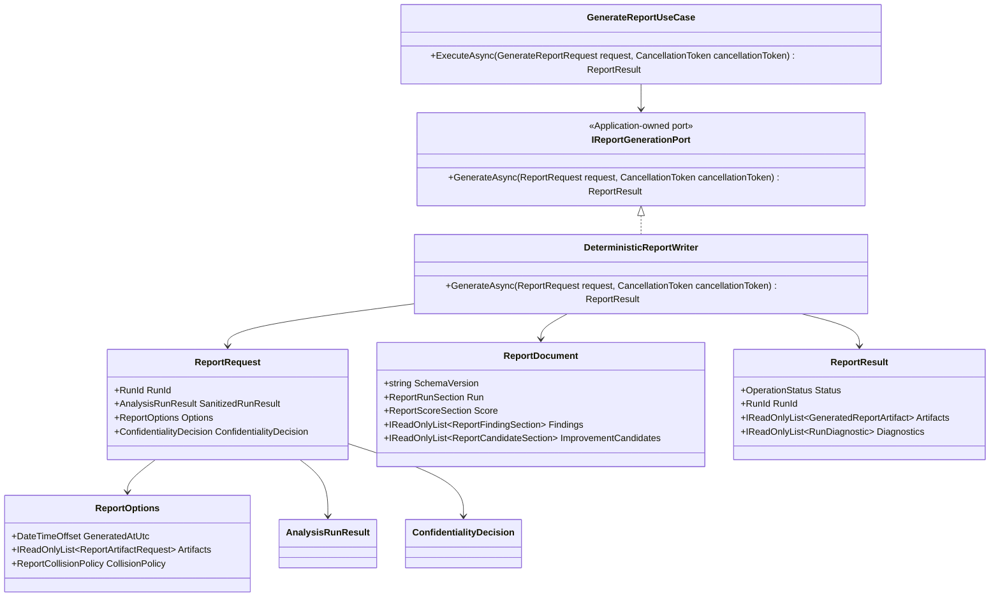

# DES-0012 Report Schema and Deterministic Serialization Detailed Design

This is detailed-design package 5 from [DES-0007](des-0007-detailed-design-execution-strategy.md) section 4, for Issue #23 and module `M10`. It fixes how Surveyor turns the post-policy analysis result into portable JSON and HTML reports without reinterpreting scoring, confidentiality policy, or DTO ownership. It is a prerequisite for review gate #34 and for `UT-0006`, `UT-0007`, and `UT-0010`.

## Purpose And Success Criterion

The purpose is to remove all implementation-time inference from report generation:

- JSON has a versioned schema, explicit property order, stable collection order, and a defined deserialize target for schema/golden validation.
- HTML has a fixed content outline that communicates result summary, risks, candidates, priority basis, unavailable data, diagnostics, and confidentiality handling.
- Serialization is byte-stable for the same sanitized input, fixed report timestamp, fixed options, fresh process, and changed culture.
- Report writes are atomic: cancel, timeout, schema failure, I/O failure, or destination collision leaves no partial final artifact.
- Golden files have a governed regeneration command, semantic-diff review, and approval rule; they protect stated product semantics, not incidental layout.

Implementers should be able to implement `Surveyor.Reports` and its tests by reading this file plus the minimal context bundle in [Downstream Handoff](#downstream-handoff), without redefining `AnalysisRunResult`, `ScoreResult`, or the DES-0013 confidentiality/export contracts.

## Module Coverage

Primary module: `M10 Report Writers`, implemented in `Surveyor.Reports`.

`M10` is an interface-adapter module. It implements the application-owned report-generation port refined by [DES-0011](des-0011-port-dtos-status-model-and-use-case-orchestration.md) as `IReportGenerationPort.GenerateAsync(ReportRequest, CancellationToken)`. This is the detailed-design realization of the [DES-0003](des-0003-module-interface-basic-design.md) `IReportWriter` boundary label.

Layer and dependency rules:

- `Surveyor.Reports` may depend on `Surveyor.Application` and `Surveyor.Domain`, per [DES-0008](des-0008-project-structure-and-test-harness.md).
- `Surveyor.Application` owns `IReportGenerationPort`, `GenerateReportUseCase`, `ReportRequest`, status/diagnostic shape, cancellation, and timeout orchestration.
- `Surveyor.Reports` owns report-specific option fields, the logical report document projection, JSON/HTML serialization, schema validation, byte encoding, and atomic file writes.
- `M10` never calls UIA, capture, WinUI, scoring, confidentiality-policy decision logic, result-store encryption, or export-bundle writing.

Guardrail disposition:

| Guardrail | Disposition |
| -- | -- |
| `RQ-048` read-only | Not target-facing. The writer touches only requested Surveyor output locations and never calls target adapters. |
| `RQ-051` determinism | Primary guardrail. All ordering, formatting, timestamps, encoding, and golden governance are fixed here. |
| `RQ-052` confidentiality | Emits only post-policy content from DES-0013. HTML carries a handling notice; export fallback keys use DES-0013 pseudonyms. |
| `RQ-054` UI-independent core | Writer is UI-independent. HTML preview or WebView2 hosting belongs to `DES-0016`. |

## Scope And Non-Goals

In scope:

- JSON schema version and logical document model for machine-readable report output (`RQ-031`).
- HTML section structure and mandatory content for human-readable report output (`RQ-030`).
- Stable order for properties, arrays, diagnostics, keys, findings, candidates, and generated artifacts.
- Timestamp precision and UTC format.
- Serializer determinism contract: explicit property order, `InvariantCulture`, fixed numeric/date formatting, UTF-8 without BOM, LF newline normalization, final newline rule, and no dependence on process-scoped randomization.
- Atomic report write behavior, destination collision policy, cleanup, and timeout/cancel precedence.
- Golden-file governance (`R-QA-02`) and the semantic properties protected by report goldens.

Non-goals:

- Score calculation, thresholds, classification, candidate generation, or priority computation. These are owned by [DES-0010](des-0010-scoring-classification-and-improvement-candidates.md); this package serializes `ScoreResult` as carried.
- DTO/status/diagnostic shape for the run as a whole. These are owned by [DES-0011](des-0011-port-dtos-status-model-and-use-case-orchestration.md). This package refines only report-specific options, artifacts, and document projection fields needed by `M10`.
- Confidentiality policy decisions, masking dictionaries, fallback-key pseudonym creation, at-rest store encryption/ACLs, and export ZIP bundles. These are owned by [DES-0013](des-0013-confidentiality-storage-and-export.md).
- UI display, HTML preview hosting, navigation, and user consent surfaces. These are owned by `DES-0016`.
- Importing a report back into an `AnalysisRunResult`. JSON deserialize is for schema validation, golden semantic diff, and external machine processing; it is not a lossless reconstruction path to the analysis DTO.

## Trace Block

| Field | Content |
| -- | -- |
| Artifact | `DES-0012`, Report Schema and Deterministic Serialization Detailed Design, detailed design phase |
| Upstream | [DES-0002](des-0002-module-responsibility-basic-design.md) `M10`; [DES-0003](des-0003-module-interface-basic-design.md) `IReportWriter` / `GenerateReportUseCase`; [DES-0004](des-0004-analysis-flow-basic-design.md) Stage 7; [DES-0007](des-0007-detailed-design-execution-strategy.md) package 5, `R-NET-03`, `R-QA-02`; [DES-0008](des-0008-project-structure-and-test-harness.md) `Surveyor.Reports` and golden fixture homes; [DES-0009](des-0009-domain-model-stable-keys-and-availability.md) key/order rules; [DES-0010](des-0010-scoring-classification-and-improvement-candidates.md) `ScoreResult`; [DES-0011](des-0011-port-dtos-status-model-and-use-case-orchestration.md) `AnalysisRunResult`, statuses, diagnostics, `IClock`; [DES-0013](des-0013-confidentiality-storage-and-export.md) sanitized result, masking, fallback-key export policy; `RQ-030`, `RQ-031`, `RQ-051`, `RQ-052`, `RQ-053`, `RQ-054` |
| Downstream | Issue #23; review gate #34; `UT-0006` issue for JSON byte stability/schema/atomicity/cancel; `UT-0007` issue for HTML content/confidentiality; `UT-0010` issue for `IClock` timestamp determinism; future `IMP-0008` report writer implementation; `DES-0016` HTML preview binding |
| Evidence | Report DTO refinement, JSON schema property order, HTML section outline, deterministic serialization rules, atomic write algorithm, contract-closure tables, fixture/golden governance, UT intent and counter-example fixtures, DRP self-review evidence |
| Verification | `tools/okf/Validate-Okf.ps1`; `git diff --check`; future `dotnet test tests/Surveyor.Reports.Tests --filter UT0006`; future `dotnet test tests/Surveyor.Reports.Tests --filter UT0007`; future `dotnet test tests/Surveyor.Application.Tests --filter UT0010` |
| Residual Risk | Actual OS atomic-rename behavior must be smoke-tested on Windows in implementation; final Japanese user-facing labels may be adjusted in `DES-0016`, but section ids/schema fields remain stable; export ZIP byte determinism stays with `DES-0013` |

## Upstream Decisions

Binding upstream inventory:

| Upstream | Decision consumed here | How this package preserves it |
| -- | -- | -- |
| `DES-0002` `M10` | Report writer serializes shared result model to HTML/JSON and must not re-score, re-key, or emit raw pre-policy content. | The report projection copies values from `ReportRequest.SanitizedRunResult`; score/key/policy fields have single upstream writers in [Contract Closure](#contract-closure). |
| `DES-0003` `IReportWriter` | Input is post-policy analysis result plus destination; output is written artifact/result; failures are modeled statuses; cancel/failure leaves no partial artifact. | `IReportGenerationPort.GenerateAsync` uses `ReportRequest`; atomic write and status mapping are fixed below. |
| `DES-0004` Stage 7 | Stage 7 writes HTML + JSON, uses `IClock`, is byte-stable, and presents carried candidates/priority basis without computing priority. | `ReportRequest.Options.GeneratedAtUtc` is supplied by `GenerateReportUseCase` from `IClock`; any caller-side value on `GenerateReportRequest.Options.GeneratedAtUtc` is discarded. `ScoreResult.PriorityBasis` and candidate basis are copied only. |
| `DES-0007` package 5 | JSON schema/version, HTML structure, stable ordering, timestamp format, atomic write, serializer determinism, golden governance. | All are first-class sections in this document. |
| `DES-0007` `R-NET-03` | Explicit property order, `InvariantCulture`, fixed numeric/date format, UTF-8 no BOM, newline normalization. | [Serializer Determinism Contract](#serializer-determinism-contract) is normative. |
| `DES-0007` `R-QA-02` | Golden regeneration command, semantic-diff review, approval. | [Golden-File Governance](#golden-file-governance) is normative. |
| `DES-0009` | Stable keys use SHA-256/ordinal material; fallback keys are marked; `Unavailable(reason)` remains explicit. | Report keys include `isFallback` and `stableAcrossExports`; `Unavailable` is serialized as an availability tag, not a score. |
| `DES-0010` | `ScoreResult` owns config versions, basis-point scores, class, confidence, findings, candidates, and no fabricated priority. | JSON/HTML expose these values without re-rounding or re-classifying; integer basis points are authoritative. |
| `DES-0011` | `AnalysisRunResult` owns run timestamps, outcome, status, stages, diagnostics; cancellation beats timeout. | The writer accepts only `ReportRequest`; it does not call `IClock`; status/diagnostic values use `OperationStatus`. |
| `DES-0013` | `SanitizedRunResult` is the only UI/report input; decision metadata is stamped by policy; fallback export keys are pseudonymized and marked not stable across exports. | Missing/mismatched `ConfidentialityDecision` is `SchemaInvalid`; export-oriented masked JSON uses the same report vocabulary with DES-0013 export keys. |

## Data And Contract Design

### Report Port Realization

`GenerateReportUseCase` builds a `ReportRequest` from the already-sanitized `AnalysisRunResult`. `Surveyor.Reports` implements `IReportGenerationPort`. The writer receives all data as immutable DTOs and does not call `IClock`, scoring services, confidentiality policy, store/export services, or presentation services.

Report-specific refinements below are owned by this package. Implementation public APIs must follow [Coding Standards](../process/coding-standards.md): Japanese XML documentation comments for public APIs (`CS-01`), `internal` default and `sealed` default (`CS-02`), and purpose-first pattern notes if a GoF pattern is used (`CS-04`).

```csharp
namespace Surveyor.Application.Dto;

public sealed record ReportOptions(
    DateTimeOffset GeneratedAtUtc,
    IReadOnlyList<ReportArtifactRequest> Artifacts,
    ReportCollisionPolicy CollisionPolicy);

public sealed record ReportArtifactRequest(
    ReportFormat Format,
    ReportDestination Destination);

public sealed record ReportDestination(
    string AbsolutePathForWrite);

public sealed record ReportResult(
    OperationStatus Status,
    RunId RunId,
    IReadOnlyList<GeneratedReportArtifact> Artifacts,
    IReadOnlyList<RunDiagnostic> Diagnostics);

public sealed record GeneratedReportArtifact(
    ReportFormat Format,
    SafeArtifactReference Reference,
    string SchemaVersion,
    string ContentSha256Hex);

public enum ReportFormat { Json, Html }

public enum ReportCollisionPolicy { FailIfDestinationExists }
```

Rules:

- `ReportOptions` appears on both DES-0011 request shapes. In caller-supplied `GenerateReportRequest.Options`, `GeneratedAtUtc` is not semantic input; callers set it to `default`, and `GenerateReportUseCase` ignores any non-default value. The use case copies only `Artifacts` and `CollisionPolicy`, reads `IClock.UtcNow`, and builds a new `ReportOptions` for `ReportRequest.Options` with that clock value. The port implementation must not read ambient time.
- `ReportDestination.AbsolutePathForWrite` is input-only command data. It must not appear in JSON, HTML, diagnostics, logs, manifests, or `SafeArtifactReference.RelativeSafePath`.
- V1 supports only `FailIfDestinationExists`. Silent overwrite is prohibited. If overwrite support is ever added, it is a new enum value with its own edge-case and golden tests.
- `ReportResult.Artifacts` is sorted by `ReportFormat` enum order (`Json`, then `Html`) regardless of request order.
- `SafeArtifactReference.Kind` is `ArtifactKind.Report`; `IsProtected` and `IsShareableExport` are derived from the active confidentiality/export path, not from destination path text.

### Logical Report Document

The JSON writer and HTML renderer both consume the same logical `ReportDocument` projection. This projection is one-way from `ReportRequest`; it is not a replacement for `AnalysisRunResult`.

```csharp
namespace Surveyor.Reports.Model;

internal sealed record ReportDocument(
    string SchemaVersion,
    string DocumentKind,
    ReportRunSection Run,
    ReportConfidentialitySection Confidentiality,
    ReportScreenSection Screen,
    ReportScoreSection Score,
    IReadOnlyList<ReportAxisSection> Axes,
    IReadOnlyList<ReportFindingSection> Findings,
    IReadOnlyList<ReportCandidateSection> ImprovementCandidates,
    IReadOnlyList<ReportStageSection> Stages,
    IReadOnlyList<ReportDiagnosticSection> Diagnostics,
    ReportSerializationSection Serialization);
```

Normative constants:

| Field | Value |
| -- | -- |
| `SchemaVersion` | `surveyor.report.v1` |
| `DocumentKind` | `SurveyorAnalysisReport` |
| JSON file extension | `.json` |
| HTML file extension | `.html` |
| JSON media type | `application/vnd.surveyor.report+json;version=1` |
| HTML media type | `text/html;charset=utf-8` |

### JSON Schema

The JSON schema is versioned by the top-level `schemaVersion`. V1 property names are lower camel case ASCII and are emitted in the exact order below. The schema file is generated and validated in tests from this table; the implementation must not depend on reflection order.

Top-level order:

| Order | Property | Type | Source |
| --: | -- | -- | -- |
| 1 | `schemaVersion` | string const | `M10` |
| 2 | `documentKind` | string const | `M10` |
| 3 | `run` | object | `DES-0011 AnalysisRunResult` |
| 4 | `confidentiality` | object | `DES-0013 ConfidentialityDecision` |
| 5 | `screen` | object | `DES-0011 AnalysisRunResult.ScreenModel` / `DES-0009` |
| 6 | `score` | object | `DES-0010 ScoreResult` |
| 7 | `axes` | array | `DES-0010 ScoreResult.AxisScores` |
| 8 | `findings` | array | `DES-0010 ScoreResult.Findings` |
| 9 | `improvementCandidates` | array | `DES-0010 ScoreResult.ImprovementCandidates` |
| 10 | `stages` | array | `DES-0011 AnalysisRunResult.Stages` |
| 11 | `diagnostics` | array | `DES-0011 RunDiagnostic`, sanitized by `DES-0013` |
| 12 | `serialization` | object | `M10` |

Required nested fields:

| Object | Property order |
| -- | -- |
| `run` | `runId`, `outcome`, `startedAtUtc`, `completedAtUtc`, `generatedAtUtc`, `targetSafeId`, `screenSelectionMetadataPresent` |
| `confidentiality` | `mode`, `policyVersion`, `decidedAtUtc`, `decisionSource`, `optOutReasonCode`, `appliedTransforms`, `handlingNoticeCode` |
| `screen` | `screenKey`, `keyVersion`, `isFallback`, `stableAcrossExports`, `elementCount`, `unavailableElementCount`, `availabilitySummary` |
| `score` | `screenKey`, `scoringConfigVersion`, `candidateRulesVersion`, `aggregateScoreBp`, `aggregateScorePercentText`, `testabilityClass`, `confidence`, `priorityBasis` |
| `axes[]` | `axis`, `applicability`, `scoreBp`, `scorePercentText`, `confidence`, `findingIds`, `evidenceCodes` |
| `findings[]` | `id`, `code`, `axis`, `rootCause`, `severity`, `elementKey`, `availability`, `acquisitionConfidence`, `relatedFindingIds`, `recommendationCode` |
| `improvementCandidates[]` | `id`, `code`, `rootCause`, `primaryAxis`, `targetElementKey`, `affectedElementCount`, `expectedEffect`, `sourceFindingIds`, `scope`, `userSuppliedPriorityBasis` |
| `stages[]` | `stage`, `status`, `timeoutBudgetMs`, `diagnosticCodes` |
| `diagnostics[]` | `stage`, `severity`, `code`, `status`, `elementKey`, `safeArgs` |
| `serialization` | `schemaVersion`, `serializerVersion`, `timestampFormat`, `encoding`, `newline`, `propertyOrder`, `contentHashAlgorithm` |

Null/empty rules:

- Optional object fields are emitted with `null` when absent and semantically meaningful, for example `score.priorityBasis`, `candidate.targetElementKey`, and `axis.scoreBp`.
- Collections are emitted as empty arrays, never `null`.
- `Unavailable` remains an explicit string/status object. It is never serialized as score `0`, empty evidence, or omitted data.
- No raw display label, window title, UI text value, screenshot pixel data, absolute file path, or raw exception message appears in DES-0012 report artifacts. Canonical fallback tokens may appear only in a protected-local report when DES-0013 allows that protected-local path; shareable export JSON never contains canonical fallback tokens.

### HTML Structure

HTML is a portable human-readable report. V1 is static HTML with inline deterministic CSS and no JavaScript, no external resources, no data URIs for screenshots, and no ambient-culture localization. User-facing labels are fixed strings owned by `Surveyor.Reports`; later UI wording changes must not rename section ids.

Required outline:

| Order | Element | Required content |
| --: | -- | -- |
| 1 | `<!doctype html>` | Lowercase doctype. |
| 2 | `<html lang="ja">` | Fixed language for v1 report labels. |
| 3 | `<head>` | UTF-8 meta tag, fixed title, deterministic inline CSS. |
| 4 | `<body data-schema-version="surveyor.report.v1">` | Schema marker for tests and external parsers. |
| 5 | `section#summary` | Run id, outcome, class, aggregate basis-point score, generated UTC timestamp. |
| 6 | `section#confidentiality` | Handling notice, policy version, mode, applied transforms, fallback-key stability note when applicable. |
| 7 | `section#score` | Aggregate score, class, confidence, config version, candidate rules version, priority-basis presence. |
| 8 | `section#axes` | Axis table with applicability, score, confidence, evidence codes. |
| 9 | `section#findings` | Findings sorted by stable order with recommendation codes and `Unavailable` markers. |
| 10 | `section#improvement-candidates` | Candidate codes, affected counts, expected effects, source finding ids, user-supplied priority basis as carried. |
| 11 | `section#screen-inventory` | Screen key, fallback/stability flags, element/unavailable counts, availability summary. |
| 12 | `section#partial-and-unavailable` | Partial-result, timeout, permission, capture, and `Unavailable(reason)` notes. |
| 13 | `section#diagnostics` | Sanitized diagnostic code/status table only. |
| 14 | `section#metadata` | Schema version, serializer version, timestamp format, encoding, newline rule, content hash algorithm. |

HTML escaping rules:

- All dynamic text is HTML-escaped using ordinal code-point processing.
- Safe enum names and safe keys are emitted as text nodes, not raw HTML.
- Diagnostic `SafeArgs` are allowlisted by DES-0011/DES-0013; any unexpected string-like arg is replaced by a safe placeholder diagnostic before rendering.
- The HTML writer does not embed screenshots in v1. Redacted export images are owned by DES-0013; HTML may link only through safe artifact references if a future profile explicitly adds them.

## Contract Closure

### I/O Derivation Table

| Contract/output | Required input | Derivation source | Output consumer | Closure rule |
| -- | -- | -- | -- | -- |
| `GenerateReportUseCase.ExecuteAsync` input `RunResult` | Post-policy `AnalysisRunResult` | `PolicyApplicationResult.SanitizedRunResult` from DES-0013, returned by DES-0011 analysis orchestration | `GenerateReportUseCase` | Must have non-null `ConfidentialityDecision`; otherwise report command returns `SchemaInvalid` and writes nothing. |
| `GenerateReportUseCase.ExecuteAsync` input `Options.Artifacts` / `Options.CollisionPolicy` | Requested formats, destinations, collision policy | Caller-provided `GenerateReportRequest.Options` from presentation/application command | `GenerateReportUseCase` | Only these fields are copied from caller options into the port request. |
| `GenerateReportUseCase.ExecuteAsync` input `Options.GeneratedAtUtc` | None; non-semantic placeholder on the caller-side DTO | Caller may pass `default` or any value, but the use case discards it | None | This value must not affect report bytes, diagnostics, or artifact metadata. `UT-0010` uses a non-default caller value counter-example. |
| `ReportRequest.Options.GeneratedAtUtc` | Current UTC instant | `IClock.UtcNow` from DES-0011, read by the use case before building `ReportRequest` | `IReportGenerationPort` and JSON/HTML `generatedAtUtc` | Writer must not read ambient time; caller-side timestamp values cannot flow here. |
| `IReportGenerationPort.GenerateAsync` input `ReportRequest.RunId` | Run identity | `AnalysisRunResult.RunId` from DES-0011 | `M10` writer | Must equal `SanitizedRunResult.RunId`; mismatch is `SchemaInvalid`. |
| `IReportGenerationPort.GenerateAsync` input `SanitizedRunResult` | Report data | DES-0011 `AnalysisRunResult`, after DES-0013 policy application | JSON/HTML projection | Writer treats it as read-only and never calls policy again. |
| `IReportGenerationPort.GenerateAsync` input `ConfidentialityDecision` | Policy metadata | DES-0013 stamped decision | JSON/HTML confidentiality section | Must equal `SanitizedRunResult.ConfidentialityDecision`; mismatch is `SchemaInvalid`. |
| JSON artifact bytes | `ReportDocument`, JSON destination, schema constants, serialization rules | `ReportDocument` projected from DES-0011/0010/0013 inputs plus M10 constants | External tools, CI comparison, optional DES-0013 protected report blob | Rendered through explicit writer order; schema-readback must pass before final move. |
| HTML artifact bytes | `ReportDocument`, HTML destination, required section outline, serialization rules | Same `ReportDocument` projected from DES-0011/0010/0013 inputs plus M10 fixed labels/notices | Human readers, `DES-0016` preview host, optional DES-0013 protected report blob | Rendered from the same post-policy document as JSON; semantic parser must find required sections before golden approval. |
| JSON `run` object | Run id, timestamps, outcome, target safe id, metadata-presence flag | DES-0011 `AnalysisRunResult`; generated timestamp from `ReportRequest.Options.GeneratedAtUtc`; `targetSafeId` from `AnalysisRunResult.Target.SessionTargetId` | External tools, CI comparison, store/export manifests | `SessionTargetId` must be the DES-0011 opaque safe id and pass the report safe-id pattern (`[A-Za-z0-9._:-]+`, no path separators, no whitespace). `SafeDisplayHint` is display-only and must not be serialized as `targetSafeId`. |
| JSON `score`, `axes`, `findings`, `improvementCandidates` | `ScoreResult` and nested fields | DES-0010 `ScoreResult` carried inside DES-0011 `AnalysisRunResult` | External tools, HTML renderer, golden semantic diff | Copy only; no scoring, rounding, classification, priority sorting, or candidate generation. |
| JSON/HTML key fields | `ScreenKey`, `ElementKey`, `IsFallback`, key version | DES-0009 values carried by DES-0011 `ScreenModel`/`ScoreResult`; DES-0013 export pseudonyms for shareable export | External comparison (`RQ-053`) | Non-fallback keys may be stable; fallback export keys are pseudonyms with `stableAcrossExports=false`. |
| JSON/HTML confidentiality notice | Mode, policy version, transforms, fallback stability | DES-0013 `ConfidentialityDecision` and export-key policy | Human readers, external recipients | Notice is mandatory for every HTML report and present in JSON as `handlingNoticeCode`. |
| JSON/HTML diagnostics | Sanitized diagnostic facts | DES-0011 diagnostic shape, sanitized by DES-0013 | Human readers, CI parsers | Safe codes/status/counts only; no raw exception/path/title/name. |
| `ReportResult.Artifacts` | Successful final artifact refs and content hashes | M10 atomic writer after final move | `GenerateReportUseCase`, UI/store handoff | Sorted by format; references are safe, never raw absolute paths. |
| `StoredReportDocument` optional payload | Generated local report document(s) | DES-0013 store receives protected model; M10 can provide report document bytes as `StoredReportArtifactDocument` | `M12` protected local store | Stored report bytes are optional, protected-local only, and never reused as `MaskedExportModel.Documents`. Load does not reconstruct `AnalysisRunResult` from them. |

No output row above requires data outside DES-0011 `AnalysisRunResult`, DES-0010 `ScoreResult`, DES-0013 sanitized/masked policy outputs, report command options, or the writer's own constants. This closes the `DRP-03` data-flow hole for JSON and HTML.

### Round-Trip Inventory

| Pair | Forward direction | Reverse direction | Symmetric type/semantics | Failure semantics |
| -- | -- | -- | -- | -- |
| JSON serialize/deserialize | `ReportDocument` -> UTF-8 JSON bytes using `ReportJsonWriter` | UTF-8 JSON bytes -> `ReportDocument` using `ReportJsonReader` for schema/golden validation | Same `ReportDocument` schema version and property vocabulary. It is not an `AnalysisRunResult` loader. | Unknown schema, missing required fields, wrong order in strict golden mode, or invalid enum -> `SchemaInvalid`; no artifact write. |
| JSON schema validation | `ReportDocument` -> JSON bytes -> v1 schema validator | Validator returns normalized semantic tree for diff | Schema vocabulary comes from this document. | Validation failure is `SchemaInvalid` and temp file cleanup. |
| HTML render/semantic parse | `ReportDocument` -> HTML bytes | Test-only semantic parser extracts required section ids and normalized table facts | One-way render; parser is a UT oracle, not application load. | Missing required section/notice or raw sensitive token fixture -> failing `UT-0007`. |
| Local protected report persistence | M10-generated `ReportDocument` bytes may be included in DES-0013 `StoredReportDocument.Documents` as `StoredReportArtifactDocument` | DES-0013 load returns `StoredRunSnapshot.Report` as optional stored report document; it does not recompute reports or analysis | `StoredReportArtifactDocument` uses the same `schemaVersion` and report document vocabulary. It may contain canonical fallback keys only inside the protected local blob when DES-0013 allows that. | Missing/corrupt optional report blob yields DES-0013 partial snapshot/diagnostic, not regenerated report. |
| Masked export symmetry | `StoredRunSnapshot` -> DES-0013 `MaskedExportModel.Documents` as `MaskedReportDocument` using DES-0012 report vocabulary | External consumer reads `result.masked.json` as `ReportDocument` v1 with masked/export keys | `MaskedReportDocument` is shareable-export only. It must not contain canonical fallback keys; fallback keys are export-local pseudonyms and `stableAcrossExports=false`. | Missing masking dictionary for fallback export is DES-0013 `IoError`; M10 never substitutes canonical fallback tokens. |
| Atomic file write | Render complete bytes -> temp file -> final move | Test fake reads final path only after success | Final artifact bytes equal rendered bytes; temp path is not semantic state. | Cancel/timeout/schema/I/O/collision leaves no final partial file; temp cleanup best effort with safe diagnostic only. |

### Field Ownership Table

| Field/value | Single writer | Write timing | Sync/fabrication rule |
| -- | -- | -- | -- |
| `ReportDocument.schemaVersion` | M10 report writer | Projection creation | Constant `surveyor.report.v1`; must match schema file, JSON, HTML `data-schema-version`, and goldens. |
| `serializerVersion` | M10 report writer | Projection creation | Constant for writer behavior, starts `report-writer-v1`; changing byte behavior requires golden governance. |
| `generatedAtUtc` | `GenerateReportUseCase` via DES-0011 `IClock` | Before `ReportRequest` is created | Caller-side `GenerateReportRequest.Options.GeneratedAtUtc` is discarded. M10 copies `ReportRequest.Options.GeneratedAtUtc` only; no `DateTime.Now`, `UtcNow`, or local time in writer. |
| `startedAtUtc`, `completedAtUtc` | DES-0011 `AnalyzeScreenUseCase` via `IClock` | Result assembly | M10 formats only; never edits run timestamps. |
| `runId` | DES-0011 `AnalysisRunResult` writer | Result assembly | `ReportRequest.RunId` must equal `SanitizedRunResult.RunId`; mismatch fails. |
| `targetSafeId` | DES-0011 `TargetReference.SessionTargetId` writer | Target discovery/selection before analysis request | M10 copies only after validating the safe-id pattern. `SafeDisplayHint` is optional display text and must not be used as `targetSafeId`, key material, path material, or ordering material. |
| `ConfidentialityDecision` fields | DES-0013 `IConfidentialityPolicy.Apply` or export decision path | Policy application/export sanitization | M10 copies; missing/mismatch fails; no default decision fabrication. |
| `ScoreResult.ConfigVersion` | DES-0010 scoring config resolver/scorer | Scoring stage | M10 copies to `score.scoringConfigVersion`; never resolves config. |
| `ScoreResult.CandidateRulesVersion` | DES-0010 scorer | Scoring stage | M10 copies to `score.candidateRulesVersion`; never chooses candidate rules. |
| `AggregateScoreBp`, `AxisScore.ScoreBp` | DES-0010 scorer | Scoring stage | Integer basis points are authoritative. M10 may derive fixed text percent only from bp. |
| `AggregateScorePercentText`, `AxisScore.scorePercentText` | M10 report projection | Projection creation | Derived from integer bp using `InvariantCulture` and `F2`; display-only. If `ScoreBp` is null, text is null. |
| `TestabilityClass`, `Confidence` | DES-0010 scorer | Scoring stage | M10 copies enum names; no reclassification. |
| `PriorityBasis` | DES-0010 copies from DES-0011 `ScreenSelectionMetadata` | Scoring stage | M10 copies presence and fields; it must not rank, weight, or synthesize priority. |
| `screen.screenKey` and `score.screenKey` | DES-0009 domain model for `ScreenModel.Key`; DES-0010 scorer copies the same key into `ScoreResult.ScreenKey` | Model construction and scoring stage | Report projection must validate `SanitizedRunResult.ScreenModel.Key == SanitizedRunResult.ScoreResult.ScreenKey` before writing. Mismatch is `SchemaInvalid`; M10 must not choose one side or rewrite either value. |
| `ScreenKey`/`ElementKey` canonical value and `IsFallback` | DES-0009 domain model, with DES-0013 export pseudonym substitution for shareable export | Model construction or export sanitization | Local protected reports may carry canonical safe keys as allowed by DES-0013; shareable exports must use export pseudonyms for fallback keys and mark `stableAcrossExports=false`. |
| `Unavailable(reason)` | DES-0009/0011 acquisition and domain model | Acquisition/model construction | M10 serializes explicit reason; never converts to score zero or omission. |
| `Diagnostics.safeArgs` | DES-0011 diagnostic builder, sanitized by DES-0013 | Stage completion / policy application | M10 copies allowlisted values; unknown unsafe args are dropped with a safe writer diagnostic. |
| `ContentSha256Hex` | M10 atomic writer | After bytes are rendered and before final result is returned | SHA-256 over exact UTF-8 bytes; lowercase hex; used only in `ReportResult`, not as ordering source. |
| Temp file path | M10 atomic writer | During write | Not serialized, logged, or returned. It can be deterministic from run id/format/attempt but is not semantic output. |

## Algorithm Or Rule Design

### Serializer Determinism Contract

Normative rules for `RQ-051` and `R-NET-03`:

| Area | Rule |
| -- | -- |
| Property order | Every JSON object is written with explicit writer calls in the order specified in this document. Reflection order and serializer default property order are prohibited. |
| Collection order | Arrays are sorted or copied by explicit stable rules below. `Dictionary`/`HashSet` iteration order is prohibited. |
| String comparison | All sorting/tie-breaks use `StringComparer.Ordinal` / `StringComparison.Ordinal`. |
| Culture | Formatting/parsing uses `CultureInfo.InvariantCulture`. Ambient current culture must not affect bytes. |
| Numeric format | Machine decision values use integer basis points. Display percentages are strings from `bp / 100m` formatted as `0.00` with invariant culture. No `double` in decision or serialization paths. |
| Timestamp format | UTC only, exactly `yyyy-MM-dd'T'HH:mm:ss.fffffff'Z'`, after `DateTimeOffset.ToUniversalTime()`. Offsets other than UTC are normalized, not preserved. |
| Encoding | UTF-8 without BOM. |
| Newlines | Serializer normalizes every newline to LF (`\n`); final JSON and HTML files end with exactly one LF. |
| Whitespace | JSON pretty print uses two spaces, no tabs, no trailing spaces. HTML uses deterministic indentation, no trailing spaces. |
| Hash/randomness | Ordering, keys, tie-breaks, and output content never use `Object.GetHashCode()`, `string.GetHashCode()`, process random salt, GUID generation, arrival order, or filesystem enumeration order. |
| Process/culture proof | `UT-0006` runs at least one equality check in a fresh process and one under a non-default culture such as `tr-TR`. |

### Stable Ordering

| Data | Order |
| -- | -- |
| Requested artifacts | Emit/write/result order by `ReportFormat`: `Json`, then `Html`. |
| `Axes` | Fixed DES-0010 `ScoreAxis` enum order. |
| `Findings` | `FindingSeverity` (`Blocking`, `Warning`, `Info`), DES-0010 `ScoreAxis` order, `FindingCode` ordinal, then `Id` ordinal. |
| `ImprovementCandidates` | DES-0010 order: `Code` ordinal, `Scope`, `TargetElementKey` ordinal with null last, then `Id` ordinal. |
| `SourceFindingIds`, `RelatedFindingIds`, `FindingIds`, `EvidenceCodes`, `AppliedTransforms` | Ordinal ascending unless upstream order is already declared semantic. Duplicates are rejected as `SchemaInvalid`. |
| `Stages` | DES-0011 `RunStage` enum order. |
| `Diagnostics` | DES-0011 order: `RunStage`, severity (`Error`, `Warning`, `Info`), `Code` ordinal, `ElementKey` ordinal with null last. |
| `AvailabilitySummary` | `UnavailableReason` enum order. |
| HTML tables | Same order as corresponding JSON arrays. |

These ordering rules present and serialize facts. They do not compute score, priority, class, or root-cause de-duplication.

### Projection And Write Pseudocode

```text
GenerateAsync(request, token):
  validate request is non-null
  validate request.RunId == request.SanitizedRunResult.RunId
  validate request.ConfidentialityDecision == request.SanitizedRunResult.ConfidentialityDecision
  validate request.SanitizedRunResult.ScreenModel is non-null
  validate request.SanitizedRunResult.ScoreResult is non-null
  validate request.SanitizedRunResult.ScreenModel.Key == request.SanitizedRunResult.ScoreResult.ScreenKey
  validate request.SanitizedRunResult.Target.SessionTargetId is a safe opaque id
  validate requested artifacts are non-empty and have unique formats
  validate every destination is input-only and outside diagnostics

  token.ThrowIfCancellationRequested()
  document = ProjectReportDocument(request)
  ValidateReportDocument(document)       // no raw unsafe fields, required sections, schema invariants

  for format in requested formats ordered by ReportFormat:
    bytes = Render(format, document)      // UTF-8 no BOM, LF, final LF
    if format == Json:
      Deserialize bytes to ReportDocument and validate schema
    AtomicWrite(destination, bytes, token)
    artifact = safe reference + SHA-256(bytes)

  return ReportResult(Ok, runId, artifacts, diagnostics)
```

### Atomic Write Algorithm

The writer uses a same-directory temp file and a final move with overwrite disabled.

1. Normalize and validate destination extension for the requested format.
2. If the final destination exists and `CollisionPolicy == FailIfDestinationExists`, return `IoError` before creating the final artifact.
3. Choose a temp path in the destination directory using only safe material: final file name, run id, format, and an ordinal attempt counter. The temp name is not logged or returned.
4. Create the temp file with exclusive create. If attempts are exhausted, return `IoError`.
5. Write the complete byte buffer; flush and close the stream.
6. Observe cancellation before final move. If canceled, delete temp best effort and propagate cancellation to the use case.
7. Move/rename temp to final with overwrite disabled. If the destination appears between the pre-check and move, return `IoError` and delete temp best effort.
8. On timeout signaled by DES-0011 timeout controller, return `Timeout` and delete temp best effort.
9. On expected I/O/schema failures, return `IoError` or `SchemaInvalid` as appropriate and delete temp best effort.
10. Temp cleanup failure is a sanitized warning diagnostic; it must not turn a successful final move into failure.

Cancellation-vs-timeout precedence follows DES-0011: caller cancellation wins when both are observed. `M10` does not implement a separate timer; it observes the caller token and receives timeout orchestration from `GenerateReportUseCase`.

### Confidentiality Branches

| Mode/path | Report behavior |
| -- | -- |
| `ProtectedLocal` | JSON/HTML use `SanitizedRunResult`; HTML includes handling notice; local protected stored reports use DES-0013 `StoredReportArtifactDocument` and may include canonical fallback keys only inside protected local storage when DES-0013 allows that. |
| `MaskedShareableExport` | JSON vocabulary is the same, but content is from DES-0013 `MaskedExportModel.Documents` as `MaskedReportDocument`; fallback keys are export-local pseudonyms and `stableAcrossExports=false`; canonical fallback keys and the reverse masking dictionary are never included. |
| `ExplicitLocalOptOut` | Allowed only when DES-0013 decision records it. HTML notice must show opt-out mode and reason code; tests assert it is never the default. |
| Missing decision | `SchemaInvalid`; no artifact. |
| Decision mismatch | `SchemaInvalid`; no artifact. |

## Mermaid UML



```mermaid
sequenceDiagram
  participant UI as Presentation
  participant GR as GenerateReportUseCase
  participant Clock as IClock
  participant RW as IReportGenerationPort
  participant FS as File system

  UI->>GR: GenerateReportRequest(SanitizedRunResult, requested artifacts)
  GR->>Clock: UtcNow
  Clock-->>GR: GeneratedAtUtc
  GR->>GR: Build ReportRequest; verify decision is present
  GR->>RW: GenerateAsync(ReportRequest, caller token)
  RW->>RW: Project ReportDocument
  RW->>RW: Render JSON/HTML deterministic bytes
  RW->>FS: Write temp, flush, move overwrite=false
  FS-->>RW: final artifact(s)
  RW-->>GR: ReportResult
  GR-->>UI: ReportResult
```

## Edge-Case Table

| Edge case | Expected behavior | Guardrail / test |
| -- | -- | -- |
| Caller cancellation before rendering | No temp or final artifact; cancellation propagates to use case boundary. | `UT-0006`; DES-0011 cancel semantics |
| Caller cancellation after temp write before final move | Temp deleted best effort; no final artifact; cancellation wins over timeout. | `UT-0006`; `DRP-08` |
| Timeout and cancellation both observed | Caller cancellation wins. No final artifact. | `UT-0006`; DES-0011 race rule |
| Timeout without caller cancellation | `ReportResult.Status = Timeout`; temp cleanup best effort; no final partial. | `UT-0006` |
| Destination exists | `IoError`; no overwrite; existing file bytes unchanged; temp cleanup. | `UT-0006` |
| Destination appears between pre-check and move | Move fails as `IoError`; existing file unchanged; temp cleanup. | `UT-0006` fake filesystem |
| JSON schema validation fails after rendering | `SchemaInvalid`; no final artifact; diagnostic uses safe schema code. | `UT-0006` |
| Requested JSON and HTML, JSON succeeds then HTML fails | V1 treats the command as all-or-none: already written final JSON is deleted best effort before returning failure; if deletion fails, report `IoError` with safe diagnostic. | `UT-0006` |
| `ScreenModel` or `ScoreResult` is null for a failed/cancelled result that still reaches report command | `SchemaInvalid`; report command is not valid unless a useful post-policy screen and score are both present. The null checks run before the duplicated `screenKey` equality check. | `UT-0006` |
| `Unavailable(reason)` in model/score | JSON/HTML preserve reason and unknown score null; never serialize as low score. | `UT-0006`, `UT-0007`, `RQ-051` |
| Missing `ConfidentialityDecision` | `SchemaInvalid`; no artifact. | `UT-0007`; DES-0013 decision consistency |
| `ProtectedLocal` report | Mandatory handling notice; post-policy content only. | `UT-0007`, `RQ-052` |
| `MaskedShareableExport` report JSON | Fallback keys are export-local pseudonyms, `isFallback=true`, `stableAcrossExports=false`; no canonical fallback token. | `UT-0007`, `UT-0008` linkage |
| `ExplicitLocalOptOut` | Notice includes opt-out mode and reason code; no silent default. | `UT-0007` |
| Raw window title/name/path appears in input diagnostic by bug | Writer drops unsafe arg, emits safe diagnostic, and fails schema validation for known raw-sensitive test fixture. | `UT-0007`, `RQ-052` |
| Current culture changed to `tr-TR` | JSON/HTML bytes identical to invariant baseline. | `UT-0006`, `UT-0010` |
| Fresh process | JSON bytes identical to baseline for same fixture and fixed clock. | `UT-0006` |

## Diagnostics And Logging

The report writer emits diagnostics through the DES-0011 `RunDiagnostic` shape. It does not write logs with raw report content.

Allowed diagnostic content:

- `RunStage.ReportGeneration`
- `OperationStatus` enum values
- report diagnostic codes from the closed set below
- artifact format enum (`Json`, `Html`)
- schema version, serializer version, counts, timeout budget in milliseconds
- safe run id, safe artifact id, safe key or export pseudonym
- safe `HResult` numeric value when an expected I/O exception is mapped

Closed writer diagnostic codes:

| Code | Status | Safe args |
| -- | -- | -- |
| `ReportSchemaInvalid` | `SchemaInvalid` | schema version, property name/code, format |
| `ReportConfidentialityDecisionMissing` | `SchemaInvalid` | run id |
| `ReportConfidentialityDecisionMismatch` | `SchemaInvalid` | run id |
| `ReportDestinationExists` | `IoError` | format, safe artifact id |
| `ReportWriteIoError` | `IoError` | format, `HResult`, safe artifact id |
| `ReportTimeout` | `Timeout` | format, timeout budget ms |
| `ReportCancelled` | `Cancelled` | format |
| `ReportTempCleanupFailed` | `IoError` warning | format, safe artifact id, `HResult` |
| `ReportUnsafeDiagnosticArgDropped` | `PartialResult` warning | original diagnostic code, arg kind |

Prohibited content:

- absolute destination path or temp path
- target process path, window title, element `Name`, display/value text
- screenshot bytes or derived OCR text
- raw exception message or stack trace
- canonical fallback token in shareable export
- serialized JSON/HTML body in diagnostic details

## Fixture Strategy

Fixtures live under the DES-0008 test layout:

```text
tests/fixtures/reports/des-0012/
  input/
    happy-path-post-policy-run.json
    unavailable-and-partial-run.json
    masked-export-fallback-run.json
    explicit-local-opt-out-run.json
    unsafe-diagnostic-arg-run.json
  counterexamples/
    dictionary-order-dependent-writer.json
    culture-sensitive-percent-writer.json
    ambient-clock-writer.json
    missing-confidentiality-notice.html
    raw-window-title-leak.html
    unavailable-as-zero-score.json
    destination-overwrite.fakefs.json
    cancel-after-temp-write.fakefs.json
  golden/
    report-v1.happy.json
    report-v1.happy.html
    report-v1.unavailable.json
    report-v1.unavailable.html
    report-v1.masked-export.json
```

### Golden-File Governance

The following rules are normative for every report golden change:

| Rule | Requirement |
| -- | -- |
| Regeneration command | `pwsh -NoProfile -File .\tools\reports\Update-GoldenReports.ps1 -FixtureSet des-0012-v1` |
| Semantic diff command | `pwsh -NoProfile -File .\tools\reports\Compare-ReportSemantics.ps1 -Baseline .\tests\fixtures\reports\des-0012\golden -Candidate .\artifacts\golden-candidates\des-0012` |
| Review evidence | PR includes the semantic diff summary, reason for golden change, and affected `RQ`/`DES` IDs. |
| Approval | A reviewer must approve the semantic diff. Goldens are never regenerated merely because a red test appeared. |
| Storage | Golden files are UTF-8 without BOM, LF-normalized, and committed under `tests/fixtures/reports/des-0012/golden/`. |

Goldens protect these semantic properties:

| Property | Protected by |
| -- | -- |
| Stable property and collection order | JSON byte golden plus semantic diff order assertions |
| Schema shape/version | JSON schema validation and top-level/nested property list |
| Confidentiality notice | HTML `section#confidentiality` and JSON `handlingNoticeCode` |
| Masked/post-policy content | Known raw-sensitive strings absent; pseudonym/export-key expectations present |
| Atomic write behavior | Fake filesystem counter-example fixtures; final path bytes checked only after success |
| `Unavailable` preservation | Golden contains explicit `Unavailable(reason)` and null score where applicable |
| Timestamp determinism | Fixed clock expected `generatedAtUtc` and format |

## Unit-Test Intent

`UT-0006`, `UT-0007`, and `UT-0010` are behavior tests. Each behavior carries at least one counter-example fixture as required by `R-QA-01`.

| UT | Behavior | Risk guarded | Fixture / counter-example | Oracle | Test smell avoided |
| -- | -- | -- | -- | -- | -- |
| `UT-0006` | JSON is byte-stable across same process, fresh process, and changed culture | `.NET` randomization, dictionary order, ambient culture, reflection property order break `RQ-051` | `happy-path-post-policy-run.json`; counterexamples `dictionary-order-dependent-writer.json`, `culture-sensitive-percent-writer.json` | Exact UTF-8 bytes equal golden; repeat in fresh process and `tr-TR` culture | Snapshotting arbitrary JSON only in one process/culture |
| `UT-0006` | JSON validates against v1 schema and required property order | Consumers cannot rely on machine-readable output | `unavailable-and-partial-run.json`; counterexample `unavailable-as-zero-score.json` | Schema validator accepts good fixture; rejects missing `schemaVersion`, wrong property order in strict mode, or `Unavailable` collapsed to score zero | Checking only file existence |
| `UT-0006` | Cancellation/failure leaves no partial artifact | Report command leaks corrupt output | `cancel-after-temp-write.fakefs.json` | Final path absent/unchanged; temp cleanup attempted; status/cancel cause correct | Testing happy path only |
| `UT-0006` | Destination collision does not overwrite | Existing user artifact lost | `destination-overwrite.fakefs.json` | Existing bytes unchanged; result `IoError`; no raw path in diagnostics | Allowing overwrite in test setup |
| `UT-0006` | Multi-format command is all-or-none | JSON final remains after HTML failure | fake filesystem write-fail-on-html fixture | No final JSON/HTML after failure except safe cleanup diagnostic if delete fails | Treating formats as unrelated commands |
| `UT-0007` | HTML contains mandatory sections and carried score/candidate facts | Human report omits required meaning (`RQ-030`) | `happy-path-post-policy-run.json`; counterexample `missing-confidentiality-notice.html` | Semantic parser finds every section id and expected class/candidate/config values | Golden layout diff without meaning checks |
| `UT-0007` | Confidentiality notice appears for every mode | Shared HTML lacks handling warning (`RQ-052`) | `masked-export-fallback-run.json`, `explicit-local-opt-out-run.json`; counterexample notice removed | Notice section contains mode, policy version, fallback stability note when needed | Testing only default mode |
| `UT-0007` | HTML/JSON contain post-policy content only | Raw title/name/path leaks | `unsafe-diagnostic-arg-run.json`; counterexample `raw-window-title-leak.html` | Known sensitive tokens absent; safe pseudonyms/codes present | Allow-all policy fixture only |
| `UT-0007` | `Unavailable` and partial-result statuses are explicit | Missing data is misread as low score or success | `unavailable-and-partial-run.json`; counterexample `unavailable-as-zero-score.json` | HTML has partial/unavailable section; JSON has `applicability=UnknownDueToUnavailable` and null score | Asserting only aggregate score |
| `UT-0010` | `generatedAtUtc` comes only from `IClock` | Ambient time or caller-controlled time breaks reproducibility | fixed fake clock fixture; counterexamples `ambient-clock-writer.json`, `caller-generated-at-leak.json` | Generated timestamp equals fake clock and bytes repeat even when `GenerateReportRequest.Options.GeneratedAtUtc` contains a different non-default value | Letting `DateTimeOffset.UtcNow` or caller-side timestamp values into expected output |
| `UT-0010` | Timestamp format is fixed UTC with seven fractional digits | Local offset/culture changes bytes | culture-change fixture | `yyyy-MM-dd'T'HH:mm:ss.fffffff'Z'` exactly for generated/start/completed/decision timestamps | Comparing parsed times only |

## Integration Assumptions

- Unit tests use pure fixtures, fake filesystem, and fake clock. No live Windows GUI target is required.
- Atomic rename should be smoke-tested on Windows during implementation because final behavior depends on .NET/Windows filesystem semantics; fake filesystem tests remain the deterministic unit oracle.
- `Surveyor.Reports` targets `net10.0`, UI-independent. It must pass the DES-0008 unit lane and core coverage gate when source exists.
- HTML preview in the app is not verified here; `DES-0016` binds the generated HTML artifact to the presentation shell.
- Export ZIP byte determinism remains a DES-0013 responsibility. This package only aligns the masked report JSON vocabulary consumed by export.

## Downstream Handoff

Candidate implementation area:

- `src/Surveyor.Reports/`
- `tests/Surveyor.Reports.Tests/`
- report fixture support in `tests/Surveyor.TestSupport/`
- future golden scripts under `tools/reports/`

First failing tests:

1. `UT0006_ReportJson_IsByteStableAcrossFreshProcessAndChangedCulture`
2. `UT0006_ReportWriter_LeavesNoPartialArtifactOnCancelFailureOrCollision`
3. `UT0007_ReportHtml_ContainsRequiredSectionsAndConfidentialityNotice`
4. `UT0007_ReportOutput_ContainsPostPolicyContentOnly`
5. `UT0010_ReportTimestamp_ComesFromIClockAndUsesFixedUtcFormat`

Implementation slice:

1. Add fixture builders for `AnalysisRunResult`, `ScoreResult`, `ConfidentialityDecision`, diagnostics, and fake filesystem.
2. Add failing `UT-0006`/`UT-0007`/`UT-0010` tests with counter-example fixtures.
3. Implement `ReportDocument` projection and explicit JSON writer.
4. Implement HTML renderer and semantic parser test helper.
5. Implement atomic writer and `ReportResult` mapping.
6. Add golden regeneration and semantic diff scripts before updating goldens.

Verification commands:

```powershell
pwsh -NoProfile -File .\tools\okf\Validate-Okf.ps1
git diff --check
dotnet test tests/Surveyor.Reports.Tests --filter UT0006
dotnet test tests/Surveyor.Reports.Tests --filter UT0007
dotnet test tests/Surveyor.Application.Tests --filter UT0010
```

Minimal context bundle for implementers:

- [DES-0002](des-0002-module-responsibility-basic-design.md) `M10 Report Writers`
- [DES-0003](des-0003-module-interface-basic-design.md) `IReportWriter` / `GenerateReportUseCase`
- [DES-0004](des-0004-analysis-flow-basic-design.md) Stage 7
- [DES-0007](des-0007-detailed-design-execution-strategy.md) package 5, section 7 `UT-0006`/`UT-0007`/`UT-0010`, section 9 checklist
- [DES-0008](des-0008-project-structure-and-test-harness.md) `Surveyor.Reports` project and golden fixture rules
- [DES-0009](des-0009-domain-model-stable-keys-and-availability.md) key/fallback/`Unavailable` rules
- [DES-0010](des-0010-scoring-classification-and-improvement-candidates.md) `ScoreResult` and candidate ordering
- [DES-0011](des-0011-port-dtos-status-model-and-use-case-orchestration.md) `AnalysisRunResult`, `ReportRequest`, diagnostics, timeout/cancel, `IClock`
- [DES-0013](des-0013-confidentiality-storage-and-export.md) sanitized result, decision consistency, fallback export pseudonyms
- [Lifecycle Traceability](../process/lifecycle-traceability.md), [Design Review Pattern Catalog](../process/design-review-patterns.md), and [AI Design Review Strategy](../process/ai-design-review-strategy.md)

Review request:

- Before PR review, copy [Self-Review Evidence](#self-review-evidence) into the PR body.
- Request review with the single L2 trigger from [AI Design Review Strategy](../process/ai-design-review-strategy.md) section 3 using `.claude/skills/surveyor-design-review`; do not use role-specific prompts.

## Self-Review Evidence

Author-side DRP sweep for the PR body:

| Pattern | Result |
| -- | -- |
| `DRP-01` Upstream drift | checked clean. Upstream inventory lists DES-0002/0003/0004/0007/0009/0010/0011/0013 decisions; no use case, port, state, or decision is renamed. `IReportGenerationPort` is explicitly treated as the DES-0011 realization of DES-0003 `IReportWriter`. |
| `DRP-02` Dangling reference | finding fixed: `ReportOptions`, `ReportArtifactRequest`, `ReportDestination`, `ReportResult`, `GeneratedReportArtifact`, `ReportFormat`, and `ReportCollisionPolicy` are defined here because DES-0011 named the report result/options without field detail. Review follow-up fixed the unresolved DES-0013 `MaskedReportDocument` dependency by splitting protected-local `StoredReportArtifactDocument` from shareable-export `MaskedReportDocument`. |
| `DRP-03` Data-flow closure | finding fixed: the I/O derivation table traces every JSON/HTML output to DES-0011 `AnalysisRunResult`, DES-0010 `ScoreResult`, DES-0013 sanitized/masked policy outputs, report command options, or M10 constants. Review follow-up made caller-side `Options.GeneratedAtUtc` non-semantic and resolved `targetSafeId` to `TargetReference.SessionTargetId` with validation. |
| `DRP-04` Round-trip asymmetry | finding fixed: JSON serialize/deserialize targets `ReportDocument`, not `AnalysisRunResult`; local protected persistence now uses `StoredReportArtifactDocument`, while masked export uses `MaskedReportDocument`, both with DES-0012 vocabulary and DES-0013 failure semantics. |
| `DRP-05` Unowned field | finding fixed: field ownership table names single writer, write timing, and sync/fabrication rules for schema version, timestamps, target safe id, duplicated screen key, config version, decision metadata, keys, diagnostics, and content hash. |
| `DRP-06` Rule overlap without precedence | checked clean. Confidentiality branches, destination collision, all-or-none multi-format behavior, and cancellation-vs-timeout precedence are ordered. Score classification remains DES-0010. |
| `DRP-07` Numeric under-specification | checked clean. Integer basis points are authoritative; display percentages are fixed invariant strings; no floating point or culture-sensitive formatting. |
| `DRP-08` Missing failure semantics | finding fixed: atomic write, cleanup, destination collision, schema failure, timeout, cancel, and multi-format partial failure are specified. Follow-up review added explicit `ScreenModel`/`ScoreResult` null checks before the duplicated `screenKey` equality validation so null report inputs fail as `SchemaInvalid`, not as undefined behavior. |
| `DRP-09` Port ownership ambiguity | checked clean. Application owns the port; `Surveyor.Reports` implements it; UI/store/export/policy boundaries are separated. |
| `DRP-10` Patch regression | finding fixed: review changes reshaped the `ReportOptions`, report-document persistence/export, `screenKey`, and `targetSafeId` boundaries; `DRP-02` to `DRP-05` were re-run on the reshaped boundary and the contract diff is summarized in the PR reply. |

DES-0007 section 9 checklist sweep:

| Checklist item | Result |
| -- | -- |
| Trace | checked clean: trace block names scoped upstream `RQ`/`DES` inputs and downstream `UT`/implementation obligations. |
| Pattern sweep | checked clean: DRP table above. |
| Module coverage | checked clean: `M10` and `Surveyor.Reports` named; no uncovered module claim. |
| Guardrails | checked clean: `RQ-051` primary; `RQ-052` and `RQ-054` explicit; `RQ-048` not target-facing. |
| Determinism | checked clean: property order, collection order, timestamps, integer basis points, ordinal sorting, fresh-process/culture tests specified. |
| Confidentiality | checked clean: post-policy-only content, notices, fallback pseudonyms, no raw diagnostics/paths/exceptions. |
| Read-only | checked clean: no target operation; filesystem writes only to requested Surveyor output. |
| Testability | checked clean: fake filesystem, fake clock, semantic parser, schema validator, and counter-example fixtures specified. |
| Unit-test intent | checked clean: `UT-0006`, `UT-0007`, `UT-0010` each name behavior, oracle, anti-pattern, and counter-example. |
| Handoff | checked clean: first failing tests, candidate project area, commands, and minimal context bundle named. |

End-to-end tabletop simulation:

| Use case | Trigger to output simulation result |
| -- | -- |
| JSON happy path | UI requests JSON after analysis review -> use case discards caller-side `GeneratedAtUtc`, stamps `ReportRequest.Options.GeneratedAtUtc` from fake `IClock`, validates decision/run id/non-null screen and score/screen key/target safe id -> projects `ReportDocument` from sanitized result -> writes ordered JSON -> schema re-read succeeds -> atomic move -> `ReportResult.Ok` with safe artifact ref. |
| HTML happy path | Same request with HTML -> renderer emits required sections and notice -> raw-sensitive fixture tokens absent -> atomic move -> `ReportResult.Ok`. |
| Masked export alignment | DES-0013 creates `MaskedExportModel.Documents` as `MaskedReportDocument` with export-local fallback keys -> report vocabulary emits pseudonym keys and `stableAcrossExports=false` -> no canonical fallback token or reverse dictionary appears. |
| Cancel after temp write | Fake filesystem records temp write -> token canceled before move -> temp deleted best effort -> no final path -> cancellation wins over timeout. |
| Destination collision | Existing destination fixture -> writer returns `IoError`, existing bytes unchanged, no raw path diagnostic. |
