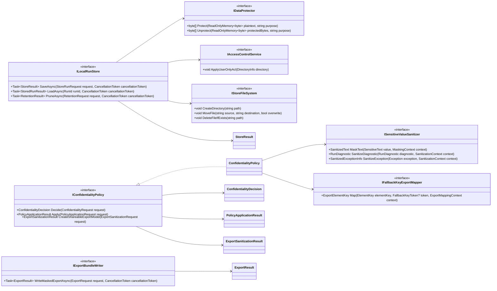
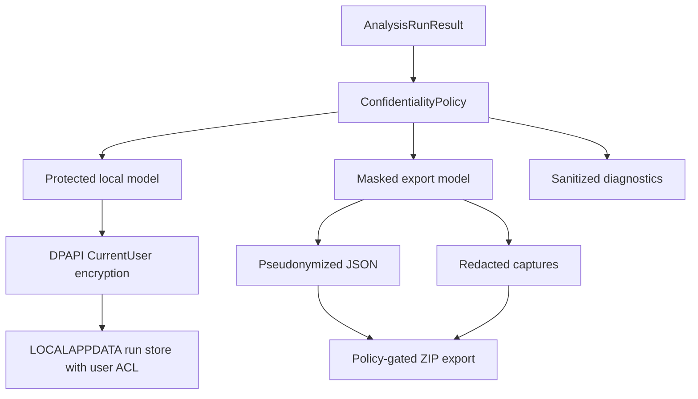

# DES-0013 Confidentiality, Storage, and Export Detailed Design

This is detailed-design package 6 from [DES-0007](des-0007-detailed-design-execution-strategy.md) section 4. It fixes how Surveyor handles screenshots, extracted text, diagnostics, fallback keys, local persistence, retention, and shareable exports so implementation slice `IMP-0003`, store/export slice `IMP-0010`, unit-test designs `UT-0008`/`UT-0009`, and integration test `IT-0004` can proceed without inventing security policy.

Canonical requirements stay in [gui-testability-analyzer-requirements.md](../../docs/gui-testability-analyzer-requirements.md) (`RQ-xxx`) and derived requirements in [requirements-definition.md](../requirements/requirements-definition.md) (`RD-xxx`).

## Trace Block

| Field | Content |
| -- | -- |
| Artifact | `DES-0013`, Confidentiality, Storage, and Export Detailed Design, detailed design phase |
| Upstream | [DES-0002](des-0002-module-responsibility-basic-design.md) `M09`/`M12`; [DES-0003](des-0003-module-interface-basic-design.md) `IConfidentialityPolicy`; [DES-0004](des-0004-analysis-flow-basic-design.md) Stages 5/8; [DES-0005](des-0005-vmodel-traceability-and-downstream-tests.md) `UT-0008`/`UT-0009`/`IT-0004`; [DES-0007](des-0007-detailed-design-execution-strategy.md) package 6, `R-SEC-01`, `R-SEC-02`; [DES-0008](des-0008-project-structure-and-test-harness.md) project homes; [DES-0009](des-0009-domain-model-stable-keys-and-availability.md) fallback-key minimal contract and residual exposure risk; [DES-0011](des-0011-port-dtos-status-model-and-use-case-orchestration.md) diagnostics shape |
| Requirements | `RQ-052`, `RQ-053`; derived `RD-012`, `RD-021`, `RD-022` |
| Downstream | Design review issue #35; `UT-0008` issue #47; `UT-0009` issue #48; `IT-0004` issue #56; `IMP-0003` issue #61; `IMP-0010` issue #68; `DES-0012` report schema; `DES-0016` UI consent/notice surfaces |
| Evidence | Confidentiality policy modes, masking rules, opt-out record, fallback-key exposure decision, storage layout, DPAPI CurrentUser + ACL rule, retention, atomic write/export flow, diagnostic and exception sanitizer, Mermaid data-flow, fixture strategy, test intents |
| Verification | `tools/okf/Validate-Okf.ps1`; `git diff --check`; future `dotnet test tests/Surveyor.Policy.Tests --filter UT0008` and `dotnet test tests/Surveyor.Adapters.Store.Tests --filter UT0009` once source exists |
| Residual Risk | DPAPI `CurrentUser` protects against casual cross-user access but not a fully compromised account or local administrator; export-local fallback pseudonyms reduce cross-export comparability for fallback-only elements; WGC capture-border user notice belongs to `DES-0016`; storage cleanup scheduling belongs to implementation/operations policy |

## Module Coverage

Primary modules:

- `M09 Confidentiality Policy` in `Surveyor.Policy`;
- `M12 Result Store / Export` in `Surveyor.Adapters.Store`.

Participating modules:

- `M03` invokes policy and store/export ports;
- `M10` report generation consumes already-sanitized report DTOs;
- `M11` provides `IClock`;
- `M04`/`M08` provide keys, labels, findings, and candidate codes that must be sanitized before logs/exports.

## Security Posture

Surveyor is secure by default:

1. screenshots and extracted UI text are confidential data;
2. logs and diagnostics use safe codes, keys, counts, statuses, and enum values only;
3. local persisted run data lives under `%LOCALAPPDATA%\Surveyor\Runs`;
4. confidential local blobs are encrypted with DPAPI `CurrentUser`;
5. run directories have a user-restricted ACL;
6. shareable export is masked by default and requires an explicit export command;
7. unmasked export is out of v1 scope;
8. any opt-out from masking/protected storage is explicit, scoped, timestamped, and recorded.

## Policy Contracts

Suggested source homes:

- `src/Surveyor.Policy/Confidentiality/ConfidentialityPolicy.cs`
- `src/Surveyor.Policy/Confidentiality/Sanitizer.cs`
- `src/Surveyor.Policy/Confidentiality/FallbackKeyExportMapper.cs`
- `src/Surveyor.Adapters.Store/LocalRunStore.cs`
- `src/Surveyor.Adapters.Store/ExportBundleWriter.cs`

### ConfidentialityDecision

Fields:

- `ConfidentialityMode Mode`: `ProtectedLocal`, `MaskedShareableExport`, `ExplicitLocalOptOut`
- `string PolicyVersion`: `confidentiality-v1`
- `DateTimeOffset DecidedAtUtc`
- `string DecisionSource`: `Default`, `UserConfirmed`, `TestFixture`
- `string? OptOutReasonCode`
- `IReadOnlyList<string> AppliedTransforms`

Default mode for a normal analysis run is `ProtectedLocal`. Default mode for export is `MaskedShareableExport`.

`ExplicitLocalOptOut` is allowed only for local developer/test scenarios that need plaintext artifacts; it must never be the default and must be visible in the run manifest.

### Sensitive Kinds

| Kind | Examples | Default treatment |
| -- | -- | -- |
| `DisplayText` | UI labels, values, status text, menu item text | Mask in reports/exports/logs. |
| `WindowTitle` | top-level title bar | Mask in reports/exports/logs. |
| `ScreenshotPixels` | captured full window/ROI images | Store encrypted locally; export only masked/redacted image. |
| `FilePath` | local run path, temp path | Never log raw absolute path; expose safe run id only. |
| `FallbackKeyToken` | hash-derived fallback identity from sensitive material | Protected locally; pseudonymized in shareable export. |
| `ExceptionMessage` | external exception message | Drop; map to exception kind/status/HResult only. |

## Class Design (UML)

`M09` implements the application-owned `IConfidentialityPolicy` port from `Surveyor.Application.Ports`. `M12` implements the application-owned `IResultStorePort` and may use adapter-internal store/export writer seams. Store/export adapters receive already protected or already masked models from application use cases; they do not depend directly on `Surveyor.Policy`. Unit tests replace all infrastructure seams with fakes and exercise policy functions without touching the real file system.



## Public API Definitions

These signatures are the implementation contract for `IMP-0003` and `IMP-0010`, and the direct fake seam for `UT-0008` and `UT-0009`.

Application-owned policy port and policy-side helper interfaces:

```csharp
namespace Surveyor.Application.Ports;

public interface IConfidentialityPolicy
{
    ConfidentialityDecision Decide(ConfidentialityRequest request);

    PolicyApplicationResult Apply(
        PolicyApplicationRequest request);

    ExportSanitizationResult CreateShareableExportModel(
        ExportSanitizationRequest request);
}

namespace Surveyor.Policy.Confidentiality;

public interface ISensitiveValueSanitizer
{
    SanitizedText MaskText(
        SensitiveText value,
        MaskingContext context);

    RunDiagnostic SanitizeDiagnostic(
        RunDiagnostic diagnostic,
        SanitizationContext context);

    SanitizedExceptionInfo SanitizeException(
        Exception exception,
        SanitizationContext context);
}

public interface IFallbackKeyExportMapper
{
    ExportElementKey Map(
        ElementKey elementKey,
        FallbackKeyToken? fallbackToken,
        ExportMappingContext context);
}
```

Policy DTO records:

```csharp
public sealed record ConfidentialityRequest(
    RunId RunId,
    DateTimeOffset RequestedAtUtc,
    ConfidentialityMode RequestedMode,
    ScreenModel? ScreenModel,
    IReadOnlyList<RunDiagnostic> Diagnostics,
    OptOutRequest? OptOut);

public sealed record PolicyApplicationRequest(
    AnalysisRunResult RunResult,
    ConfidentialityDecision Decision);

public sealed record ExportSanitizationRequest(
    AnalysisRunResult RunResult,
    ConfidentialityDecision Decision,
    ExportProfile ExportProfile);

public sealed record PolicyApplicationResult(
    ConfidentialityDecision Decision,
    ProtectedRunModel ProtectedLocalModel,
    IReadOnlyList<RunDiagnostic> Diagnostics);

public sealed record ExportSanitizationResult(
    ConfidentialityDecision Decision,
    MaskedExportModel MaskedModel,
    IReadOnlyList<ExportElementKey> ExportKeys,
    IReadOnlyList<RunDiagnostic> Diagnostics);
```

Store/export interfaces:

```csharp
namespace Surveyor.Adapters.Store;

// Adapter-internal seam used by the IResultStorePort implementation.
public interface ILocalRunStore
{
    Task<StoreResult> SaveAsync(
        StoreRunRequest request,
        CancellationToken cancellationToken);

    Task<StoredRunResult> LoadAsync(
        RunId runId,
        CancellationToken cancellationToken);

    Task<RetentionResult> PruneAsync(
        RetentionRequest request,
        CancellationToken cancellationToken);
}

public interface IExportBundleWriter
{
    Task<ExportResult> WriteMaskedExportAsync(
        ExportRequest request,
        CancellationToken cancellationToken);
}
```

Relationship to `DES-0011`: `IResultStorePort` is the only application-owned store/export port. The `Surveyor.Adapters.Store` implementation of `IResultStorePort.SaveRunAsync` delegates to `ILocalRunStore.SaveAsync`; its `ExportAsync` delegates to `IExportBundleWriter.WriteMaskedExportAsync`. `IExportBundleWriter` receives an already masked `ExportRequest` from `ExportResultUseCase` and must not call `IConfidentialityPolicy` directly.

Infrastructure seams:

```csharp
public interface IDataProtector
{
    byte[] Protect(
        ReadOnlyMemory<byte> plaintext,
        string purpose);

    byte[] Unprotect(
        ReadOnlyMemory<byte> protectedBytes,
        string purpose);
}

public interface IAccessControlService
{
    void ApplyUserOnlyAcl(DirectoryInfo directory);
}

public interface IStoreFileSystem
{
    void CreateDirectory(string path);
    void WriteAllBytesAtomicInput(string path, ReadOnlyMemory<byte> bytes);
    void MoveFile(string source, string destination, bool overwrite);
    void MoveDirectory(string source, string destination, bool overwrite);
    void DeleteFileIfExists(string path);
    void DeleteDirectoryIfExists(string path);
    bool IsReparsePoint(string path);
}
```

Store/export DTO records:

```csharp
public sealed record StoreRunRequest(
    RunId RunId,
    ProtectedRunModel ProtectedModel,
    LocalStoreOptions Options);

public sealed record StoreResult(
    OperationStatus Status,
    RunId RunId,
    SafeArtifactReference? Manifest,
    IReadOnlyList<RunDiagnostic> Diagnostics);

public sealed record ExportRequest(
    RunId RunId,
    MaskedExportModel MaskedModel,
    ExportDestination Destination,
    ExportOptions Options);

public sealed record ExportResult(
    OperationStatus Status,
    SafeArtifactReference? Bundle,
    IReadOnlyList<RunDiagnostic> Diagnostics);
```

Minimum DTO fields fixed by this package:

```csharp
public sealed record ProtectedRunModel(
    RunId RunId,
    ConfidentialityDecision Decision,
    byte[] ProtectedResultBytes,
    byte[] ProtectedCaptureBytes,
    byte[] ProtectedReportBytes,
    byte[] ProtectedMaskingDictionaryBytes,
    IReadOnlyList<RunDiagnostic> SanitizedDiagnostics);

public sealed record MaskedExportModel(
    RunId RunId,
    ExportId ExportId,
    string PolicyVersion,
    string ScoringConfigVersion,
    IReadOnlyList<MaskedReportDocument> Documents,
    IReadOnlyList<MaskedCapture> Captures,
    IReadOnlyList<RunDiagnostic> Diagnostics,
    IReadOnlyList<ExportElementKey> ExportKeys);

public sealed record SafeArtifactReference(
    string ArtifactId,
    ArtifactKind Kind,
    string RelativeSafePath,
    bool IsProtected,
    bool IsShareableExport);

public sealed record StoredRunResult(
    OperationStatus Status,
    RunId RunId,
    ProtectedRunModel? ProtectedModel,
    IReadOnlyList<RunDiagnostic> Diagnostics);

public sealed record LocalStoreOptions(
    string RootDirectory,
    bool RequireAclHardening,
    TimeSpan OperationTimeout);

public sealed record RetentionRequest(
    string RootDirectory,
    DateTimeOffset NowUtc,
    TimeSpan RetentionWindow);

public sealed record RetentionResult(
    OperationStatus Status,
    int DeletedRunCount,
    int SkippedRunCount,
    IReadOnlyList<RunDiagnostic> Diagnostics);

public sealed record ExportProfile(
    ExportId ExportId,
    DateTimeOffset NormalizedTimestampUtc,
    bool IncludeMaskedCaptures,
    bool IncludeDiagnostics);

public sealed record ExportDestination(
    string AbsolutePathForWrite);

public sealed record ExportOptions(
    bool FailIfDestinationExists,
    TimeSpan OperationTimeout);

public sealed record MaskingContext(
    RunId RunId,
    ExportId? ExportId,
    SensitiveKind Kind);

public sealed record SanitizationContext(
    RunId RunId,
    ConfidentialityMode Mode,
    ExportId? ExportId);

public sealed record ExportMappingContext(
    RunId RunId,
    ExportId ExportId,
    int Ordinal);

public sealed record SensitiveText(
    SensitiveKind Kind,
    string Value);

public sealed record SanitizedText(
    string Pseudonym,
    string LengthBucket);

public sealed record FallbackKeyToken(
    string CanonicalToken);

public sealed record ExportElementKey(
    string ExportKey,
    bool IsFallback,
    bool StableAcrossExports);

public sealed record SanitizedExceptionInfo(
    ExceptionKind Kind,
    int? HResult);
```

`ExportDestination.AbsolutePathForWrite` is an input-only command value. It must not appear in diagnostics, manifests, logs, or reports; those surfaces use `SafeArtifactReference` instead.

Enums fixed by this package:

```csharp
public enum ConfidentialityMode
{
    ProtectedLocal,
    MaskedShareableExport,
    ExplicitLocalOptOut
}

public enum SensitiveKind
{
    DisplayText,
    WindowTitle,
    ScreenshotPixels,
    FilePath,
    FallbackKeyToken,
    ExceptionMessage
}

public enum ArtifactKind
{
    Manifest,
    Result,
    Captures,
    Report,
    Diagnostics,
    ExportBundle
}
```

Function rules:

| API | Throws / status | Test rule |
| -- | -- | -- |
| `IConfidentialityPolicy.Decide` | `ArgumentException` for invalid opt-out; otherwise no expected throw | `UT-0008` verifies default `ProtectedLocal`, explicit opt-out recording, policy version, and UTC timestamp. |
| `IConfidentialityPolicy.Apply` | Programmer-invalid model is `ArgumentException` | No raw labels, titles, paths, exception messages, or export-unsafe fallback tokens in returned diagnostics/model. |
| `CreateShareableExportModel` | Programmer-invalid profile is `ArgumentException` | Fallback keys become export-local pseudonyms and `StableAcrossExports=false`. |
| `ISensitiveValueSanitizer.*` | No expected throw for malformed external text/exception | Sanitizer is allowlist-based and deterministic for fixed context. |
| `ILocalRunStore.SaveAsync` | Expected I/O/DPAPI/ACL failures return `StoreResult` with `IoError`; caller cancellation propagates | Fake `IDataProtector` and `IAccessControlService` prove DPAPI CurrentUser and ACL seams are invoked before final result. |
| `ILocalRunStore.PruneAsync` | Expected deletion failures become diagnostics | Tests verify no reparse-point traversal and no non-Surveyor deletion. |
| `IExportBundleWriter.WriteMaskedExportAsync` | Expected I/O failures return `ExportResult` with `IoError`; caller cancellation propagates | Fixed inputs produce deterministic ZIP entry order and normalized timestamps. |

## Masking And Redaction

Text masking uses per-run deterministic pseudonyms, not hashes of raw text. Hashes can be guessed for small UI strings.

For protected local storage, `M09` builds a run-local `MaskingDictionary`:

```text
DisplayText -> txt-0001, txt-0002, ...
WindowTitle -> win-0001, win-0002, ...
FallbackKeyToken -> fk-0001, fk-0002, ...
```

Pseudonym assignment order is deterministic by first safe traversal order from `ScreenModel` and then ordinal raw category order inside the policy implementation. The dictionary is stored only in the protected local store, encrypted. Shareable exports contain pseudonyms but not the reverse mapping.

For shareable export, fallback-key pseudonyms are export-local and include the export id scope:

```text
FallbackKeyToken -> exp-<export-id-short>-fk-0001
```

For the same run and the same fixed `ExportId`, output is deterministic. A new export command normally creates a new `ExportId`, so fallback pseudonyms are not comparable across exports. Text/window pseudonyms may remain run-local (`txt-0001`, `win-0001`) because they are non-reversible placeholders with no canonical key semantics.

Length buckets may be included when useful for human review:

- `0`
- `1-4`
- `5-12`
- `13-40`
- `41+`

Do not include raw prefixes, suffixes, or reversible hashes in shareable artifacts.

### Screenshot Redaction

Default export redacts text-bearing and result-bearing regions when their source element has `DisplayText`, `Value`, or unknown sensitivity. V1 supports rectangular redaction:

- fill color: neutral gray;
- optional pseudonym label, e.g. `txt-0007`;
- no raw text drawn into the image.

If bounds are unavailable for any element that can contain text or unknown sensitivity, export replaces the image with a placeholder metadata record. V1 does not perform OCR or heuristic text detection. An image may be included without redaction only when all included regions have explicit non-text sensitivity metadata and no unknown-sensitivity elements overlap the exported region.

## Fallback-Key Exposure Decision

`DES-0009` fixes the fallback-key minimal contract and leaves exposure policy to this package. The decision is:

- protected local run data may store canonical fallback key tokens because the local store is encrypted and ACL-restricted;
- shareable export must not expose canonical fallback key tokens;
- shareable export replaces fallback element keys with export-local pseudonyms (`exp-<export-id-short>-fk-0001`, `exp-<export-id-short>-fk-0002`, ...);
- report DTOs mark such ids with `IsFallback = true` and `StableAcrossExports = false`.

Non-fallback stable ids that are not derived from sensitive text may be exported as stable keys. This preserves version comparison where safe, while reducing guess-and-verify exposure for fallback-only elements.

## Local Store Design

Root:

```text
%LOCALAPPDATA%\Surveyor\Runs\<yyyyMMdd>\<run-id>\
```

Path rules:

- `<yyyyMMdd>` comes from `IClock.UtcNow`.
- `<run-id>` is a generated safe id from `M03`; tests may inject a fixed id.
- No path segment uses target title, label, process name, screen name, or raw key.
- File names are fixed: `manifest.json`, `result.protected`, `captures.protected`, `report.protected`, `masking-dictionary.protected`, `diagnostics.json`.

Protected blobs:

- serialized with deterministic JSON or byte format decided by `DES-0012` / store implementation;
- encrypted with `ProtectedData.Protect(..., DataProtectionScope.CurrentUser)`;
- include policy/config versions in plaintext manifest and authenticated protected payload metadata.

DPAPI purpose strings are fixed and contain no raw target data:

| Blob | File | Purpose |
| -- | -- | -- |
| Result | `result.protected` | `Surveyor.RunStore.v1:{run-id}:result` |
| Captures | `captures.protected` | `Surveyor.RunStore.v1:{run-id}:captures` |
| Report | `report.protected` | `Surveyor.RunStore.v1:{run-id}:report` |
| Masking dictionary | `masking-dictionary.protected` | `Surveyor.RunStore.v1:{run-id}:masking-dictionary` |

The manifest stores the purpose string used for each protected blob so load tests can verify the same purpose is used for unprotect.

ACL:

- directory owner: current user;
- full control: current user;
- inherited broad write entries are removed where possible;
- administrators/SYSTEM behavior follows Windows defaults but no additional broad group is granted.

Atomic write:

1. create temp directory under the same root;
2. write protected blobs and plaintext manifest;
3. fsync/flush where supported;
4. move/rename temp directory to final run directory;
5. on failure, mark partial and remove temp best-effort.

Expected store failures return `OperationStatus.IoError` or `Timeout`, not raw exceptions.

## Retention

Default retention for protected local runs is 30 days. The retention job:

- deletes only directories whose manifest identifies Surveyor and whose run age exceeds the configured retention;
- never follows reparse points;
- logs only run ids and counts;
- treats deletion errors as diagnostics with safe codes.
- skips directories with missing, corrupt, or unreadable manifests and emits `RetentionManifestUnreadable`; such directories are not deleted automatically because they cannot be proven to be Surveyor-owned.

Exports are user-created files and are not automatically deleted by Surveyor.

## Export Bundle Design

Default shareable export is a ZIP bundle:

```text
surveyor-export-<run-id>.zip
  manifest.json
  result.masked.json
  diagnostics.masked.json
  captures/
    roi-0001.png
    roi-0002.png
  README.txt
```

Policy gate:

- export requires an explicit user command;
- export runs `MaskedShareableExport` mode even if the local store is protected;
- export manifest records `PolicyVersion`, `MaskingDictionaryVersion`, `ScoringConfigVersion`, and whether any fallback keys were pseudonymized;
- export never includes the reverse masking dictionary.

ZIP entry order is deterministic by path ordinal. Entry timestamps use a fixed normalized timestamp supplied by the export policy so byte-stable export tests are possible when inputs are fixed.

Export write is atomic:

1. choose a temp file in the destination directory with a safe generated name;
2. write the complete ZIP to the temp file;
3. close/flush the stream;
4. if the destination exists and `FailIfDestinationExists == true`, delete the temp file and return `IoError`;
5. move/rename the temp file to the destination with `overwrite=false`;
6. on cancellation or expected failure, delete the temp file best-effort and never leave a partial file at the final destination.

The writer never overwrites an existing export bundle silently. If overwrite support is added later it must be a new explicit option and test case.

## Diagnostics And Exception Sanitization

`DES-0011` defines the diagnostic shape. This package defines the sanitizer:

Allowed values:

- diagnostic code;
- stage;
- status;
- severity;
- enum names;
- safe keys or export pseudonyms;
- counts;
- duration milliseconds;
- HRESULT integer;
- exception kind enum, e.g. `UnauthorizedAccess`, `ComError`, `WinRtArgument`, `IOException`.

Disallowed values:

- exception message;
- stack trace in user export;
- absolute file path;
- window title;
- display label;
- raw text/value;
- canonical fallback token in export.

Developer-local debug logs may include stack traces only when explicitly enabled in a local developer configuration and still must pass the raw target text/path sanitizer. Debug mode is out of shareable export.

## Mermaid Data Flow



## Edge Cases

| Case | Required behavior |
| -- | -- |
| DPAPI encryption fails | Store returns `IoError`, no plaintext fallback. |
| ACL tightening fails | Store returns `IoError` unless running in a test fixture that explicitly disables ACL checks. |
| Export requested before local protected store completed | Export operates from in-memory sanitized model or fails safely; it does not read partial temp files. |
| Fallback-only element appears in report | Local protected report may contain canonical key; shareable export uses `fk-xxxx` and marks not stable across exports. |
| Exception message contains UI text | Sanitizer drops message; diagnostic keeps exception kind/HResult/status. |
| ROI bounds unavailable for text-bearing element | Export omits or placeholders the screenshot rather than leaking full image. |
| Retention encounters reparse point | Skip and emit safe diagnostic. |

## Unit And Integration Test Handoff

`UT-0008` confidentiality policy tests:

| Test intent | Fixture |
| -- | -- |
| Text masking | raw labels/values replaced by deterministic pseudonyms; no raw text in export model. |
| Fallback key export | canonical fallback key in protected local model, pseudonym in export model. |
| Diagnostic sanitizer | raw exception message/path/title removed; safe code/status/HResult remain. |
| Screenshot redaction decision | text-bearing ROI redacted; unknown bounds replaced by placeholder. |
| Opt-out record | explicit local opt-out requires reason and timestamp; default never opts out. |
| Export-local fallback pseudonym | same `ExportId` yields deterministic `exp-<id>-fk-000N`; different `ExportId` changes fallback export keys. |
| Real exception sanitization | representative `UnauthorizedAccessException`, `IOException`, and `COMException` instances keep kind/HResult and drop message/path/text. |

`UT-0009` store/export tests:

| Test intent | Fixture |
| -- | -- |
| Store path hygiene | generated paths contain run id/date only, no label/title/raw key. |
| DPAPI wrapper invoked | fake protection service records `CurrentUser`; plaintext blob is not written. |
| ACL service invoked | fake ACL service receives final run directory. |
| Atomic write | temp directory is used; failure leaves no final partial directory. |
| Export atomic write | temp ZIP is used; cancellation/failure deletes temp and leaves no final partial bundle; destination collision returns `IoError` without overwrite. |
| Export determinism | fixed inputs and fixed `ExportId` yield stable ZIP entry order and normalized timestamps. |
| Retention safety | old Surveyor run removed; non-Surveyor/reparse entries skipped; corrupt/missing manifest skipped with `RetentionManifestUnreadable`. |
| File-system failure injection | fake `IStoreFileSystem` injects move/write/delete failures for store/export cleanup paths. |

Windows integration / manual checks that cannot be proven with pure unit fakes:

| Check | Evidence expectation |
| -- | -- |
| DPAPI round trip | Windows integration test verifies `CurrentUser` protect/unprotect for each purpose string. |
| ACL hardening | Windows integration/manual test records resulting ACL; administrator/SYSTEM default behavior is documented as residual risk, not an automated unit assertion. |
| Reparse-point skip | Windows integration test or documented manual check creates a junction/symlink when environment permissions allow it; otherwise fixture-level fake coverage is the unit fallback. |
| ZIP byte determinism | Golden comparison runs in the pinned Windows test lane; if non-Windows lanes are added, compare normalized manifest entries rather than raw OS-specific file attribute bits. |

`IT-0004` end-to-end confidential run:

- analyze a fixture target with sensitive labels and screenshots;
- persist local run;
- export masked bundle;
- assert no known sensitive strings appear in logs, manifest, JSON, ZIP entries, redacted image labels, or paths.
- assert placeholder replacement, not OCR, for unknown-bounds screenshots.

## Implementation Handoff

Implementers should start with:

1. `IConfidentialityPolicy` and immutable policy DTOs;
2. sanitizer allowlist tests;
3. fallback-key export pseudonym mapper;
4. store protection seam (`IDataProtector` wrapping DPAPI);
5. ACL seam;
6. atomic local run writer;
7. masked export writer.

The first implementation slice should make the "safe by default" tests pass before adding optional export refinements.
