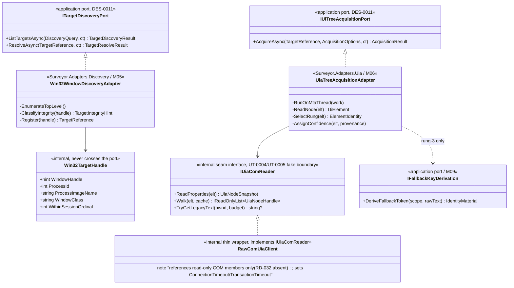
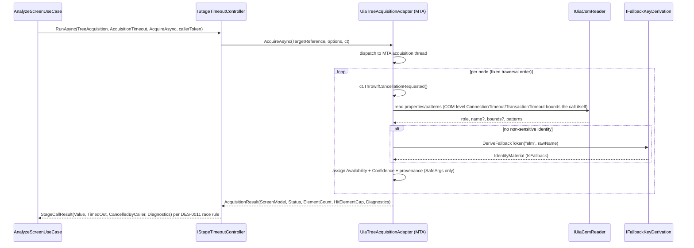

# DES-0014 Discovery, UIA/MSAA Acquisition, and Read-Only Audit Detailed Design

This is detailed-design package 7 from [DES-0007](des-0007-detailed-design-execution-strategy.md) section 4. It fixes how Surveyor discovers a target, reads its UIA/MSAA tree into the `DES-0009` domain model, proves it never mutates the target, and marks legacy edges honestly, so discovery slice `IMP-0005`, acquisition slice `IMP-0006`, read-only audit slice `IMP-0007`, and the real UIA adapter slice `IMP-0013` can proceed without inventing acquisition behavior. It is the first adapter-bound package and is unblocked by the accepted [ADR-0002](../decisions/adr-0002-adapter-technology-selection.md) (raw-COM UIA client, same-integrity unpackaged default).

Canonical requirements stay in [gui-testability-analyzer-requirements.md](../../docs/gui-testability-analyzer-requirements.md) (`RQ-xxx`) and derived requirements in [requirements-definition.md](../requirements/requirements-definition.md) (`RD-xxx`).

## Trace Block

| Field | Content |
| -- | -- |
| Artifact | `DES-0014`, Discovery, UIA/MSAA Acquisition, and Read-Only Audit Detailed Design, detailed design phase |
| Upstream | [ADR-0002](../decisions/adr-0002-adapter-technology-selection.md) (UIA raw COM, capture, packaging, minimal-privilege); [DES-0002](des-0002-module-responsibility-basic-design.md) `M05`/`M06`; [DES-0003](des-0003-module-interface-basic-design.md) `ITargetDiscoveryPort`/`IUiTreeAcquisitionPort`; [DES-0004](des-0004-analysis-flow-basic-design.md) Stages 1/2; [DES-0005](des-0005-vmodel-traceability-and-downstream-tests.md) `UT-0003`/`UT-0004`/`UT-0005`/`IT-0001`/`IT-0002`/`IT-0005`/`IT-0006`; [DES-0007](des-0007-detailed-design-execution-strategy.md) package 7, `R-WIN-02`, `R-WIN-03`, `R-GTA-02`, `R-SEC-02`; [DES-0008](des-0008-project-structure-and-test-harness.md) project homes and banned-API guards; [DES-0009](des-0009-domain-model-stable-keys-and-availability.md) identity-source ladder (rung-1 detection delegated here), `Availability`/`AcquisitionConfidence` semantics, `IdentityMaterial` and `IFallbackKeyDerivation` seam; **[DES-0011](des-0011-port-dtos-status-model-and-use-case-orchestration.md) (binding, not merely referenced): `ITargetDiscoveryPort.ListTargetsAsync`/`ResolveAsync` and `IUiTreeAcquisitionPort.AcquireAsync` method signatures, `TargetReference`/`TargetCandidate`/`TargetDiscoveryResult`/`TargetResolveResult`/`AcquisitionResult`/`OperationStatus`/`RunDiagnostic` shapes, and `IStageTimeoutController`-owned stage timeout/cancellation precedence — this package fixes only the field detail DES-0011 left open and adapter-internal mechanics, and does not rename methods or redefine already-fixed DTOs** |
| Requirements | `RQ-048`, `RQ-049`, `RQ-050`; `RQ-017`, `RQ-026`, `RQ-054`; derived `RD-001`, `RD-003`, `RD-004`, `RD-023`, `RD-024`, `RD-026`, `RD-032` |
| Downstream | Design review issue #36; `UT-0003` issue #42; `UT-0004` issue #43; `UT-0005` issue #44; `IMP-0005` issue #63; `IMP-0006` issue #64; `IMP-0007` issue #65; `IMP-0013` issue #71; `IT-0001` issue #53; `IT-0002` issue #54; `IT-0005` issue #57; `IT-0006` (UIA cancellation/timeout on a large legacy tree, `R-WIN-02`; no issue tracked yet in this bundle); `DES-0015` (capture shares `TargetReference`/DPI context); `DES-0017` (perf caps calibration); `DES-0018` (adapter provider wiring) |
| Evidence | Discovery/acquisition field detail conforming to the DES-0011-fixed port/DTO shapes, the adapter-internal `Win32TargetHandle` opaque-boundary mechanism, within-session ordering key, UIA apartment/threading model with COM-level timeout enforcement and cooperative cancellation, `RD-032` prohibited-pattern→COM-method audit mapping with a concrete read-only allow-list and spy, legacy acquisition edge table, virtualized-tree `NotRealized` handling, confidence rubric with a misclassification counter-example, rung-1 runtime-id detection rules, minimal-privilege policy, Mermaid class/sequence diagrams, contract-closure tables, edge cases, fixture strategy with counter-examples, `UT-0003`/`UT-0004`/`UT-0005` intents, integration assumptions |
| Verification | `tools/okf/Validate-Okf.ps1`; `git diff --check`; author-side `DRP-01`–`DRP-10` + DES-0007 §9 self-review (below), re-swept after the `R-ARC-01` boundary-reshaping fix; future `dotnet test tests/Surveyor.Adapters.Discovery.Tests --filter UT0003`, `dotnet test tests/Surveyor.Adapters.Uia.Tests --filter "UT0004|UT0005"` once source exists; live `IT-0001`/`IT-0002`/`IT-0005`/`IT-0006` on the manual Windows gate |
| Residual Risk | `RSK-RD-001` closes for UIA client selection but live legacy-edge coverage stays incremental (`DES-0015` capture edges + IT fixture app built out over time); rung-1 runtime-id pattern set is versioned and may need tuning against real frameworks; `WM_GETTEXT` is a documented read-only exception (query message, no state change) carried as a named risk with both reactive and proactive mitigation; cross-run `TargetReference.SessionTargetId` identity is within-session only by design; the read-only guarantee is defense-in-depth (structural + build-time + test-time) but not a cryptographic proof against a determined caller using unsafe interop against the raw COM objects the wrapper never exposes |

## Module Coverage

Primary modules ([DES-0002](des-0002-module-responsibility-basic-design.md)):

- **`M05` Target Discovery** — read-only enumeration of candidate windows/processes, `HWND` resolution, permission/integrity classification, within-session stable ordering. Home: `Surveyor.Adapters.Discovery` (adapter) implementing the application-owned `ITargetDiscoveryPort`.
- **`M06` UIA/MSAA Acquisition** — reads the target tree into the `DES-0009` model with confidence/availability markers, owns the strongest `RQ-048` read-only guarantee, populates `IdentitySource` (including rung-1 detection), and calls the `M09` `IFallbackKeyDerivation` seam when no non-sensitive identity exists. Home: `Surveyor.Adapters.Uia` implementing `IUiTreeAcquisitionPort`.

Not covered here: capture/DPI (`M07` → `DES-0015`); scoring of the acquired model (`M08` → `DES-0010`); confidentiality masking/storage of extracted text (`M09`/`M12` → `DES-0013`); concrete DI wiring of these adapters (`M13` → `DES-0018`). The `IClock` and DTO/diagnostics shapes are consumed as fixed by `DES-0009`/`DES-0011`.

## Scope And Non-Goals

In scope:

1. Discovery DTO field detail not already fixed by `DES-0011` (`DiscoveryQuery`, `TargetProcessInfo`, `TargetIntegrityHint`), the adapter-internal `Win32TargetHandle` mechanism behind the `DES-0011`-fixed `TargetReference`, and the within-session ordering key (`RQ-051` scoped to live selection, not report determinism).
2. UIA client concretization on ADR-0002's raw COM, the thin Surveyor-owned wrapper boundary, and the MSAA / `WM_GETTEXT` fallback rules.
3. UIA apartment/threading model and cooperative cancellation/timeout (`R-WIN-02`, `RQ-050`).
4. The `RD-032` prohibited-pattern read-only audit: pattern→COM-method mapping, banned-API enforcement, and the acquisition spy (`RQ-048`, `UT-0005`).
5. Legacy acquisition edge table (MSAA proxy / owner-draw / MDI / windowless / `WM_GETTEXT`) with per-case confidence and `Unavailable` policy (`R-WIN-03`).
6. Virtualized/lazy-tree detection → `Unavailable(NotRealized)` / `PartialResult`, distinct from genuine absence (`R-GTA-02`).
7. The acquisition confidence rubric (how `M06` assigns `High`/`Medium`/`Low`).
8. Identity-source ladder rung-1 "runtime-generated id" detection rules (delegated here by `DES-0009`).
9. Minimal-privilege policy: same-integrity default; `uiAccess`/elevation as signed opt-in (`R-SEC-02`, ADR-0002).

Non-goals (owned elsewhere):

- Capture API, DPI normalization, occlusion/offscreen imaging → `DES-0015`.
- Domain key derivation, `IdentityMaterial` construction rules, fallback-key minimal contract → `DES-0009` (fixed; consumed here).
- Fallback-key masking/storage/export/log policy → `DES-0013`.
- Scoring/classification of acquired signals → `DES-0010`.
- Caps *default values* calibration and large-tree performance targets → `DES-0017` (this package fixes cap *semantics* and where caps apply).
- Concrete provider registration / lifetimes → `DES-0018`.

## Upstream Decisions (binding)

- **ADR-0002 §Decision**: UIA client is **raw COM (`Interop.UIAutomationClient` PIA)** behind a thin internal wrapper in `Surveyor.Adapters.Uia`; decisive reason is the 1:1 auditable mapping between the `RD-032` prohibited-pattern list and COM methods that are simply never referenced. Packaging is **unpackaged, same-integrity default**, with a signed classic-manifest `uiAccess` escape hatch. Capture is WGC-primary (owned by `DES-0015`).
- **DES-0003 `ITargetDiscoveryPort`**: read-only enumeration; per-candidate status is an `OperationStatus` value (`Ok`/`PermissionDenied`/`IntegrityMismatch`/`Unavailable`/`Timeout`); `TargetReference` is an opaque domain-safe handle (no `HWND`/process types inward, `RQ-054`); within-session stable order, not z-order.
- **DES-0003 `IUiTreeAcquisitionPort`**: strongest `RQ-048` owner; only read patterns; state-changing patterns (`RD-032`) absent from the surface; per-node `Availability.Unavailable(reason)`, run-level `PermissionDenied`/`PartialResult`/`Timeout` via `OperationStatus`; `Name`/text as `DisplayLabel` only, never in keys, handed downstream via `M09`.
- **DES-0004 Stages 1/2**: run does not start until a `TargetReference` resolves; per-node unavailable and `PartialResult`/`Timeout` are recorded, never turned into scores.
- **DES-0009**: the identity-source ladder (rung 1 AutomationId → rung 2 framework-stable id → rung 3 `M09` fallback token → rung 4 structural ordinal) is fixed, including the `ElementIdentity`/`IdentityMaterial` union (`StableIdentity` | `FallbackKeyToken`, no third constructor); **rung-1 runtime-generated-id detection is explicitly delegated to this package**; `Availability`/`AcquisitionConfidence` are distinct from low scores; `IdentityMaterial.StableIdentity` trusts its caller to pass non-sensitive text — **this package is that caller and owns the classification**.
- **DES-0011 (binding, fixed there — not redefined here)**: `ITargetDiscoveryPort.ListTargetsAsync(DiscoveryQuery, ct) -> TargetDiscoveryResult` and `.ResolveAsync(TargetReference, ct) -> TargetResolveResult`; `IUiTreeAcquisitionPort.AcquireAsync(TargetReference, AcquisitionOptions, ct) -> AcquisitionResult`; the `TargetReference`, `TargetCandidate`, `TargetDiscoveryResult`, `TargetResolveResult`, and `AcquisitionResult` field sets; the `OperationStatus` and `RunDiagnostic` shapes; the `IStageTimeoutController` race rule (caller cancellation wins over stage timeout) and `IClock` threading. This package's field detail (`DiscoveryQuery`, `TargetProcessInfo`, `TargetIntegrityHint`, `AcquisitionOptions`) and adapter-internal mechanics fit inside those fixed shapes without renaming a method or adding/removing a DTO field.

## Data And Contract Design

`ITargetDiscoveryPort`/`IUiTreeAcquisitionPort` method signatures and the `TargetReference`/`TargetCandidate`/`TargetDiscoveryResult`/`TargetResolveResult`/`AcquisitionResult`/`OperationStatus` shapes are fixed by `DES-0011` and are **consumed as-is below, not redefined**. This package fixes only the field detail `DES-0011` left open (`DiscoveryQuery`, `TargetProcessInfo`, `TargetIntegrityHint`, `AcquisitionOptions`) and the adapter-internal mechanics behind those fixed shapes.

### Discovery

- `DiscoveryQuery` (field detail not fixed elsewhere) — `DiscoveryScope Scope` (`TopLevelWindows` | `ProcessScoped`), `string? ProcessNameFilter` (non-sensitive, ordinal match), `bool IncludeInvisible = false`. Caller input only.
- `TargetReference` (`DES-0011`, consumed as-is) — `string SessionTargetId`, `TargetKind Kind` (`ProcessWindow` | `TopLevelWindow` | `Fixture`), `string? SafeDisplayHint`, `TargetIntegrityHint IntegrityHint`. `TargetIntegrityHint` (field detail fixed here, enum) — `SameOrLower`, `HigherRequiresElevation`, `Unknown`.
- `TargetProcessInfo` (field detail not fixed elsewhere, referenced by `TargetCandidate.Process`) — `string ProcessImageName` (file name only, non-sensitive), `int ProcessId` (diagnostics-lane only, never key material).
- `TargetCandidate` (`DES-0011`, consumed as-is) — `TargetReference Reference`, `string SafeName`, `TargetProcessInfo Process`, `bool IsLikelyLegacyGui`, `OperationStatus Status`, `IReadOnlyList<RunDiagnostic> Diagnostics`. Single writer: the discovery adapter. `Status` is the `DES-0011` `OperationStatus` value directly (`Ok`, `Unavailable`, `PermissionDenied`, `IntegrityMismatch`, `Timeout`); this package does not define a parallel discovery-only status enum.

**Adapter-internal handle (never crosses the port, closes `R-ARC-02`).** Inside `Surveyor.Adapters.Discovery`, each live candidate is tracked by an `internal`-only `Win32TargetHandle`: `nint WindowHandle`, `int ProcessId`, `string ProcessImageName`, `string WindowClass`, `int WithinSessionOrdinal`. `Win32TargetHandle` is never returned by, or accepted as a parameter of, `ITargetDiscoveryPort` or `IUiTreeAcquisitionPort` — it is the *only* place a raw `HWND` lives. The adapter keeps a process-local registry (`Dictionary<string, Win32TargetHandle>`) keyed by an adapter-minted opaque token, and `TargetReference.SessionTargetId` **is** that token (e.g. `"tgt-" + <session-scoped ulong counter>` — no title, path, or `HWND` bits encoded). `ResolveAsync`/`AcquireAsync` look the token up in this registry to reach the live `HWND`; there is no reverse mapping exposed inward, and no inward-facing method accepts or returns a `Win32TargetHandle`. This is the concrete, type-level mechanism enforcing `RQ-054` opacity — a compile error, not just a review convention, would result from any attempt to thread `Win32TargetHandle` across the port.

**Within-session ordering key** (`RQ-051`, live-selection scope): before returning `TargetDiscoveryResult.Candidates` (which `DES-0011` requires the producer to pre-sort), the discovery adapter orders candidates by the ordinal tuple `(ProcessImageName, WindowClass, WithinSessionOrdinal)`, where `WithinSessionOrdinal` is the ascending index in the deterministic top-level enumeration of that (process, class) group. Raw `HWND` and z-order are never ordering inputs, and `WithinSessionOrdinal` itself never leaves the adapter (`Win32TargetHandle`-only). This ordering is *not* report/`ScreenKey` material — report determinism is owned by `M04` keys (`DES-0009`).

### Acquisition

`IUiTreeAcquisitionPort.AcquireAsync(TargetReference, AcquisitionOptions, ct) -> AcquisitionResult` and `AcquisitionResult`'s field set (`Status`, `ScreenModel`, `ElementCount`, `HitElementCap`, `Availability`, `Diagnostics`) are fixed by `DES-0011` and consumed as-is; this package does not introduce a parallel run-status enum or a `PartialReason` DTO field.

- `AcquisitionOptions` (field detail not fixed elsewhere) — `int MaxElementCount` (the same cap `AnalysisRunOptions.MaxElementCount` threads through per `DES-0011`; default 20000 per `DES-0011`, not redefined here), `TimeSpan PerNodeReadBudget` (adapter-level fine-grained budget enforced *within* the `IStageTimeoutController`-owned `TreeAcquisition` stage timeout; cap *semantics* fixed here, default *value* → `DES-0017`). The overall per-run timeout for the `TreeAcquisition` stage is owned by `AnalyzeScreenUseCase` calling `IStageTimeoutController.RunAsync` (`DES-0011`) with `AnalysisRunOptions.AcquisitionTimeout`; this package does not add a second, competing run-level timeout field.
- `AcquisitionResult.Status` uses `OperationStatus` directly. A `PartialResult` status's specific reason (`CapReached` / `VirtualizedSubtree` / `NodeErrors`) is carried as a `RunDiagnostic.Code` (e.g. `Acquisition.Partial.CapReached`) plus `SafeArgs`, per the `DES-0011` diagnostics model, not as a new DTO field. `HitElementCap = true` together with a `PartialResult` status is the cap-reached case; `ElementCount` is the count of nodes actually read.
- Per-node `Availability` and `AcquisitionConfidence` are the `DES-0009` types; this package fixes **how their values are assigned** (rubric and legacy table below).
- `AcquisitionProvenance` (enum, recorded per node only in `RunDiagnostic.SafeArgs`, never as a `UiElement` field or key material) — `UiaNative`, `MsaaProxy`, `WmGetText`, `Synthesized`. Used by the confidence rubric and honest edge marking; `DES-0009`'s `UiElement` has no provenance field, so provenance never becomes domain/model state.

### Identity population (rung selection)

`M06` selects the ladder rung per element in fixed order and hands the result to `DES-0009`'s fixed `ElementIdentity`/`IdentityMaterial` types:

1. **Rung 1 — AutomationId**, only if it passes the runtime-id detection below; source `AutomationId`; `IdentityMaterial.StableIdentity(automationId)`.
2. **Rung 2 — framework-stable id** (Win32 control id / `FrameworkStableId`) when present and stable; `IdentityMaterial.StableIdentity(controlId)`.
3. **Rung 3 — `M09` fallback token** of the normalized `Name`/title via `IFallbackKeyDerivation.DeriveFallbackToken(scope, rawName)`; `IdentitySource.FallbackHash`, marks `IsFallback`. Raw `Name` never touches the domain directly (`RQ-052`).
4. **Rung 4 — structural ordinal** among same-`ControlKind` siblings in fixed traversal order; recorded as `ElementIdentity.SiblingOrdinal` with `IdentitySource.StructuralOrdinal`, per the `DES-0009`-fixed shape — this package does not add a third `IdentityMaterial` constructor beyond the fixed `StableIdentity`/`FallbackKeyToken` union; never fallback (no sensitive input).

**Rung-1 runtime-generated-id detection (owned here, versioned `runtime-id-rules v=1`).** An AutomationId is treated as runtime-generated (and rung 1 is skipped, falling through to rung 2+) if it matches any deny rule, evaluated with `StringComparison.Ordinal`:

- GUID-shaped: matches `^\{?[0-9a-fA-F]{8}-...\}?$` (with/without braces).
- Pure ephemeral integer: all-digits **and** length ≥ 6 (heuristic for HWND/handle-like ids); short numeric control ids remain rung 2 framework-stable, not rung 1.
- **Embedded long digit run** (`R-SEC-04`): contains any substring of ≥ 8 consecutive digits *anywhere* in the value (not only whole-string matches), e.g. `customer_48213099` or `row-2024011500391`. This is broader than the whole-string integer rule above so an AutomationId that embeds an account/customer/order id alongside a stable prefix is still excluded from rung 1, reducing (not eliminating — see Residual Risks) the chance sensitive-shaped content reaches `IdentityMaterial.StableIdentity` unflagged.
- Known auto-id prefixes: ordinal-prefixed by a versioned set (e.g. framework auto names). The set is externalized alongside the `DES-0010` config-version discipline so a change bumps `runtime-id-rules` version and is recorded in the report.

Rationale: a too-permissive rung-1 rule silently destabilizes keys across runs (`RQ-051`/`RQ-053`); a too-strict rule over-uses fallback and degrades comparability (`RD-021`). The deny-list is conservative and testable (counter-example fixtures below). The embedded-digit-run addition trades a small amount of extra rung-2/3 fallthrough for materially lower risk of a customer/account identifier landing in a stable key (`RQ-052`); it is a syntactic heuristic, not content classification, so it is carried as a residual risk, not a closed guarantee.

## Contract Closure

### Port-method I/O derivation

| Method | Input → source | Output → consumer |
| -- | -- | -- |
| `ITargetDiscoveryPort.ListTargetsAsync(DiscoveryQuery, ct)` | `DiscoveryQuery` = caller (`SelectTargetUseCase`) input; window/process facts = outward OS enumeration | `TargetDiscoveryResult.Candidates` → `SelectTargetUseCase` for user choice; each candidate's `TargetReference` → `ResolveAsync` |
| `ITargetDiscoveryPort.ResolveAsync(TargetReference, ct)` | `TargetReference` = a candidate chosen by the caller; `SessionTargetId` resolves via the adapter's internal `Win32TargetHandle` registry | `TargetResolveResult.Target` (+ status) → `AnalyzeScreenUseCase` as Stage-2 input |
| `IUiTreeAcquisitionPort.AcquireAsync(TargetReference, AcquisitionOptions, ct)` | `TargetReference` = Stage-1 output; `AcquisitionOptions` caps = caller input; tree facts = outward UIA/MSAA reads; fallback token = `IFallbackKeyDerivation` (`M09`) | `AcquisitionResult` → `AnalyzeScreenUseCase` → `M08` scoring (`ScreenModel`) and `DES-0011` diagnostics (status/provenance via `SafeArgs`) |

Every input is derivable from caller input, a prior-stage output, or an outward read through a defined contract; every output has a named inward consumer. No inward method needs a value it cannot obtain (guards `DRP-03`).

### DTO field ownership

| Field | Single writer | Write timing | Sync / fabrication rule |
| -- | -- | -- | -- |
| `TargetCandidate.Status` | discovery adapter | during enumeration | consumers never fabricate a status; `OperationStatus.Unavailable`/other non-`Ok` values are explicit, never silently upgraded |
| `TargetReference.SessionTargetId` | discovery adapter | at candidate creation | opaque adapter-minted token; the `Win32TargetHandle` it maps to (incl. `WindowHandle`) never crosses the port, is never persisted, never key material |
| `Win32TargetHandle.WithinSessionOrdinal` | discovery adapter | at candidate creation | adapter-internal ordering only; never inward, never report/`ScreenKey` input |
| `UiElement.Availability` / `.Confidence` | acquisition adapter | during node read | per rubric/legacy table; `Unavailable` never rewritten to a score by consumers |
| `AcquisitionResult.Status` / `.HitElementCap` | acquisition adapter | at run completion | recorded, never converted to a score (`DES-0004` Stage 2) |
| `IdentitySource` / `IdentityMaterial` | acquisition adapter (via ladder) | at node model construction | domain keys become final here; downstream never re-derives keys |
| `AcquisitionProvenance` | acquisition adapter | per node | `RunDiagnostic.SafeArgs` only; never a `UiElement` field, never key material |

### Round-trip inventory

- **Fixture tree ⇄ model**: the UT fixture serializer and `IUiTreeAcquisitionPort` fake read the same `.tree` schema into the same `ScreenModel`/`UiElement` types the live adapter produces — symmetric types, so a fixture-passing test exercises the real model shape (shared with `DES-0009` `IMP-0001` reader).
- **`TargetReference` opaque projection**: outward (adapter holds `Win32TargetHandle`, including `HWND`/pid) vs inward (`TargetReference.SessionTargetId` opaque token plus optional `SafeDisplayHint`) are two distinct types, not one type with a visibility split — there is no field on `TargetReference` a bug could accidentally populate with `WindowHandle`. There is no inward→`Win32TargetHandle` direction (asymmetry is intentional and enforced by type separation, not an omission).
- No persistence round-trip is introduced here (store/export symmetry is `DES-0013`).

## UIA Threading And Apartment Model (`R-WIN-02`, `RQ-050`)

- **Apartment**: the raw-COM UIA client runs on a dedicated Surveyor-owned **MTA** acquisition thread, never on the WinUI UI/dispatcher thread. The thin wrapper marshals results to the caller as plain domain values (no COM objects cross the wrapper boundary), so `RQ-054` holds and UI responsiveness is preserved.
- **Cooperative cancellation**: UIA COM reads are blocking, so cancellation is checked at each node boundary and before each subtree descent (`ct.ThrowIfCancellationRequested()` between reads). An external cancel surfaces as `OperationCanceledException` (per `DES-0003` convention); it is **not** an `AcquisitionRunStatus`.
- **Timeout vs cancellation precedence**: `PerRunTimeout` and `MaxElementCount` are *expected* bounds → they produce `AcquisitionRunStatus.Timeout` / `PartialResult(CapReached)` (a result, recorded). An external `CancellationToken` cancel takes precedence over an in-flight timeout check and throws. `PerNodeReadBudget` exhaustion marks that node `Unavailable(Timeout)` and continues (partial), rather than aborting the run.
- **No reentrancy**: one acquisition per `TargetRef` at a time; the wrapper owns the COM lifetime and disposes it deterministically on completion/cancel.

## Read-Only Audit (`RQ-048`, `RD-032`, `UT-0005`)

Primary enforcement is **type-surface absence** (the port exposes no mutation), backed by an **adapter-internal call audit**.

### Prohibited pattern → COM method map (never referenced by the wrapper)

| `RD-032` prohibited pattern | UIA COM interface / method that must be absent |
| -- | -- |
| Invoke | `IUIAutomationInvokePattern.Invoke` |
| SetValue | `IUIAutomationValuePattern.SetValue`, `IUIAutomationRangeValuePattern.SetValue` |
| Select | `IUIAutomationSelectionItemPattern.Select` / `AddToSelection` / `RemoveFromSelection` |
| Toggle | `IUIAutomationTogglePattern.Toggle` |
| Expand/Collapse | `IUIAutomationExpandCollapsePattern.Expand` / `Collapse` |
| Scroll | `IUIAutomationScrollPattern.Scroll` / `SetScrollPercent`, `ScrollItemPattern.ScrollIntoView` |
| Dock | `IUIAutomationDockPattern.SetDockPosition` |
| Transform | `IUIAutomationTransformPattern.Move` / `Resize` / `Rotate` |
| Text edit | `IUIAutomationTextEditPattern` / `TextPattern` range set operations |
| Window/focus | `SetFocus`, `IUIAutomationWindowPattern.Close` / `SetWindowVisualState` |

The wrapper references **only** read interfaces (`IUIAutomationElement` property reads, `TreeWalker`, `CacheRequest`, read-only pattern getters). ADR-0002 chose raw COM precisely so this is a 1:1 reviewable absence.

### Enforcement layers

1. **Banned-API architecture test** (`DES-0008` guard, extended here): the prohibited COM member set is a banned-symbol list; referencing any is a build failure — a static, always-on guard.
2. **Acquisition read-only spy** (`UT-0005`, `IMP-0007`): a spy UIA element/pattern provider records every method invoked during a full acquisition over a fixture; the test asserts the invoked-set is a subset of the read-only allow-list and fails if any state-changing method (or `WM_SETTEXT`/input send) appears. Counter-example: a deliberately mutating fake provider must turn the spy test red.
3. **`WM_GETTEXT` exception, explicitly bounded**: text retrieval for controls lacking a UIA `Name` may use `SendMessage(WM_GETTEXT)` — a query message that does not change target state. It is allow-listed as read-only with a written justification, downgrades confidence (below), and is recorded as `AcquisitionProvenance.WmGetText`. `WM_SETTEXT` and any input-injection message remain banned.

## Legacy Acquisition Edge Table (`R-WIN-03`)

| Edge | Detection | Technique | Provenance | Confidence | Availability policy |
| -- | -- | -- | -- | -- | -- |
| MSAA-only proxy (no native UIA) | UIA element backed by MSAA proxy (`IAccessible`) | read MSAA role/name via UIA-over-MSAA bridge | `MsaaProxy` | ≤ `Medium` | `Available` with degraded confidence; missing role → `Unavailable(NotExposed)` |
| Owner-draw control (no exposed text) | UIA `Name` empty and control is custom-drawn | attempt `WM_GETTEXT`; else structural only | `WmGetText` or `Synthesized` | `Low` | `Available(Low)` if any text; else `Unavailable(NotExposed)` |
| MDI child windows | MDI client/child window class | enumerate child frames as nested screens/subtrees | `UiaNative`/`MsaaProxy` | per-node | children mapped normally; unreachable child → `Unavailable(NotExposed)` |
| Windowless / ActiveX controls | no `HWND`, MSAA-only object | read via MSAA `IAccessible` only | `MsaaProxy` | ≤ `Medium` | `Available` degraded; no accessible interface → `Unavailable(NotExposed)` |
| `WM_GETTEXT`-only text | UIA `Name` absent but `WM_GETTEXT` returns text | read-only `WM_GETTEXT` | `WmGetText` | `Low` | `Available(Low)`; timeout on the message → `Unavailable(Timeout)` |

All edges: extracted text is `DisplayLabel` only, never key material; when no non-sensitive identity exists the rung-3 fallback token is used for the key.

## Virtualized / Lazy-Tree Handling (`R-GTA-02`)

- A subtree that a provider advertises but has not realized (virtualized list/grid items, `ItemContainerPattern`/`VirtualizedItem`, lazy tree nodes) is marked `Unavailable(NotRealized)` on the placeholder node and contributes `OperationStatus.PartialResult` with `RunDiagnostic.Code = Acquisition.Partial.VirtualizedSubtree` to the run result.
- `NotRealized` is **distinct from `NotExposed`** (genuine absence): the model records that content exists but was not materialized read-only, so scoring/reporting never conflate "hidden by virtualization" with "not present." Surveyor does **not** scroll or expand to force realization (that would violate `RQ-048`).

## Acquisition Confidence Rubric

`AcquisitionConfidence` is assigned per node from identity strength × property completeness × provenance (ordinal decision list, first match wins):

1. `High` — rung-1/2 stable identity **and** `UiaNative` provenance **and** required properties (`ControlType`, bounds, `Name`-or-empty) present.
2. `Medium` — rung-1/2 identity with `MsaaProxy` provenance, **or** `UiaNative` with partial properties (e.g. missing bounds but present role).
3. `Low` — rung-3 fallback identity, **or** `WmGetText`/`Synthesized` provenance, **or** owner-draw text.
4. Confidence is orthogonal to `Availability`: an `Unavailable(reason)` node carries no confidence claim; a `Low`-confidence node is still `Available`. Confidence never becomes a score (that mapping is `DES-0010`).

## Minimal-Privilege Policy (`R-SEC-02`, ADR-0002)

- Default: run **same integrity** as the analyzer session, unpackaged, no `uiAccess`, no elevation, no prompts. Discovery reports `IntegrityMismatch`/`HigherRequiresElevation` for targets it cannot read at this privilege instead of silently escalating.
- Opt-in: a signed classic-manifest build may enable `uiAccess`/elevation **only** when a specific target requires it; this is an explicit user action, never automatic. MSIX is incompatible with `uiAccess` (ADR-0002), so the opt-in path is the unpackaged signed build.
- No privileged operation is a mutation: elevation only widens *read* reach; the `RD-032` read-only audit still applies unchanged.

## Class Design (UML)

`UiaTreeAcquisitionAdapter` depends on the `IUiaComReader` seam, not directly on `RawComUiaClient`; `IMP-0013` wires the real implementation, while `UT-0004`/`UT-0005` substitute a fake/spy `IUiaComReader` so rung-selection, confidence-assignment, and read-only-audit logic in `UiaTreeAcquisitionAdapter` itself is exercised by the tests, not bypassed by them (closes `R-TEST-02`).

## Edge Cases

| Case | Behavior |
| -- | -- |
| Target closed mid-acquisition | disposed-target COM fault → `OperationStatus.PartialResult` with `RunDiagnostic.Code = Acquisition.Partial.NodeErrors` and a sanitized diagnostic; no throw of raw COM fault to the caller |
| Permission denied on subtree | node `Unavailable(PermissionDenied)`; run continues; run-level `OperationStatus.PermissionDenied` if the root is unreadable |
| Element count cap reached | stop descent, `OperationStatus.PartialResult` with `HitElementCap = true` and `RunDiagnostic.Code = Acquisition.Partial.CapReached`; already-read nodes returned in stable order |
| Per-run timeout | `IStageTimeoutController` reports `TimedOut` (caller token not canceled); `AnalyzeScreenUseCase` maps the `TreeAcquisition` stage to `OperationStatus.Timeout`; partial tree returned if one was assembled before the budget fired |
| External cancel | `IStageTimeoutController` reports `CancelledByCaller` (wins any race with a concurrent timeout, per `DES-0011`); `OperationCanceledException` surfaces from `AcquireAsync` itself (not an `AcquisitionResult` status); no partial artifact promised beyond what the caller already holds |
| Duplicate sibling AutomationId | keys stay unique via `DES-0009` collision rule; also a `DES-0010` testability finding (not resolved here) |
| Empty/whitespace `Name` | not sensitive; rung falls through; no fallback token derived for empty text |
| Offscreen element | `Availability` may be `Available` with `Offscreen`-derived bounds handling deferred to `DES-0015`; existence is still modeled |
| Runtime-generated AutomationId | rung-1 skipped per detection rules; rung-2+ used; provenance/confidence reflect the downgrade |

## Diagnostics And Logging

This package **emits** run-level diagnostics into the `DES-0011`-owned `RunDiagnostics` shape: counts of nodes by provenance/confidence, cap/timeout hits, per-subtree `Unavailable` reasons, and the `runtime-id-rules` version applied. All diagnostic strings are sanitized per `DES-0013`: no raw window title, `Name`, or path — only non-sensitive identifiers, keys (already non-reversible), enums, and counts. COM `HRESULT`s map to modeled statuses; raw fault text is never surfaced to logs or exceptions crossing inward.

## Fixture Strategy

- **UT (synthetic, deterministic)** under `tests/fixtures/uia-trees/` (schema shared with `DES-0009` `IMP-0001`): trees seeded with each `IdentitySource` rung, `Unavailable` reasons, virtualized placeholders, MSAA-proxy/owner-draw/`WM_GETTEXT` provenance markers, and duplicate ids.
- **Counter-example fixtures** (per behavior, `R-QA-01`): (a) a mutating fake UIA provider that calls a prohibited pattern → must turn the `UT-0005` spy red; (b) a fixture whose AutomationId is runtime-generated but *incorrectly* accepted as rung-1 → must turn a key-stability test red; (c) a virtualized subtree mislabeled `NotExposed` instead of `NotRealized` → must fail the availability-distinction test; (d) discovery candidates in scrambled order → must fail the within-session ordering test.
- **IT (real, incremental)**: the mixed IT fixture app (`DES-0008` `Surveyor.ITFixture.Win32` / `Surveyor.ITFixture.WinForms`) supplies authentic legacy edges (owner-draw, MSAA-only, MDI, windowless, `WM_GETTEXT`); built out incrementally as `DES-0015` and real targets land.

## Unit-Test Intent

| UT | Intent | Meaningful oracle | Anti-pattern avoided | Counter-example |
| -- | -- | -- | -- | -- |
| `UT-0003` | Discovery candidate ordering and status mapping are stable and honest | Seeded candidates (incl. `PermissionDenied`/`IntegrityMismatch`) return the fixed within-session order and modeled statuses; raw `HWND`/z-order do not affect order | Mocking the adapter to echo one DTO and asserting it returned | scrambled-input order must fail |
| `UT-0004` | Acquisition fixture → model with confidence/unavailable/provenance markers | Fixture with missing ids, virtualized nodes, MSAA/owner-draw yields the expected `UiElement` states, rung selection, `NotRealized` vs `NotExposed`, and confidence tiers | Testing only the happy path where every UIA field is present | virtualized-as-`NotExposed` fixture must fail |
| `UT-0005` | Read-only enforcement at the adapter seam | Spy over a full acquisition asserts the invoked COM method set ⊆ read-only allow-list; any state-changing pattern or `WM_SETTEXT` fails | Merely checking the port type has no mutation method | mutating fake provider must turn the spy red |

## Integration Assumptions

- Windows 11, same-integrity default, unpackaged self-contained build; `uiAccess`/elevation only on the signed opt-in path.
- Runs on the **manual developer Windows gate** (`DES-0007` §8.2, `R-OPS-01`); UT stays headless/unattended.
- `IT-0001` (target state unchanged before/after analysis), `IT-0002` (real UIA acquisition incl. legacy edges via the fixture app), `IT-0005` (environment/permission/integrity/packaging premises). Live legacy-edge coverage is incremental as the fixture app grows.
- Residual: DPI/occlusion imaging behavior is `DES-0015`; this package assumes bounds are read but normalization is not its concern.

## Downstream Handoff

- **Candidate project area**: `Surveyor.Adapters.Discovery` (`M05`), `Surveyor.Adapters.Uia` (`M06`, thin raw-COM wrapper), ports already in `Surveyor.Application.Ports`; tests in `Surveyor.Adapters.Discovery.Tests` / `Surveyor.Adapters.Uia.Tests`; fixtures under `tests/fixtures/uia-trees/`; live edges in `tests/it-fixtures/*`.
- **First failing tests**: `UT-0003` "discovery returns the fixed within-session order with modeled statuses"; `UT-0005` "acquisition invokes no state-changing UIA pattern" (spy) — both written red before adapter code.
- **Implementation slices**: `IMP-0005` (discovery port + fake, #63), `IMP-0006` (acquisition port + fixture loader over the shared model, #64), `IMP-0007` (read-only spy audit + banned-API extension, #65), then `IMP-0013` (real raw-COM UIA adapter, #71) on the live gate.
- **Verification command**: `dotnet test tests/Surveyor.Adapters.Discovery.Tests`, `dotnet test tests/Surveyor.Adapters.Uia.Tests`, plus the `Surveyor.Architecture.Tests` banned-API check; `IT-0001`/`IT-0002`/`IT-0005` on the manual Windows gate.
- **Minimal context bundle** for the implementing agent: this package's [Data And Contract Design](#data-and-contract-design), [Read-Only Audit](#read-only-audit-rq-048-rd-032-ut-0005), [Legacy Acquisition Edge Table](#legacy-acquisition-edge-table-r-win-03), and [Confidence Rubric](#acquisition-confidence-rubric); `RQ-048`/`RQ-049`/`RQ-050` from the requirement source; `DES-0009` identity ladder and `Availability`/`AcquisitionConfidence` types; ADR-0002 §Decision; the `IUiTreeAcquisitionPort`/`ITargetDiscoveryPort` rows of `DES-0003`. Reading `DES-0001`/`DES-0004` in full is not required.
- **Unblocks**: `DES-0015` (shares `TargetRef`/DPI context), `DES-0017` (cap calibration), `DES-0018` (adapter provider wiring), and the `IT` live-Windows track.

## Self-Review Evidence (author-side, DES-0007 §5 step 8)

| Pattern | Result |
| -- | -- |
| `DRP-01` Upstream drift | checked clean. Consumes `ITargetDiscoveryPort`/`IUiTreeAcquisitionPort`/`Availability`/`AcquisitionConfidence`/`IdentityMaterial`/`IFallbackKeyDerivation` as fixed by `DES-0003`/`DES-0009`; renames nothing. Rung-1 detection and confidence rubric are *delegated* scope, not redefinitions. |
| `DRP-02` Dangling reference | checked clean. New types (`DiscoveryStatus`, `IntegrityComparison`, `AcquisitionOptions`, `AcquisitionRunStatus`, `PartialReason`, `AcquisitionProvenance`, `TargetRef` fields) are defined here; upstream types resolve to `DES-0003`/`DES-0009`/`DES-0011`. |
| `DRP-03` Data-flow closure | checked clean. The I/O derivation table traces every port output to a named consumer and every input to caller/prior-stage/outward-read. |
| `DRP-04` Round-trip asymmetry | checked clean. Fixture⇄model uses the shared `DES-0009` types; `TargetRef` outward/inward split is intentional with no inward→`HWND` direction; no persistence round-trip introduced. |
| `DRP-05` Unowned field | checked clean. Field-ownership table names single writer, timing, and the "never fabricate status / never key material" rules. |
| `DRP-06` Rule overlap without precedence | checked clean. Confidence rubric, rung selection, timeout-vs-cancel, and runtime-id detection are ordered first-match lists. |
| `DRP-07` Numeric under-specification | N/A for scoring numerics (owned by `DES-0010`); caps are integer/`TimeSpan` with fixed semantics, default values deferred to `DES-0017` with that stated. |
| `DRP-08` Missing failure semantics | checked clean. Cancel/timeout/cap/permission/disposed-target/collision each have defined behavior; timeout-vs-cancel precedence stated. |
| `DRP-09` Port ownership ambiguity | checked clean. Both ports are application-owned; adapters in `Surveyor.Adapters.*` depend inward; no UIA/`HWND` type crosses the port surface (`RQ-054`). |
| `DRP-10` Patch regression | N/A for initial authoring; boundary-reshaping review fixes will re-run `DRP-02`–`DRP-05`. |

DES-0007 §9: Trace/module-coverage/guardrails (`RQ-048` read-only audit, `RQ-051` within-session ordering scope + stable model order, `RQ-052` text-as-label-only, `RQ-054` no leak inward)/determinism/confidentiality/testability/unit-test-intent/handoff — all present above.

## Residual Risks

- `RSK-RD-001` closes for **UIA client selection** (ADR-0002); live legacy-edge and capture coverage remain incremental via `DES-0015` and the IT fixture app.
- The `runtime-id-rules v=1` deny-list is a heuristic; real frameworks may need tuning. It is versioned and report-recorded so a change is auditable; carried as a named review item.
- `WM_GETTEXT` is a documented read-only exception (query message, no state change); if a specific control proves it can have side effects, that control drops to `Unavailable(NotExposed)`. Carried.
- `TargetRef` identity is within-session only by design; cross-run correlation is the domain `ScreenKey`'s job (`DES-0009`), not discovery.
- Cap *default values* and large-tree performance targets are deferred to `DES-0017`; until then only cap *semantics* are fixed.
- Concrete DI wiring/lifetimes of these adapters are `DES-0018`.

## Related

- [ADR-0002](../decisions/adr-0002-adapter-technology-selection.md), [DES-0003](des-0003-module-interface-basic-design.md), [DES-0004](des-0004-analysis-flow-basic-design.md), [DES-0007](des-0007-detailed-design-execution-strategy.md), [DES-0008](des-0008-project-structure-and-test-harness.md), [DES-0009](des-0009-domain-model-stable-keys-and-availability.md), [DES-0011](des-0011-port-dtos-status-model-and-use-case-orchestration.md), `DES-0015` (planned), [design-review-patterns](../process/design-review-patterns.md).
