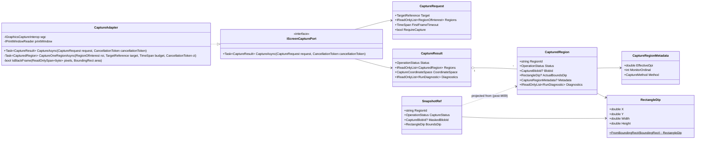
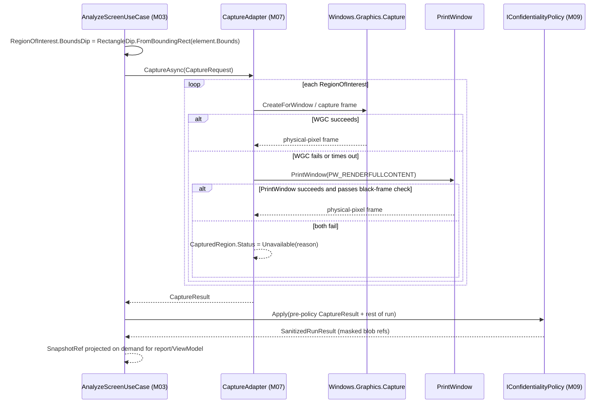

# DES-0015 Capture and Snapshot Correspondence Detailed Design

This is detailed-design package 8 from [DES-0007](des-0007-detailed-design-execution-strategy.md) section 4. It fixes how Surveyor captures a DPI-correct image of a target window/region, how that image's pixel geometry stays honestly correlated with the `DES-0009` domain model's `BoundingRect`, and how capture failure is marked instead of silently degraded, so capture adapter slice `IMP-0014` can proceed without inventing DPI or coordinate behavior. It is the second adapter-bound package and is unblocked by the accepted [ADR-0002](../decisions/adr-0002-adapter-technology-selection.md) (Windows.Graphics.Capture primary, PrintWindow fallback, unpackaged same-integrity default).

Canonical requirements stay in [gui-testability-analyzer-requirements.md](../../docs/gui-testability-analyzer-requirements.md) (`RQ-xxx`) and derived requirements in [requirements-definition.md](../requirements/requirements-definition.md) (`RD-xxx`).

## Trace Block

| Field | Content |
| -- | -- |
| Artifact | `DES-0015`, Capture and Snapshot Correspondence Detailed Design, detailed design phase |
| Upstream | [ADR-0002](../decisions/adr-0002-adapter-technology-selection.md) (Capture API decision, minimal-privilege); [TRC-0001](../traces/trc-0001-adr-0002-spike-measurements.md) (DPI virtualization and WGC failure-mode measurements); [DES-0002](des-0002-module-responsibility-basic-design.md) `M07`; [DES-0003](des-0003-module-interface-basic-design.md) `IScreenCapturePort`; [DES-0004](des-0004-analysis-flow-basic-design.md) Stage 4; [DES-0005](des-0005-vmodel-traceability-and-downstream-tests.md) `UT-0011`/`UT-0012`/`IT-0003`; [DES-0006](des-0006-screen-basic-design.md) `SCR-06` snapshot correspondence model; [DES-0007](des-0007-detailed-design-execution-strategy.md) package 8, `R-WIN-01`, `R-WIN-04`; [DES-0009](des-0009-domain-model-stable-keys-and-availability.md) `BoundingRect` (target-DPI-normalization rule delegated here), `SnapshotRef` (population delegated here), `Availability`/`UnavailableReason`; **[DES-0011](des-0011-port-dtos-status-model-and-use-case-orchestration.md) (binding, not merely referenced): `IScreenCapturePort.CaptureAsync` signature, `CaptureRequest`/`CaptureResult`/`RegionOfInterest`/`OperationStatus`/`RunDiagnostic` shapes, `AnalysisRunOptions.CaptureFirstFrameTimeout`/`ContinueWithoutCapture`/`RequireCapture` defaults, and `IStageTimeoutController`-owned stage timeout/cancellation precedence — this package fixes only the field detail DES-0011 left open (`CapturedRegion`, `CaptureCoordinateSpace`, `CaptureBlobId`) and adapter-internal mechanics, and does not rename methods or redefine already-fixed DTOs**; **[DES-0013](des-0013-confidentiality-storage-and-export.md) (binding, not merely referenced): `StoredCaptureArtifact(CaptureBlobId, RegionOfInterest, byte[] PngBytes, CaptureCoordinateSpace)` — fixes the image byte format as PNG and the store-side shape this package's `CaptureBlobId`/`CaptureCoordinateSpace` must resolve into unchanged** |
| Requirements | `RQ-011`, `RQ-016`, `RQ-027`, `RQ-028`; derived `RD-012`, `RD-013` |
| Downstream | Design review issue #37; `IMP-0014` issue #72; `IT-0003` issue #55; extends `UT-0011`/`UT-0012` (no new issue numbers — existing ViewModel/orchestration test intents, per `DES-0005`); `DES-0016` (overlay rendering, zoom/pan, in-app image host consume `RectangleDip`/`SnapshotRef` as fixed here) |
| Evidence | Capture DTO field detail conforming to the DES-0011-fixed port/DTO shapes; the physical-pixel coordinate contract shared with `DES-0009`'s `BoundingRect`; the pure, fakeable `BoundingRect` → `RectangleDip` mapping; the `SnapshotRef` population/projection rule reconciling `DES-0009`'s domain-owned type with the `DES-0011`-fixed `AnalysisRunResult`/`RegionOfInterest`/`CaptureResult` shapes without adding a field to any of them; the capture method selection/fallback rule; the failure-mode table (`R-WIN-04`); multi-monitor/occlusion/offscreen handling; Mermaid class/sequence diagrams; contract-closure tables; edge cases; fixture strategy with counter-examples; extended `UT-0011`/`UT-0012` intents; `IT-0003` integration assumptions |
| Verification | `tools/okf/Validate-Okf.ps1`; `git diff --check`; author-side `DRP-01`–`DRP-10` + DES-0007 §9 self-review (below); future `dotnet test tests/Surveyor.Adapters.Capture.Tests`, `dotnet test tests/Surveyor.Application.Tests --filter UT0012`, `dotnet test tests/Surveyor.Presentation.Tests --filter UT0011` once source exists; live `IT-0003` on the manual Windows gate (mixed-DPI monitor layout) |
| Residual Risk | Mixed-DPI monitor layout and yellow-border/consent visual behavior are measured on a single machine/DPI in `TRC-0001`, not exercised live yet (`IT-0003`); the black-frame heuristic is a pixel-uniformity check, not a guaranteed detector for every layered/GPU composition failure; WGC uncapturable windows (shell/`ApplicationFrameHost`-hosted) are enumerated from one smoke run, not exhaustively catalogued; `SnapshotRef` is defined here as a derived projection rather than a new stored field, which keeps `DES-0009`/`DES-0011` unmodified but means its lifetime is scoped to presentation/report construction, not the persisted run result itself (persisted capture identity is `StoredCaptureArtifact`, `DES-0013`) |

## Module Coverage

Primary module ([DES-0002](des-0002-module-responsibility-basic-design.md)):

- **`M07` Screen Capture** — DPI-correct capture of a target window/region into an in-memory image, with metadata (bounds, coordinate space, effective DPI, capture method) or an honest `Unavailable(reason)`/`Timeout`. Home: `Surveyor.Adapters.Capture` (adapter) implementing the application-owned `IScreenCapturePort`. Never foregrounds, moves, activates, or sends input to the target (`RQ-048`).

Not covered here: UIA/MSAA tree acquisition (`M05`/`M06` → `DES-0014`); scoring of acquired signals (`M08` → `DES-0010`); image masking/redaction technique and default retention (`M09` → `DES-0013`, this package defines only the pre-policy shape and the hand-off point); overlay rendering, zoom/pan, and the in-app image host control (`M01`/`M02` → `DES-0016`); concrete DI wiring (`M13` → `DES-0018`). `BoundingRect`, `Availability`/`UnavailableReason`, and `SnapshotRef`'s type identity are consumed/finalized as fixed by `DES-0009`; this package supplies the population rule `DES-0009` delegated for both.

## Scope And Non-Goals

In scope:

1. Capture DTO field detail not already fixed by `DES-0011` (`CapturedRegion`, `CaptureCoordinateSpace`, `CaptureBlobId`, `CaptureRegionMetadata`).
2. Capture method concretization on ADR-0002's decision (WGC primary, PrintWindow fallback), the selection/fallback algorithm, and the read-only posture of each.
3. Per-Monitor-V2 DPI awareness as an analyzer-process invariant, the resulting physical-pixel coordinate contract that closes `DES-0009`'s `BoundingRect` "target-DPI-normalized" delegation, and the pure `BoundingRect` → `RectangleDip` overlay-mapping function (`R-WIN-01`).
4. `SnapshotRef` population: the projection rule from `RegionOfInterest` + `CapturedRegion` (post-`M09`) to the `DES-0009`-owned `SnapshotRef` value, used by `SCR-06`/`M10` without adding a field to any already-fixed DTO.
5. Capture failure-mode table (black frame / layered / GPU / DWM / WGC-uncapturable / disposed target) → `Unavailable(reason)` / `Timeout` (`R-WIN-04`).
6. Multi-monitor spanning, occlusion, and offscreen/minimized handling — including the explicit finding that WGC/PrintWindow(`PW_RENDERFULLCONTENT`) capture is *not* generally defeated by z-order occlusion, only by the failure modes in (5).
7. Image format and the confidentiality "apply point" (this package returns pre-policy bytes only; masking technique is `DES-0013`'s).
8. `UT-0011`/`UT-0012` test-intent extensions (fakes only) and `IT-0003` integration assumptions.
9. IT fixture-app capture-relevant content (layered/owner-draw/DPI-scaled fixture window, `R-OPS-03`).

Non-goals (owned elsewhere):

- UIA/MSAA tree acquisition, read-only audit, legacy edge table → `DES-0014`.
- Image masking/redaction rule, default retention, export sanitization → `DES-0013` (this package defines only the pre-policy `CaptureResult`/`CapturedRegion` shape and the hand-off point into `IConfidentialityPolicy`).
- Overlay rendering, zoom/pan, cropping UI, in-app image host (WebView2 vs native `Image` control) → `DES-0016`.
- Scoring/classification → `DES-0010`.
- Concrete provider registration / lifetimes → `DES-0018`.
- Elevated-target and true mixed-DPI-monitor live behavior calibration → carried to `IT-0003` (this package specifies the rule; live confirmation is the manual gate).

## Upstream Decisions (binding)

- **ADR-0002 §Decision**: Capture is **Windows.Graphics.Capture (WGC) primary, `PrintWindow(PW_RENDERFULLCONTENT)` fallback**. WGC is compositor-side (no message sent into the target, handles occlusion); PrintWindow is necessary for WGC-uncapturable windows and degrades via this package's failure-mode table. Packaging is unpackaged/same-integrity default (no capture-specific constraint measured).
- **TRC-0001 measured findings (binding inputs to this package)**:
  - **DPI virtualization**: a capture path run from a non-Per-Monitor-V2-aware process received virtualized bounds (455×537 via `GetWindowRect`) for a window WGC captured at physical 664×796 from a PMv2-aware path. This is the direct evidence that Surveyor's analyzer process itself must be, and stay, PMv2-aware, and that "target-DPI-normalized" means *physical pixels, not analyzer-side rescaling*.
  - **WGC uncapturable windows**: `IGraphicsCaptureItemInterop.CreateForWindow` throws `ArgumentException` for the shell window (`Program Manager`) and a UWP window hosted by `ApplicationFrameHost`; both must fall back to PrintWindow, then to `Unavailable` if that also fails.
  - **WGC first-frame latency** (~400 ms on the measurement machine, async frame-pool warm-up) is already budgeted by `DES-0011`'s `AnalysisRunOptions.CaptureFirstFrameTimeout` default (5 seconds); this package does not redefine that default, only consumes it.
  - **PrintWindow read-only caveat**: `PrintWindow` sends a `WM_PRINT`-style render request into the target (a technical repaint), accepted in ADR-0002 as within the `RQ-048` read-only guarantee for capture (distinguished from any *state-changing* UIA pattern, which remains `DES-0014`'s concern).
- **DES-0003 `IScreenCapturePort`**: DPI-aware image capture of a window/region; input `CaptureRequest` (target + ROI bounds); output `CaptureResult` (image bytes + bounds/DPI metadata) or `Unavailable(reason)`; must not foreground/move/activate/send input; image bytes excluded from scoring; image confidential by default, routed through `M09` before emit/persist; no capture API types cross the port signature.
- **DES-0009**: `BoundingRect` is `int X, Y, Width, Height`, "target-DPI-normalized per `DES-0015`" — this package fixes that phrase to mean *physical pixels, virtual-screen origin, as read by a Per-Monitor-V2-aware caller* (no rescale). `SnapshotRef` is "opaque reference + capture metadata... population is `DES-0015`" — this package fixes it as a **derived projection**, not a new stored field (see Data And Contract Design).
- **DES-0011 (binding, fixed there — not redefined here)**: `IScreenCapturePort.CaptureAsync(CaptureRequest, ct) -> CaptureResult`; `CaptureRequest(TargetReference Target, IReadOnlyList<RegionOfInterest> Regions, TimeSpan FirstFrameTimeout, bool RequireCapture)`; `CaptureResult(OperationStatus Status, IReadOnlyList<CapturedRegion> Regions, CaptureCoordinateSpace CoordinateSpace, IReadOnlyList<RunDiagnostic> Diagnostics)`; `RegionOfInterest(string Id, ElementKey? ElementKey, RectangleDip? BoundsDip, RegionPurpose Purpose, string SourceFindingId, RunDiagnostic? Diagnostic)` with deterministic order by `(SourceFindingId, ElementKey, Id)`; `AnalysisRunOptions.CaptureFirstFrameTimeout` (5s default), `ContinueWithoutCapture` (true default), `RequireCapture` (false default); the `IStageTimeoutController` race rule (caller cancellation wins). This package's field detail (`CapturedRegion`, `CaptureCoordinateSpace`, `CaptureBlobId`, `RectangleDip`, `CaptureRegionMetadata`) and adapter-internal mechanics fit inside those fixed shapes without renaming a method or adding/removing a field on any of them.
- **DES-0013 (binding, fixed there — not redefined here)**: `StoredCaptureArtifact(CaptureBlobId CaptureBlobId, RegionOfInterest Region, byte[] PngBytes, CaptureCoordinateSpace CoordinateSpace)` — the image byte format is **PNG** (fixed by `DES-0013`, consumed as-is); masking technique and default retention are `DES-0013`'s; this package's `CaptureBlobId`/`CaptureCoordinateSpace` definitions must resolve into that shape unchanged.
- **DES-0006 `SCR-06`**: snapshot viewer needs two-way list↔image correspondence, uncapturable regions shown (not hidden), and a metadata-driven (not image-analysis) correspondence so it stays deterministic and ViewModel-unit-testable.

## Data And Contract Design

`IScreenCapturePort`'s method signature and the `CaptureRequest`/`CaptureResult`/`RegionOfInterest` shapes are fixed by `DES-0011` and are **consumed as-is below, not redefined**. This package fixes only the field detail `DES-0011` left open (`CapturedRegion`, `CaptureCoordinateSpace`, `CaptureBlobId`) plus two new pure value types the overlay/report path needs (`CaptureRegionMetadata`, `RectangleDip`'s conversion rule) and the adapter-internal capture mechanics.

### The physical-pixel coordinate contract (closes `DES-0009`'s `BoundingRect` delegation)

Surveyor's WinUI 3 host (`Surveyor.App`) is manifested **Per-Monitor-V2 DPI aware** (already an architecture-level decision, [DES-0001](../architecture/des-0001-initial-architecture.md) §1.6/§8, reasserted here as a binding invariant this package depends on). Under PMv2 awareness, Win32 geometry APIs (`GetWindowRect`, UI Automation's `BoundingRectangle`) return **true physical pixels** for *any* window regardless of that window's own per-window DPI-awareness state — DPI virtualization (bitmap-stretching, coordinate scaling) is something Windows applies only to a *caller* that is **not** per-monitor aware. `TRC-0001` measured exactly this: a non-PMv2-aware capture path received virtualized 455×537 bounds for a window a PMv2-aware path (WGC) captured at physical 664×796.

Therefore: **"target-DPI-normalized" (`DES-0009` `BoundingRect`) means physical pixels, virtual-screen origin (which may be negative for monitors left of/above the primary), as observed by a PMv2-aware reader — no rescaling is applied by this package or by `DES-0014`.** This package's obligation is twofold:

1. **Guarantee capture output shares the same physical-pixel convention** as `BoundingRect`, so a `RegionOfInterest.BoundsDip` (computed from `ScreenModel`) lines up pixel-for-pixel against the corresponding `CapturedRegion` without any capture-path-dependent correction.
2. **Record effective DPI as metadata, not as a rescale input** (`CaptureRegionMetadata.EffectiveDpi` below) — for report readability, cross-run comparability (`RD-021` ceiling: comparisons across differently-scaled displays are honestly labeled, not silently normalized), and as a live self-check: if the analyzer process's own DPI-awareness context is ever found to be *not* PMv2 at capture time (`GetThreadDpiAwarenessContext` / `GetAwarenessFromDpiAwarenessContext`), the adapter records `CaptureCoordinateSpace.PhysicalPixelsUnverified` instead of silently trusting a possibly-virtualized value (see enum below).

### `RectangleDip` (new type, the overlay-mapping unit `DES-0011`'s `RegionOfInterest.BoundsDip` needs)

```csharp
public readonly record struct RectangleDip(double X, double Y, double Width, double Height);
```

`RectangleDip` is the **identity cast of `BoundingRect` to floating point** — `X`/`Y`/`Width`/`Height` numerically unchanged, no DPI rescale:

```csharp
public static RectangleDip FromBoundingRect(BoundingRect r) =>
    new(r.X, r.Y, r.Width, r.Height);
```

This is deliberate, not an oversight: Surveyor's canonical overlay/report coordinate space is anchored to the **captured image's own physical-pixel grid** (1 unit = 1 pixel of the image at the resolution it was actually captured at, which — by the contract above — equals the source window's physical bounds). Rendering that canvas at the correct on-screen size for the *reviewing* monitor's own DPI, and any zoom/pan, is native WinUI/XAML scaling behavior applied at display time — a `DES-0016` concern (overlay rendering, zoom control), not a numeric transform this package needs to perform or a live DPI value `M03` (which has no Win32 access, `RQ-054`) would otherwise need to obtain mid-orchestration. `FromBoundingRect` is a pure, total function over already-domain-fixed input — trivially fakeable and exactly the "purely functional overlay coordinate mapping" `DES-0007` §6 requires. It is called by `AnalyzeScreenUseCase` (`M03`) at ROI-selection time (`DES-0004` Stage 6) to populate `RegionOfInterest.BoundsDip` from the `UiElement.Bounds` of the finding's element — no capture has happened yet at that point, and none needs to have, since no rescale is involved.

### `CaptureCoordinateSpace` (field detail fixed here, referenced by `DES-0011` and `DES-0013`)

```csharp
public enum CaptureCoordinateSpace
{
    PhysicalPixels,            // v1 canonical value: matches BoundingRect 1:1, PMv2-awareness self-check passed
    PhysicalPixelsUnverified,  // capture ran while the analyzer's own DPI-awareness context could not be confirmed as Per-Monitor-V2; same nominal units, carried as a named residual risk (see below)
}
```

One value per `CaptureResult` (`DES-0011`-fixed field), applying to every region in that result — a single capture run does not mix coordinate spaces mid-run.

### `CaptureBlobId` and `CapturedRegion` (field detail fixed here)

```csharp
public readonly record struct CaptureBlobId(Guid Value);

public enum CaptureMethod { Wgc, PrintWindow }

public sealed record CaptureRegionMetadata(
    double EffectiveDpi,     // GetDpiForWindow(hwnd) at capture time; 96.0 = unscaled baseline (100%)
    int MonitorOrdinal,      // within-run opaque monitor index (session-local; not a persistent hardware id, mirrors DES-0014's within-session ordering discipline), used only to explain "which monitor" in diagnostics/report, never as report/comparison key material
    CaptureMethod Method);   // which of the two ADR-0002 candidates actually produced this region's bytes

public sealed record CapturedRegion(
    string RegionId,                    // == the RegionOfInterest.Id it was captured for (DES-0011 RegionOfInterest.Id)
    OperationStatus Status,             // Ok | Unavailable | Timeout, per DES-0011 OperationStatus — no parallel status enum
    CaptureBlobId? BlobId,               // null when Status != Ok
    RectangleDip? ActualBoundsDip,       // the region's bounds as actually cropped from the captured image; null when not captured; equals the requested BoundsDip unless the region was clipped at the window/monitor edge
    CaptureRegionMetadata? Metadata,     // null when Status != Ok
    IReadOnlyList<RunDiagnostic> Diagnostics);
```

`RegionId` closes the round-trip between the capture *request* (`CaptureRequest.Regions`, `RegionOfInterest.Id`) and the capture *result* (`CaptureResult.Regions`, `CapturedRegion.RegionId`) — every requested ROI has exactly one corresponding result region, in the same order as the request (`DRP-03`/`DRP-04`). `ActualBoundsDip` is reported separately from the requested `BoundsDip` because a region can be clipped (partially offscreen/off-monitor) — this keeps clipping an honest, inspectable fact instead of a silent geometry mismatch.

The in-memory `byte[]` for a captured region is **not** a `CapturedRegion` field. `CapturedRegion` is the adapter/use-case-internal, pre-policy shape; the actual PNG bytes live behind `CaptureBlobId` in an adapter-owned in-process blob table (mirrors `DES-0014`'s `Win32TargetHandle` pattern: an opaque token stands in for a resource that must not leak across the port as a raw reference) until `IConfidentialityPolicy.Apply` (`M09`) resolves it into the `DES-0013`-fixed `StoredCaptureArtifact.PngBytes` for storage, or a `MaskedCapture` for export. This keeps `RQ-052` intact: nothing downstream of the adapter holds raw image bytes outside the policy gate by construction, not by convention.

### `SnapshotRef` population (closes `DES-0009`'s delegation without touching `DES-0011`'s fixed shapes)

`DES-0009` names `SnapshotRef` ("opaque reference + capture metadata") as a domain-owned value type whose *population* this package owns, but no `DES-0011`-fixed type (`AnalysisRunResult`, `ScreenModel`, `UiElement`) carries a `SnapshotRef` field — `AnalysisRunResult.RegionsOfInterest` (list of `RegionOfInterest`) and `AnalysisRunResult.Capture` (`CaptureResult`) are the only capture-adjacent fields `DES-0011` fixed. Adding a `SnapshotRef` field to any of those closed types now would be exactly the upstream drift `DRP-01` exists to catch.

This package resolves the delegation as a **derived projection, not a stored field**: `SnapshotRef` is constructed on demand by zipping `AnalysisRunResult.RegionsOfInterest[i]` with the matching `AnalysisRunResult.Capture.Regions[j]` where `Regions[j].RegionId == RegionsOfInterest[i].Id`, after the pair has passed through `IConfidentialityPolicy.Apply` (`M09`):

```csharp
public sealed record SnapshotRef(
    string RegionId,
    OperationStatus CaptureStatus,     // Ok | Unavailable | Timeout — carried through so SCR-06 shows uncapturable markers, not omission (DES-0006 §6)
    CaptureBlobId? MaskedBlobId,       // post-M09 reference; null when CaptureStatus != Ok
    RectangleDip BoundsDip);
```

The zip/projection function (`M04`-homed pure helper per `DES-0009`'s "value type owned here" framing, called by `M10`'s report writer and by `M02`'s ViewModel — never by `M07`/`M03` themselves) is deterministic, order-preserving on `RegionsOfInterest`'s existing `(SourceFindingId, ElementKey, Id)` order, and needs no image bytes to run — it only needs the two already-fixed lists plus the post-policy blob reference. This is exactly what `DES-0006 §6` requires ("metadata-driven... no image analysis... deterministic and testable at the ViewModel level").

## Contract Closure

### Port-method I/O derivation

| Method | Input → source | Output → consumer |
| -- | -- | -- |
| `IScreenCapturePort.CaptureAsync(CaptureRequest, ct)` | `CaptureRequest.Target` = Stage-1/2 `TargetReference` (`DES-0014`); `CaptureRequest.Regions` = Stage-6 `RegionOfInterest` list built by `AnalyzeScreenUseCase` from `ScreenModel.Bounds` via `RectangleDip.FromBoundingRect`; `FirstFrameTimeout`/`RequireCapture` = `AnalysisRunOptions` caller input; image bytes = outward WGC/PrintWindow read | `CaptureResult` → `AnalyzeScreenUseCase` → `AnalysisRunResult.Capture` (for report/store) and, via the `SnapshotRef` projection, → `M10` report writer / `M02` ViewModel for `SCR-06` |

Every input is derivable from caller input, a prior-stage output (`DES-0014`'s `TargetReference`, `M03`'s own `RegionOfInterest` construction), or an outward read through the defined contract; every output has a named inward consumer (`DRP-03`).

### DTO field ownership

| Field | Single writer | Write timing | Sync / fabrication rule |
| -- | -- | -- | -- |
| `RegionOfInterest.BoundsDip` | `AnalyzeScreenUseCase` (`M03`), via `RectangleDip.FromBoundingRect` | Stage 6, before the capture call | Identity cast of the already-final `UiElement.Bounds`; never independently recomputed downstream |
| `CapturedRegion.RegionId` | capture adapter | per region, at capture | must equal a `RegionOfInterest.Id` from the same request; consumers never fabricate a match |
| `CapturedRegion.ActualBoundsDip` | capture adapter | per region, at capture | reported even when it differs from the requested `BoundsDip` (clipping); never silently corrected to match the request |
| `CapturedRegion.Status` / `CaptureResult.Status` | capture adapter | at capture / at run completion | `OperationStatus` values only; consumers never upgrade `Unavailable`/`Timeout` to `Ok` |
| `CaptureRegionMetadata.EffectiveDpi` / `.Method` | capture adapter | per region, at capture | recorded, never used to rescale `ActualBoundsDip`; audit/report/comparability data only |
| `CaptureCoordinateSpace` | capture adapter | at run completion (adapter startup PMv2 self-check) | `PhysicalPixelsUnverified` is set (never silently defaulted to `PhysicalPixels`) when the self-check cannot confirm PMv2 awareness |
| `SnapshotRef` | derived projection (`M04`-homed helper) | on demand, at report/ViewModel construction, post-`M09` | never persisted as its own field; recomputable at any time from `RegionsOfInterest` + `Capture`; `MaskedBlobId` only ever holds a post-policy reference |

### Round-trip inventory

- **`CaptureRequest.Regions` ⇄ `CaptureResult.Regions`**: every requested `RegionOfInterest.Id` has exactly one `CapturedRegion.RegionId` match, same cardinality and order-correlatable — no request can silently vanish from the result (`DRP-04`).
- **`CapturedRegion` (pre-policy) ⇄ `StoredCaptureArtifact` (`DES-0013`, post-policy)**: `CaptureBlobId` and `CaptureCoordinateSpace` are the same types end to end; `PngBytes` is the resolved content behind the pre-policy blob id after `IConfidentialityPolicy.Apply`; `RegionOfInterest` is carried unchanged. Symmetric types in both directions, no shape invented at the store boundary.
- **`SnapshotRef` projection is not a persistence round-trip** — it is recomputed from already-round-tripped data (`RegionsOfInterest`, `Capture`/`StoredCaptureDocument`) each time it is needed; there is nothing to save/load for `SnapshotRef` itself.

## Capture Method Selection And Fallback (`ADR-0002`, `R-WIN-04`)

For each requested region, per run:

1. **Try WGC** (`Windows.Graphics.Capture`, via `IGraphicsCaptureItemInterop.CreateForWindow`). Compositor-side; no message into the target; handles occlusion and DWM/layered/GPU-composited content by construction (captures the window's own render surface, not a screen rectangle).
   - If `CreateForWindow` throws `ArgumentException` (measured: shell window, `ApplicationFrameHost`-hosted UWP windows) → step 2.
   - If frame pool warm-up exceeds `AnalysisRunOptions.CaptureFirstFrameTimeout` (5 s default, via `IStageTimeoutController` at the *stage* level; **per-region** first-frame wait is bounded by the same budget divided across remaining regions, never re-extended per region) → that region's `Status = Timeout`; continue with the next region rather than aborting the whole capture stage.
2. **Fall back to `PrintWindow(PW_RENDERFULLCONTENT)`.** Synchronous, ~40 ms/frame measured; accepted `WM_PRINT`-style read-only caveat (`ADR-0002`). Run a **black-frame heuristic** (below) on the result before accepting it as `Ok`.
3. **If both fail** (or the black-frame heuristic rejects the PrintWindow result) → `CapturedRegion.Status = Unavailable`, with a `RunDiagnostic.Code` naming the specific failure category (failure-mode table below). Per-region failure never aborts the other regions in the same `CaptureRequest` (partial capture is expected, not exceptional, matching `AnalysisRunOptions.ContinueWithoutCapture = true` default).

**Black-frame heuristic** (deterministic, pure, fakeable over decoded pixel data): a captured region is rejected as a black/blank frame when ≥ 99% of sampled pixels (a fixed deterministic grid sample, not every pixel, for performance) are within a narrow tolerance of a single uniform color (typically pure black or pure transparent) **and** the requested region's `BoundingRect` area exceeds a minimum size (small regions can be legitimately near-uniform, e.g. a blank `Pane`) — this is a defense-in-depth signal, not a certainty; see Residual Risks.

## Capture Failure-Mode Table (`R-WIN-04`)

| Failure mode | Detection | Outcome | Notes |
| -- | -- | -- | -- |
| WGC `CreateForWindow` `ArgumentException` (shell / `ApplicationFrameHost`-hosted UWP) | exception from the interop call | fall back to PrintWindow | measured in `TRC-0001`; window-state at failure time (e.g. minimized) not fully characterized — residual risk |
| WGC/PrintWindow first-frame timeout | `IStageTimeoutController` budget exceeded for that region | `Timeout`; other regions continue | budget = `AnalysisRunOptions.CaptureFirstFrameTimeout`, consumed not redefined |
| Layered/GPU/DWM-composited black frame via PrintWindow | black-frame heuristic (above) | `Unavailable(reason: BlackFrame)`; WGC was already tried first, so this only occurs when WGC also failed | PrintWindow-only limitation; WGC's compositor-side capture is the primary mitigation, not a fix applied to PrintWindow itself |
| Target window closed/disposed mid-capture | capture API returns an unexpected handle-invalid error | `Unavailable(reason: TargetDisposed)` | run continues; does not retry against a resolved-but-stale `TargetReference` |
| Minimized / fully offscreen window | window state check before capture attempt (`IsIconic`/off-virtual-screen bounds) | `Unavailable(reason: Offscreen)` | reuses `DES-0009`'s existing `UnavailableReason.Offscreen` value at the `RunDiagnostic` level for consistency with acquisition-side marking; capture is not attempted, avoiding a guaranteed black/blank frame |
| Occlusion by another window (z-order) | — (not a distinct capture failure for either candidate) | `Ok`, normal capture | explicit non-failure: WGC captures the window's own compositor surface regardless of z-order; PrintWindow with `PW_RENDERFULLCONTENT` requests a full redraw independent of on-screen visibility. `IT-0003` still exercises this case to prove it, since it is easy to regress if a future capture-path change silently drops `PW_RENDERFULLCONTENT` or falls back to a naive screen-rect copy |
| Analyzer process not confirmed Per-Monitor-V2 aware at capture time | `GetAwarenessFromDpiAwarenessContext` self-check at adapter construction | `CaptureCoordinateSpace = PhysicalPixelsUnverified` for the whole result (not per-region) | defense-in-depth against the exact virtualization bug measured in `TRC-0001`; does not block the run, marks it for honest downstream handling (e.g. report footnote) |

## Multi-Monitor Handling

A top-level window's *effective* DPI (used for `CaptureRegionMetadata.EffectiveDpi`) is read once per capture via `GetDpiForWindow(hwnd)` — the OS-maintained per-window DPI that already accounts for which monitor the window is currently considered to belong to (Windows updates this via `WM_DPICHANGED` as a PMv2-aware window moves across monitors; Surveyor does not re-derive "which monitor" itself for this purpose). `CaptureRegionMetadata.MonitorOrdinal` (a within-run index, not a persistent hardware id) is recorded only for diagnostics/report narrative ("captured from monitor 2") and is never key material or a comparability input. A window whose bounds genuinely straddle two differently-scaled monitors is a known Windows per-monitor-DPI edge case (sub-regions can render at slightly mismatched effective scale near the boundary); this package does not attempt sub-window DPI stitching — it records the single effective DPI Windows reports for the window and carries the boundary-rendering edge case as a residual risk exercised by `IT-0003`, not solved analytically.

## Class Design (UML)





## Edge Cases

| Case | Behavior |
| -- | -- |
| Requested region only partially on-monitor (window dragged mostly offscreen) | `CapturedRegion.ActualBoundsDip` reports the clipped extent honestly; `Status = Ok` if any pixels were captured, `Unavailable(Offscreen)` if none were |
| `RequireCapture = true` and every region fails | Run-level `CaptureResult.Status = Unavailable`; `AnalyzeScreenUseCase` treats this as making the run partial/failed per `AnalysisRunOptions.RequireCapture` semantics (`DES-0011`, consumed as-is) |
| `RequireCapture = false` (default) and capture fails | Run continues as `PartialResult`; `SCR-06` shows the uncapturable marker per region, never omits the finding (`DES-0006` §6) |
| Cancellation mid-capture (multiple regions requested) | Cooperative check between regions; a region already in flight completes or is abandoned per the same node-boundary discipline as `DES-0014`'s acquisition cancellation; caller cancellation wins over the stage timeout (`IStageTimeoutController` race rule, consumed) |
| Zero regions requested (no findings needed a snapshot) | `CaptureAsync` is not called; `AnalysisRunResult.Capture` remains `null`, not an empty `CaptureResult` — avoids fabricating a vacuous "capture ran" record |
| Duplicate `RegionOfInterest.Id` in a request (should not happen given `DES-0011`'s deterministic ROI construction) | Adapter treats it as a caller contract violation (`ArgumentException`), not a silently-deduplicated capture — this package does not invent tolerance for an upstream invariant break |
| Analyzer briefly loses PMv2 awareness (e.g. a diagnostic/test harness runs the adapter unaware) | `CaptureCoordinateSpace.PhysicalPixelsUnverified` for the whole result; capture still attempted (not blocked), so partial analysis remains possible, but the result is honestly flagged rather than silently trusted |

## Diagnostics And Logging

Cross-cut owned by `DES-0011`/`DES-0013`; this package's diagnostics are safe by construction: `RunDiagnostic.Code` values (e.g. `Capture.Unavailable.BlackFrame`, `Capture.Unavailable.WgcUncapturable`, `Capture.Unavailable.Offscreen`, `Capture.Unavailable.TargetDisposed`, `Capture.Timeout.FirstFrame`, `Capture.CoordinateSpace.Unverified`) carry no raw title/`Name`/path — only the `RegionOfInterest.Id`, `CaptureMethod`, and `EffectiveDpi` as `SafeArgs`, mirroring `DES-0014`'s diagnostics-model discipline. Image bytes never appear in a diagnostic.

## Fixture Strategy

- **Synthetic capture fixtures** (deterministic, no live window): a fake `IScreenCapturePort` returning canned `CaptureResult`s per scenario (success at declared DPI, WGC-fail-then-PrintWindow-succeed, both-fail, black-frame-rejected, offscreen, clipped-region) — used by `UT-0012` (orchestration) and `UT-0011` (ViewModel/`SCR-06` correspondence), neither of which needs a live window.
- **Counter-example fixtures**: a fixture asserting the naive "always trust PrintWindow" implementation must fail the black-frame check (deliberately-uniform-color fixture image); a fixture asserting a `RectangleDip` that silently rescales by some DPI factor must fail the `FromBoundingRect` identity-mapping test (deliberately different-DPI expected value that only an incorrect rescaling implementation would produce).
- **IT fixture-app content** (`DES-0008` harness, incremental per `R-OPS-03`): the fixture app gains a layered/semi-transparent window and a deliberately owner-drawn (GDI, non-DWM-composited) surface, exercised live under `IT-0003` at more than one display-scale setting.

## Unit-Test Intent

| UT | Intent | Meaningful oracle | Anti-pattern avoided | Counter-example |
| -- | -- | -- | -- | -- |
| `UT-0011` (extended) | `SCR-06` correspondence renders `SnapshotRef` (post-`M09`) with uncapturable regions shown as explicit markers, never omitted; selection state syncs both directions with `SCR-05` | Fixture `AnalysisRunResult` with a mix of `Ok`/`Unavailable` `CapturedRegion`s drives the ViewModel via fakes; the `Unavailable` region still produces a bound, marked overlay entry, not a missing one | Testing only the all-`Ok` happy path; asserting pixel content instead of the metadata-driven correspondence | fixture where an `Unavailable` region is silently dropped from the ViewModel's region list must fail |
| `UT-0012` (extended) | Orchestration threads capture as optional-by-default (`ContinueWithoutCapture`), required-by-option, and partial across multiple ROIs, over an `IScreenCapturePort` fake; `RegionOfInterest.BoundsDip` is populated by `RectangleDip.FromBoundingRect` before the capture call, not fabricated after | Fake capture port returns per-region success/failure combinations; asserts `AnalysisRunResult.Capture` reflects them unmodified and `RunOutcome` follows `RequireCapture` semantics; asserts `BoundsDip` numerically equals the source `BoundingRect` (identity, no rescale) | Faking capture at a level that bypasses the use case's own `RequireCapture`/partial-result logic; asserting a rescaled `BoundsDip` value that only an incorrect DPI-conversion implementation would produce | a fake that returns `Unavailable` for a required region but the use case still reports `Completed` (not partial/failed) must fail |

Additionally (adapter-level, once `Surveyor.Adapters.Capture.Tests` exists): the black-frame heuristic and the `CaptureCoordinateSpace.PhysicalPixelsUnverified` self-check are unit-testable in isolation over synthetic pixel buffers and a fake DPI-awareness query, with no live window.

## Integration Assumptions

- Windows 11, same-integrity default, unpackaged self-contained build (`ADR-0002`); no capture-specific elevation requirement identified.
- Runs on the **manual developer Windows gate** (`DES-0007` §8.2, `R-OPS-01`); UT stays headless/unattended (no live window/monitor dependency).
- `IT-0003`: DPI awareness (at least two display-scale settings, e.g. 100%/150%), occlusion (prove it is *not* a failure for either capture candidate), multi-monitor (a fixture window moved across monitors of differing scale), and offscreen/minimized → `Unavailable` marking. Mixed-DPI-monitor live behavior and yellow-capture-border/consent visuals are carried from `TRC-0001` as not-yet-exercised-live (single-DPI measurement machine).
- Live legacy-edge coverage (layered/owner-draw fixture content) grows incrementally with the `DES-0008` IT fixture app, shared with `DES-0014`.

## Downstream Handoff

- **Candidate project area**: `Surveyor.Adapters.Capture` (`M07`), port already in `Surveyor.Application.Ports`; tests in `Surveyor.Adapters.Capture.Tests`; the `RectangleDip.FromBoundingRect` pure function and the `SnapshotRef` projection helper are `Surveyor.Domain`-homed per `DES-0009`'s "value type owned here" framing (no adapter dependency, callable from `M03`/`M10`/`M02`).
- **First failing tests**: `UT-0012` "capture failure on a required region marks the run partial/failed, not completed"; `UT-0011` "an uncapturable snapshot region renders as an explicit marker, never omitted" — both written red before adapter code, over fakes only.
- **Implementation slice**: `IMP-0014` (capture adapter, #72) — WGC-primary/PrintWindow-fallback selection, black-frame heuristic, `CaptureRegionMetadata`/`CaptureCoordinateSpace` population, the PMv2 self-check.
- **Verification command**: `dotnet test tests/Surveyor.Adapters.Capture.Tests`, `dotnet test tests/Surveyor.Application.Tests --filter UT0012`, `dotnet test tests/Surveyor.Presentation.Tests --filter UT0011`, plus `Surveyor.Architecture.Tests` for the read-only/layering guards; `IT-0003` on the manual Windows gate.
- **Minimal context bundle** for the implementing agent: this package's [Data And Contract Design](#data-and-contract-design), [Capture Method Selection And Fallback](#capture-method-selection-and-fallback-adr-0002-r-win-04), [Capture Failure-Mode Table](#capture-failure-mode-table-r-win-04), and [Multi-Monitor Handling](#multi-monitor-handling); `RQ-011`/`RQ-016`/`RQ-027`/`RQ-028` from the requirement source; `DES-0009`'s `BoundingRect`/`Availability` types; `DES-0011`'s fixed `CaptureRequest`/`CaptureResult`/`RegionOfInterest`/`AnalysisRunOptions` capture defaults; `ADR-0002` §Decision and §Measurement results. Reading `DES-0001`/`DES-0004` in full is not required.
- **Unblocks**: `DES-0016` (overlay rendering consumes `RectangleDip`/`SnapshotRef` as fixed here), `DES-0017` (capture-stage performance calibration), `DES-0018` (adapter provider wiring), and the `IT-0003` live-Windows track.

## Self-Review Evidence (author-side, DES-0007 §5 step 8)

| Pattern | Result |
| -- | -- |
| `DRP-01` Upstream drift | checked clean. `IScreenCapturePort.CaptureAsync` and `CaptureRequest`/`CaptureResult`/`RegionOfInterest` are consumed verbatim from `DES-0011`; `BoundingRect`/`Availability`/`SnapshotRef`(-identity) from `DES-0009`; `StoredCaptureArtifact`'s `CaptureBlobId`/`CaptureCoordinateSpace`/PNG format from `DES-0013`. No method renamed, no field added to any already-fixed type. `SnapshotRef` — named by two upstream packages but never wired into a stored field by either — is resolved as a derived projection specifically *because* adding a field to `AnalysisRunResult`/`RegionOfInterest` now would itself be `DRP-01` drift against `DES-0011`; this is recorded as a reconciliation, not silently assumed. |
| `DRP-02` Dangling reference | fix applied during authoring. `CapturedRegion`, `CaptureCoordinateSpace`, `CaptureBlobId`, `CaptureRegionMetadata`, `RectangleDip`, `SnapshotRef`, `CaptureMethod` are all defined with fields here; upstream types (`CaptureRequest`, `CaptureResult`, `RegionOfInterest`, `BoundingRect`, `Availability`, `OperationStatus`, `RunDiagnostic`, `StoredCaptureArtifact`) resolve to `DES-0009`/`DES-0011`/`DES-0013` and are not re-declared. |
| `DRP-03` Data-flow closure | checked clean. The port I/O derivation table traces `CaptureRequest`'s inputs to Stage-1/2 output and Stage-6 ROI construction, and `CaptureResult`'s output to the report/ViewModel consumers via the `SnapshotRef` projection. |
| `DRP-04` Round-trip asymmetry | checked clean. `CaptureRequest.Regions` ⇄ `CaptureResult.Regions` correlate 1:1 by `RegionId`; `CapturedRegion` ⇄ `StoredCaptureArtifact` share `CaptureBlobId`/`CaptureCoordinateSpace`/`RegionOfInterest` types symmetrically; `SnapshotRef` is explicitly documented as *not* a round-trip (recomputed, not persisted), closing what would otherwise be an unanswered "where does this load from" question. |
| `DRP-05` Unowned field | checked clean. Every new field in the DTO field-ownership table names a single writer, write timing, and a fabrication rule (e.g. `ActualBoundsDip` is reported even when it disagrees with the request, never silently corrected). |
| `DRP-06` Rule overlap without precedence | checked clean. Capture method selection is an ordered fallback (WGC → PrintWindow → `Unavailable`), not two rules that could both match; the failure-mode table's rows are each keyed to a distinct, non-overlapping detection signal (exception type, heuristic result, window-state check), with "occlusion" explicitly called out as a non-match for any failure row. |
| `DRP-07` Numeric under-specification | N/A — this package introduces no score/threshold arithmetic (owned by `DES-0010`); `RectangleDip.FromBoundingRect` is an explicit identity cast (double-precision, no rounding rule needed since no arithmetic transform occurs); the black-frame heuristic's sampling grid and tolerance are implementation-detail constants for `IMP-0014`, not decision-affecting numerics in the domain sense. |
| `DRP-08` Missing failure semantics | fix applied during authoring. Every capture I/O boundary (WGC, PrintWindow, per-region timeout, cancellation) has a defined outcome in the failure-mode table and edge-case table; cancellation-vs-timeout precedence is inherited from `DES-0011`'s `IStageTimeoutController` race rule, not redefined; partial-capture-continues-the-run is explicit, not implied. |
| `DRP-09` Port ownership ambiguity | checked clean. `IScreenCapturePort` remains application-owned (`DES-0003`/`DES-0011`, unchanged here); `Surveyor.Adapters.Capture` depends inward on it; the `RectangleDip.FromBoundingRect`/`SnapshotRef` helpers are declared `Surveyor.Domain`-homed, matching `DES-0009`'s "value type owned here" statement, not adapter- or presentation-homed. |
| `DRP-10` Patch regression | N/A for this initial authoring pass (no prior review round to regress against yet); the pattern will apply to any fix-loop round following L2 review of this PR. |

DES-0007 §9: Trace/module-coverage/guardrails (`RQ-048` read-only capture posture, `RQ-051` no capture-path-dependent geometry drift, `RQ-052` image confidentiality apply-point, `RQ-054` no capture API type crosses the port)/determinism/confidentiality/testability/unit-test-intent/handoff — all present above.

## Residual Risks

- Mixed-DPI-monitor layout and yellow-capture-border/consent visual behavior are measured on a **single machine at a single DPI (144, 150%)** in `TRC-0001`; genuine multi-DPI-monitor live behavior is carried to `IT-0003` as not yet exercised.
- The black-frame heuristic is a **pixel-uniformity signal, not a certain detector** — a legitimately near-uniform-color window (e.g. a mostly-blank dialog) above the size threshold could, in principle, be misclassified; it is a defense-in-depth check layered on top of the WGC-primary/PrintWindow-fallback selection, not a formal proof.
- WGC-uncapturable windows are catalogued from **one smoke run** (`Program Manager`, one `ApplicationFrameHost`-hosted UWP window); the shell/UWP-frame category may have members not yet observed, and the minimized-vs-other-state distinction for the observed failures was not confirmed. `IMP-0014` should log (not silently swallow) any new `ArgumentException` shape so the table can grow.
- `SnapshotRef` as a derived projection (rather than a stored field) means its lifetime is scoped to the moment it is constructed for report/ViewModel use — this is intentional (keeps `DES-0009`/`DES-0011` unmodified) but is a named design choice a future package should not "fix" by adding a stored field without an explicit `DES-0007` §5.3 supersede note against both `DES-0009` and `DES-0011`.
- A window spanning two differently-scaled monitors can still show a boundary-region rendering mismatch that is a Windows-level per-monitor-DPI limitation, not something this package's single-effective-DPI-per-window model resolves; carried as a named, not-solved risk into `IT-0003`.
- The `CaptureCoordinateSpace.PhysicalPixelsUnverified` self-check depends on `GetAwarenessFromDpiAwarenessContext` behaving as documented across the Windows builds Surveyor targets; older builds' exact reporting behavior is unverified (same class of residual risk as `DES-0014`'s `IUIAutomation6` version dependency).
- Image format is fixed as PNG by the already-accepted `DES-0013` contract (`StoredCaptureArtifact.PngBytes`); this package does not re-litigate that choice, only conforms to it.

## Related

- [DES-0001 Initial Architecture](../architecture/des-0001-initial-architecture.md)
- [DES-0002 Module Responsibility Basic Design](des-0002-module-responsibility-basic-design.md)
- [DES-0003 Module Interface Basic Design](des-0003-module-interface-basic-design.md)
- [DES-0004 Analysis Flow Basic Design](des-0004-analysis-flow-basic-design.md)
- [DES-0005 V-Model Traceability and Downstream Tests](des-0005-vmodel-traceability-and-downstream-tests.md)
- [DES-0006 Screen (Operating UI) Basic Design](des-0006-screen-basic-design.md)
- [DES-0007 Detailed Design Phase Execution Strategy](des-0007-detailed-design-execution-strategy.md)
- [DES-0009 Domain Model, Stable Keys, and Availability Detailed Design](des-0009-domain-model-stable-keys-and-availability.md)
- [DES-0011 Port DTOs, Status Model, and Use-Case Orchestration Detailed Design](des-0011-port-dtos-status-model-and-use-case-orchestration.md)
- [DES-0013 Confidentiality, Storage, and Export Detailed Design](des-0013-confidentiality-storage-and-export.md)
- [DES-0014 Discovery, UIA/MSAA Acquisition, and Read-Only Audit Detailed Design](des-0014-discovery-uia-msaa-acquisition-and-read-only-audit.md)
- [ADR-0002 Adapter Technology Selection](../decisions/adr-0002-adapter-technology-selection.md)
- [TRC-0001 ADR-0002 Spike Measurement Evidence](../traces/trc-0001-adr-0002-spike-measurements.md)
- [Design Review Pattern Catalog](../process/design-review-patterns.md)
- [Lifecycle Traceability](../process/lifecycle-traceability.md)
