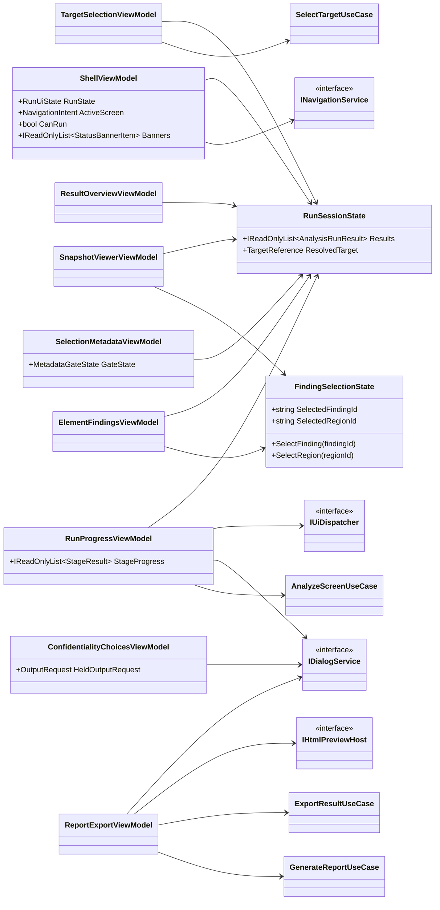
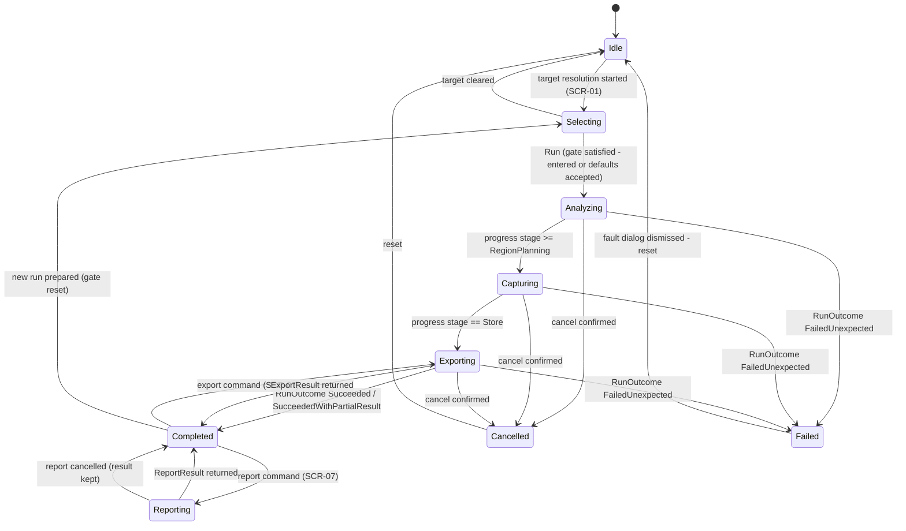
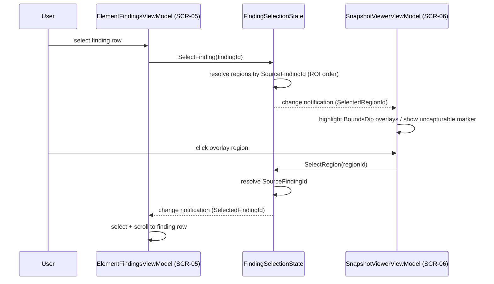

# DES-0016 Operating UI Detailed Design

This is detailed-design package 9 from [DES-0007](des-0007-detailed-design-execution-strategy.md) section 4. It converts the screen basic design ([DES-0006](des-0006-screen-basic-design.md), `SCR-01`–`SCR-08`) into implementation-ready presentation decisions so `M01` (WinUI views) and `M02` (ViewModels) bind to the already-stable application contracts ([DES-0011](des-0011-port-dtos-status-model-and-use-case-orchestration.md) DTOs/status model, [DES-0012](des-0012-report-schema-and-deterministic-serialization.md) report artifacts, [DES-0013](des-0013-confidentiality-storage-and-export.md) confidentiality decisions, [DES-0015](des-0015-capture-and-snapshot-correspondence.md) snapshot correspondence) without re-litigating them.

It fixes what [DES-0006](des-0006-screen-basic-design.md#10-downstream-design-and-test-obligations) delegated to detailed design: the concrete `INavigationService`/`IDialogService` intent enums (including the metadata-gate signal), the per-screen XAML control set, the in-app HTML preview host, `SCR-06` overlay/zoom rendering, the visual encoding of class/risk, resource-string policy, and the accessibility conformance target.

## Trace Block

| Field | Content |
| -- | -- |
| Artifact | `DES-0016`, Operating UI Detailed Design, detailed design phase |
| Upstream | [DES-0006](des-0006-screen-basic-design.md) screen inventory/transitions/per-screen bindings; [ADR-0003](../decisions/adr-0003-review-surface-native-vs-html.md) native-primary/HTML-portable; [ADR-0002](../decisions/adr-0002-adapter-technology-selection.md) WGC capture-border/consent observation and unpackaged-primary packaging; [DES-0003](des-0003-module-interface-basic-design.md) presentation ports; [DES-0004](des-0004-analysis-flow-basic-design.md) run state machine; [DES-0005](des-0005-vmodel-traceability-and-downstream-tests.md) `UT-0011` (extended) / `IT-0007`; [DES-0007](des-0007-detailed-design-execution-strategy.md) package 9; [DES-0008](des-0008-project-structure-and-test-harness.md) `Surveyor.Presentation`/`Surveyor.App` homes; [DES-0010](des-0010-scoring-classification-and-improvement-candidates.md) `ScoreResult`/`Finding`/`TestabilityClass`; [DES-0011](des-0011-port-dtos-status-model-and-use-case-orchestration.md) use cases/DTOs/statuses/diagnostics; [DES-0012](des-0012-report-schema-and-deterministic-serialization.md) `ReportResult`/HTML artifact; [DES-0013](des-0013-confidentiality-storage-and-export.md) `ConfidentialityMode`/`ConfidentialityDecision`/opt-out record; [DES-0015](des-0015-capture-and-snapshot-correspondence.md) `SnapshotRef`/`RectangleDip` |
| Requirements | `RQ-030`, `RQ-046`, `RQ-052`, `RQ-054`; guardrails `RQ-048`, `RQ-051`; derived `RD-016`, `RD-020`, `RD-022`, `RD-025`, `RD-028`, `RD-030` |
| Downstream | Review gate #38; `UT-0011` #50; implementation `IMP-0012` #70; manual usability walkthrough `IT-0007` #59; `DES-0018` composition root wires the concrete pages/ViewModels |
| Evidence | Navigation/dialog intent enums, run-UI state machine + stage progress contract, metadata-gate rule, correspondence selection state, opt-out recording contract (`OutputRequest`/`OptOutRequest` field detail), HTML preview host decision, per-screen control set, resource-string and diagnostics-display rules, accessibility target, contract-closure tables, fixture strategy, `UT-0011` intent with counter-examples, DRP self-review evidence |
| Verification | `tools/okf/Validate-Okf.ps1`; `git diff --check`; author-side `DRP-01`–`DRP-10` + DES-0007 §9 self-review (below); future `dotnet test tests/Surveyor.Presentation.Tests --filter UT0011` once source exists; `IT-0007` manual walkthrough on the Windows gate |
| Residual Risk | Pixel layout, spacing, iconography, and final Japanese resource strings are implementation freedom within the rules below; WGC yellow-border visuals vary by OS build (`ADR-0002`) — the notice wording may need adjustment after `IT-0007`; the in-app WebView2 preview host is deferred, revisit if offline users reject the external-browser preview; accessibility conformance is verified manually in `IT-0007` until an automated self-scan exists |

## Module Coverage

Primary modules:

- **`M01` WinUI Views** — XAML pages, controls, and the WinUI implementations of the presentation ports. Home: `Surveyor.App` ([DES-0008](des-0008-project-structure-and-test-harness.md)).
- **`M02` ViewModels** — per-screen ViewModels, the run-UI state machine, shared selection state, and the presentation ports (`INavigationService`, `IDialogService`, `IUiDispatcher`, `IHtmlPreviewHost`). Home: `Surveyor.Presentation`.

Consumed (not designed here): `M03` use cases via the [DES-0011](des-0011-port-dtos-status-model-and-use-case-orchestration.md) public API only. No ViewModel touches an adapter port, a Windows API, or a WinUI type (`RQ-054`, `RD-025`).

## Scope And Non-Goals

In scope, fixed here:

1. Concrete `NavigationIntent`/`DialogIntent` enums, the presentation-port method shapes, and the navigation-gating rule keyed to the run-UI state (closes the [DES-0006 §3](des-0006-screen-basic-design.md#3-navigation-and-transition-resolves-gap-d) delegation).
2. The `M02` run-UI state machine (`RunUiState`), its mapping from [DES-0011](des-0011-port-dtos-status-model-and-use-case-orchestration.md) `RunOutcome`/`RunStage`, and the stage-progress contract `SCR-02` needs.
3. The `SCR-03` metadata gate: state, acknowledgement recording, reset rule, and the gate signal exposed to `SCR-02` (`RQ-046`, `RD-016`/`RD-028`).
4. The `SCR-05`↔`SCR-06` snapshot-correspondence selection state over [DES-0015](des-0015-capture-and-snapshot-correspondence.md) `SnapshotRef`/`RectangleDip`, including uncapturable markers and overlay/zoom rendering rules.
5. The `SCR-08` confidentiality opt-out recording surface (`RD-022`), fixing the `OutputRequest` field detail left open by [DES-0011](des-0011-port-dtos-status-model-and-use-case-orchestration.md) and the `OptOutRequest` field detail delegated by [DES-0013](des-0013-confidentiality-storage-and-export.md) to this package's consent surface, plus the WGC capture-border notice carried from [ADR-0002](../decisions/adr-0002-adapter-technology-selection.md)/[DES-0013](des-0013-confidentiality-storage-and-export.md).
6. The `SCR-07` HTML preview host decision left open by [ADR-0003](../decisions/adr-0003-review-surface-native-vs-html.md).
7. Per-screen page structure and WinUI control set, `TestabilityClass` visual encoding, resource-string policy, the diagnostics display projection, and the accessibility target.
8. `UT-0011` unit-test intent and the `IT-0007` manual walkthrough assumptions.

Non-goals (owned elsewhere):

- Use-case contracts, DTO/status shapes, timeout defaults, diagnostics shape → [DES-0011](des-0011-port-dtos-status-model-and-use-case-orchestration.md). This package adds only the two additive refinements recorded there as §5.3 version notes (stage progress, `OutputRequest` detail).
- Report content, schema, serialization, golden governance → [DES-0012](des-0012-report-schema-and-deterministic-serialization.md). The UI binds the generated artifact; it never re-renders report content natively.
- Masking technique, storage/retention/export policy, sanitizer implementation → [DES-0013](des-0013-confidentiality-storage-and-export.md).
- Capture mechanics, coordinate contract, `SnapshotRef` projection rule → [DES-0015](des-0015-capture-and-snapshot-correspondence.md). The viewer consumes `RectangleDip` values as given and never rescales them.
- Scoring, classification, priority → [DES-0010](des-0010-scoring-classification-and-improvement-candidates.md). The UI presents scores/classes as carried and never re-rounds, re-classifies, or re-sorts by anything but core-owned keys (`RQ-051`).
- DI wiring, page/ViewModel registration lifetimes → `DES-0018`.
- Pixel layout, spacing, colors beyond the class-encoding rule, iconography, and final string wording → implementation freedom inside the rules below.

## Upstream Decisions (binding)

- **[DES-0006](des-0006-screen-basic-design.md)**: screen inventory `SCR-01`–`SCR-08`; linear acquisition path (`SCR-01`→`SCR-03`→`SCR-02`) and non-linear post-run review; the metadata gate as a required step with explicit default acceptance; the per-screen item→binding tables; the status/error surface grammar (expected status ≠ failure); the persistent read-only reassurance indicator (`RQ-048`).
- **[ADR-0003](../decisions/adr-0003-review-surface-native-vs-html.md)**: native WinUI is the primary interactive review surface; HTML/JSON is the portable artifact; the in-app HTML host is decided here (§ [HTML preview host decision](#html-preview-host-decision-closes-the-adr-0003-open-item)).
- **[DES-0004](des-0004-analysis-flow-basic-design.md)**: the run state machine names (`Idle`, `Selecting`, `Analyzing`, `Capturing`, `Reporting`, `Exporting`, `Completed`, `Failed`, `Cancelled`), owned by `M02`; expected statuses never move the run to `Failed`.
- **[DES-0011](des-0011-port-dtos-status-model-and-use-case-orchestration.md)**: the four use cases and their public API are the only inward dependency of `M02`; `RunOutcome`/`OperationStatus`/`RunStage`/`StageResult`/`RunDiagnostic` shapes; `ScreenSelectionMetadata` is threaded unchanged and never fabricated (`RD-016`); report/export are separate post-review commands.
- **[DES-0012](des-0012-report-schema-and-deterministic-serialization.md)**: `ReportResult`/`GeneratedReportArtifact`/`ReportOptions`/`ReportDestination` shapes; `ReportDestination.AbsolutePathForWrite` is input-only command data and never appears in emitted content.
- **[DES-0013](des-0013-confidentiality-storage-and-export.md)**: `ConfidentialityMode` (`ProtectedLocal` default for runs, `MaskedShareableExport` for exports, `ExplicitLocalOptOut` never default); opt-outs are explicit, scoped, timestamped, recorded; unmasked export is out of v1 scope; the WGC capture-border user notice belongs to this package.
- **[DES-0015](des-0015-capture-and-snapshot-correspondence.md)**: `SnapshotRef(RegionId, CaptureStatus, MaskedBlobId, BoundsDip)` is a derived projection; `RectangleDip` is numerically identical to `BoundingRect` (no DPI rescale); uncapturable regions carry `CaptureStatus != Ok` and must be shown, not hidden.
- **[DES-0010](des-0010-scoring-classification-and-improvement-candidates.md)**: `ScoreResult`, `Finding`, `ImprovementCandidate`, `TestabilityClass { ImmediatelyAutomatable, SmallImprovement, LimitedAutomation, ImproveFirst, NotEnoughEvidence }`, `FindingSeverity { Info, Warning, Blocking }`; `Unavailable` is never presented as a low score (`RD-020`).
- **[ADR-0002](../decisions/adr-0002-adapter-technology-selection.md)**: WGC may draw a yellow capture border with OS-build-dependent semantics; packaging is unpackaged-primary (no guaranteed store-managed runtime dependencies).

## Data And Contract Design

### Presentation ports (concretization of DES-0003)

Owned by `Surveyor.Presentation` (`M02`), implemented by `Surveyor.App` (`M01`). Blocked navigation and dismissed dialogs are normal return values, never exceptions ([DES-0003](des-0003-module-interface-basic-design.md#inavigationservice--idialogservice--iuidispatcher)).

```csharp
namespace Surveyor.Presentation.Ports;

public interface INavigationService
{
    Task<NavigationOutcome> NavigateAsync(
        NavigationIntent intent,
        CancellationToken cancellationToken);
}

public interface IDialogService
{
    Task<DialogOutcome> ShowAsync(
        DialogRequest request,
        CancellationToken cancellationToken);
}

public interface IUiDispatcher
{
    Task RunOnUiThreadAsync(
        Action action,
        CancellationToken cancellationToken);
}

public interface IHtmlPreviewHost
{
    Task<PreviewOutcome> OpenAsync(
        string absolutePathSuppliedByCaller,
        CancellationToken cancellationToken);
}
```

```csharp
public enum NavigationIntent
{
    TargetSelection,        // SCR-01
    SelectionMetadata,      // SCR-03
    RunProgress,            // SCR-02
    ResultOverview,         // SCR-04
    ElementFindings,        // SCR-05
    SnapshotViewer,         // SCR-06
    ReportExport,           // SCR-07
    ConfidentialityChoices  // SCR-08
}

public enum NavigationOutcome { Navigated, Blocked }

public enum DialogIntent
{
    ConfirmRunCancel,               // DES-0006 modal: run-cancel confirmation
    ConfidentialityHandlingNotice,  // DES-0006 modal: handling notice before share/export (RD-022)
    ConfirmConfidentialityOptOut,   // DES-0006 modal: opt-out confirmation (RD-022)
    UnexpectedFault                 // DES-0006 modal: unexpected-fault error dialog
}

public sealed record DialogRequest(
    DialogIntent Intent,
    string BodyResourceKey,
    IReadOnlyDictionary<string, string> SafeArgs);

public enum DialogOutcome { Confirmed, Dismissed }

public enum PreviewOutcome { Opened, Unavailable }
```

Shared presentation state types (owned by `Surveyor.Presentation`):

```csharp
public enum StatusBannerKind
{
    PermissionDenied, IntegrityMismatch, PartialResult, Timeout,
    Unavailable, IoError, CaptureBorderInfo, MetadataGateHint, OptOutActive
}

public sealed record StatusBannerItem(
    StatusBannerKind Kind,
    string BodyResourceKey,
    IReadOnlyDictionary<string, string> SafeArgs);

public sealed class RunSessionState
{
    public TargetReference? ResolvedTarget { get; }
    public IReadOnlyList<AnalysisRunResult> Results { get; }  // ordered by ScreenKey ordinal for display (RQ-051)
}
```

`StatusBannerItem` carries resource keys + allowlisted `SafeArgs` only, mirroring `DialogRequest`. `RunSessionState` is the single session-scoped holder of the resolved target and the post-policy results the review screens project from; `FindingSelectionState` resolves finding↔region lookups against the currently selected result in this state.

Rules:

- `DialogRequest` carries resource keys and [DES-0011](des-0011-port-dtos-status-model-and-use-case-orchestration.md)-allowlisted `SafeArgs` only — never raw `DisplayLabel`, titles, paths, or exception text (`RQ-052`).
- `IHtmlPreviewHost.OpenAsync` accepts only a path the calling ViewModel itself supplied earlier as `ReportDestination.AbsolutePathForWrite` in the same session (§ [Report preview contract](#report-preview-contract-scr-07)); the `M01` implementation opens it with the OS default handler and never renders or copies the content itself.
- `IUiDispatcher` is used only to marshal use-case completion/progress back to the UI thread; ViewModel logic itself stays thread-agnostic so `UT-0011` runs it synchronously with a same-thread fake.

### Run-UI state and stage progress (`SCR-02`)

`M02` owns the run state ([DES-0004](des-0004-analysis-flow-basic-design.md#run-state-machine)). `RunUiState` keeps the DES-0004 state names one-for-one:

```csharp
public enum RunUiState
{
    Idle, Selecting, Analyzing, Capturing,
    Reporting, Exporting, Completed, Failed, Cancelled
}
```

Mapping rules (the refinement already implied by the [DES-0011](des-0011-port-dtos-status-model-and-use-case-orchestration.md) use-case split, recorded there as a §5.3 version note):

| Trigger | State |
| -- | -- |
| No target resolved | `Idle` |
| `SCR-01`/`SCR-03` acquisition path active (target resolution and/or metadata not yet recorded) | `Selecting` |
| `AnalyzeScreenUseCase` in flight, last progressed stage ≤ `Scoring` | `Analyzing` |
| `AnalyzeScreenUseCase` in flight, last progressed stage in `RegionPlanning`..`ResultAssembly` | `Capturing` |
| `AnalyzeScreenUseCase` in flight, last progressed stage = `Store` | `Exporting` (DES-0004 Stage-8 store semantics) |
| `GenerateReportUseCase` in flight (post-review command from `SCR-07`) | `Reporting` |
| `ExportResultUseCase` in flight (explicit command from `SCR-07`) | `Exporting` |
| `RunOutcome.Succeeded` / `SucceededWithPartialResult` returned; report/export command finished | `Completed` (partial shown via banner, not a distinct state — `RD-020`) |
| `RunOutcome.FailedUnexpected`, or a required command invariant failure | `Failed` (via `DialogIntent.UnexpectedFault`, then reset to `Idle`) |
| `RunOutcome.Cancelled` | `Cancelled` (then reset to `Idle`) |

Stage progress reaches the ViewModel through the additive `IProgress<StageResult>` parameter on `AnalyzeScreenUseCase.ExecuteAsync` (recorded in [DES-0011](des-0011-port-dtos-status-model-and-use-case-orchestration.md) as a §5.3 version note): the use case reports each stage's `StageResult` as it completes; the ViewModel marshals via `IUiDispatcher` and shows a determinate `ProgressBar` over the fixed `RunStage` enum order plus the current stage name from a resource key. Fakes drive the progress sink deterministically, so `UT-0011` verifies the `Analyzing`→`Capturing`→`Exporting` display transitions without real time.

Expected statuses (`Unavailable`, `PermissionDenied`, `IntegrityMismatch`, `Timeout`, `PartialResult`) never enter `Failed`; they surface on the status banner with the [DES-0006 §7](des-0006-screen-basic-design.md#7-statuserror-surface-resolves-gap-f) grammar. Cancel is always available while a run or command is in flight; the cancel command first shows `DialogIntent.ConfirmRunCancel`, then cancels the token; caller cancellation wins over stage timeout ([DES-0011](des-0011-port-dtos-status-model-and-use-case-orchestration.md#timeout-handling)).

**Command-scoped `Reporting`/`Exporting` gating refinement.** [DES-0006 §3](des-0006-screen-basic-design.md#3-navigation-and-transition-resolves-gap-d) wrote its gating row for `Reporting`/`Exporting` against the DES-0004 linear model where report/export ran inside the run. Under the accepted [DES-0011](des-0011-port-dtos-status-model-and-use-case-orchestration.md) split they are post-review commands issued from `SCR-07`. Refined rule (recorded as a §5.3 version note in DES-0006): while a report/export command is in flight, the user stays on `SCR-07` with a cancellable inline progress surface; all other navigation intents return `Blocked` except `RunProgress` (`SCR-02`, which shows the same in-flight state); Run remains disabled. This preserves DES-0006's intent — no review-screen interaction races an output operation — while keeping report generation post-review.

### Metadata gate (`SCR-03`, `RQ-046`/`RD-016`/`RD-028`)

```csharp
public enum MetadataGateState { NotRecorded, EnteredByUser, AcceptedRecordedDefaults }
```

- Owned by `SelectionMetadataViewModel`; exposed to the shell and `SCR-02` as the single gate signal `CanRun = TargetResolved && MetadataGateState != NotRecorded` (the "metadata-gate signal exposed to `SCR-02`" required by [DES-0006 §3](des-0006-screen-basic-design.md#3-navigation-and-transition-resolves-gap-d)).
- `EnteredByUser` is set only by the Continue command after the user edited at least one field; `AcceptedRecordedDefaults` is set only by the explicit "Accept defaults and continue" command (a distinct button, not a checkbox default). Navigation alone never changes the state — there is no silent skip.
- The recorded state maps one-for-one to [DES-0011](des-0011-port-dtos-status-model-and-use-case-orchestration.md#prioritybasis-mapping)'s acknowledgement → `PriorityBasisSource` rule (`EnteredByUser` / `AcceptedRecordedDefaults`). The ViewModel builds `ScreenSelectionMetadata` exactly from the form fields (bands, judgment-split flag, rationale note; a blank note records "no rationale provided" per [DES-0006 §5 SCR-03](des-0006-screen-basic-design.md#scr-03-selection-metadata-input-the-previously-missing-input-screen)) and places it on `AnalysisRunRequest.ScreenSelectionMetadata` unchanged. `M02` never normalizes, defaults, or reorders the values (`RD-016`).
- Reset rule: the gate returns to `NotRecorded` when (a) the resolved target changes, (b) a run reaches `Completed`, `Failed`, or `Cancelled` and a new run is being prepared — previous metadata is pre-filled into the form for convenience but must be re-acknowledged ([DES-0006 §3](des-0006-screen-basic-design.md#3-navigation-and-transition-resolves-gap-d): not silently reused).

### Snapshot-correspondence selection state (`SCR-05`↔`SCR-06`)

One shared, presentation-owned state object realizes [DES-0006 §6](des-0006-screen-basic-design.md#6-snapshot-correspondence-model-resolves-gap-c):

```csharp
public sealed class FindingSelectionState
{
    public string? SelectedFindingId { get; }   // DES-0010 Finding.Id
    public string? SelectedRegionId { get; }    // DES-0015 SnapshotRef.RegionId

    public void SelectFinding(string findingId);
    public void SelectRegion(string regionId);
    public void Clear();
}
```

Mapping is metadata-driven and deterministic (no image analysis, `RQ-051`):

- `SelectFinding(findingId)` resolves the finding's regions through `AnalysisRunResult.RegionsOfInterest` where `RegionOfInterest.SourceFindingId == findingId`, in the [DES-0011](des-0011-port-dtos-status-model-and-use-case-orchestration.md#regionofinterest)-fixed ROI order; `SelectedRegionId` becomes the first match's `Id` (all matches are highlighted; the first anchors scroll/zoom focus). No match leaves `SelectedRegionId` null and shows the "no captured region for this finding" marker row in `SCR-06`.
- `SelectRegion(regionId)` resolves through the same list where `RegionOfInterest.Id == regionId` and sets `SelectedFindingId = SourceFindingId`. `RegionPurpose.ShowResultArea`/`ManualReview` regions without a meaningful finding selection still highlight and show their purpose label.
- Both setters are idempotent and raise one change notification, so a `SCR-05` selection updating `SCR-06` cannot re-trigger `SCR-05` (no feedback loop).

Overlay/zoom rendering rules (`M01`): the snapshot image and overlays live in a `ScrollViewer` (`ZoomMode=Enabled`) hosting a `Canvas` over an `Image`; each `SnapshotRef` with `CaptureStatus == Ok` renders a rectangle at `BoundsDip` coordinates under a single uniform zoom transform — never per-rectangle rescaling, so the [DES-0015](des-0015-capture-and-snapshot-correspondence.md) coordinate contract is preserved; refs with `CaptureStatus != Ok` render as explicit uncapturable markers in a side list with the reason status, visually distinct from both normal overlays and low scores (`RD-020`, `RQ-027`). Display order of findings/regions follows core-owned order as carried in the result — the UI never re-sorts by hash, arrival, or click order (`RQ-051`).

### Confidentiality choice and opt-out record (`SCR-08`, `RD-022`)

This package fixes the `OutputRequest` field detail left open by [DES-0011](des-0011-port-dtos-status-model-and-use-case-orchestration.md) (which named the field but not its shape) and the `OptOutRequest` field detail that [DES-0013](des-0013-confidentiality-storage-and-export.md) referenced on `ConfidentialityRequest` and delegated to this package's consent surface:

```csharp
namespace Surveyor.Application.Dto;

public sealed record OutputRequest(
    ConfidentialityMode RequestedMode,      // ProtectedLocal unless SCR-08 recorded an explicit opt-out
    OptOutRequest? ConfidentialityOptOut);  // non-null iff RequestedMode == ExplicitLocalOptOut

public sealed record OptOutRequest(
    OptOutScope Scope,
    string ReasonCode);                     // allowlisted code, becomes ConfidentialityDecision.OptOutReasonCode

public enum OptOutScope
{
    DisableMaskingLocalOnly,   // DES-0006 SCR-08 "masking off" — plaintext local artifacts
    WidenStorageLocalOnly      // DES-0006 SCR-08 "wider storage" — plaintext local store
}
```

Rules:

- `AnalyzeScreenUseCase` builds `ConfidentialityRequest.RequestedMode`/`OptOut` from `AnalysisRunRequest.Outputs`; the [DES-0011](des-0011-port-dtos-status-model-and-use-case-orchestration.md#sequence) sequence's `Decide(ProtectedLocal)` is the default path of this parameterization, not a hard-coded constant. Timestamping stays with `IConfidentialityPolicy.Decide` (`DecidedAtUtc` via the use case's `IClock`), satisfying [DES-0013](des-0013-confidentiality-storage-and-export.md)'s "explicit, scoped, timestamped, recorded".
- `ReasonCode` comes from a fixed allowlist (`opt-out-reason-v1`: `DebuggingMaskedContent`, `FixtureAuthoring`, `LocalPlaintextReview`) rendered as localized choices. Free-text reasons are deliberately not offered: a free-text field on a confidentiality surface is itself a sensitive-text egress (`RQ-052`).
- `ConfidentialityChoicesViewModel` (`SCR-08`) shows the current handling summary from the last `ConfidentialityDecision` (mode, policy version, applied transforms); the opt-out toggle requires `DialogIntent.ConfirmConfidentialityOptOut` with `DialogOutcome.Confirmed` before the choice is held; `Dismissed` leaves the safe default untouched. The held choice applies to subsequent runs in this session only and is visibly flagged on `SCR-02`/`SCR-04` while active; it never persists across app restarts (safe-by-default on every launch).
- Export from `SCR-07` always uses `MaskedShareableExport` — the opt-out scopes are local-only, and unmasked export stays out of v1 scope ([DES-0013](des-0013-confidentiality-storage-and-export.md)). The `DialogIntent.ConfidentialityHandlingNotice` is shown before the first export command per session (`RD-022`).
- **WGC capture-border notice** (carried from [ADR-0002](../decisions/adr-0002-adapter-technology-selection.md)/[DES-0013](des-0013-confidentiality-storage-and-export.md)): before the first run of a session, `SCR-02` shows a dismissible informational banner stating that Windows may draw a capture border around the target while its screen is captured, and that capture is read-only. This is a banner, not a dialog — it informs, it does not gate (`RQ-052` user notice; `RQ-048` reassurance).

### Report preview contract (`SCR-07`)

`ReportExportViewModel` composes `GenerateReportRequest` with caller-chosen `ReportDestination` values, remembers those destinations for the session keyed by `ReportFormat`, and enables Preview only after `ReportResult.Status == Ok` includes an artifact with `ReportFormat.Html`. Preview calls `IHtmlPreviewHost.OpenAsync` with **exactly the remembered destination path** for the HTML artifact. The path is never derived from `SafeArtifactReference.RelativeSafePath`, never shown in diagnostics, and never persisted ([DES-0012](des-0012-report-schema-and-deterministic-serialization.md): `AbsolutePathForWrite` is input-only command data). `PreviewOutcome.Unavailable` (file missing, no handler) surfaces as an `IoError`-grammar banner, not a failure state.

### ViewModel catalog and per-screen control set

All ViewModels live in `Surveyor.Presentation`, depend only on the four [DES-0011](des-0011-port-dtos-status-model-and-use-case-orchestration.md) use cases and the presentation ports, and are constructed by the `DES-0018` composition root.

| ViewModel | Screen | Key bound state (source) | Primary WinUI controls (`M01`) |
| -- | -- | -- | -- |
| `ShellViewModel` | shell | `RunUiState`, active `NavigationIntent`, status banner queue, persistent read-only indicator (`RQ-048`) | `NavigationView` (left rail), `InfoBar` stack, footer `TextBlock` + icon for read-only reassurance |
| `TargetSelectionViewModel` | `SCR-01` | `TargetCandidate` list with per-candidate `OperationStatus` badge; resolved `TargetReference` | `ListView` (virtualized), status `InfoBadge`, refresh/filter `CommandBar`, `AutoSuggestBox` filter |
| `SelectionMetadataViewModel` | `SCR-03` | `ScreenSelectionMetadata` form fields, `MetadataGateState`, recorded defaults | `RadioButtons` per band, `ToggleSwitch` (judgment split), `TextBox` (rationale), two distinct buttons: Continue / Accept defaults and continue |
| `RunProgressViewModel` | `SCR-02` | `RunUiState`, per-stage `StageResult` list, diagnostics projection, Cancel command, capture-border banner, gate signal | determinate `ProgressBar` over `RunStage` order, stage list `ItemsRepeater`, `Button` Cancel |
| `ResultOverviewViewModel` | `SCR-04` | session results ordered by `ScreenKey` ordinal; per screen: `DisplayLabel`+`ScreenKey`, `TestabilityClass`, `AggregateScorePercent` as carried, finding/candidate summaries, `PriorityBasis` | `ListView` with header row template; class chip (see encoding rule); drill-down commands |
| `ElementFindingsViewModel` | `SCR-05` | `Finding` list in carried order; filter/group by `FindingCode`/`ScoreAxis`; `Availability` markers; `FindingSelectionState` | `ListView` (virtualized) with group headers, filter `ComboBox`, locate button per row |
| `SnapshotViewerViewModel` | `SCR-06` | `SnapshotRef` projections, overlay rectangles, uncapturable list, `FindingSelectionState`, zoom level | `ScrollViewer`+`Image`+overlay `Canvas`, uncapturable side `ListView`, zoom `Slider` |
| `ReportExportViewModel` | `SCR-07` | requested artifacts/destinations, `ReportResult`/`ExportResult` outcomes, preview enablement, handling notice state | destination pickers, generate/export `Button`s, inline `ProgressRing`, Preview `Button` |
| `ConfidentialityChoicesViewModel` | `SCR-08` | current `ConfidentialityDecision` summary, held `OutputRequest`, opt-out confirmation flow | summary `Expander`s, opt-out `ToggleSwitch` + confirmation dialog, active-opt-out `InfoBar` |

`TestabilityClass` visual encoding rule: class is always encoded by **text label + icon + color together**, never color alone (accessibility); `NotEnoughEvidence` and `Availability.Unavailable` reuse the "insufficient data" visual grammar, distinct from low-score classes (`RD-020`). Concrete palette is implementation freedom; the pairing rule is not.

### Resource strings and diagnostics display projection

- Every user-facing string is a `.resw` resource (`x:Uid` in XAML, resource keys in ViewModels); Japanese (`ja-JP`) is the primary authored language (`RD-030`); no hardcoded UI strings in XAML or C#.
- Diagnostics display: the UI renders a `RunDiagnostic` as localized text resolved from `MessageTemplateId` + allowlisted `SafeArgs` substitution, plus code/status/stage. Primary surfaces avoid raw UIA jargon and link the glossary where a defined term is unavoidable ([spec §1.5](../../docs/gui-testability-analyzer-requirements.md#15-用語), `RD-030`). The projection has no code path that accepts arbitrary text — its input type is `RunDiagnostic`, which is safe by construction ([DES-0011](des-0011-port-dtos-status-model-and-use-case-orchestration.md#diagnostics-model)); `DisplayLabel` values appear only in dedicated label-display bindings, never in banner/dialog/log composition (`RQ-052`).

### Accessibility target (closes the DES-0006 delegation)

The v1 conformance target is: **every interactive element is keyboard-reachable and operable, and exposes a stable `AutomationProperties.AutomationId` plus a localized `AutomationProperties.Name`**; focus order follows visual order; class/status information is never conveyed by color alone. Verification is manual in `IT-0007` (keyboard-only pass + Accessibility Insights spot check). Dogfood intent (non-gating in v1): Surveyor analyzing its own screens should raise no `Blocking` identifiability findings — recorded as an `IT-0007` observation item, not an acceptance gate.

## Contract Closure

### Port-method I/O derivation (`DRP-03`)

| Method | Input → source | Output → consumer |
| -- | -- | -- |
| `INavigationService.NavigateAsync` | `NavigationIntent` from user command or drill-down; gate check from `RunUiState`/`MetadataGateState` (VM-held) | `NavigationOutcome` → calling ViewModel (Blocked shows why via banner resource) |
| `IDialogService.ShowAsync` | `DialogRequest` composed from fixed resource keys + `RunDiagnostic.SafeArgs` | `DialogOutcome` → calling ViewModel command flow |
| `IUiDispatcher.RunOnUiThreadAsync` | continuation composed by the VM from use-case results/progress | completion → VM state change notification |
| `IHtmlPreviewHost.OpenAsync` | session-remembered `ReportDestination.AbsolutePathForWrite` (written earlier by the same VM) | `PreviewOutcome` → `ReportExportViewModel` banner |
| `SelectTargetUseCase.ListTargetsAsync`/`ResolveAsync` | `DiscoveryQuery` from filter UI; `TargetReference` from selected candidate | candidates/resolved target → `TargetSelectionViewModel`; resolved target → gate signal + `AnalysisRunRequest.Target` |
| `AnalyzeScreenUseCase.ExecuteAsync` | `AnalysisRunRequest` assembled by `RunProgressViewModel` from: resolved `TargetReference` (SCR-01), `ScreenSelectionMetadata` (SCR-03, unchanged), `AnalysisRunOptions` defaults, `ScoringConfigReference` from app config, `OutputRequest` (SCR-08 choice); progress sink from VM | `AnalysisRunResult` (post-policy `SanitizedRunResult`) → session result list consumed by SCR-04/05/06/07; `StageResult` progress → SCR-02 |
| `GenerateReportUseCase.ExecuteAsync` | `GenerateReportRequest` from the selected session result + `ReportOptions` (artifacts/destinations from SCR-07; `GeneratedAtUtc` left `default` per [DES-0012](des-0012-report-schema-and-deterministic-serialization.md)) | `ReportResult` → SCR-07 outcome + preview enablement |
| `ExportResultUseCase.ExecuteAsync` | `ExportRunRequest` from the selected result's `RunId` + `ExportProfile`/`ExportDestination`/`ExportOptions` (SCR-07 form) | `ExportResult` → SCR-07 outcome banner |

Every input is derivable from user input, session-held prior outputs, or app configuration; every output has a named consuming surface.

### DTO field ownership (`DRP-05`)

| Field | Single writer | Write timing | Sync / fabrication rule |
| -- | -- | -- | -- |
| `MetadataGateState` | `SelectionMetadataViewModel` | Continue / Accept-defaults command | Never written by navigation, shell, or run completion (reset rule excepted); consumers read only |
| `AnalysisRunRequest.ScreenSelectionMetadata` | `RunProgressViewModel` (copies the SCR-03 value) | Run command assembly | Byte-for-byte the SCR-03 value; no normalization or defaulting (`RD-016`) |
| `OutputRequest.RequestedMode` / `ConfidentialityOptOut` | `ConfidentialityChoicesViewModel` | opt-out confirmation flow | `ProtectedLocal`+null unless a confirmed opt-out is held; cleared on app start and on opt-out revocation |
| `FindingSelectionState.SelectedFindingId`/`SelectedRegionId` | `FindingSelectionState` itself (via its two setters) | user selection in SCR-05/SCR-06 | The two fields are updated atomically by one setter call; views never set them independently |
| `RunUiState` | `ShellViewModel` (single reducer over use-case lifecycle + progress events) | state-machine transitions only | Screen VMs read; no screen VM writes run state |
| session `ReportDestination` memory | `ReportExportViewModel` | report request assembly | Preview reads only; never reconstructed from artifacts or references |

### Round-trip inventory (`DRP-04`)

The presentation layer persists nothing in v1: no view-state save/load, no settings file, no serialization pair is introduced. The only cross-boundary "pair" is destination-out (`ReportDestination` in the request) / path-in (`IHtmlPreviewHost.OpenAsync`), which is closed by the session-memory rule above — the same value flows both directions within one session, and loss of that memory disables Preview rather than reconstructing a path.

## Rule Design

### Navigation gating decision table (first match wins, `DRP-06`)

| # | Condition | Allowed intents | Run command |
| -- | -- | -- | -- |
| 1 | Report/export command in flight (`Reporting`/`Exporting` command-scoped) | `ReportExport`, `RunProgress` | disabled |
| 2 | `Analyzing`/`Capturing`/`Exporting` (analysis run in flight) | `RunProgress` only; Cancel available | disabled (start is idempotent; further Run requests ignored) |
| 3 | `Completed` | all of `SCR-01`–`SCR-08` intents | enabled only after the gate is re-satisfied for a new run |
| 4 | `Failed`/`Cancelled` (pre-reset) | `RunProgress`, `TargetSelection` | disabled |
| 5 | `Idle`/`Selecting` | `TargetSelection`, `SelectionMetadata`, `RunProgress`, `ConfidentialityChoices` | enabled iff `TargetResolved && MetadataGateState != NotRecorded` |

Review intents (`ResultOverview`, `ElementFindings`, `SnapshotViewer`, `ReportExport`) additionally require at least one session result to exist; otherwise `Blocked`.

### Metadata gate (pseudocode)

```text
on ContinueCommand:
  if no field was edited: show inline validation "enter values or accept defaults"; return
  metadata = BuildFromForm()           // bands, flag, note ("" -> recorded as no-rationale)
  gateState = EnteredByUser

on AcceptDefaultsCommand:              // distinct, explicit button
  metadata = RecordedDefaults()
  gateState = AcceptedRecordedDefaults

on TargetChanged or NewRunPrepared:
  gateState = NotRecorded              // form keeps previous values as a starting point

CanRun = TargetResolved && gateState != NotRecorded
```

### HTML preview host decision (closes the ADR-0003 open item)

**Decision: v1 previews the generated HTML report in the OS default browser through `IHtmlPreviewHost` (external host). In-app WebView2 hosting is deferred.**

| Axis | WebView2 in-app | External default browser (chosen) |
| -- | -- | -- |
| Confidentiality (`RQ-052`) | Report content enters the WebView2 user-data folder (cache/temp) outside the [DES-0013](des-0013-confidentiality-storage-and-export.md) protected store — a second, unmanaged copy | Opens the already-written post-policy artifact in place; no additional Surveyor-managed copy (the browser is the user's chosen viewer for a portable artifact) |
| Dependency/packaging | Requires the WebView2 Evergreen runtime; unpackaged-primary distribution ([ADR-0002](../decisions/adr-0002-adapter-technology-selection.md)) cannot assume it on locked-down legacy-maintenance environments | No new dependency; a default browser exists on any supported Windows |
| Testability (`RQ-054`) | Not fakeable in the unit lane; adds a live-window surface to `UT-0011`'s scope | One-method port, trivially faked; the launch is the only untested seam (covered by `IT-0007`) |
| Requirement fit | `RQ-030` needs a human-readable report; [ADR-0003](../decisions/adr-0003-review-surface-native-vs-html.md) fixed interactivity on native screens, so an in-app HTML surface adds no required capability | Same `RQ-030` satisfaction; reinforces "HTML is the portable artifact" |
| UX | Preview without leaving the app | Context switch to the browser — the accepted cost |

Revisit trigger (residual risk): if `IT-0007` or early users show that leaving the app for preview breaks the review flow, or an environment blocks browser launch, add a WebView2 implementation of `IHtmlPreviewHost` behind the same port with a dedicated, run-scoped, cleaned-on-exit user-data folder; the port shape already accommodates it.

## Class Design (UML)



WinUI pages in `Surveyor.App` (one page per `SCR-xx` plus the shell window) bind to these ViewModels and implement the four ports; no page contains logic beyond binding and port implementation (`RQ-054`).

## State Design



## Sequence: SCR-05 ↔ SCR-06 correspondence



## Edge Cases

| Case | Behavior |
| -- | -- |
| Run attempted with `MetadataGateState == NotRecorded` | Run command disabled; `SCR-02` shows the gate hint linking to `SCR-03`; navigation to `SCR-02` alone never enables Run |
| Defaults accepted, then target changes | Gate resets to `NotRecorded`; previous values pre-fill the form; re-acknowledgement required |
| Candidate list contains `PermissionDenied`/`IntegrityMismatch` | Candidate stays listed with a status badge and guidance banner (`RQ-049`); resolve is blocked for that candidate |
| Resolved target disappears (`NotFound` on resolve/run) | Expected status: banner + return to `SCR-01`; not a fault dialog |
| `SucceededWithPartialResult` | State `Completed`; persistent partial banner naming the partial stages from `Stages`; explicit markers in SCR-05/06 (`RQ-050`, `RD-020`) |
| Finding with no captured region | `SCR-06` shows the uncapturable marker row with reason; selection sync still works; never rendered as "no problem" |
| All regions uncapturable | Image area shows placeholder + full marker list; overview/findings remain fully usable |
| Zero findings | `SCR-04`/`SCR-05` show an explicit "no findings" state with class/confidence still displayed |
| Very large finding list | Virtualized lists only (`ListView` virtualization); filtering/grouping never re-sorts underlying order (`RQ-051`, responsiveness `RD-024`) |
| Cancel during run | `ConfirmRunCancel` dialog; on confirm, token cancelled; `Cancelled` → reset; no partial artifact expectation surfaces ([DES-0004](des-0004-analysis-flow-basic-design.md#cancellation-timeout-and-partial-results)) |
| Cancel dialog dismissed | Run continues unaffected |
| Unexpected fault (`FailedUnexpected`) | `UnexpectedFault` dialog with sanitized code/status only → `Failed` → reset to `Idle` |
| Report command with missing `ConfidentialityDecision` | Use case returns report failure ([DES-0011](des-0011-port-dtos-status-model-and-use-case-orchestration.md)); UI shows failure banner; no fault dialog |
| Preview with deleted/moved report file | `PreviewOutcome.Unavailable` → `IoError`-grammar banner suggesting regeneration |
| Opt-out confirmation dismissed | Held choice unchanged (safe default); toggle snaps back |
| Opt-out active | `SCR-02`/`SCR-04` show a persistent "local opt-out active" flag; cleared on revocation or app restart |
| Export while opt-out active | Export still uses `MaskedShareableExport`; handling notice states this explicitly |
| Report/export command in flight | Other navigation `Blocked` (rule 1); inline progress + cancel on `SCR-07` |
| Display-scale (DPI) change while `SCR-06` open | Overlays keep `BoundsDip` coordinates under the uniform zoom transform; no per-rectangle rescale; a banner notes the snapshot reflects capture-time DPI ([DES-0015](des-0015-capture-and-snapshot-correspondence.md)) |
| Keyboard-only operation | Every command reachable; gate/selection/zoom operable via keyboard (accessibility target) |

## Diagnostics And Logging

The presentation layer **emits no diagnostics and writes no logs** in v1. It renders [DES-0011](des-0011-port-dtos-status-model-and-use-case-orchestration.md) `RunDiagnostic` values through the display projection (template id + `SafeArgs`) and shows dialog/banner text from resource keys only. Any future presentation-side logging must route through the [DES-0013](des-0013-confidentiality-storage-and-export.md) sanitizer; introducing it requires a version note here. This keeps the `RQ-052` egress set unchanged: the UI adds no new output channel.

## Fixture Strategy

- **Fake presentation ports**: recording fakes for `INavigationService` (intent log), `IDialogService` (scripted `DialogOutcome` per intent, request log), `IUiDispatcher` (synchronous same-thread execution), `IHtmlPreviewHost` (path log + scripted outcome).
- **Fake use cases**: `UT-0011` fakes the four use-case classes behind thin seams that capture the request and return canned results — it does not re-fake the adapter ports (that is `UT-0012`'s seam). Canned `AnalysisRunResult` fixtures are shared with the `UT-0012` fixture builder ([DES-0011](des-0011-port-dtos-status-model-and-use-case-orchestration.md#unit-test-design-handoff)) so the two test suites cannot drift on result shape.
- **Progress driver**: a deterministic driver pushes `StageResult` values into the captured `IProgress<StageResult>` sink in `RunStage` order (and, for race tests, out of order) without real time.
- **Result fixtures**: (a) full success with 3 findings / 2 captured regions / 1 uncapturable; (b) `SucceededWithPartialResult` with cap + capture timeout; (c) `Cancelled`; (d) `FailedUnexpected`; (e) zero findings; (f) all-uncapturable. Each carries the deterministic core-owned ordering so order assertions are meaningful.
- **Counter-example fixtures** (`R-QA-01`, at least one per behavior test): e.g. a gate-bypass mutant (VM variant that sets `AcceptedRecordedDefaults` on navigation) must turn the gate test red; a sync mutant that resolves regions by list index instead of `SourceFindingId` must turn the correspondence test red; a fixture whose `RunDiagnostic` deliberately smuggles a fake title into `SafeArgs` under a non-allowlisted key must turn the display-projection test red.

## Unit-Test Intent (`UT-0011`, extended per DES-0005/DES-0006)

All tests drive ViewModels + fakes only — no live WinUI window, no dispatcher thread, no property-setter-only assertions (anti-patterns from [DES-0007 §7](des-0007-detailed-design-execution-strategy.md#7-unit-test-intent-strategy)).

| Behavior | Risk guarded | Fixture / oracle | Anti-pattern avoided |
| -- | -- | -- | -- |
| Run stays disabled until target resolved **and** metadata recorded (entered or defaults explicitly accepted); navigation alone never enables Run | Silent metadata skip fabricates priority basis (`RQ-046`, `RD-028`, `RSK-DES-001`) | Gate state driven through commands; oracle: `CanRun` transitions + captured `AnalysisRunRequest` exists only after gate; counter-example: gate-bypass mutant goes red | Checking a `CanRun` property setter instead of the command path |
| Recorded metadata reaches `AnalysisRunRequest.ScreenSelectionMetadata` unchanged; acknowledgement kind maps to entered/defaults exactly | `M02` normalizing/defaulting user input (`RD-016`) | Fake analyze seam captures request; field-for-field equality with form values incl. blank-note case | Asserting only that "some metadata" was passed |
| New run after `Completed`/`Failed`/`Cancelled` or target change re-requires acknowledgement | Stale metadata silently reused | Complete a run, prepare a new one; oracle: gate `NotRecorded`, Run disabled | Testing only the first run |
| Navigation gating follows the decision table; blocked intents return `Blocked`, never throw; review intents blocked with no session result | Review screens race an in-flight run; crash on blocked nav | Recording nav fake; drive each table row; oracle: intent log + outcomes | One happy-path navigation test |
| Stage progress maps to `Analyzing`→`Capturing`→`Exporting` display states; command-scoped `Reporting`/`Exporting` keep Run disabled | UI state contradicts run truth | Deterministic progress driver; oracle: `RunUiState` sequence | Sleeping/waiting on real async timing |
| Cancel flow: confirm dialog → token cancelled → `Cancelled` → reset; dismissed dialog leaves run running; caller-cancel wins over timeout presentation | Cancel unavailable or destructive without confirmation | Scripted dialog fake; fake seam observes token; oracle: state + token + dialog log | Asserting only that a Cancel command exists |
| `SCR-05`→`SCR-06` and `SCR-06`→`SCR-05` selection sync via `SourceFindingId`/`RegionId`; uncapturable refs surface as markers distinct from low scores; no notification loop | Broken correspondence breaks position-based understanding (`RQ-011`/`RQ-016`); `Unavailable` read as "fine" (`RD-020`) | Fixture (a)+(f); oracle: both directions + marker rows + single notification per selection; counter-example: index-based mutant goes red | Testing one direction only |
| Display order everywhere equals carried core-owned order; filtering/grouping never re-sorts | UI re-sorting breaks `RQ-051` determinism | Fixture with deliberately non-alphabetical carried order; oracle: view order equals carried order pre/post filter | Sorting the expected list in the test itself |
| Opt-out requires confirmed dialog; produces allowlisted `OptOutRequest` + `ExplicitLocalOptOut` on `OutputRequest`; dismissal keeps safe default; export request still `MaskedShareableExport`; choice not persisted across VM lifetime | Opt-out by accident, free-text leak, unmasked export (`RD-022`, `RQ-052`) | Scripted dialog fake; captured requests; oracle: `OutputRequest`/`ExportRunRequest` field values | Testing the toggle state without the captured request |
| Expected statuses (`PermissionDenied`, `PartialResult`, `Timeout`, `NotFound`) render as banners with state `Completed`/candidate badges; only `FailedUnexpected` raises the fault dialog | Expected status escalated to failure, or fault hidden ([DES-0006 §7](des-0006-screen-basic-design.md#7-statuserror-surface-resolves-gap-f)) | Fixtures (b)(d) + candidate fixture; oracle: banner queue kinds + dialog log + `RunUiState` | Mapping every non-Ok status to one generic error path in the test |
| Preview enabled only after an `Ok` `ReportResult` with an HTML artifact; opens exactly the session-remembered destination; `Unavailable` becomes a banner | Path derived from safe references or leaked (`RQ-052`); preview of a non-existent artifact | Preview fake path log; oracle: exact path equality with the requested destination | Asserting "preview was called" without the path |
| Diagnostics display projection renders template+`SafeArgs` only; non-allowlisted arg is replaced by the safe placeholder | Raw title/label/path reaching a visible/loggable surface (`RQ-052`, `R-SEC-01`) | Trap-fixture counter-example goes red on a projection that echoes unknown args | Asserting rendered text equality without the trap case |

## Integration Assumptions (`IT-0007`, manual)

- Windows 11 manual gate ([DES-0007 §8.2](des-0007-detailed-design-execution-strategy.md#82-ci-and-execution-topology)); fixture app from the `DES-0008` harness; Japanese display language; a default browser present.
- Walkthrough: `SCR-01`→`SCR-03`→`SCR-02`→`SCR-04`→`SCR-05`↔`SCR-06`→`SCR-07`(→preview)→`SCR-08`, recording multi-role readability (`RD-030`), the read-only reassurance and actual target-state constancy impression (`RQ-048`), handling-notice/opt-out behavior (`RD-022`), and the WGC capture-border visual vs. the notice wording ([ADR-0002](../decisions/adr-0002-adapter-technology-selection.md) residual).
- Accessibility pass: keyboard-only completion of the full walkthrough; Accessibility Insights spot check for `AutomationId`/`Name` coverage; the non-gating Surveyor-on-Surveyor dogfood observation.
- `SCR-06` overlay spot check at 100% and 150% display scale (viewer-side only; capture-side DPI truth is `IT-0003`).

## Downstream Handoff

- **Candidate project areas**: `src/Surveyor.Presentation` (ViewModels, ports, enums, `FindingSelectionState`, `RunSessionState`), `src/Surveyor.App` (shell window, 8 pages, port implementations, `.resw` resources), `tests/Surveyor.Presentation.Tests` (`UT-0011`).
- **First failing test**: "Run stays disabled until metadata is recorded or defaults are explicitly accepted" (the gate is the highest-risk product rule this package owns).
- **Implementation slice** (`IMP-0012`, issue #70): 1) presentation ports + enums + `FindingSelectionState`/`RunSessionState`; 2) `SelectionMetadataViewModel` + gate (first test green); 3) `ShellViewModel` state reducer + navigation gating; 4) `RunProgressViewModel` + progress mapping + cancel; 5) findings/snapshot VMs + sync; 6) report/export/confidentiality VMs; 7) `Surveyor.App` XAML pages + port implementations (thin, no logic).
- **Verification command**: `dotnet test tests/Surveyor.Presentation.Tests --filter UT0011` (registered in `eng/Surveyor.Unit.slnf` for the unit lane); OKF: `tools/okf/Validate-Okf.ps1`.
- **Minimal context bundle**: this document; [DES-0011](des-0011-port-dtos-status-model-and-use-case-orchestration.md) Public API Definitions + Status Model + Diagnostics Model (with its 2026-07-11 version note); [DES-0006](des-0006-screen-basic-design.md) §3/§5/§7; [DES-0013](des-0013-confidentiality-storage-and-export.md) Policy Contracts (`ConfidentialityMode`/`ConfidentialityDecision`); [DES-0015](des-0015-capture-and-snapshot-correspondence.md) `SnapshotRef`/`RectangleDip` sections; [DES-0010](des-0010-scoring-classification-and-improvement-candidates.md) result-model records.

## Self-Review Evidence (author-side, DES-0007 §5 step 8)

| Pattern | Result |
| -- | -- |
| `DRP-01` upstream drift | Screen set, use-case split, port names, state names, and DTO shapes kept as fixed upstream. Two deliberate additive refinements are recorded as §5.3 version notes in the owning artifacts: [DES-0011](des-0011-port-dtos-status-model-and-use-case-orchestration.md) (stage-progress parameter; `OutputRequest` field detail) and [DES-0006](des-0006-screen-basic-design.md) (command-scoped `Reporting`/`Exporting` gating row). No rename/merge/drop elsewhere; `RunUiState` reuses DES-0004 names one-for-one |
| `DRP-02` dangling reference | All referenced types resolve: upstream types to DES-0010/0011/0012/0013/0015 definitions; new types (`NavigationIntent`, `DialogIntent`, `DialogRequest`, `NavigationOutcome`, `DialogOutcome`, `PreviewOutcome`, `RunUiState`, `MetadataGateState`, `FindingSelectionState`, `RunSessionState`, `OutputRequest`, `OptOutRequest`, `OptOutScope`, port interfaces) defined here. The previously-dangling `OptOutRequest` on [DES-0013](des-0013-confidentiality-storage-and-export.md)'s `ConfidentialityRequest` is now defined (noted there) |
| `DRP-03` data-flow closure | Port-method I/O derivation table covers every presentation port and use-case call; each input names its source, each output its consumer; the acquisition→run→review→report/export flow simulated end-to-end in the state/sequence diagrams |
| `DRP-04` round-trip asymmetry | No persistence introduced; the destination-out/path-in pair is closed by session memory with a defined loss behavior (Preview disabled) |
| `DRP-05` unowned field | Field-ownership table gives every new/held field a single writer, write timing, and fabrication ban |
| `DRP-06` rule overlap | Navigation gating is an ordered first-match decision table; every row reachable (rows 1–5 correspond to disjoint state sets) |
| `DRP-07` numeric under-specification | No numeric computation is introduced; scores/percentages are displayed as carried (`RQ-051`); zoom is a display transform with no data effect |
| `DRP-08` missing failure semantics | Edge-case table defines blocked navigation, dismissed dialogs, preview unavailability, cancel-vs-timeout presentation (caller-cancel wins per DES-0011), and fault-vs-expected-status surfaces; the UI performs no I/O of its own beyond the preview launch, whose failure is a modeled outcome |
| `DRP-09` port ownership | All four presentation ports declare owner (`M02`, `Surveyor.Presentation`) and implementer (`M01`, `Surveyor.App`); dependency direction stays inward (VMs → use cases; views → VMs); `OutputRequest`/`OptOutRequest` live in `Surveyor.Application.Dto` with application ownership |
| `DRP-10` patch regression | Not applicable at authoring; any review fix reshaping the port/enum/state contracts re-runs `DRP-02`–`DRP-05` on the reshaped boundary |

DES-0007 §9 checklist: trace links explicit and honest (upstream table names only binding inputs); module coverage `M01`/`M02` stated; guardrails — `RQ-046`/`RQ-052`/`RQ-054` directly addressed, `RQ-048` surfaced (read-only indicator, no mutating command exists on any ViewModel), `RQ-051` addressed as carried-order/no-recompute rules; determinism owned upstream and preserved by display rules; confidentiality egress unchanged (no new output channel, no free-text opt-out reason); testability — every UI edge has a fixture/fake and every behavior test a confirmed-red counter-example; unit-test intents name behavior and risk; handoff complete with first failing test, project areas, verification command, and minimal context bundle.

## Residual Risks

- The WGC capture-border notice wording is written before the border/consent visuals were recorded live ([ADR-0002](../decisions/adr-0002-adapter-technology-selection.md) residual); `IT-0007` validates and may adjust the wording (string-level change only).
- The external-browser preview decision trades in-app continuity for confidentiality/dependency/testability; the revisit trigger and the WebView2 fallback path are recorded in the decision table.
- The accessibility target is verified manually until a Surveyor-on-Surveyor self-scan is practical; the dogfood check stays non-gating in v1.
- Stage-progress granularity is per-stage, not per-element; if large trees make `Analyzing` feel stalled, a within-stage heartbeat would need a further DES-0011 version note (not designed here).
- Final Japanese resource strings may adjust `DES-0012` display labels within its "section ids/schema fields stay stable" constraint.

## Related

- [DES-0006 Screen (Operating UI) Basic Design](des-0006-screen-basic-design.md)
- [ADR-0003 Review Surface - Native WinUI Primary, HTML Portable](../decisions/adr-0003-review-surface-native-vs-html.md)
- [ADR-0002 Adapter Technology Selection](../decisions/adr-0002-adapter-technology-selection.md)
- [DES-0004 Analysis Flow Basic Design](des-0004-analysis-flow-basic-design.md)
- [DES-0011 Port DTOs, Status Model, and Use-Case Orchestration Detailed Design](des-0011-port-dtos-status-model-and-use-case-orchestration.md)
- [DES-0012 Report Schema and Deterministic Serialization Detailed Design](des-0012-report-schema-and-deterministic-serialization.md)
- [DES-0013 Confidentiality, Storage, and Export Detailed Design](des-0013-confidentiality-storage-and-export.md)
- [DES-0015 Capture and Snapshot Correspondence Detailed Design](des-0015-capture-and-snapshot-correspondence.md)
- [DES-0007 Detailed Design Phase Execution Strategy](des-0007-detailed-design-execution-strategy.md)
- [Design Review Pattern Catalog](../process/design-review-patterns.md)
- [Lifecycle Traceability](../process/lifecycle-traceability.md)
