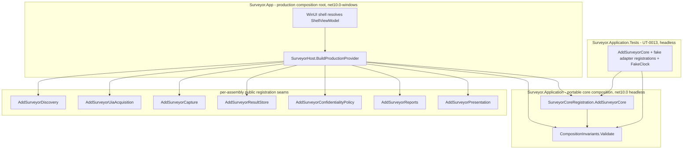
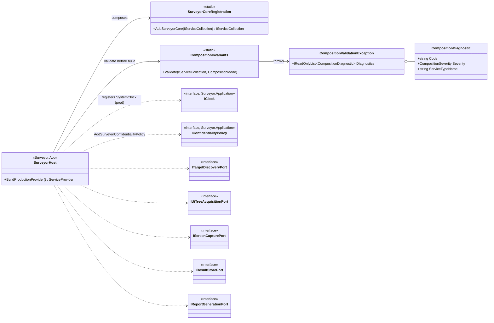
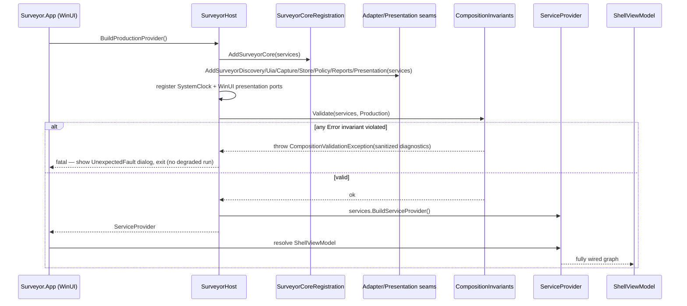

# DES-0018 Composition Root and DI Detailed Design

This is detailed-design package 11 (the final package) from [DES-0007](des-0007-detailed-design-execution-strategy.md) section 4. It designs `M13`, the composition root: the one seam in Surveyor where abstractions meet concretes (`RQ-054`). It fixes how every application-owned port, use case, presentation port, and shared state object is wired into one object graph at startup, and — more importantly — it fixes the **injection invariants** that keep that wiring honest: only read-only adapters may be registered, exactly one `IClock` and exactly one `IConfidentialityPolicy` exist, and the real system clock can never leak into a test configuration (`R-ARC-01`).

Because the composition root touches all thirteen modules, this package is deliberately written against the *whole* assembled system, not a local slice. Its correctness criterion is a property of the complete graph, so its design decisions (DI mechanism, registration-seam ownership, core/production split, lifetimes) are made once for every port together, never per adapter.

Canonical requirements stay in [gui-testability-analyzer-requirements.md](../../docs/gui-testability-analyzer-requirements.md) (`RQ-xxx`) and derived requirements in [requirements-definition.md](../requirements/requirements-definition.md) (`RD-xxx`).

## Trace Block

| Field | Content |
| -- | -- |
| Artifact | `DES-0018`, Composition Root and DI Detailed Design, detailed design phase |
| Upstream | [DES-0002](des-0002-module-responsibility-basic-design.md) `M13` responsibility; [DES-0007](des-0007-detailed-design-execution-strategy.md) §4 package 11 / §4.1 (`R-ARC-01`) / §4.2 DAG / §8.1 resolved decision; [DES-0008](des-0008-project-structure-and-test-harness.md) `Surveyor.App` composition home, project↔module map, inward dependency rule, `Surveyor.Application.Tests` UT-0013 seam; [DES-0011](des-0011-port-dtos-status-model-and-use-case-orchestration.md) the nine application-owned ports, four use cases, `IClock`, `IStageTimeoutController`, read-only guardrail; [DES-0013](des-0013-confidentiality-storage-and-export.md) `IConfidentialityPolicy` composition and diagnostic-sanitization rule; [DES-0014](des-0014-discovery-uia-msaa-acquisition-and-read-only-audit.md) UIA MTA-thread ownership and read-only audit; [DES-0015](des-0015-capture-and-snapshot-correspondence.md) capture adapter resource ownership; [DES-0016](des-0016-operating-ui-detailed-design.md) presentation ports, ViewModel catalog, shared session state; accepted [ADR-0002](../decisions/adr-0002-adapter-technology-selection.md) (concrete provider set); [DES-0005](des-0005-vmodel-traceability-and-downstream-tests.md) `UT-0013` obligation |
| Requirements | `RQ-054` (UI-independent core / single seam), `RQ-051` (determinism / single clock), `RQ-052` (confidentiality / single policy); derived `RD-025`, `RD-026` |
| Downstream | Review gate #40 ("レビュー: DES-0018 の注入不変条件を確認"); `UT-0013` #52 (composition-root invariants, failing-first); `IMP-0015` #73 (composition root + end-to-end wiring smoke) |
| Evidence | DI-mechanism decision, per-assembly public registration seams, core/production composition split, full provider wiring table (provider, selection key, lifetime, scope), injection-invariant rules with mechanical enforcement + counter-examples, fail-fast wiring-diagnostic shape, Mermaid composition class/sequence diagrams, contract-closure tables, edge-case table, fixture strategy, `UT-0013` intent, end-to-end wiring-smoke assumptions, `IMP-0015` handoff |
| Verification | [Validate-Okf.ps1](../../tools/okf/Validate-Okf.ps1); `git diff --check`; author-side `DRP-01`–`DRP-10` + [DES-0007](des-0007-detailed-design-execution-strategy.md) §9 self-review (below); `surveyor-design-review` + `surveyor-quality-review` pre-review evidence, then human owner final approval per [DES-0007](des-0007-detailed-design-execution-strategy.md) §5.2 (review gate #40); future `dotnet test tests/Surveyor.Application.Tests --filter UT0013` once `IMP-0015` source exists |
| Residual Risk | Concrete provider set carries `ADR-0002`'s residual risks (elevated-target/`uiAccess`/MSIX not calibrated) unchanged; WinUI 3 hosting may force adjustment of *where* the production `ServiceProvider` is built and how the shell resolves the first page, though the application-owned core registration and its invariants are hosting-independent; the concrete `IStageTimeoutController`/`IScoringConfigProvider` implementations are still deferred by [DES-0011](des-0011-port-dtos-status-model-and-use-case-orchestration.md) and supplied at `IMP-0015`; `SystemClock`'s physical home currently deviates from [DES-0008](des-0008-project-structure-and-test-harness.md) (see [Observed source deviations](#observed-source-deviations)) — reconciled at `IMP-0015`, not a design blocker |

## Purpose And Success Criterion

The success criterion is not "the app starts and objects are connected." It is:

- **there is exactly one place** that knows both the concrete adapters and the application ports, and every other assembly stays ignorant of concretes (`RQ-054`);
- **the injection invariants are enforced mechanically at startup and provable in a WinUI-free unit test**, not upheld by reviewer vigilance — a wiring mistake (a second clock, a rogue target-facing adapter, the real clock in a test) fails fast with a sanitized diagnostic, and `UT-0013` catches each violation with a confirmed-red counter-example;
- **the invariant-bearing composition logic is testable headless** so `UT-0013` runs in the unattended unit lane ([DES-0008](des-0008-project-structure-and-test-harness.md) §CI), never needing a live WinUI shell;
- **the wiring is complete for the whole system** — all four use cases, all nine application ports, the domain scorer, the four presentation ports, the ViewModels, and the shared session state each have exactly one obvious registration with a justified lifetime, so `IMP-0015` never has to invent a lifetime or a registration order.

After this package, an implementer wiring `Surveyor.App` copies a table; a reviewer checks four invariants against one test.

## Module Coverage

This package designs **`M13` Composition Root** ([DES-0002](des-0002-module-responsibility-basic-design.md#m13-composition-root)). It designs no other module's internals; it *consumes* every other module's public port/type to wire them. `M11`'s `SystemClock` concrete is *registered* here but *owned* by [DES-0009](des-0009-domain-model-stable-keys-and-availability.md)/[DES-0011](des-0011-port-dtos-status-model-and-use-case-orchestration.md); the presentation ports and ViewModels are *registered* here but *owned* by [DES-0016](des-0016-operating-ui-detailed-design.md); the adapters are *registered* here but *owned* by [DES-0013](des-0013-confidentiality-storage-and-export.md)/[DES-0014](des-0014-discovery-uia-msaa-acquisition-and-read-only-audit.md)/[DES-0015](des-0015-capture-and-snapshot-correspondence.md).

## Scope And Non-Goals

In scope, fixed here:

1. The DI mechanism decision (container vs hand-wired) and its justification against the guardrails.
2. The **core/production composition split**: which registrations are adapter-agnostic and application-owned (headless-testable) vs which are Windows/WinUI-bound and `Surveyor.App`-owned.
3. The **per-assembly public registration seam** convention that keeps adapter implementations `internal` (CS-02) while `Surveyor.App` stays the only assembly that composes them.
4. The **full provider wiring table**: every application port and use case → concrete provider, provider-selection key, lifetime, and scope.
5. The **four injection invariants** and their mechanical enforcement, each paired with the `UT-0013` counter-example that proves the enforcement discriminates.
6. The **wiring-diagnostic shape** and the fail-fast-at-startup failure behavior.
7. The `UT-0013` unit-test intent and the end-to-end wiring-smoke integration assumptions.

Non-goals (owned elsewhere):

- Each port's contract → [DES-0011](des-0011-port-dtos-status-model-and-use-case-orchestration.md) (application ports), [DES-0016](des-0016-operating-ui-detailed-design.md) (presentation ports).
- Adapter implementations and their internal seams (`IDataProtector`, `IAccessControlService`, the raw UIA reader, the WGC device) → [DES-0013](des-0013-confidentiality-storage-and-export.md)/[DES-0014](des-0014-discovery-uia-msaa-acquisition-and-read-only-audit.md)/[DES-0015](des-0015-capture-and-snapshot-correspondence.md). Those seams are composed *inside* each adapter's own registration seam, not by `M13`.
- Project/assembly layout, the inward dependency rule, and its architecture-test enforcement → [DES-0008](des-0008-project-structure-and-test-harness.md). This package assumes that structure and adds one allowed dependency (see [DI mechanism](#di-mechanism-decision)).
- The confidentiality masking/sanitizer *technique* → [DES-0013](des-0013-confidentiality-storage-and-export.md); this package only reuses its diagnostic-sanitization rule for the wiring diagnostics.
- WinUI page/`Frame` navigation mechanics and XAML → [DES-0016](des-0016-operating-ui-detailed-design.md)/`M01`; this package registers the ViewModels/ports, it does not design the visual shell.

## Upstream Decisions (binding)

- **[DES-0007](des-0007-detailed-design-execution-strategy.md) §8.1 (2026-07-01, `R-ARC-01`)**: the composition root is a standalone `DES-0018`, finalized after the adapter spike; its injection invariants and `UT-0013` intent were draftable early, but concrete provider wiring waits on `ADR-0002`.
- **[ADR-0002](../decisions/adr-0002-adapter-technology-selection.md) (Accepted, human-approved 2026-07-03, #30)**: the concrete provider set is fixed — raw-COM UIA acquisition, Windows.Graphics.Capture-primary/PrintWindow-fallback capture, unpackaged/same-integrity default. **The "after `ADR-0002`" gate this Issue names is therefore satisfied**, so this package specifies concrete provider wiring, not only the early invariant draft.
- **[DES-0008](des-0008-project-structure-and-test-harness.md)**: `Surveyor.App` is the composition-root physical home and the only assembly permitted to reference concrete adapter assemblies (architecture-test enforced); `Surveyor.Application.Tests` is the `UT-0013` seam home; the inward dependency rule and the banned-framework-namespace guard hold.
- **[DES-0011](des-0011-port-dtos-status-model-and-use-case-orchestration.md)**: the nine application-owned ports (`ITargetDiscoveryPort`, `IUiTreeAcquisitionPort`, `IScreenCapturePort`, `IReportGenerationPort`, `IResultStorePort`, `IScoringConfigProvider`, `IConfidentialityPolicy`, `IStageTimeoutController`, `IClock`), the four use cases, the `TestabilityScorer` domain dependency, and the **read-only guardrail** — "no application DTO or use case exposes a target-mutating command" — which is the contract this package's read-only-only invariant rests on.
- **[DES-0013](des-0013-confidentiality-storage-and-export.md)**: `IConfidentialityPolicy` is implemented by `ConfidentialityPolicy` composed with `ISensitiveValueSanitizer`/`IFallbackKeyExportMapper`; the diagnostics-sanitization allowlist (safe codes/enums/counts only — no raw title/`Name`/path/exception message) governs any diagnostic this package emits.
- **[DES-0014](des-0014-discovery-uia-msaa-acquisition-and-read-only-audit.md)**: the UIA acquisition adapter runs on a dedicated Surveyor-owned **MTA acquisition thread** and marshals only plain domain values across the wrapper boundary; concrete DI wiring/lifetimes are explicitly delegated to `DES-0018` (this package). This thread-ownership fixes the adapter's lifetime as a long-lived singleton.
- **[DES-0016](des-0016-operating-ui-detailed-design.md)**: the presentation ports (`INavigationService`, `IDialogService`, `IUiDispatcher`, `IHtmlPreviewHost`) are owned by `Surveyor.Presentation` and implemented by `Surveyor.App` (`M01`); ViewModels live in `Surveyor.Presentation`, depend only on the four use cases + presentation ports, and are "constructed by the `DES-0018` composition root"; `RunSessionState`/`FindingSelectionState` are session-scoped shared state.

## Observed Source Deviations

The current scaffold under `src/` differs from prior design assumptions in ways `IMP-0015` must reconcile; recording them here keeps the wiring table honest (`DRP` data-flow closure):

| Observed | Prior assumption | Reconciliation |
| -- | -- | -- |
| `SystemClock` lives in `src/Surveyor.Application/Time/SystemClock.cs` (public) | [DES-0008](des-0008-project-structure-and-test-harness.md) §Module Coverage placed the `IClock` concrete in `Surveyor.App` for the MVP | Its *registration* is production-only regardless of physical home (see [Invariant D](#invariant-d-no-real-clock-in-a-test-configuration)); the core registration never registers it. Whether it physically moves to `Surveyor.App` is an `IMP-0015` cleanup, not a wiring blocker. |
| `Surveyor.Adapters.Discovery`/`.Capture`/`.Store` are empty scaffolds (no port implementation yet) | [DES-0011](des-0011-port-dtos-status-model-and-use-case-orchestration.md)/[DES-0013](des-0013-confidentiality-storage-and-export.md)/[DES-0014](des-0014-discovery-uia-msaa-acquisition-and-read-only-audit.md) define their ports/adapters | Their registration seams are designed here; the concrete classes are created by `IMP-0013`/`IMP-0014` and the store slice before `IMP-0015` wires the production graph. |
| No DI framework is referenced anywhere in `src/` yet | — | This package chooses the mechanism (below); `IMP-0015` adds the reference. |
| `DeterministicReportWriter` (`IReportGenerationPort`) and the store/policy helpers are `internal` (CS-02 internal-default) | — | Confirms the [per-assembly public registration seam](#per-assembly-public-registration-seams) is *required*, not optional: `Surveyor.App` cannot `new` an internal type. |

## Data And Contract Design

### DI mechanism decision

**Decision: use `Microsoft.Extensions.DependencyInjection` (MEDI) as the container, driven by explicit, per-assembly registration extension methods over `IServiceCollection`. Reject both assembly-scanning/convention auto-registration and a fully hand-written new-expression graph.**

| Axis | Hand-written `new` graph | MEDI + assembly-scanning | MEDI + explicit registrations (chosen) |
| -- | -- | -- | -- |
| Determinism (`RQ-051`) | Deterministic but drifts as the graph grows | Scanning discovers types in a non-guaranteed order; hides what is registered | Every registration is an explicit, reviewable line; resolution order is irrelevant because all lifetimes are singleton/transient with no ordering effect |
| Invariant enforcement (`R-ARC-01`) | No uniform registration model to inspect; each invariant hand-coded per graph | Scanning actively *fights* the read-only-only invariant (it may auto-register an unaudited type) | `IServiceCollection` is a reflectable `ServiceDescriptor` list — the guard inspects it uniformly for "single `IClock`", "single policy", and "target-facing ⊆ read-only allowlist" |
| Testability (`RQ-054`) | Core graph not separable from WinUI without discipline | Same | The core registration is a headless method over `IServiceCollection`; `UT-0013` calls it with fake-adapter registrations, no WinUI |
| Internal-default (CS-02) | `App` must reach internals or types go public | Scanning needs types discoverable (often public) | Each assembly's own extension method registers its `internal` type from *inside* that assembly; only the extension method + port are public |
| WinUI 3 hosting | Native fit (manual `App.xaml.cs`) | Works but adds a heavier host | MEDI's `ServiceCollection`/`ServiceProvider` integrates with a manually built provider held on `App`; no Generic Host required |

`Microsoft.Extensions.DependencyInjection.Abstractions` is a pure, OS-agnostic abstraction package (no `Microsoft.UI.*`/`Windows.*` surface), so referencing it from `Surveyor.Application` does not violate the [DES-0008](des-0008-project-structure-and-test-harness.md) inward rule or banned-namespace guard; it is added to the architecture-test's allowed-dependency set alongside the BCL. The concrete `Microsoft.Extensions.DependencyInjection` implementation package is referenced only by `Surveyor.App` and the test projects — never by `Surveyor.Domain`/`Surveyor.Application` — so the container implementation stays at the composition edge.

### Composition topology: core vs production

The composition is split so the invariant-bearing logic is headless and the WinUI/adapter-bound logic is isolated at the edge:



- **`SurveyorCoreRegistration.AddSurveyorCore(IServiceCollection)`** (in `Surveyor.Application`, headless) registers only the adapter-agnostic services: the four use cases, the `TestabilityScorer` domain scorer, `IStageTimeoutController`, and `IScoringConfigProvider`. It **does not register any `IClock`, any adapter, or any presentation type** — those are supplied by the caller. This is the single piece `UT-0013` exercises.
- **Per-assembly registration seams** (below) each add their own concrete provider. `Surveyor.App` calls the production set; `Surveyor.Application.Tests` calls fakes.
- **`CompositionInvariants.Validate(IServiceCollection)`** (in `Surveyor.Application`, headless) runs the four invariant checks over the assembled `ServiceCollection` before `BuildServiceProvider`. Both the production root and the test composition call it, so the same guard protects both.
- **`SurveyorHost.BuildProductionProvider()`** (in `Surveyor.App`) is the only WinUI-bound piece: it composes core + production adapter seams + presentation, calls `Validate`, builds the `ServiceProvider`, and hands it to the WinUI shell for first-page resolution.

### Per-assembly public registration seams

Each assembly that owns a concrete port implementation exposes **exactly one** public extension method; the implementation type stays `internal`:

```csharp
// Surveyor.Reports (implementation DeterministicReportWriter stays internal)
namespace Surveyor.Reports;
public static class ReportsRegistration
{
    public static IServiceCollection AddSurveyorReports(this IServiceCollection services);
}
```

| Assembly | Public seam | Registers (service → internal impl) | Notes |
| -- | -- | -- | -- |
| `Surveyor.Adapters.Discovery` | `AddSurveyorDiscovery` | `ITargetDiscoveryPort` → discovery adapter | scaffold today; created by the discovery slice |
| `Surveyor.Adapters.Uia` | `AddSurveyorUiaAcquisition` | `IUiTreeAcquisitionPort` → `UiaTreeAcquisitionAdapter`, plus its `UiaTargetHandleRegistry` and the read-only audit (`Surveyor.Adapters.Uia.Audit`) it composes internally | owns the MTA acquisition thread → singleton (see lifetimes) |
| `Surveyor.Adapters.Capture` | `AddSurveyorCapture` | `IScreenCapturePort` → capture adapter (WGC device + PrintWindow fallback composed internally) | scaffold today; `IMP-0014` |
| `Surveyor.Adapters.Store` | `AddSurveyorResultStore` | `IResultStorePort` → store adapter, composing its `IDataProtector`/`IAccessControlService`/`IStoreFileSystem`/`IExportBundleWriter` internal seams | scaffold today; store slice |
| `Surveyor.Policy` | `AddSurveyorConfidentialityPolicy` | `IConfidentialityPolicy` → `ConfidentialityPolicy`, composing `ISensitiveValueSanitizer`/`IFallbackKeyExportMapper` internally | implemented today |
| `Surveyor.Reports` | `AddSurveyorReports` | `IReportGenerationPort` → `DeterministicReportWriter` | implemented today (internal) |
| `Surveyor.Presentation` | `AddSurveyorPresentation` | ViewModels, `RunSessionState`, `FindingSelectionState` | presentation ports' *implementations* are `Surveyor.App` (WinUI) → registered by `SurveyorHost`, not here |

Rule: **adapter-internal seams are never registered by `M13`.** `AddSurveyorResultStore` composes `IDataProtector`/`IAccessControlService`/`IStoreFileSystem` inside `Surveyor.Adapters.Store`; the composition root sees only `IResultStorePort`. This keeps the read-only-only and single-policy invariants checkable over a small, application-level service set instead of the whole transitive graph, and keeps DPAPI/ACL/file-system decisions owned by [DES-0013](des-0013-confidentiality-storage-and-export.md).

### Composition support types

```csharp
namespace Surveyor.Application.Composition;

// Result of the guard — safe by construction (no raw type internals/paths).
public sealed record CompositionDiagnostic(
    string Code,                 // e.g. "Composition.Clock.Duplicate"
    CompositionSeverity Severity,
    string ServiceTypeName,      // short type name only (safe), e.g. "IClock"
    IReadOnlyDictionary<string, string> SafeArgs);

public enum CompositionSeverity { Error, Warning }

public sealed class CompositionValidationException : Exception
{
    public IReadOnlyList<CompositionDiagnostic> Diagnostics { get; }
}

public static class CompositionInvariants
{
    // Throws CompositionValidationException (fail-fast) if any Error invariant is violated.
    public static void Validate(IServiceCollection services);
}

public static class SurveyorCoreRegistration
{
    // Adapter-agnostic: use cases, TestabilityScorer, IStageTimeoutController,
    // IScoringConfigProvider. Registers NO IClock, NO adapter, NO presentation type.
    public static IServiceCollection AddSurveyorCore(this IServiceCollection services);
}
```

`CompositionDiagnostic` carries only a code, a severity, a short service *type name*, and allowlisted `SafeArgs` (counts, expected/actual multiplicities) — it reuses the [DES-0011](des-0011-port-dtos-status-model-and-use-case-orchestration.md#diagnostics-model)/[DES-0013](des-0013-confidentiality-storage-and-export.md#diagnostics-and-exception-sanitization) sanitization posture. There is no target, screen, or file in scope at composition time, so there is nothing sensitive to leak beyond assembly/type identifiers, which are safe.

## Provider Wiring Table

The complete v1 wiring. "Selection key" is the mechanism that chooses the provider; in v1 every port has exactly one production provider, so the selection is the *choice of which registration seam `Surveyor.App` composes* (a compile-time set), not a runtime key (see [Provider selection](#provider-selection-and-lifetimes)).

| Service (application/presentation port or type) | Concrete provider (assembly) | Selection key (v1) | Lifetime | Rationale |
| -- | -- | -- | -- | -- |
| `IClock` | `SystemClock` (`Surveyor.Application.Time`) | production seam only | Singleton | stateless; single clock invariant (`RQ-051`); **never** registered by core (Invariant D) |
| `IConfidentialityPolicy` | `ConfidentialityPolicy` (`Surveyor.Policy`) | `AddSurveyorConfidentialityPolicy` | Singleton | stateless deterministic policy; single-policy invariant (`RQ-052`) |
| `TestabilityScorer` (domain type) | `TestabilityScorer` (`Surveyor.Domain`) | `AddSurveyorCore` | Singleton | pure deterministic scorer; no per-run state |
| `IScoringConfigProvider` | application default (`Surveyor.Application`) | `AddSurveyorCore` | Singleton | config resolution; deferred impl per [DES-0011](des-0011-port-dtos-status-model-and-use-case-orchestration.md), supplied at `IMP-0015` |
| `IStageTimeoutController` | application default (`Surveyor.Application`) | `AddSurveyorCore` | Singleton | stateless per-call controller; deferred impl per [DES-0011](des-0011-port-dtos-status-model-and-use-case-orchestration.md) |
| `ITargetDiscoveryPort` | discovery adapter (`Surveyor.Adapters.Discovery`) | `AddSurveyorDiscovery` | Singleton | read-only target-facing seam |
| `IUiTreeAcquisitionPort` | `UiaTreeAcquisitionAdapter` (`Surveyor.Adapters.Uia`) | `AddSurveyorUiaAcquisition` | Singleton | **owns the dedicated MTA acquisition thread** ([DES-0014](des-0014-discovery-uia-msaa-acquisition-and-read-only-audit.md)) — a long-lived resource; one instance avoids repeated thread creation |
| `UiaTargetHandleRegistry` | `UiaTargetHandleRegistry` (`Surveyor.Adapters.Uia`) | `AddSurveyorUiaAcquisition` | Singleton | session-scoped opaque-handle registry |
| `IScreenCapturePort` | capture adapter (`Surveyor.Adapters.Capture`) | `AddSurveyorCapture` | Singleton | owns the WGC device/frame-pool ([DES-0015](des-0015-capture-and-snapshot-correspondence.md)); one instance amortizes device warm-up |
| `IResultStorePort` | store adapter (`Surveyor.Adapters.Store`) | `AddSurveyorResultStore` | Singleton | stateless over `%LOCALAPPDATA%`; internal DPAPI/ACL/fs seams composed inside |
| `IReportGenerationPort` | `DeterministicReportWriter` (`Surveyor.Reports`) | `AddSurveyorReports` | Singleton | stateless deterministic writer |
| `SelectTargetUseCase` | `Surveyor.Application` | `AddSurveyorCore` | Transient | stateless orchestrator; transient avoids accidental cross-invocation state |
| `AnalyzeScreenUseCase` | `Surveyor.Application` | `AddSurveyorCore` | Transient | same |
| `GenerateReportUseCase` | `Surveyor.Application` | `AddSurveyorCore` | Transient | same |
| `ExportResultUseCase` | `Surveyor.Application` | `AddSurveyorCore` | Transient | same |
| `INavigationService` / `IDialogService` / `IUiDispatcher` / `IHtmlPreviewHost` | WinUI implementations (`Surveyor.App`) | `SurveyorHost` (production only) | Singleton | one shell-bound implementation per app; not headless-testable → never in core |
| `ShellViewModel` | `Surveyor.Presentation` | `AddSurveyorPresentation` | Singleton | one shell; owns `RunUiState`/`RunActivityKind` reducer ([DES-0016](des-0016-operating-ui-detailed-design.md)) |
| other ViewModels (`TargetSelection`/`SelectionMetadata`/`RunProgress`/`ResultOverview`/`ElementFindings`/`SnapshotViewer`/`ReportExport`/`ConfidentialityChoices`) | `Surveyor.Presentation` | `AddSurveyorPresentation` | Transient | one per navigation; read shared singleton state |
| `RunSessionState` / `FindingSelectionState` | `Surveyor.Presentation` | `AddSurveyorPresentation` | Singleton | session-scoped shared state ([DES-0016](des-0016-operating-ui-detailed-design.md)); a single window session in v1 |

### Provider selection and lifetimes

- **v1 uses a single default provider set**, so provider *selection* is not a per-resolve key or runtime switch — it is which registration seams `Surveyor.App` composes. The [DES-0001](../architecture/des-0001-initial-architecture.md) extension strategy (a future alternative provider, e.g. a FlaUI acquisition variant) is accommodated by composing a *different* registration seam, not by adding keyed/named registrations now. Designing a runtime provider-key registry in v1 would be premature (`RD-026`); the seam is the module boundary, and it is already there.
- **No DI "scope" is used in v1.** Surveyor is a single-desktop-session app; a "run" is not a container scope. Run state is held in the singleton `RunSessionState`/`FindingSelectionState`, reset by the [DES-0016](des-0016-operating-ui-detailed-design.md) state-machine rules, not by scope disposal. Introducing request-style scopes would be over-engineering with no consumer. This is recorded so `IMP-0015` does not add a scope factory speculatively.
- **Singleton is the default**; transient is reserved for the cheap, stateless-per-invocation graph nodes (use cases, non-shell ViewModels). The two adapters that own OS resources (UIA MTA thread, WGC device) are singletons deliberately — repeated creation would re-spawn threads/devices and defeat [DES-0014](des-0014-discovery-uia-msaa-acquisition-and-read-only-audit.md)'s single-acquisition-thread model.
- **Disposal**: the resource-owning singletons (`IUiTreeAcquisitionPort`, `IScreenCapturePort`) implement `IDisposable`/`IAsyncDisposable` and are disposed by the container when the `ServiceProvider` is disposed at app shutdown (`SurveyorHost` disposes the provider on `App` exit). Disposal semantics of the MTA thread and WGC device are owned by [DES-0014](des-0014-discovery-uia-msaa-acquisition-and-read-only-audit.md)/[DES-0015](des-0015-capture-and-snapshot-correspondence.md); `M13` only guarantees the container disposes them exactly once.
- **No captive dependencies.** The lifetime split above is only safe if no singleton captures a shorter-lived service. The singletons here (adapters, scorer, policy, clock, session state, `ShellViewModel`) depend only on other singletons; the transients (use cases, non-shell ViewModels) depend on singletons — the safe direction. In particular `ShellViewModel` (singleton) must **not** hold the transient screen ViewModels (they are reached through `INavigationService`, per [DES-0016](des-0016-operating-ui-detailed-design.md)), or they would be pinned for the app lifetime. `SurveyorHost` builds the provider with `BuildServiceProvider(validateScopes: true, validateOnBuild: true)` so missing registrations and scope captures fail fast at build; the singleton-captures-transient case (which MEDI does not flag) is guarded by the lifetime table above being the single source of truth for `IMP-0015`.

## Injection Invariants (`R-ARC-01`)

Each invariant is stated as (a) what it forbids, (b) how `CompositionInvariants.Validate` detects the violation over `IServiceCollection`, and (c) the `UT-0013` counter-example that must go red. All four map to the [DES-0005](des-0005-vmodel-traceability-and-downstream-tests.md) `UT-0013` obligation and the `RQ-054`/`RQ-051`/`RQ-052` guardrails.

### Invariant A: read-only adapters only

- **Forbids**: registering any target-facing service other than the three sanctioned read-only ports, or a second implementation of one of them that is not the audited adapter.
- **Basis, not re-litigated**: [DES-0011](des-0011-port-dtos-status-model-and-use-case-orchestration.md#read-only-guardrail) already guarantees the application surface has *no* target-mutating method, and [DES-0014](des-0014-discovery-uia-msaa-acquisition-and-read-only-audit.md) proves the acquisition adapter's read-only behavior at the adapter seam (`UT-0005` spy). `M13`'s narrower job is that the *wiring* introduces no target-facing service outside that set.
- **Detection**: the guard holds a canonical **read-only target-facing allowlist** `{ ITargetDiscoveryPort, IUiTreeAcquisitionPort, IScreenCapturePort }`. It asserts every registered `ServiceDescriptor` whose service type is target-facing is in the allowlist, and that no registration carries the `ITargetMutationCapability` marker (a marker interface defined only for the read-only audit and the counter-example fake; production adapters never implement it). Violation → `Composition.ReadOnly.ForbiddenTargetFacingService` Error.
- **`UT-0013` counter-example**: register a fake `IUiTreeAcquisitionPort` that also implements `ITargetMutationCapability` (or register a fictitious `ITargetControlPort`) → `Validate` throws; removing it makes the suite green. This proves the guard discriminates, not just that a clean graph passes.

### Invariant B: single `IClock`

- **Forbids**: zero or more-than-one `IClock` registration.
- **Detection**: `services.Count(d => d.ServiceType == typeof(IClock)) == 1`, else `Composition.Clock.Duplicate` (>1) or `Composition.Clock.Missing` (0) Error.
- **`UT-0013` counter-example**: add a second `IClock` registration on top of the fake clock → `Validate` throws `Composition.Clock.Duplicate`.

### Invariant C: single `IConfidentialityPolicy`

- **Forbids**: zero or more-than-one `IConfidentialityPolicy` registration.
- **Detection**: `services.Count(d => d.ServiceType == typeof(IConfidentialityPolicy)) == 1`, else `Composition.Policy.Duplicate`/`Composition.Policy.Missing` Error.
- **`UT-0013` counter-example**: register two policies → `Validate` throws `Composition.Policy.Duplicate`.

### Invariant D: no real clock in a test configuration

- **Forbids**: the production `SystemClock` appearing in any headless/test composition.
- **Structural guarantee (primary)**: `AddSurveyorCore` **never registers an `IClock`**. The clock is a required input supplied by the composer — `SurveyorHost` (production) registers `SystemClock`; `Surveyor.Application.Tests` registers `FakeClock`. Because core never knows `SystemClock`, a test built on core + fakes *cannot* pull the real clock. The [DES-0008](des-0008-project-structure-and-test-harness.md) architecture test independently enforces "only `Surveyor.App` references concrete adapters," and the banned-API analyzer forbids ambient time in `Surveyor.Application`, so the real clock is boxed at the production edge.
- **Detection (defense-in-depth)**: `Validate` accepts a `CompositionMode` (`Production`/`Test`); in `Test` mode it asserts the registered `IClock` implementation type is not `SystemClock`, else `Composition.Clock.RealClockInTest` Error.
- **`UT-0013` counter-example**: in `Test` mode, deliberately register `SystemClock` → `Validate` throws `Composition.Clock.RealClockInTest`; the normal `FakeClock` composition passes.

## Contract Closure

### Composition input → source, output → consumer (`DRP-03`)

| Composition method | Input → source | Output → consumer |
| -- | -- | -- |
| `AddSurveyorCore` | `IServiceCollection` from the composer | mutated collection with use cases/scorer/config/timeout registered → consumed by `SurveyorHost` and `UT-0013` |
| `AddSurveyor<Adapter>` seams | `IServiceCollection`; the adapter's own internal seams from inside its assembly | collection with `IPort → internal impl` → consumed by the composer |
| `CompositionInvariants.Validate` | the fully assembled `IServiceCollection`; `CompositionMode` from the composer | throws `CompositionValidationException` with sanitized `CompositionDiagnostic`s, or returns → consumed by `SurveyorHost` (fatal dialog) / `UT-0013` (assertion) |
| `SurveyorHost.BuildProductionProvider` | production adapter + presentation seams + core | validated `ServiceProvider` → consumed by the WinUI shell to resolve `ShellViewModel` |

Every input is derivable from the composer or the assembly's own internals; every output has a named consumer.

### Registration ownership (`DRP-05`)

| Registration | Single writer | Write timing | Rule |
| -- | -- | -- | -- |
| `IClock` | production `SurveyorHost` (`SystemClock`) or test composition (`FakeClock`) | at composition | never written by `AddSurveyorCore`; exactly one writer per composition (Invariant B/D) |
| `IConfidentialityPolicy` | `AddSurveyorConfidentialityPolicy` (prod) / policy fake (test) | at composition | exactly one (Invariant C) |
| each adapter port | that adapter's own registration seam | at composition | the seam is the only place its internal impl is named; `M13` never re-registers it |
| use cases / scorer / config / timeout | `AddSurveyorCore` | at composition | core is the only writer; production/test never re-register them |
| presentation ports | `SurveyorHost` (WinUI impls) | at composition (production only) | never in core; not headless-registerable |

### Round-trip inventory (`DRP-04`)

The composition root persists nothing and has no serialize/deserialize pair. Its only "round trip" is build→dispose: services created by the `ServiceProvider` are disposed by that same provider at shutdown (the resource-owning UIA/capture singletons especially). The pair is closed by container-owned disposal — `M13` introduces no manual create/dispose asymmetry.

## Class Design (UML)





## Edge-Case Table

| Case | Required behavior |
| -- | -- |
| Two `IClock` registrations | `Validate` fails fast with `Composition.Clock.Duplicate` (Invariant B); app does not start |
| No `IClock` registered | `Composition.Clock.Missing`; app does not start (a run with no clock would break `RQ-051`) |
| Two `IConfidentialityPolicy` registrations | `Composition.Policy.Duplicate` (Invariant C); app does not start |
| Real `SystemClock` in a test composition | `Composition.Clock.RealClockInTest` in `Test` mode (Invariant D); structurally prevented because core never registers it |
| A target-facing service outside the read-only allowlist (or one tagged `ITargetMutationCapability`) | `Composition.ReadOnly.ForbiddenTargetFacingService` (Invariant A); app does not start |
| An application port has no registration | `BuildServiceProvider(validateOnBuild: true)` (plus a required-port check in `Validate`) fails fast, naming the missing port type — never a null-injection at first run |
| A singleton captures a transient/shorter-lived service (e.g. `ShellViewModel` holds a screen ViewModel) | prevented by the lifetime table (single source of truth) + `validateScopes: true`; screen ViewModels are reached via `INavigationService`, never injected into the shell singleton |
| Adapter singleton owns an OS resource (UIA MTA thread, WGC device) | registered `Singleton` so the thread/device is created once; disposed exactly once at provider disposal ([DES-0014](des-0014-discovery-uia-msaa-acquisition-and-read-only-audit.md)/[DES-0015](des-0015-capture-and-snapshot-correspondence.md)) |
| WinUI hosting cannot build the provider before the first page | `SurveyorHost` builds and validates the provider in `App` construction, before the shell resolves any ViewModel; if validation throws, the shell is never shown |
| A future alternative provider is added | composed as a different registration seam in `SurveyorHost`; no runtime keying added, no core change |
| Composition diagnostic content | only code/severity/short type name/allowlisted args — no raw path, assembly file location, or target data ([DES-0013](des-0013-confidentiality-storage-and-export.md) sanitization) |

## Diagnostics And Logging

This package emits diagnostics only at **composition time**, before any target is touched, so there is no screen/element/target data in scope. The `CompositionDiagnostic` shape reuses the [DES-0011](des-0011-port-dtos-status-model-and-use-case-orchestration.md#diagnostics-model)/[DES-0013](des-0013-confidentiality-storage-and-export.md#diagnostics-and-exception-sanitization) posture: a stable code, a severity, a short service *type name* (safe — no namespace-path or file location), and allowlisted `SafeArgs` (expected/actual registration counts). It never carries an assembly file path, a raw exception message, or reflection dumps. Failure is **fail-fast**: an `Error` invariant throws `CompositionValidationException`; `Surveyor.App` surfaces it through the [DES-0016](des-0016-operating-ui-detailed-design.md) `DialogIntent.UnexpectedFault` fatal path and exits. There is no "degraded" composition — a mis-wired graph is a programmer/config defect, not a recoverable run status, so it must never reach a user-visible analysis run.

## Fixture Strategy

- **Fake adapter registrations** live in `Surveyor.TestSupport` ([DES-0008](des-0008-project-structure-and-test-harness.md)) as the same port fakes `UT-0011`/`UT-0012` reuse, exposed through a `AddSurveyorFakeAdapters(IServiceCollection)` test seam so `UT-0013` composes `AddSurveyorCore` + fakes + `FakeClock` with no WinUI, no Windows, and no live target.
- **Counter-example fixtures** are first-class: each invariant test has a paired "mis-wired" collection (duplicate clock, duplicate policy, real clock in test, forbidden target-facing service) that must throw. A green `UT-0013` is only credited after the counter-example is confirmed red (`R-QA-01`).
- No golden files; composition has no serialized output. The oracle is the thrown/absent `CompositionValidationException` and the resolved graph shape.

## Unit-Test Intent (`UT-0013`)

`UT-0013` lives in `tests/Surveyor.Application.Tests` ([DES-0008](des-0008-project-structure-and-test-harness.md)), runs headless in the unattended unit lane, and protects the composition-root invariants — not the DI framework itself.

| Behavior | Risk guarded | Fixture | Oracle | Counter-example (confirmed red) | Anti-pattern avoided |
| -- | -- | -- | -- | -- | -- |
| Valid core+fake composition builds and resolves the four use cases | wiring completeness (`RQ-054`) | `AddSurveyorCore` + fake adapters + `FakeClock` | `ServiceProvider` resolves each use case with all ports non-null | remove one adapter registration → resolve/validate fails naming the missing port | asserting `BuildServiceProvider()` merely does not throw, without resolving the graph |
| Read-only-only (Invariant A) | a mutating/rogue target-facing adapter enters the graph (`RQ-048`) | valid composition + a fake `IUiTreeAcquisitionPort` tagged `ITargetMutationCapability` | `Validate` throws `Composition.ReadOnly.ForbiddenTargetFacingService` | remove the tag → passes | testing that the port "has no mutate method" (that is [DES-0011](des-0011-port-dtos-status-model-and-use-case-orchestration.md)'s contract) instead of the wiring guard |
| Single clock (Invariant B) | two clocks / nondeterministic time source (`RQ-051`) | valid composition + a second `IClock` | `Validate` throws `Composition.Clock.Duplicate` | single clock → passes | asserting a specific clock instance rather than the multiplicity |
| Single policy (Invariant C) | two confidentiality policies (`RQ-052`) | valid composition + a second `IConfidentialityPolicy` | `Validate` throws `Composition.Policy.Duplicate` | single policy → passes | over-asserting policy identity |
| No real clock in test (Invariant D) | `SystemClock` leaks into a test/headless config (`RQ-051`) | `AddSurveyorCore` + fakes, `CompositionMode.Test` | resolved `IClock` is the fake, never `SystemClock`; adding `SystemClock` throws `Composition.Clock.RealClockInTest` | production mode with `SystemClock` is valid | proving the fake works but never proving the real clock is excluded |
| Diagnostic is sanitized | composition diagnostic leaks a path/internal (`RQ-052`) | a violation composition | `CompositionDiagnostic` contains only code/severity/short type name/safe args | inject a path-bearing arg → assertion catches it | trusting the diagnostic shape without asserting the absence of unsafe content |

Determinism: all `UT-0013` cases are pure over `IServiceCollection` — no time, culture, file system, or process dependence — so they are byte-stable across a fresh process and machine ([DES-0008](des-0008-project-structure-and-test-harness.md) unit lane).

## Integration Assumptions (end-to-end wiring smoke)

The composition root's *production* graph (real WinUI presentation ports, real Windows adapters, `SystemClock`) cannot be built headless, so its smoke check is a **documented manual gate now** ([DES-0007](des-0007-detailed-design-execution-strategy.md) §8.2, `R-OPS-01`), folded into the `IT-0007` operating-UI walkthrough environment rather than a new `IT` id:

- **Assumptions**: local Windows 11, unpackaged/same-integrity ([ADR-0002](../decisions/adr-0002-adapter-technology-selection.md)), the WinForms IT fixture app as a target ([DES-0008](des-0008-project-structure-and-test-harness.md)).
- **Smoke**: launch `Surveyor.App`; `SurveyorHost.BuildProductionProvider` builds and validates without throwing; the shell resolves `ShellViewModel` and every navigable ViewModel resolves; a single analyze→review→report round trip over the fixture confirms the real adapters, `SystemClock`, and policy are wired coherently (the same flow `IT-0007` already exercises).
- **Run mode**: manual now; a headless "production-registration validates" check (calling `SurveyorHost`'s registration list through `CompositionInvariants.Validate` without building WinUI) is the automatable subset revisited when the adapters exist, mirroring [DES-0008](des-0008-project-structure-and-test-harness.md)'s incremental IT stance.

## Downstream Handoff

- **`UT-0013` (#52) — first failing test.** Start red: write `Composition_rejects_duplicate_clock` (or `Composition_rejects_forbidden_target_facing_service`) against a not-yet-existing `CompositionInvariants.Validate`; it fails to compile/throw, then goes green when `AddSurveyorCore` + `CompositionInvariants` land in `Surveyor.Application` and the fake-adapter seam lands in `Surveyor.TestSupport`. Home: `tests/Surveyor.Application.Tests`. Owner: `Codex`.
- **`IMP-0015` (#73) — implementation slice.** (1) Add `Microsoft.Extensions.DependencyInjection.Abstractions` to `Surveyor.Application` and the impl package to `Surveyor.App`/tests (update `Directory.Packages.props`, the architecture-test allowed set). (2) Implement `SurveyorCoreRegistration.AddSurveyorCore` + `CompositionInvariants.Validate` + the composition support types in `Surveyor.Application.Composition`. (3) Add the seven public registration seams to their assemblies (registering existing internal impls; scaffold adapters register their impls as they are implemented). (4) Implement `SurveyorHost.BuildProductionProvider` in `Surveyor.App` and wire the WinUI presentation-port implementations; resolve `ShellViewModel`. (5) Reconcile the `SystemClock` home ([Observed source deviations](#observed-source-deviations)). Owner: `Codex`.
- **Verification command**: `dotnet test tests/Surveyor.Application.Tests --filter UT0013` on the unit lane; `dotnet build` warnings-as-errors; the manual end-to-end wiring smoke on the Windows gate; `Validate-Okf.ps1` for this artifact.
- **Minimal context bundle for the slice**: this package's [Provider Wiring Table](#provider-wiring-table), [Injection Invariants](#injection-invariants-r-arc-01), [Composition support types](#composition-support-types), and [per-assembly seam](#per-assembly-public-registration-seams) table; [DES-0011](des-0011-port-dtos-status-model-and-use-case-orchestration.md)'s port list + read-only guardrail; [DES-0016](des-0016-operating-ui-detailed-design.md)'s ViewModel catalog/presentation ports; [DES-0008](des-0008-project-structure-and-test-harness.md)'s `Surveyor.App` home + architecture-test rule; `RQ-054`/`RQ-051`/`RQ-052`.

## Residual Risks

- **Concrete provider set inherits `ADR-0002`'s carried risks** — elevated-target/`uiAccess`/MSIX not calibrated, WGC border/consent UX not visually recorded. Owned by [DES-0014](des-0014-discovery-uia-msaa-acquisition-and-read-only-audit.md)/[DES-0015](des-0015-capture-and-snapshot-correspondence.md)/`IT-0005`; not reopened here.
- **WinUI 3 hosting adjustment** — *where* the production `ServiceProvider` is built (App constructor vs `OnLaunched`) and how the first page is resolved may need adjustment against Windows App SDK hosting constraints. The application-owned core registration + invariants are hosting-independent, so any such adjustment is confined to `SurveyorHost`. Carried.
- **Deferred application-default impls** — `IStageTimeoutController`/`IScoringConfigProvider` concrete implementations are still deferred by [DES-0011](des-0011-port-dtos-status-model-and-use-case-orchestration.md); their registration lines exist here, their bodies land in `IMP-0015`. Carried.
- **`SystemClock` home deviation** — currently in `Surveyor.Application.Time`, not `Surveyor.App` as [DES-0008](des-0008-project-structure-and-test-harness.md) assumed. Neutralized for wiring by Invariant D (core never registers it), reconciled physically at `IMP-0015`. Carried.
- **Scaffold adapters** — discovery/capture/store registration seams are designed but their concrete implementations are created by `IMP-0013`/`IMP-0014`/the store slice; `IMP-0015` wires the full production graph only once those exist. Carried.

## Related

- [DES-0007 Detailed Design Phase Execution Strategy](des-0007-detailed-design-execution-strategy.md) — §4 package 11, §4.1/§4.2 DAG, §8.1 `R-ARC-01`
- [DES-0002 Module Responsibility Basic Design](des-0002-module-responsibility-basic-design.md) — `M13`
- [DES-0008 Project Structure and Test Harness Detailed Design](des-0008-project-structure-and-test-harness.md) — `Surveyor.App` home, inward rule, UT-0013 seam
- [DES-0011 Port DTOs, Status Model, and Use-Case Orchestration Detailed Design](des-0011-port-dtos-status-model-and-use-case-orchestration.md) — ports, use cases, read-only guardrail
- [DES-0013 Confidentiality, Storage, and Export Detailed Design](des-0013-confidentiality-storage-and-export.md) — policy composition, diagnostic sanitization
- [DES-0014 Discovery, UIA/MSAA Acquisition, and Read-Only Audit Detailed Design](des-0014-discovery-uia-msaa-acquisition-and-read-only-audit.md) — MTA thread ownership
- [DES-0015 Capture and Snapshot Correspondence Detailed Design](des-0015-capture-and-snapshot-correspondence.md) — capture resource ownership
- [DES-0016 Operating UI Detailed Design](des-0016-operating-ui-detailed-design.md) — presentation ports, ViewModels, session state
- [ADR-0002 Adapter Technology Selection](../decisions/adr-0002-adapter-technology-selection.md) — concrete provider set
- [DES-0005 V-Model Traceability and Downstream Tests](des-0005-vmodel-traceability-and-downstream-tests.md) — `UT-0013` obligation
- [Lifecycle Traceability](../process/lifecycle-traceability.md)
- [Design Review Pattern Catalog](../process/design-review-patterns.md)
