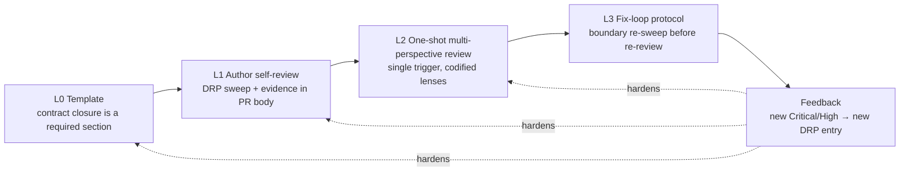

# AI Design Review Strategy

This strategy makes AI-authored detailed design converge in **at most one review round** instead of a multi-round PR rally. It generalizes the retrospective of PR [#81](https://github.com/urario/Surveyor/pull/81) (`DES-0010`/`DES-0011`/`DES-0013`) into repo-tracked mechanisms, so the remaining detailed-design packages (`DES-0012`, `DES-0014`–`DES-0018`) and later phases inherit the lessons instead of rediscovering them.

## 1. Case Study: the PR #81 Rally

PR #81 needed **four review rounds** before the human owner could merge:

| Round | Trigger | Outcome |
| -- | -- | -- |
| 1 | Four hand-typed role prompts (architect / implementer / quality / tester) posted as separate `@claude` comments | ~15 findings incl. blocking: upstream contradiction (`DRP-01`), port ownership inversion (`DRP-09`), undefined DTOs (`DRP-02`), numeric/failure semantics (`DRP-07`/`DRP-08`) |
| 2 | Fix commit `950d02d` + re-review request | New **Critical**: `ExportResultUseCase` could not derive `AnalysisRunResult` from `RunId` (`DRP-03`) |
| 3 | Fix commit `2f56f5b` + re-review request | New **Critical**: save/load type asymmetry (`ProtectedRunModel` vs bare `AnalysisRunResult`) introduced by the round-2 fix (`DRP-04`) |
| 4 | Fix commit `10c9125` + re-review request | New **Medium**: `ConfidentialityDecision` had no owner/sync rule, surfaced by the round-3 fix (`DRP-05`); closed by `ada2a6c` |

Each round costs a full human relay cycle (read review → brief the fixing agent → verify → commit → request re-review). The pattern IDs refer to the [Design Review Pattern Catalog](design-review-patterns.md), which this strategy seeds.

## 2. Root Causes

1. **Review knowledge lived in hand-typed comments, not in the repository.** The four role prompts were composed ad hoc in the PR thread. They are invisible to the authoring agent, not reusable, and drift between PRs. The existing `surveyor-design-review` skill covered architecture guardrails but not the defect classes that actually dominated the rally.
2. **No author-side gate.** Round-1 findings that are mechanically derivable before a PR exists — the upstream use-case inventory diff (`DRP-01`), undefined referenced types (`DRP-02`), unpinned arithmetic (`DRP-07`) — reached the reviewer because nothing required the author to sweep for them first.
3. **The design template made contract holes invisible.** DES-0007 §6 required DTO/algorithm/edge-case sections but nothing forced the author to demonstrate *closure*: that every use-case input is derivable, every output consumed, every round-trip symmetric, every field owned. The rounds-2–4 Criticals were all closure defects; a reviewer only finds them by simulating execution, and the round-1 reviewers were not asked to.
4. **Fixes were local patches with no boundary re-check.** Each of rounds 2–4 was *introduced* by the previous round's fix reshaping the store/export boundary. Nothing required the fixer to re-sweep the reshaped boundary before requesting re-review (`DRP-10`).
5. **Findings evaporated after the merge.** Nothing fed the review findings back into durable checklists, so `DES-0012`/`DES-0014`–`DES-0018` would face the same rally.

## 3. Strategy: Defense in Depth

Move each defect class to the cheapest layer that can catch it. A defect caught at L0/L1 costs an agent-local edit; the same defect at L2+ costs a human relay cycle per round.

### L0 — Templates encode closure (structure)

The DES-0007 §6 artifact template gains a required **Contract closure** section:

- **Port-method I/O derivation table**: for every use-case/port method, each input names its source (caller input / prior stage output / persisted state via a defined contract) and each output names its consumer. This is the table whose absence hid the `RunId → AnalysisRunResult` hole.
- **DTO field-ownership table**: every introduced DTO field names its single writer, write timing, and sync rule when duplicated across models.
- **Round-trip inventory**: every save/load, serialize/deserialize, mask/export pair is named, with both directions defined against symmetric types.

Rationale: the template is the one asset every author must touch; a required section is cheaper and more reliable than asking reviewers to simulate execution.

### L1 — Author self-review gate (before the PR)

The authoring agent (Codex via `.codex/skills/surveyor-detailed-design`; Claude Code via the self-check mode of `surveyor-design-review`) sweeps **every `DRP-xxx` pattern** and the DES-0007 §9 checklist before opening the PR, and records the result as a **Self-Review Evidence** section in the PR body (pattern → checked / finding fixed / not applicable + reason). An empty or missing Self-Review Evidence section means the design is not ready for review.

Rationale: the upstream-consistency diff and the dangling-reference sweep are exactly the checks an agent does well unprompted-by-a-human; they just have to be demanded.

### L2 — One-shot structured multi-perspective review

Replace the four hand-typed prompts with a **single standard trigger** that delegates to the repo-tracked skill (the GitHub workflow checks out the repo, so `@claude` reads `.claude/skills/` at review time):

> `@claude` `.claude/skills/surveyor-design-review` の詳細設計レビュープロトコルに従い、この PR の詳細設計を多視点レビューしてください。

The skill codifies the four lenses (architect / implementer / quality / tester) as one pass, requires an explicit sweep of every catalog pattern, tags each finding `DRP-xxx` + severity, and ends with a verdict (Accept / Accept with risks / Changes required) plus the list of patterns checked clean — so re-review can be scoped instead of restarted.

Rationale: prompts in the repo are versioned, reviewable, shared by author and reviewer (the author self-checks against the same catalog the reviewer will use), and identical across PRs.

### L3 — Fix-loop protocol

When responding to review findings, the fixer must:

1. Classify each fix as **local** (wording, values, added rows) or **boundary-reshaping** (types, ownership, call sequences, new/changed port methods).
2. For boundary-reshaping fixes, re-run the closure patterns (`DRP-02`–`DRP-05`) on the *reshaped boundary* — not just the reported symptom — before requesting re-review.
3. Reply with a **contract diff** summary: which types/methods/owners changed, and the closure re-sweep result.

Target: **at most one re-review round** per design PR. Rounds 2–4 of PR #81 would each have been caught at this layer.

### Feedback loop — the catalog grows

Any **Critical/High** finding that surfaces at L2 or later and matches no existing pattern is generalized into a new `DRP-xxx` entry by `surveyor-knowledge-curator` (growth rule in the catalog). A design PR that exceeds the one-re-review-round target triggers a short retrospective: which layer should have caught each finding, and what asset change closes the gap.

## 4. Asset Map

| Layer | Asset | Change |
| -- | -- | -- |
| L0 | [DES-0007](../design/des-0007-detailed-design-execution-strategy.md) §6 template | Contract-closure row added; §5 execution rules gain the self-review step; §9 checklist references the catalog |
| L1 | `.codex/skills/surveyor-detailed-design/SKILL.md` | New authoring skill: template compliance, DRP sweep, Self-Review Evidence, fix-loop protocol |
| L1/L2 | `.claude/skills/surveyor-design-review/SKILL.md` | Detailed-design review protocol (four lenses, DRP sweep, verdict shape), self-check mode, re-review protocol |
| L1–L3 | [Design Review Pattern Catalog](design-review-patterns.md) | New living catalog; single source shared by author and reviewer |
| Feedback | `surveyor-knowledge-curator` agent | Owns catalog growth and rally retrospectives |
| Flow | [AI 開発ワークフロー](../../docs/ai-development-workflow.md) | Detailed-design review flow pointer |

## 5. Operating Metric

- **Metric**: review rounds per design PR (a round = a review or re-review that produces at least one Changes-required finding).
- **Baseline**: PR #81 = 4 rounds. **Target**: ≤ 1 re-review round.
- The human owner remains the final gate on every design PR (DES-0007 §5.2 approval model is unchanged); this strategy reduces the number of relay cycles needed to reach that gate, not the gate itself.

## 6. Phase 2 Candidates (not decided here)

- **Mechanical contract lint**: extract C# API blocks from `DES-xxxx` files and verify referenced-type closure (`DRP-02`) automatically, as a `tools/okf/` extension alongside `Validate-Okf.ps1`.
- **Design-structure validation**: extend OKF validation to check that detailed-design artifacts contain the required §6 sections, including Contract closure.
- **Scope extension**: apply the same L1–L3 pattern (self-review evidence → codified one-shot review → fix-loop protocol) to implementation and unit-test-design PRs, seeding an implementation-review pattern catalog from their first rally instead of waiting for one.

## Related

- [Design Review Pattern Catalog](design-review-patterns.md)
- [DES-0007 Detailed Design Phase Execution Strategy](../design/des-0007-detailed-design-execution-strategy.md)
- [AI Collaboration](ai-collaboration.md)
- [Quality Review Policy](quality-review-policy.md)
